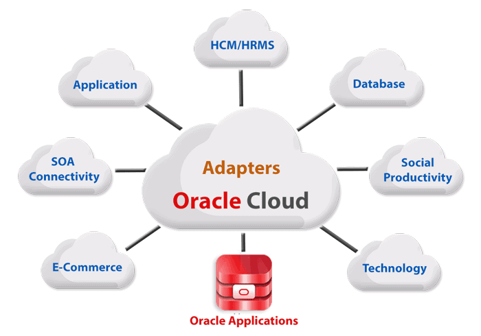
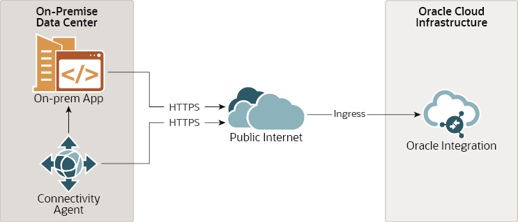
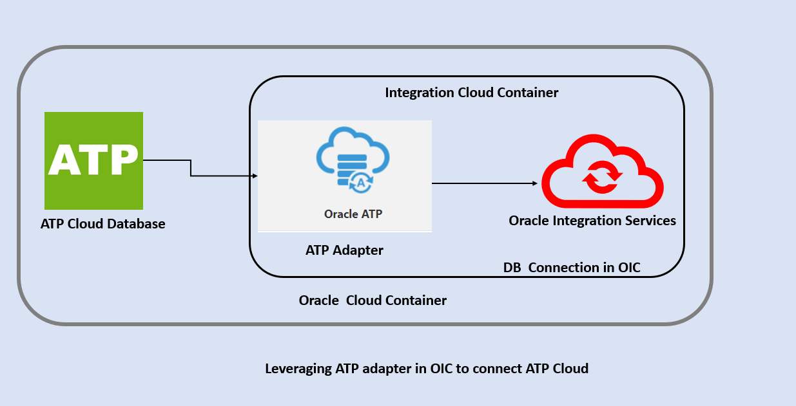
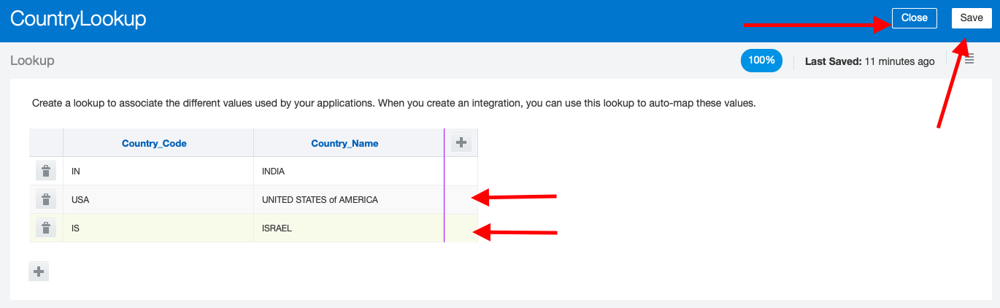
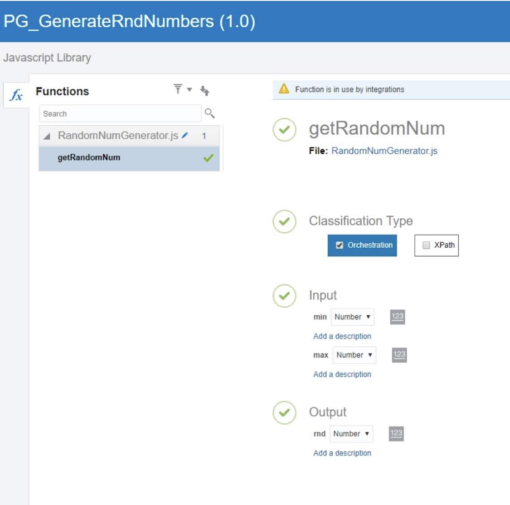
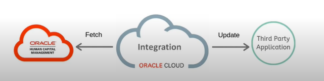

# Componentes en OIC

Como se mencionó en la introducción, Oracle Integration Cloud (OIC) está compuesto por varios componentes esenciales que son fundamentales para el desarrollo de integraciones exitosas. Uno de estos componentes clave son los adaptadores.

## Adaptadores en OIC

Los adaptadores son componentes fundamentales dentro de Oracle Integration Cloud (OIC) que desempeñan un papel crucial en la interoperabilidad y la conectividad entre diferentes sistemas, aplicaciones y servicios. En esencia, los adaptadores actúan como puentes que permiten que OIC se comunique con una amplia variedad de tecnologías y plataformas, tanto en la nube como en las instalaciones locales.

    

### Funcionalidad de los Adaptadores

Los adaptadores en OIC proporcionan una capa de abstracción que permite a los desarrolladores integrar sistemas heterogéneos de manera transparente. Estos adaptadores se encargan de traducir los protocolos de comunicación y los formatos de datos específicos de cada sistema, lo que facilita la interoperabilidad entre ellos.

### Ejemplos de Adaptadores

Algunos ejemplos comunes de adaptadores en Oracle Integration Cloud (OIC) incluyen:

- **Adaptadores de Bases de Datos:** Estos adaptadores permiten a OIC conectarse y comunicarse con diferentes sistemas de gestión de bases de datos, como Oracle Database, MySQL, SQL Server, PostgreSQL, entre otros. Esto facilita la integración de datos entre diferentes bases de datos y aplicaciones.

- **Adaptadores de Aplicaciones Empresariales:** Estos adaptadores permiten la integración con aplicaciones empresariales populares, como SAP, Salesforce, Workday, Oracle E-Business Suite, entre otros. Esto permite a las organizaciones automatizar procesos empresariales que involucran múltiples sistemas.

- **Adaptadores de Tecnologías en la Nube:** OIC ofrece adaptadores para diversas tecnologías en la nube, como AWS S3, Azure Blob Storage, Google Cloud Storage, entre otros. Esto facilita la integración de servicios en la nube con aplicaciones locales o con otros servicios en la nube.

- **Adaptadores ATP (Application-to-Application):** Estos adaptadores permiten la comunicación entre diferentes aplicaciones empresariales y sistemas, lo que facilita la automatización de flujos de trabajo complejos que involucran múltiples sistemas.

- **Adaptadores FTP (File Transfer Protocol):** Los adaptadores FTP permiten la transferencia de archivos entre sistemas mediante el protocolo FTP, lo que es útil para la integración de sistemas que intercambian datos a través de archivos.

- **Adaptadores de Archivo:** Estos adaptadores permiten la lectura y escritura de archivos en sistemas de archivos locales o compartidos, lo que facilita la integración con aplicaciones que generan o consumen archivos como parte de sus procesos.

- **Adaptadores REST (Representational State Transfer):** Los adaptadores REST permiten la integración con servicios web que siguen el estilo arquitectónico REST, lo que facilita la comunicación y el intercambio de datos con aplicaciones y servicios basados en la web.

- **Adaptadores SOAP (Simple Object Access Protocol):** Los adaptadores SOAP permiten la integración con servicios web que siguen el protocolo SOAP, lo que es común en aplicaciones empresariales que utilizan servicios web para la comunicación entre sistemas.

Estos son solo algunos ejemplos de los numerosos adaptadores disponibles en Oracle Integration Cloud, cada uno diseñado para facilitar la integración con tecnologías y sistemas específicos, garantizando así la interoperabilidad y la conectividad fluida entre diferentes plataformas y aplicaciones.

### Configuración de Adaptadores

Los adaptadores en OIC se configuran mediante conexiones que especifican los detalles de acceso y autenticación necesarios para conectarse al sistema o servicio correspondiente. Una vez configurados, los adaptadores pueden ser utilizados en integraciones para intercambiar datos de manera segura y eficiente.

### Personalización de Adaptadores

Además de los adaptadores predefinidos que ofrece OIC, los desarrolladores también pueden crear adaptadores personalizados para integrar sistemas o tecnologías específicas que no estén cubiertas por los adaptadores estándar. Esto proporciona una flexibilidad adicional para adaptar OIC a las necesidades específicas de cada organización.

## Agentes en OIC

Los agentes son componentes esenciales dentro de Oracle Integration Cloud (OIC) que desempeñan un papel crucial en la recopilación y transmisión de datos entre diferentes fuentes y el entorno de OIC. Estos agentes actúan como intermediarios entre los sistemas de origen de datos y OIC, facilitando la transferencia segura y eficiente de información.

    

### Funcionalidad de los Agentes

Los agentes en OIC se utilizan para recopilar datos de diversas fuentes, como sistemas locales, bases de datos, aplicaciones en la nube, servicios web, entre otros. Estos datos pueden ser eventos, registros, transacciones u otra información relevante para los procesos de integración que se están desarrollando en OIC.

Una vez recopilados, los agentes transmiten estos datos a OIC para su procesamiento posterior. Esto puede implicar transformaciones de datos, enriquecimiento con información adicional, enrutamiento a destinos específicos, entre otras operaciones que forman parte de los flujos de trabajo de integración definidos en OIC.

### Tipos de Agentes

Existen diferentes tipos de agentes en OIC, cada uno diseñado para cumplir con requisitos específicos de conectividad y recopilación de datos:

- **Agentes de Conector Local:** Estos agentes se instalan en las instalaciones del cliente y actúan como puntos de conexión entre los sistemas locales y OIC. Permiten la integración de datos almacenados en sistemas locales con las soluciones de integración en la nube de OIC.

- **Agentes de Conector Remoto:** Estos agentes se ejecutan en entornos de nube o en servidores externos y se utilizan para recopilar datos de sistemas y aplicaciones ubicados fuera del entorno del cliente. Facilitan la integración con servicios en la nube y aplicaciones basadas en la web.

### Ejemplos de Agentes

Algunos ejemplos de casos de uso de agentes en OIC incluyen:

- **Agente para Recopilación de Datos de Ventas:** Un agente instalado en el sistema de gestión de ventas de una empresa puede recopilar datos de transacciones de ventas y enviarlos a OIC para su procesamiento y análisis posterior.

- **Agente para Integración con Aplicaciones en la Nube:** Un agente desplegado en un entorno de nube puede conectarse con aplicaciones en la nube, como Salesforce o Workday, para recopilar datos de clientes o empleados y sincronizarlos con sistemas internos.

- **Agente para Monitoreo de Servicios Web:** Un agente puede monitorear constantemente servicios web externos en busca de eventos o datos específicos, y enviar alertas a OIC cuando se detecten ciertas condiciones o patrones.

### Configuración de Agentes

Los agentes en OIC se configuran mediante la instalación y la configuración de software específico en los sistemas donde se despliegan. Esta configuración incluye la definición de conexiones seguras con OIC, la especificación de las fuentes de datos que se van a recopilar y otros parámetros relevantes para su funcionamiento.

### Implementaciones de Agentes

Los agentes en OIC pueden ser implementados de manera escalable para satisfacer las necesidades de integración de diferentes organizaciones. Esto significa que pueden desplegarse múltiples instancias de agentes para gestionar grandes volúmenes de datos o para proporcionar redundancia y alta disponibilidad en entornos críticos.

## Conexiones en OIC

Las conexiones son componentes esenciales dentro de Oracle Integration Cloud (OIC) que facilitan la comunicación y la interacción entre OIC y los sistemas externos con los que se integra. Estas conexiones actúan como puentes que establecen canales seguros y confiables para la transferencia de datos y la ejecución de operaciones entre OIC y los sistemas conectados.

    

### Funcionalidad de las Conexiones

Las conexiones en OIC permiten a los usuarios configurar y administrar los detalles de conectividad necesarios para establecer comunicación con sistemas externos. Esto incluye la especificación de credenciales de autenticación, parámetros de conexión, configuraciones de seguridad y otros aspectos relevantes para garantizar una comunicación fluida y segura.

### Tipos de Conexiones

OIC ofrece una amplia gama de tipos de conexiones que abarcan diferentes protocolos, tecnologías y sistemas. Algunos de los tipos de conexiones más comunes incluyen:

- **Conexiones de Base de Datos:** Estas conexiones permiten a OIC conectarse con sistemas de gestión de bases de datos, como Oracle, MySQL, SQL Server, PostgreSQL, entre otros, para intercambiar datos y ejecutar consultas.

- **Conexiones de Servicios Web:** Estas conexiones facilitan la integración con servicios web basados en REST o SOAP, lo que permite a OIC consumir y exponer servicios web para interactuar con aplicaciones y sistemas externos.

- **Conexiones de Aplicaciones Empresariales:** Estas conexiones permiten la integración con aplicaciones empresariales populares, como SAP, Salesforce, Workday, entre otras, para automatizar procesos empresariales y compartir datos entre sistemas.

- **Conexiones de Sistemas en la Nube:** OIC ofrece conexiones para integrar servicios en la nube, como AWS, Azure, Google Cloud Platform, entre otros, facilitando la interoperabilidad entre aplicaciones en la nube y sistemas locales.

### Ejemplos de Conexiones

Algunos ejemplos de conexiones que pueden ser creadas en OIC incluyen:

- **Conexión con Servidor FTP:** Esta conexión permite intercambiar archivos con un servidor FTP remoto para transferir datos de manera segura y eficiente.

- **Conexión con Redes Sociales:** OIC proporciona conectores integrados para redes sociales populares, como LinkedIn, Facebook y Twitter, lo que permite interactuar con estas plataformas para compartir contenido, enviar mensajes o realizar acciones específicas.

- **Conexión con Servicios de Correo Electrónico:** Es posible crear conexiones con servicios de correo electrónico, como Gmail, para enviar y recibir correos electrónicos automáticamente como parte de los flujos de trabajo de integración.

### Configuración de Conexiones

La configuración de conexiones en OIC se realiza mediante una interfaz intuitiva que guía a los usuarios a través del proceso de configuración paso a paso. Esto incluye la especificación de detalles de autenticación, como nombres de usuario y contraseñas, configuraciones de red, como direcciones URL y puertos, y otros parámetros relevantes para establecer la conexión.

### Gestión de Conexiones

OIC proporciona herramientas para administrar y monitorear conexiones de manera centralizada. Esto incluye la capacidad de crear, editar y eliminar conexiones según sea necesario, así como la supervisión del estado de las conexiones para garantizar su disponibilidad y rendimiento.

### Importancia de las Conexiones

Las conexiones son la base de la integración en OIC, ya que permiten establecer vínculos entre sistemas internos y externos para intercambiar datos de manera efectiva. Al utilizar adaptadores específicos para crear conexiones, OIC garantiza la compatibilidad y la seguridad en la comunicación con una amplia variedad de aplicaciones y servicios, lo que facilita la implementación de soluciones de integración completas y robustas.

## Lookups en OIC

Los lookups son componentes cruciales en Oracle Integration Cloud (OIC) que permiten la búsqueda y recuperación de datos de referencia durante el procesamiento de integraciones. Estos componentes son especialmente útiles cuando se necesita enriquecer o transformar datos utilizando información adicional almacenada en tablas o conjuntos de datos externos.

    

### Funcionalidad de los Lookups

Los lookups en OIC actúan como tablas de búsqueda que contienen datos de referencia que pueden ser utilizados durante la ejecución de integraciones. Estos datos pueden ser consultados y recuperados dinámicamente durante el flujo de trabajo de integración para enriquecer, filtrar o transformar los datos que están siendo procesados.

### Tipos de Lookups

OIC ofrece varios tipos de lookups que se adaptan a diferentes escenarios y requisitos de integración:

- **Lookup de Base de Datos:** Este tipo de lookup permite consultar y recuperar datos almacenados en tablas de bases de datos relacionales, como Oracle, MySQL, SQL Server, entre otros.

- **Lookup de Archivo:** Permite buscar datos en archivos planos, como archivos CSV o Excel, que contienen información de referencia necesaria para el procesamiento de integraciones.

### Creación y Configuración de Lookups

Los lookups en OIC se crean mediante la definición de una estructura de búsqueda que incluye los campos clave y los valores de referencia que se utilizarán durante la búsqueda de datos. Estos lookups se pueden configurar para acceder a fuentes de datos externas, como bases de datos o archivos, y se pueden integrar fácilmente en los flujos de trabajo de integración.

### Uso de Lookups en Integraciones

Durante la ejecución de integraciones en OIC, los lookups pueden ser utilizados para enriquecer datos, filtrar registros o realizar transformaciones basadas en la información de referencia recuperada. Esto permite implementar lógica de negocio compleja y mejorar la calidad y precisión de los datos que son procesados por las integraciones.

### Ejemplos de Uso de Lookups

Algunos ejemplos de cómo se pueden utilizar los lookups en OIC incluyen:

- **Enriquecimiento de Datos:** Utilizar un lookup de base de datos para recuperar información adicional de clientes, productos o ubicaciones y enriquecer los datos que están siendo procesados durante una integración.

- **Filtrado de Registros:** Utilizar un lookup de archivo para filtrar registros de entrada en función de ciertos criterios, como fechas, códigos de producto o valores de estado.

- **Validación de Datos:** Utilizar un lookup para validar la integridad y consistencia de los datos que están siendo procesados durante una integración, asegurando que cumplan con ciertas reglas o restricciones definidas.

Los lookups son componentes versátiles y poderosos en Oracle Integration Cloud que permiten mejorar la calidad y la eficiencia de las integraciones al proporcionar acceso a datos de referencia durante el procesamiento. Su flexibilidad y capacidad para integrarse con diferentes fuentes de datos los convierten en un elemento fundamental en la implementación de soluciones de integración robustas y escalables.

## Bibliotecas, Paquetes y JavaScript en OIC

En Oracle Integration Cloud (OIC), las bibliotecas y los paquetes son componentes esenciales que permiten organizar y reutilizar lógica de integración de manera eficiente. Además, el soporte integrado para JavaScript proporciona flexibilidad adicional para implementar funcionalidades personalizadas dentro de las integraciones.

    

### Bibliotecas y Paquetes

- **Bibliotecas:** Las bibliotecas en OIC son conjuntos de artefactos que contienen lógica de integración reutilizable, como transformaciones de datos, funciones personalizadas o reglas de negocio. Es importante destacar que las bibliotecas se crean principalmente utilizando JavaScript, lo que permite a los desarrolladores escribir código personalizado para manipular datos, realizar transformaciones complejas o aplicar lógica empresarial específica.

- **Paquetes:** Los paquetes son contenedores lógicos que agrupan uno o más artefactos relacionados, como integraciones, bibliotecas o conectores. Los paquetes permiten organizar y gestionar de manera centralizada los recursos de integración en OIC, lo que facilita la implementación, el mantenimiento y la colaboración en proyectos de integración.

### Funcionalidad de JavaScript

- **JavaScript:** OIC ofrece soporte integrado para JavaScript, un lenguaje de programación ampliamente utilizado que permite implementar lógica personalizada dentro de las integraciones. Con JavaScript, los desarrolladores pueden manipular datos, realizar transformaciones complejas, interactuar con servicios externos y aplicar reglas de negocio personalizadas para adaptarse a requisitos específicos de integración.

### Uso de Bibliotecas, Paquetes y JavaScript

- **Reutilización de Lógica:** Las bibliotecas en OIC permiten reutilizar lógica de integración común en múltiples proyectos, lo que mejora la eficiencia del desarrollo y garantiza la coherencia en la implementación de integraciones. Al estar basadas en JavaScript, los desarrolladores tienen la flexibilidad de crear funciones personalizadas para abordar requerimientos específicos.

- **Personalización con JavaScript:** El soporte para JavaScript ofrece flexibilidad adicional para personalizar el comportamiento de las integraciones según las necesidades del negocio. Los desarrolladores pueden utilizar JavaScript para implementar lógica personalizada que no está cubierta por los componentes estándar de OIC, lo que permite adaptar las integraciones a escenarios y casos de uso específicos.

### Ejemplos de Uso

- **Implementación de Reglas de Validación:** Utilizar JavaScript para implementar reglas de validación personalizadas dentro de una integración, asegurando que los datos cumplan con ciertos criterios antes de ser procesados.

- **Manipulación de Datos:** Utilizar JavaScript para realizar transformaciones complejas en los datos durante el proceso de integración, como la combinación de múltiples fuentes de datos o la conversión de formatos de datos.

- **Interacción con Servicios Externos:** Utilizar JavaScript para interactuar con servicios externos, como APIs web o sistemas de terceros, para enriquecer o enriquecer los datos que están siendo procesados por la integración.

La combinación de bibliotecas, paquetes y JavaScript en Oracle Integration Cloud proporciona a los desarrolladores una amplia gama de herramientas y funcionalidades para crear integraciones robustas y flexibles que satisfagan las necesidades cambiantes del negocio. Al aprovechar estas capacidades, las organizaciones pueden implementar soluciones de integración eficientes y escalables que impulsen la innovación y la transformación digital.

## Integraciones en Oracle Integration Cloud (OIC)

Las integraciones son el núcleo de Oracle Integration Cloud (OIC), permitiendo conectar, automatizar y orquestar procesos empresariales entre diferentes aplicaciones, sistemas y servicios. En OIC, las integraciones facilitan la transferencia de datos, la ejecución de acciones y la sincronización de información, lo que mejora la eficiencia operativa y la agilidad empresarial.

    

### Funcionalidad de las Integraciones

Las integraciones en OIC ofrecen una amplia gama de funcionalidades para diseñar, implementar y gestionar flujos de trabajo de integración:

- **Mapeo de Datos:** Permite definir reglas de transformación para mapear datos entre sistemas heterogéneos, garantizando la coherencia y precisión en la transferencia de información.

- **Flujos de Trabajo Orquestados:** Facilita la creación de flujos de trabajo complejos que involucran múltiples pasos y acciones, coordinando la ejecución de tareas entre sistemas y aplicaciones.

- **Gestión de Errores:** Proporciona capacidades para gestionar y manejar errores durante la ejecución de integraciones, incluyendo la detección, el registro y la resolución de problemas para garantizar la integridad de los datos y la continuidad de los procesos empresariales.

### Tipos de Integraciones

En OIC, se pueden crear varios tipos de integraciones para abordar diferentes necesidades empresariales:

- **Integraciones de Aplicación a Aplicación (A2A):** Conectan aplicaciones internas de una organización, permitiendo la comunicación y la transferencia de datos entre sistemas empresariales, como sistemas CRM, ERP o sistemas de gestión de pedidos.

- **Integraciones de Empresa a Empresa (B2B):** Facilitan la integración con socios comerciales externos, permitiendo intercambiar datos y transacciones comerciales de manera segura y eficiente.

- **Integraciones de Aplicación a Nube (A2N) y Nube a Nube (N2N):** Permiten conectar aplicaciones locales con servicios en la nube o integrar servicios en la nube entre sí, proporcionando una arquitectura flexible y escalable para la gestión de datos y procesos empresariales.

### Diseño y Desarrollo de Integraciones

En OIC, el diseño y desarrollo de integraciones se realiza a través de una interfaz gráfica intuitiva que permite a los usuarios crear, configurar y probar integraciones de manera visual. Esta interfaz simplifica el proceso de diseño, permitiendo a los usuarios arrastrar y soltar componentes, definir reglas de negocio y configurar conectores para establecer la comunicación entre sistemas.

### Ejemplos de Casos de Uso

- **Integración de Pedidos de Cliente:** Automatizar el proceso de recepción y procesamiento de pedidos de clientes, integrando sistemas de CRM, gestión de pedidos y gestión de inventario para mejorar la eficiencia operativa y la satisfacción del cliente.

- **Integración de Datos de Ventas:** Sincronizar datos de ventas entre sistemas de CRM y sistemas de contabilidad para proporcionar una visión unificada de las ventas y facilitar el análisis y la toma de decisiones empresariales.

- **Integración de Empleados:** Facilitar la integración de sistemas de recursos humanos con sistemas de gestión de nóminas y beneficios para automatizar procesos de incorporación, gestión de cambios y seguimiento de la información del personal.

Las integraciones en Oracle Integration Cloud ofrecen una solución completa y flexible para conectar aplicaciones, sistemas y servicios en entornos empresariales complejos. Al proporcionar una plataforma unificada para la integración de datos y procesos, OIC ayuda a las organizaciones a mejorar la eficiencia operativa, la agilidad empresarial y la satisfacción del cliente.