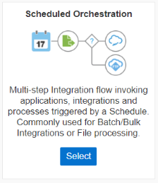
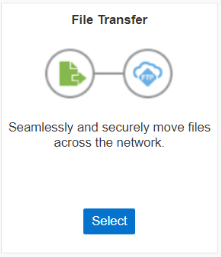

# Patrones de Integración en Oracle Integration Cloud

Oracle Integration Cloud (OIC) ofrece una amplia gama de patrones de integración que permiten a las organizaciones conectar sistemas, aplicaciones y servicios de manera eficiente y escalable. Estos patrones están diseñados para adaptarse a diferentes escenarios y requisitos de integración, ofreciendo flexibilidad y potencia para abordar una variedad de casos de uso empresarial.

Los patrones de integración son enfoques predefinidos y optimizados para la implementación de integraciones entre sistemas heterogéneos. Estos patrones proporcionan un marco estructurado para diseñar, desarrollar y desplegar integraciones de manera consistente y eficaz.

    

## Orquestación Impulsada por Aplicaciones

La orquestación impulsada por aplicaciones es un patrón de integración que se enfoca en coordinar procesos empresariales complejos que involucran múltiples aplicaciones y servicios. En este enfoque, las integraciones actúan como conductos que conectan y coordinan las interacciones entre diferentes sistemas, permitiendo la automatización de flujos de trabajo complejos y la gestión de excepciones.

    

### Funcionalidad y Características

- **Coordinación de Procesos:** La orquestación impulsada por aplicaciones permite la coordinación de flujos de trabajo complejos que involucran múltiples pasos y decisiones. Esto se logra a través de la definición de flujos de proceso que especifican el orden de ejecución de las actividades y las reglas de negocio asociadas.

- **Gestión de Excepciones:** Este patrón de integración incluye capacidades robustas para la gestión de excepciones, lo que permite manejar errores y situaciones inesperadas de manera elegante. Se pueden definir acciones de compensación, como reversión de transacciones o notificaciones de alerta, para garantizar la integridad y la consistencia de los procesos.

- **Integración de Aplicaciones Empresariales:** La orquestación impulsada por aplicaciones facilita la integración con sistemas empresariales complejos, como ERP, CRM y sistemas de gestión de pedidos, permitiendo la automatización de procesos end-to-end que abarcan múltiples sistemas y aplicaciones.

### Usos y Ejemplos

- **Procesamiento de Órdenes de Compra:** Un ejemplo común de uso de la orquestación impulsada por aplicaciones es el procesamiento de órdenes de compra en una organización. En este escenario, la integración coordina la recepción de órdenes de compra desde un sistema de comercio electrónico, valida la información, actualiza el inventario en un sistema de gestión de almacén y genera facturas en un sistema de contabilidad.

- **Gestión de Solicitudes de Reembolso:** Otra aplicación de este patrón es la gestión de solicitudes de reembolso de gastos de empleados. La integración puede orquestar el flujo de aprobación de solicitudes, verificar los límites de gastos, integrarse con sistemas de nómina para procesar los reembolsos y generar informes de gastos para contabilidad.

- **Automatización de Procesos de Contratación:** La orquestación impulsada por aplicaciones también se puede utilizar para automatizar procesos de contratación de personal. La integración puede coordinar la recopilación de información del solicitante, la verificación de referencias, la generación de contratos de empleo y la integración con sistemas de recursos humanos para la incorporación de nuevos empleados.

### Beneficios

- **Eficiencia Operativa:** La orquestación impulsada por aplicaciones mejora la eficiencia operativa al automatizar flujos de trabajo complejos y eliminar la necesidad de intervención manual en tareas repetitivas.

- **Integración Empresarial:** Facilita la integración de sistemas empresariales heterogéneos, permitiendo la creación de procesos empresariales end-to-end que abarcan múltiples aplicaciones y sistemas.

- **Agilidad y Escalabilidad:** Este enfoque proporciona agilidad y escalabilidad al permitir la rápida adaptación de procesos empresariales a medida que cambian las necesidades del negocio y la adición de nuevas capacidades y aplicaciones.

La orquestación impulsada por aplicaciones es un patrón de integración versátil y poderoso que ofrece a las organizaciones la capacidad de automatizar y optimizar procesos empresariales complejos. Al aprovechar este patrón en Oracle Integration Cloud, las organizaciones pueden mejorar la eficiencia operativa, la integración empresarial y la capacidad de adaptación a medida que evolucionan las necesidades del negocio.

## Orquestación Programada

La orquestación programada es un patrón de integración que se centra en la ejecución de integraciones según un horario predefinido o en respuesta a eventos programados. Este enfoque es ideal para tareas de integración que deben realizarse en momentos específicos, como cargas de datos nocturnas, procesos de generación de informes periódicos o cualquier otra actividad que requiera ejecución programada.

    

### Funcionalidad y Características

- **Ejecución Programada:** La orquestación programada permite programar la ejecución de integraciones en momentos específicos, como horas del día, días de la semana o fechas particulares. Esto garantiza que las integraciones se ejecuten de manera oportuna y consistente según los requisitos del negocio.

- **Eventos Temporizados:** Además de la ejecución en horarios programados, este patrón de integración también puede responder a eventos temporizados, como temporizadores o intervalos regulares, para activar la ejecución de integraciones en momentos específicos.

- **Automatización de Procesos Periódicos:** La orquestación programada es ideal para automatizar procesos periódicos y repetitivos que requieren ejecución regular, como la carga de datos desde sistemas externos, la generación de informes diarios o la sincronización de datos entre aplicaciones.

### Usos y Ejemplos

- **Cargas de Datos Nocturnas:** Un ejemplo común de uso de la orquestación programada es la realización de cargas de datos nocturnas desde sistemas transaccionales a sistemas de análisis o data warehouses. Las integraciones pueden programarse para ejecutarse fuera del horario comercial para minimizar el impacto en el rendimiento del sistema.

- **Generación de Informes Periódicos:** Este patrón también se utiliza para la generación de informes periódicos que requieren datos actualizados de múltiples fuentes. Las integraciones pueden programarse para recopilar datos, ejecutar cálculos y generar informes automáticamente en momentos específicos, como al final de cada mes o trimestre.

- **Actualizaciones de Inventario Semanales:** Otro ejemplo de uso es la sincronización de datos de inventario entre sistemas de gestión de almacenes y sistemas de ventas. Las integraciones pueden programarse para ejecutarse semanalmente para garantizar que los niveles de inventario estén actualizados y disponibles para su visualización en los sistemas de ventas.

### Beneficios

- **Automatización y Programación:** La orquestación programada automatiza la ejecución de tareas de integración en momentos específicos, eliminando la necesidad de intervención manual y garantizando la ejecución oportuna de las integraciones.

- **Eficiencia y Precisión:** Al programar la ejecución de integraciones, se mejora la eficiencia operativa y se reducen los errores asociados con la ejecución manual de tareas repetitivas.

- **Planificación y Flexibilidad:** Este enfoque proporciona flexibilidad para planificar y ajustar la ejecución de integraciones según las necesidades del negocio, permitiendo la optimización de recursos y la maximización de la eficiencia operativa.

La orquestación programada es un patrón de integración poderoso que ofrece a las organizaciones la capacidad de automatizar y programar la ejecución de tareas de integración en momentos específicos. Al aprovechar este patrón en Oracle Integration Cloud, las organizaciones pueden mejorar la eficiencia operativa, reducir los errores y garantizar la ejecución oportuna de procesos empresariales críticos.

## Transferencia de Archivos

La transferencia de archivos es un patrón que facilita el intercambio de datos en formato de archivo entre sistemas y aplicaciones. Este patrón es especialmente útil para integrar sistemas heredados, sistemas locales y sistemas en la nube que necesitan compartir datos de manera eficiente y segura.

    

### Funcionalidad y Características

- **Intercambio de Datos en Formato de Archivo:** La transferencia de archivos permite la transmisión de archivos entre sistemas utilizando protocolos estándar como FTP (Protocolo de Transferencia de Archivos), SFTP (Protocolo de Transferencia de Archivos Seguro) y FTPS (Protocolo de Transferencia de Archivos Seguro sobre SSL).

- **Automatización de Procesos de Transferencia:** Este patrón de integración facilita la automatización de procesos de transferencia de archivos, lo que permite programar la ejecución de transferencias en horarios específicos o en respuesta a eventos desencadenantes.

- **Gestión de Errores y Excepciones:** La transferencia de archivos incluye mecanismos integrados para la gestión de errores y excepciones, lo que permite manejar situaciones como la pérdida de conexión, errores de autenticación y problemas de integridad de archivos de manera elegante.

### Usos y Ejemplos

- **Integración de Sistemas Heredados:** La transferencia de archivos se utiliza comúnmente para integrar sistemas heredados que no admiten integraciones API modernas. Por ejemplo, puede ser necesario transferir archivos de datos entre un sistema mainframe y un sistema ERP para actualizar registros de inventario.

- **Procesamiento de Archivos de Registro:** Otro caso de uso típico es el procesamiento de archivos de registro generados por sistemas de registro de aplicaciones, servidores web u otros sistemas. Estos archivos pueden ser transferidos a OIC para su análisis, almacenamiento o generación de informes.

- **Integración de Sistemas Locales y en la Nube:** La transferencia de archivos también es útil para integrar sistemas locales con servicios en la nube. Por ejemplo, los archivos generados por una aplicación local pueden ser transferidos a un servicio en la nube para su procesamiento adicional o almacenamiento.

### Beneficios

- **Sencillez y Facilidad de Implementación:** La transferencia de archivos es un patrón de integración simple y fácil de implementar que no requiere cambios significativos en los sistemas existentes.

- **Compatibilidad con Sistemas Legados:** Permite la integración con sistemas heredados y sistemas locales que no admiten integraciones API modernas.

- **Automatización y Programación:** Facilita la automatización y programación de procesos de transferencia de archivos, lo que mejora la eficiencia operativa y reduce la necesidad de intervención manual.

La transferencia de archivos es un patrón de integración versátil y efectivo que proporciona una solución robusta para el intercambio de datos entre sistemas y aplicaciones. Al aprovechar este patrón en Oracle Integration Cloud, las organizaciones pueden mejorar la eficiencia operativa, la interoperabilidad y la agilidad en sus procesos de integración.

## Enrutamiento Básico

El enrutamiento básico es un patrón de integración que se utiliza para distribuir mensajes entre sistemas basados en reglas de enrutamiento simples. Este patrón es ideal para escenarios donde se requiere una lógica de enrutamiento directa y sin procesamiento adicional, permitiendo dirigir los mensajes entrantes a destinos específicos según criterios predefinidos.

    

### Funcionalidad y Características

- **Distribución de Mensajes:** El enrutamiento básico facilita la distribución de mensajes entrantes a través de rutas predefinidas hacia destinos específicos. Las reglas de enrutamiento se definen en función de criterios como direcciones IP, rutas de URL, valores de campo u otras condiciones lógicas simples.

- **Sin Procesamiento Adicional:** A diferencia de otros patrones de integración que implican procesamiento adicional de datos, el enrutamiento básico se centra exclusivamente en la distribución de mensajes según reglas de enrutamiento predefinidas. No se realizan transformaciones de datos ni manipulaciones adicionales durante el proceso de enrutamiento.

- **Flexibilidad y Escalabilidad:** Este patrón ofrece flexibilidad y escalabilidad al permitir la definición dinámica de reglas de enrutamiento y la adición de nuevos destinos sin afectar la infraestructura existente. Esto facilita la adaptación a cambios en los requisitos de negocio y la expansión de la arquitectura de integración según sea necesario.

### Usos y Ejemplos

- **Enrutamiento de Solicitudes HTTP:** Un caso de uso común del enrutamiento básico es dirigir solicitudes HTTP entrantes a diferentes endpoints en función de la ruta de URL o los parámetros de la solicitud. Por ejemplo, las solicitudes dirigidas a "/api/productos" pueden ser enrutadas a un servicio que maneja operaciones relacionadas con productos, mientras que las solicitudes dirigidas a "/api/clientes" pueden ser enrutadas a un servicio de gestión de clientes.

- **Distribución de Mensajes por Tipo:** Otra aplicación típica es la distribución de mensajes entrantes a diferentes sistemas o aplicaciones según el tipo de mensaje. Por ejemplo, los mensajes de ventas pueden ser enviados a un sistema de gestión de ventas, mientras que los mensajes de soporte pueden ser enviados a un sistema de gestión de casos.

- **Enrutamiento Basado en Contenido:** El enrutamiento básico también se puede utilizar para dirigir mensajes a diferentes destinos según el contenido de los mensajes. Por ejemplo, los correos electrónicos con ciertas palabras clave pueden ser enrutados a una bandeja de entrada específica para su procesamiento prioritario.

### Beneficios

- **Simplicidad y Claridad:** El enrutamiento básico ofrece una solución simple y clara para dirigir mensajes entrantes a destinos específicos según criterios predefinidos, lo que facilita la comprensión y mantenimiento de la lógica de enrutamiento.

- **Flexibilidad y Escalabilidad:** Permite la definición dinámica de reglas de enrutamiento y la adición de nuevos destinos sin afectar la infraestructura existente, lo que facilita la adaptación a cambios en los requisitos de negocio y la expansión de la arquitectura de integración.

- **Eficiencia Operativa:** Al dirigir los mensajes directamente a los destinos apropiados sin procesamiento adicional, el enrutamiento básico mejora la eficiencia operativa y reduce la latencia en la entrega de mensajes.

El enrutamiento básico es un patrón de integración efectivo que proporciona una solución sencilla y escalable para dirigir mensajes entre sistemas y aplicaciones. Al aprovechar este patrón en Oracle Integration Cloud, las organizaciones pueden mejorar la eficiencia operativa, la claridad de la lógica de enrutamiento y la flexibilidad de su arquitectura de integración.

## Publicar en Oracle Integration Cloud

El patrón de "Publicar en OIC" es una estrategia de integración que permite que otras aplicaciones o sistemas externos envíen eventos a OIC para su procesamiento. Este enfoque permite la creación de arquitecturas de eventos basadas en la nube, donde OIC actúa como un concentrador central para la gestión y el procesamiento de eventos provenientes de diversas fuentes.

    

### Funcionalidad y Características

- **Recepción de Eventos Externos:** Con el patrón de "Publicar en OIC", OIC actúa como un receptor de eventos externos enviados por otras aplicaciones o sistemas. Estos eventos pueden ser datos, notificaciones, mensajes u otros tipos de información relevantes para el proceso de integración.

- **Gestión de Eventos Entrantes:** Una vez que OIC recibe un evento, puede realizar diversas acciones según la lógica de negocio definida en las integraciones configuradas. Esto puede incluir transformaciones de datos, enriquecimiento de eventos, enrutamiento a destinos específicos y ejecución de flujos de trabajo automatizados.

- **Escalabilidad y Flexibilidad:** Este enfoque proporciona escalabilidad y flexibilidad al permitir la recepción de eventos desde múltiples fuentes externas y la ejecución de múltiples acciones en respuesta a cada evento. Esto facilita la adaptación a cambios en los requisitos de negocio y la expansión de la arquitectura de integración según sea necesario.

### Usos y Ejemplos

- **Integración con Aplicaciones Externas:** El patrón de "Publicar en OIC" se utiliza comúnmente para integrar aplicaciones externas con OIC, permitiendo que estas aplicaciones envíen eventos a OIC para su procesamiento. Por ejemplo, una aplicación de comercio electrónico puede enviar eventos de nuevos pedidos a OIC para su procesamiento y gestión.

- **Integración de Dispositivos IoT:** Otra aplicación típica es la integración de dispositivos IoT (Internet de las cosas), donde los dispositivos envían eventos de telemetría o datos de sensor a OIC para su procesamiento y análisis. Esto permite la creación de soluciones de IoT escalables y flexibles que pueden adaptarse a diversas aplicaciones y casos de uso.

- **Gestión de Notificaciones Externas:** También se puede utilizar para la gestión de notificaciones externas, donde sistemas externos envían eventos de notificación a OIC para su procesamiento y distribución a destinatarios específicos. Por ejemplo, un sistema de gestión de incidentes puede enviar notificaciones de alerta a OIC para su procesamiento y enrutamiento a los equipos de soporte correspondientes.

### Beneficios

- **Centralización de la Lógica de Integración:** El patrón de "Publicar en OIC" permite centralizar la lógica de integración en OIC, lo que simplifica la gestión y el mantenimiento de los procesos de integración en un único punto central.

- **Escalabilidad y Flexibilidad:** Permite la recepción de eventos desde múltiples fuentes externas y la ejecución de múltiples acciones en respuesta a cada evento, lo que proporciona escalabilidad y flexibilidad para adaptarse a cambios en los requisitos de negocio.

- **Integración Ágil y Reactiva:** Facilita la creación de arquitecturas de integración ágiles y reactivas, donde OIC puede responder dinámicamente a eventos externos y ejecutar acciones específicas en tiempo real.

El patrón de "Publicar en OIC" es una estrategia poderosa para integrar aplicaciones y sistemas externos con Oracle Integration Cloud, permitiendo la creación de arquitecturas de integración ágiles, flexibles y centradas en eventos. Al aprovechar este patrón, las organizaciones pueden mejorar la eficiencia operativa, la agilidad empresarial y la capacidad de adaptación a medida que evolucionan las necesidades del negocio.

## Suscribirse a Oracle Integration Cloud

El patrón de "Suscribirse a OIC" es una estrategia de integración que permite que aplicaciones o sistemas externos se suscriban a eventos generados por OIC para su procesamiento. Este enfoque habilita la creación de arquitecturas de integración reactivas, donde OIC actúa como un emisor de eventos que desencadena acciones en otros sistemas según las necesidades empresariales.

    

### Funcionalidad y Características

- **Emisión de Eventos desde OIC:** Con el patrón de "Suscribirse a OIC", OIC actúa como un emisor de eventos que genera y envía notificaciones sobre eventos relevantes ocurridos en el entorno de integración. Estos eventos pueden ser cambios en datos, finalización de procesos, activación de flujos de trabajo u otras acciones importantes.

- **Registro y Gestión de Suscripciones:** OIC proporciona mecanismos para registrar y gestionar suscripciones de aplicaciones externas a eventos específicos. Las aplicaciones pueden registrarse para recibir notificaciones sobre eventos de interés y especificar las acciones a tomar en respuesta a cada evento.

- **Distribución de Eventos:** Una vez que se genera un evento en OIC, se distribuye automáticamente a todas las aplicaciones suscritas que hayan registrado interés en el evento específico. Esto permite la propagación rápida y eficiente de eventos a través de la arquitectura de integración para su procesamiento y acción.

### Usos y Ejemplos

- **Integración con Sistemas Externos:** El patrón de "Suscribirse a OIC" se utiliza comúnmente para integrar sistemas externos con OIC, permitiendo que estas aplicaciones se suscriban a eventos generados por OIC para su procesamiento. Por ejemplo, una aplicación de gestión de inventario puede suscribirse a eventos de actualización de inventario para mantener su base de datos sincronizada con OIC.

- **Gestión de Flujos de Trabajo:** También se puede utilizar para gestionar flujos de trabajo y procesos empresariales, donde OIC genera eventos para indicar la finalización de etapas de procesos o la activación de flujos de trabajo específicos. Las aplicaciones externas pueden suscribirse a estos eventos para coordinar acciones adicionales según sea necesario.

- **Notificaciones y Alertas:** Otra aplicación típica es la gestión de notificaciones y alertas, donde OIC emite eventos de alerta sobre situaciones críticas o cambios en el estado de los sistemas. Las aplicaciones externas pueden suscribirse a estos eventos para recibir notificaciones en tiempo real y tomar medidas correctivas o preventivas.

### Beneficios

- **Reactividad y Agilidad:** El patrón de "Suscribirse a OIC" facilita la creación de arquitecturas de integración reactivas y ágiles, donde OIC puede notificar automáticamente a aplicaciones externas sobre eventos importantes y desencadenar acciones correspondientes en tiempo real.

- **Interoperabilidad y Colaboración:** Permite la integración y la colaboración entre sistemas internos y externos al proporcionar un mecanismo estándar para la distribución de eventos y la coordinación de acciones entre diferentes aplicaciones y sistemas.

- **Centralización de la Lógica de Integración:** Facilita la centralización de la lógica de integración en OIC, lo que simplifica la gestión y el mantenimiento de los procesos de integración en un único punto central.

El patrón de "Suscribirse a OIC" es una estrategia efectiva para integrar aplicaciones y sistemas externos con Oracle Integration Cloud, permitiendo la creación de arquitecturas de integración reactivas y colaborativas. Al aprovechar este patrón, las organizaciones pueden mejorar la eficiencia operativa, la agilidad empresarial y la capacidad de adaptación a medida que evolucionan las necesidades del negocio.

## Diferencias entre los Patrones de Integración

Cada patrón de integración en Oracle Integration Cloud ofrece características únicas y se adapta mejor a diferentes escenarios y requisitos empresariales. A continuación, se presenta una comparación general de los principales patrones de integración:

| Patrón de Integración          | Descripción                                                                                                                                                                               | Ejemplos de Uso                                                                                                                    |
|--------------------------------|-------------------------------------------------------------------------------------------------------------------------------------------------------------------------------------------|-------------------------------------------------------------------------------------------------------------------------------------|
| Orquestación Impulsada por Aplicaciones | Coordina procesos empresariales complejos que involucran múltiples aplicaciones y servicios. | Procesamiento de órdenes de compra, gestión de solicitudes de reembolso, automatización de procesos de contratación. |
| Orquestación Programada        | Automatiza flujos de trabajo y procesos empresariales en horarios específicos o en respuesta a eventos desencadenantes.                                                                  | Generación de informes programados, procesamiento de datos diarios, actualizaciones de estado programadas.                         |
| Transferencia de Archivos      | Facilita el intercambio de datos en formato de archivo entre sistemas y aplicaciones.                                                                                                     | Integración con sistemas heredados, procesamiento de archivos de registro, integración de sistemas locales y en la nube.           |
| Enrutamiento Básico            | Dirige mensajes entrantes a destinos específicos según reglas de enrutamiento simples.                                                                                                      | Enrutamiento de solicitudes HTTP, distribución de mensajes por tipo, enrutamiento basado en contenido.                             |
| Publicar en OIC                | Permite que otras aplicaciones o sistemas externos envíen eventos a OIC para su procesamiento.                                                                                             | Integración con aplicaciones externas, integración de dispositivos IoT, gestión de notificaciones externas.                       |
| Suscribirse a OIC              | Permite que aplicaciones externas se suscriban a eventos generados por OIC para su procesamiento.                                                                                         | Integración con sistemas externos, gestión de flujos de trabajo, notificaciones y alertas.                                         |

Estas comparaciones proporcionan una visión general de las diferencias clave entre los diferentes patrones de integración y pueden ayudar a determinar cuál es el más adecuado para un caso de uso específico.

## Demo: creación de una integración

### [Ver el siguiente video a partir del minuto 4:00](https://www.youtube.com/watch?v=eya4Nz0FFT4&list=PL3X62LScvI_IQ-5ji5SQGx3Zc0IhZB3jZ&index=3)