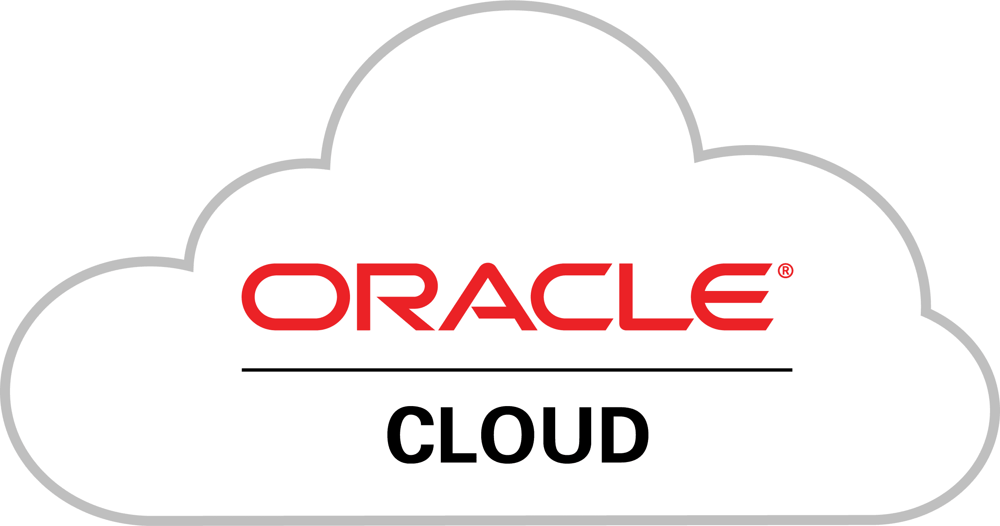

# Oracle Integration Cloud (OIC)

Oracle Integration Cloud (OIC) es un servicio de integración desarrollado por Oracle que proporciona una solución ligera y segura para conectar aplicaciones tanto en la nube como en las instalaciones locales. Este servicio es especialmente útil para empresas que operan en entornos híbridos, donde tienen una combinación de sistemas en la nube y en las instalaciones.

    

## Qué es OIC

OIC es una solución de integración que ofrece las siguientes características principales:

- **Integración Ligera y Segura:** OIC ofrece una plataforma de integración robusta pero fácil de usar, lo que permite a las organizaciones conectar diferentes sistemas de manera eficiente y segura.
  
- **Conectividad Nativa a Aplicaciones Oracle SaaS:** Una de las ventajas clave de OIC es su capacidad para proporcionar conectividad nativa a las aplicaciones de software como servicio (SaaS) de Oracle. Esto significa que las empresas pueden integrar fácilmente sus aplicaciones Oracle SaaS con otros sistemas, tanto internos como externos.

## ¿Qué es un Servicio PaaS?

OIC se clasifica como un servicio PaaS, que significa Plataforma como Servicio. En el contexto de Oracle, un servicio PaaS es una plataforma proporcionada por Oracle que ofrece una capa intermedia entre las aplicaciones y los recursos de infraestructura subyacentes.

- **Plataforma para Facilitar el Desarrollo y la Gestión de Integraciones:** Como servicio PaaS, OIC facilita tanto el desarrollo como la gestión de integraciones entre diferentes sistemas. Proporciona herramientas y funcionalidades que permiten a los desarrolladores crear, desplegar y gestionar integraciones de manera eficiente.

## Servicios de OIC

OIC está compuesto por tres servicios principales:

1. **Integration Cloud Service (ICS):** ICS proporciona capacidades de integración de nivel empresarial para conectar aplicaciones en la nube y en las instalaciones. Ofrece una variedad de herramientas y adaptadores para facilitar la integración de sistemas heterogéneos.

2. **Process Cloud Service (PCS):** PCS es un servicio de gestión de procesos empresariales que permite a las organizaciones modelar, automatizar y optimizar sus procesos empresariales. Proporciona herramientas de diseño de procesos y capacidades de ejecución de flujo de trabajo.

3. **Visual Builder Cloud Service (VBCS):** VBCS es un servicio de desarrollo de aplicaciones visuales que permite a los usuarios crear y desplegar aplicaciones web y móviles de forma rápida y sencilla. Proporciona herramientas de diseño visual y un entorno de desarrollo basado en la nube.

    

## Componentes de OIC

OIC está compuesto por varios componentes esenciales que son fundamentales para el desarrollo de integraciones exitosas. Estos componentes incluyen:

1. **Adaptadores:** Los adaptadores son componentes que facilitan la comunicación y la interoperabilidad entre OIC y diferentes sistemas, aplicaciones y servicios. OIC ofrece una amplia gama de adaptadores predefinidos que admiten una variedad de protocolos y tecnologías.

2. **Agentes:** Los agentes son componentes que se utilizan para recopilar datos de diferentes fuentes y transmitirlos a OIC para su procesamiento. Estos agentes pueden residir tanto en las instalaciones locales como en entornos en la nube.

3. **Conexiones:** Las conexiones son configuraciones que establecen la comunicación entre OIC y los sistemas externos con los que se está integrando. Estas conexiones pueden incluir detalles como credenciales de autenticación y parámetros de conexión.

4. **Búsquedas:** Las búsquedas son componentes que permiten a los usuarios encontrar y acceder rápidamente a recursos específicos dentro de OIC, como integraciones, adaptadores o conexiones.

5. **Bibliotecas:** Las bibliotecas son repositorios de recursos reutilizables, como plantillas de integración, fragmentos de código y reglas de negocio. Estos recursos pueden ser compartidos y reutilizados en diferentes proyectos de integración.

6. **Paquetes:** Los paquetes son contenedores que agrupan múltiples artefactos relacionados, como integraciones, adaptadores y bibliotecas, en una unidad coherente. Esto facilita la gestión y el despliegue de conjuntos completos de funcionalidades.

7. **Integraciones:** Las integraciones son flujos de trabajo que conectan diferentes sistemas y aplicaciones para automatizar procesos empresariales. Estas integraciones pueden involucrar transformaciones de datos, enrutamiento de mensajes y acciones condicionales.