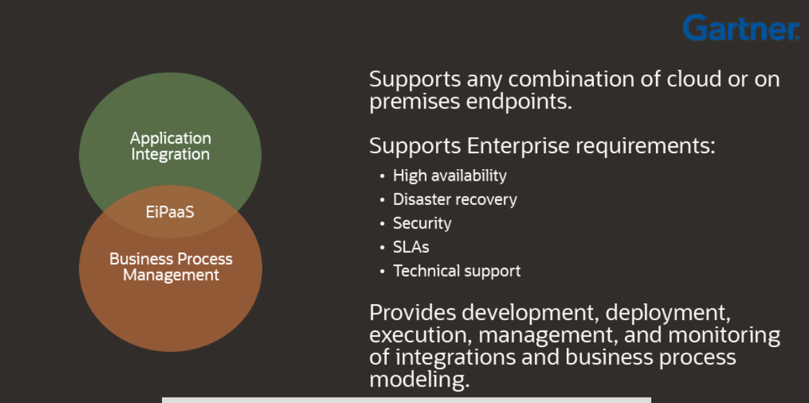
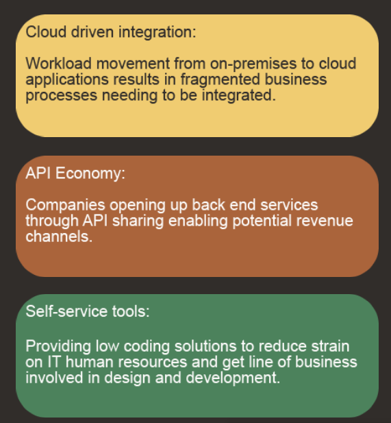
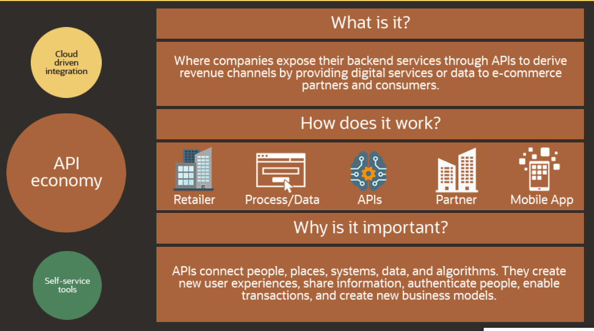
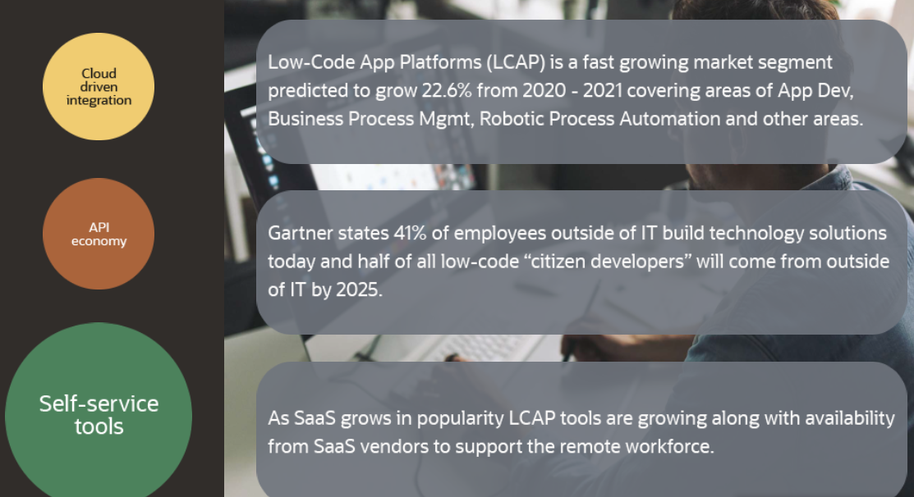
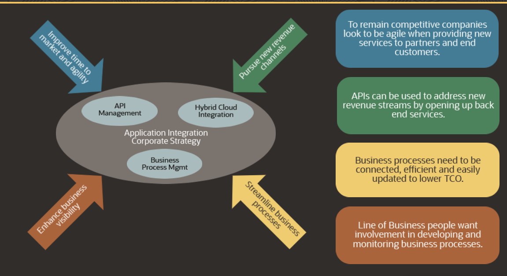

# EiPaaS

En el contexto de Oracle Integration Cloud (OIC), EiPaaS significa Enterprise Integration Platform as a Service. Es una plataforma en la nube que proporciona herramientas y servicios para facilitar la integración de aplicaciones y sistemas empresariales. 

Las principales características de EiPaaS incluyen la capacidad de conectar de forma segura aplicaciones en la nube y on-premise, facilitar la integración de datos y procesos empresariales, y ofrecer una variedad de conectores predefinidos para sistemas populares.

En el caso de Oracle OIC, esta plataforma ofrece una amplia gama de capacidades de integración, incluyendo la integración de aplicaciones SaaS y on-premise, la integración de datos, la automatización de procesos empresariales, y la creación de APIs. Además, OIC proporciona herramientas visuales y basadas en modelos para simplificar el diseño, desarrollo y despliegue de integraciones.

# Market Trends

# API economy

# Self-service tools

# Internal business drivers

