# Trends: multicloud is the new norm

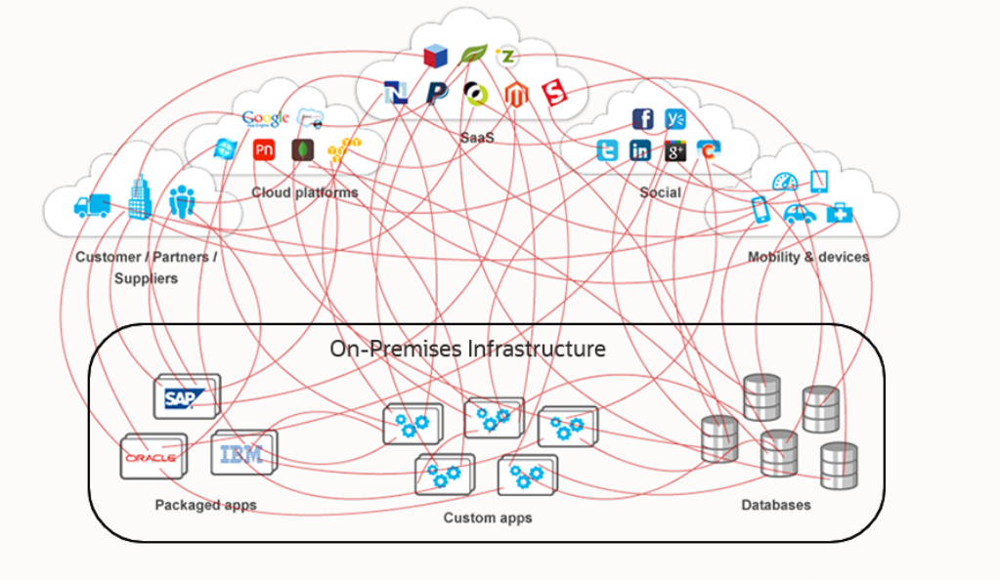

# Trends: event driven integrations

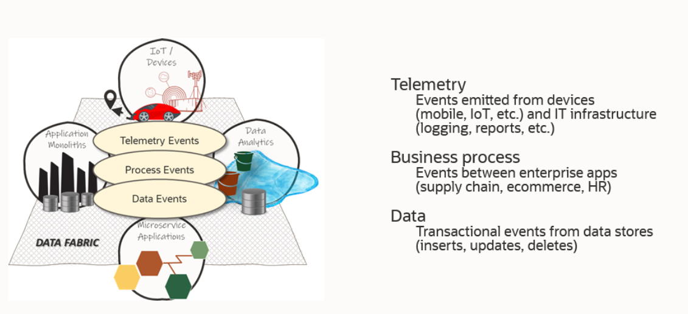

# Customer challenges when connecting SaaS 

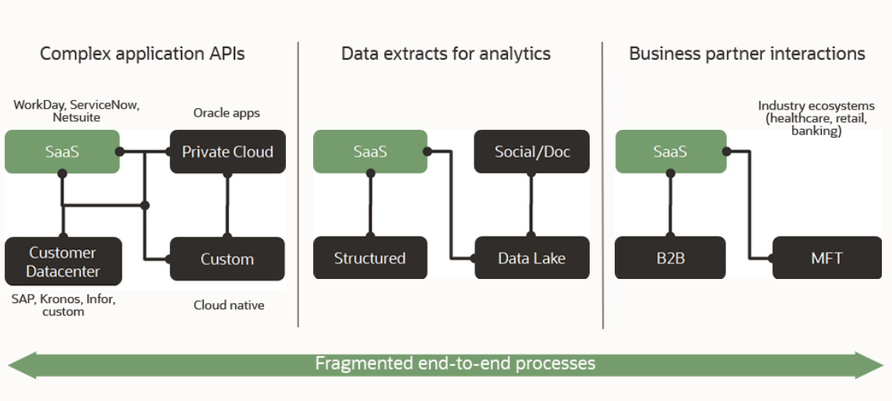

# Four basic issues when connecting apps

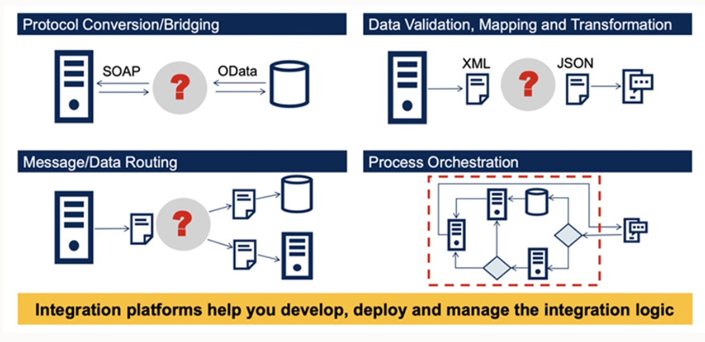

# Automated ent-to-end business process example

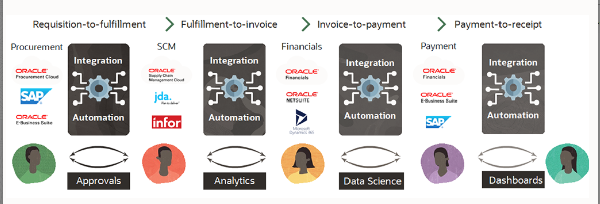

# OIC

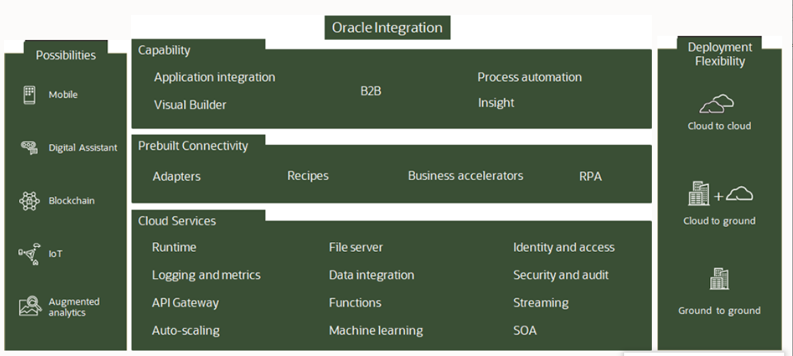

# Hybrid cloud support

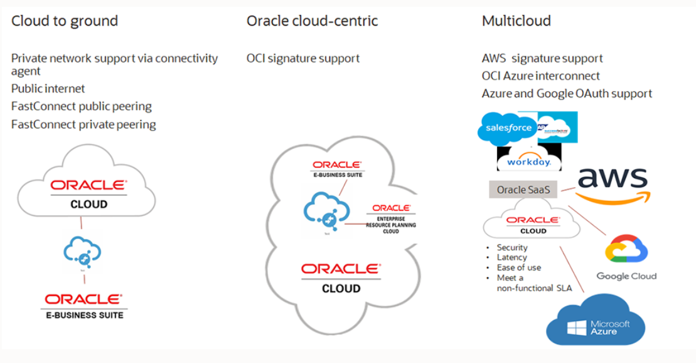

# Secure file server

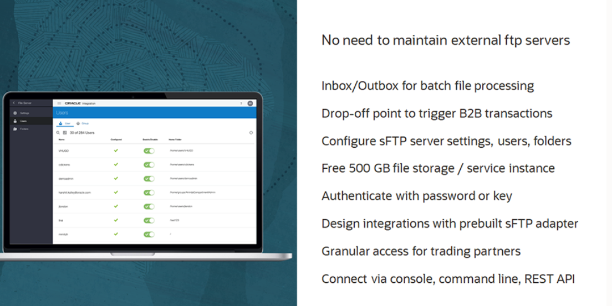

# Business to Business B2B

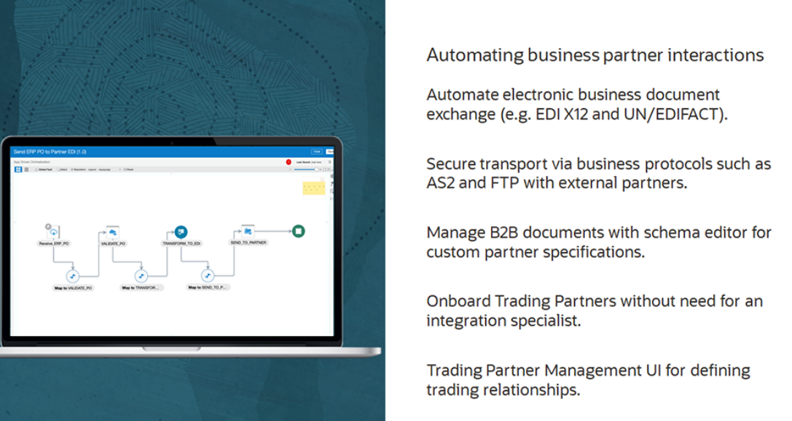

# API capabilities within OIC

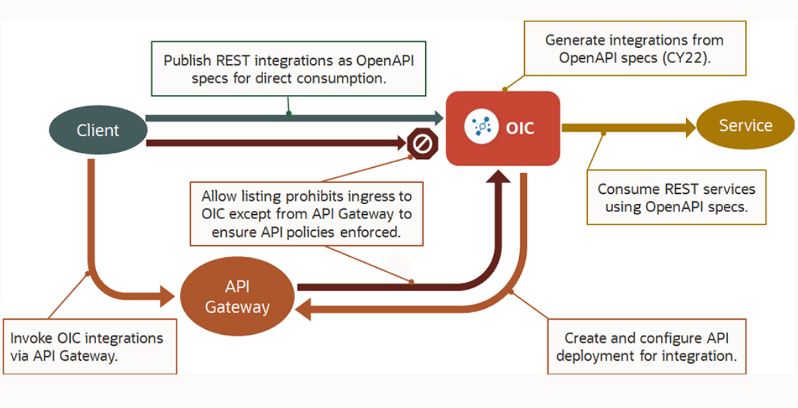

# API Responsibilities

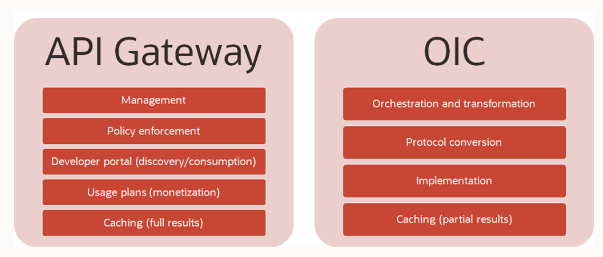
