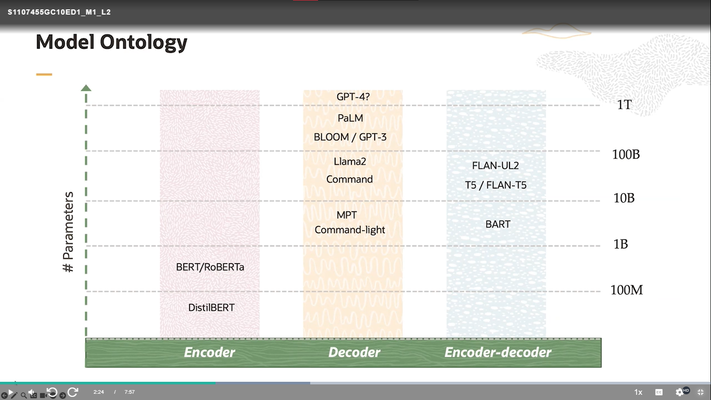
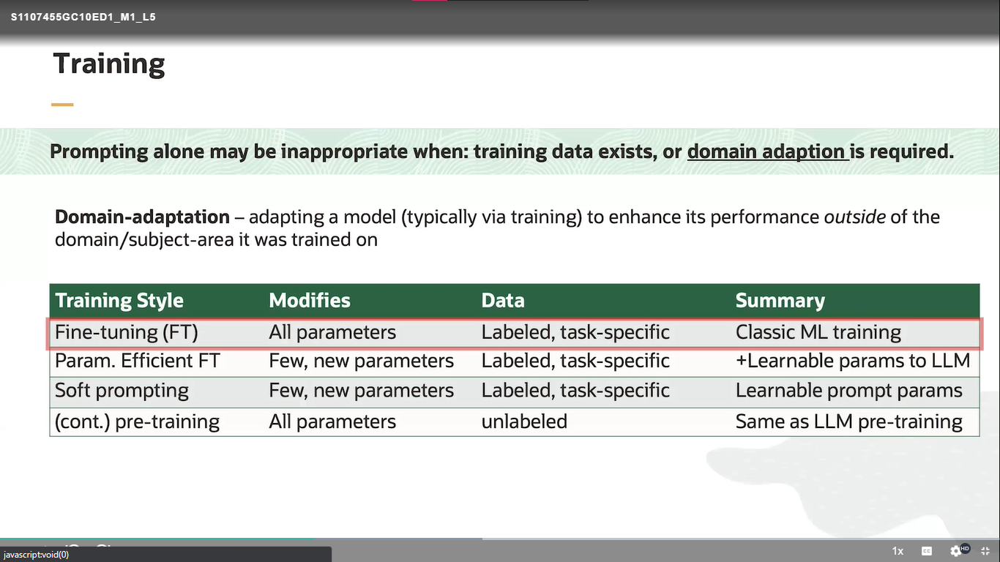
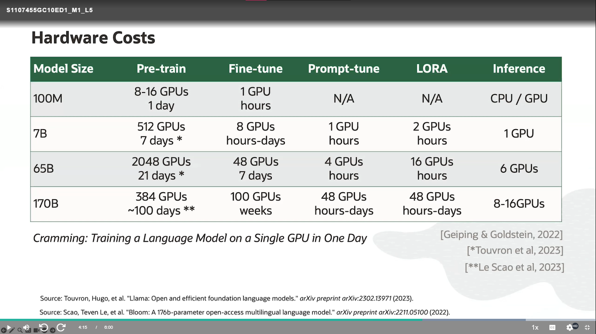
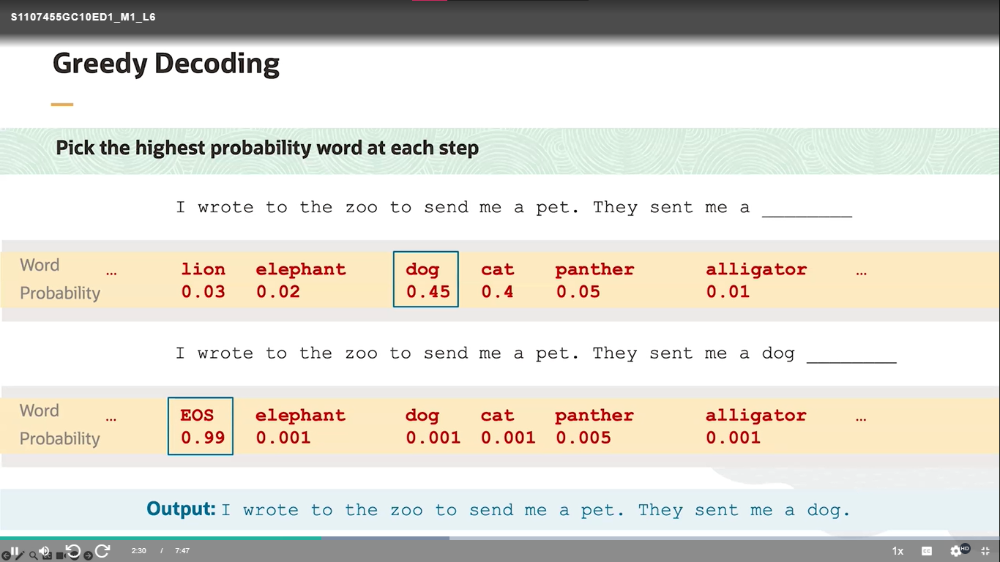
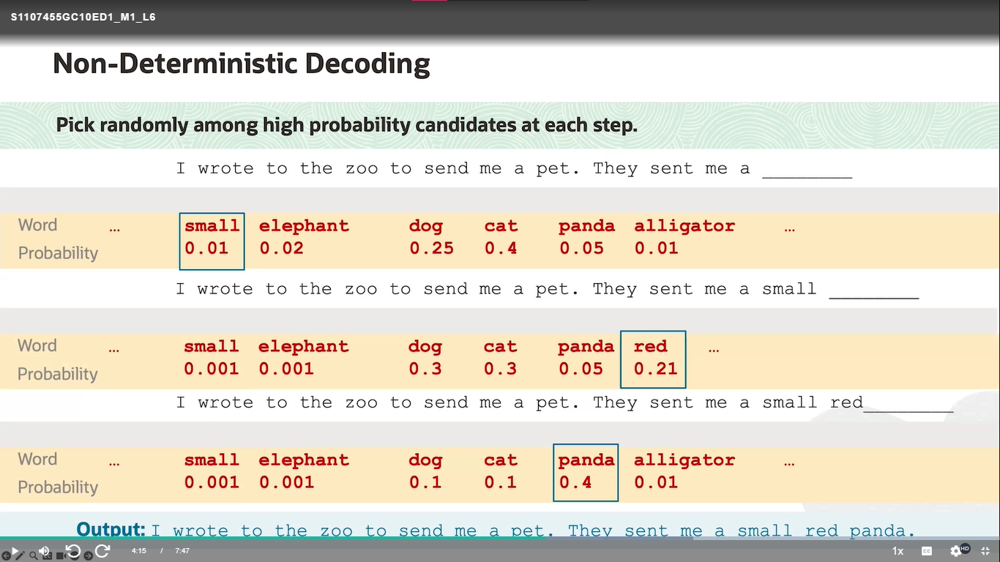
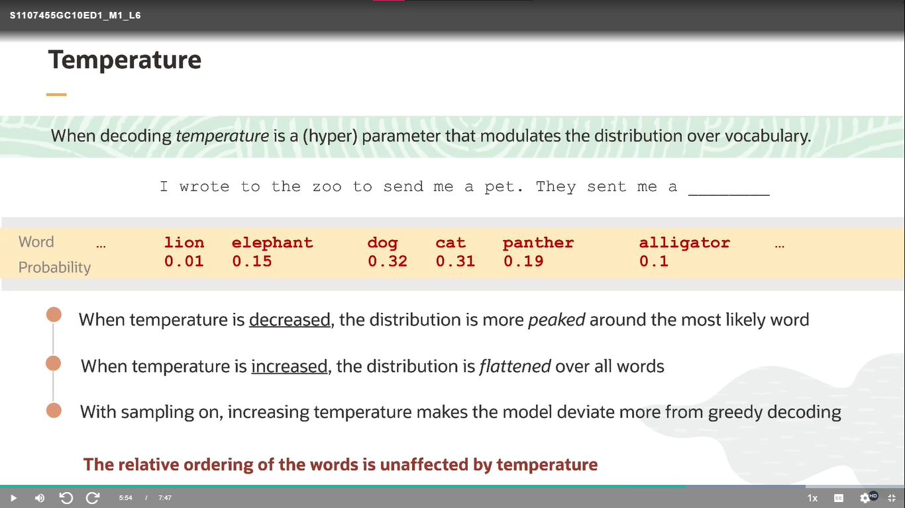

# Fundamentals of Large Language Models

# Language Models (LMs)

Los modelos de lenguaje (LMs) son herramientas poderosas en el campo de la inteligencia artificial y el procesamiento del lenguaje natural (NLP). Estos modelos tienen la capacidad de entender y generar texto humano de manera coherente y relevante. Funcionan mediante el aprendizaje de patrones en grandes conjuntos de datos textuales, lo que les permite predecir palabras o secuencias de palabras basadas en el contexto proporcionado.

## Funcionamiento de los LMs

Los LMs utilizan una arquitectura de red neuronal, como las redes neuronales recurrentes (RNNs) o las transformers, para aprender la estructura y la gramática del lenguaje. Esto se logra a través del entrenamiento en corpus textuales masivos, como colecciones de libros, artículos de noticias o conversaciones en línea.

### Ejemplo de Funcionamiento

Supongamos que tenemos una frase inicial incompleta: "El gato está en el..."

El LM, basándose en su entrenamiento previo, puede predecir la siguiente palabra. Si ha visto muchas instancias de esta frase en su entrenamiento, es probable que sugiera palabras comunes que siguen a "El gato está en el", como "tejado", "jardín" o "sillón".

## Aplicaciones de los LMs

Los LMs tienen una amplia gama de aplicaciones en diversas áreas:

- **Generación de Texto:** Pueden utilizarse para generar texto automáticamente, como en la escritura automática de contenido para sitios web, creación de historias, generación de diálogos, entre otros.

- **Traducción Automática:** Ayudan en la traducción de idiomas al predecir la secuencia de palabras más probable en el idioma de destino.

- **Asistencia Virtual:** Alimentan los chatbots y asistentes virtuales, permitiéndoles entender consultas y responder de manera inteligente.

- **Corrección de Texto:** Pueden utilizarse para corregir errores gramaticales y ortográficos en textos.

## Por aprender...

- **What else can LLMs do?**
- **How do we affect the distribution over the vocabulary?**
- **How do LLMs generate text using these distributions?**

# LLM Architectures

## Encoders y Decoders

Los modelos de lenguaje (LMs) han evolucionado considerablemente gracias a la introducción de arquitecturas como los codificadores (encoders) y decodificadores (decoders). Estas estructuras son fundamentales en la comprensión y generación de texto, permitiendo a los LMs capturar y producir secuencias coherentes y relevantes.

### Encoders

Los encoders son responsables de procesar la entrada de texto y convertirla en una representación vectorial significativa. Esta representación codificada contiene información sobre el contexto y las características semánticas del texto de entrada.

### Decoders

Los decoders, por otro lado, toman la representación vectorial generada por el encoder y la utilizan para generar secuencias de texto coherentes. El decoder utiliza esta información contextual para predecir la siguiente palabra o token en la secuencia.

## Ejemplo de Funcionamiento

Tomemos como ejemplo un modelo de lenguaje basado en la arquitectura transformer, que utiliza tanto encoders como decoders. Supongamos que queremos completar la siguiente frase: "El perro está en el..."

1. **Encoding:** El texto "El perro está en el..." se pasa a través del encoder, que lo convierte en una representación vectorial contextualizada, capturando información sobre el perro y su ubicación.

2. **Decoding:** Esta representación vectorial se pasa al decoder, que utiliza esta información para generar la siguiente palabra en la secuencia. Basándose en el contexto proporcionado, el decoder podría predecir palabras como "parque", "jardín" o "casa".

3. **Iteración:** El proceso se repite iterativamente, con el decoder generando una palabra a la vez hasta que se completa la secuencia.

## Aplicaciones en LLMs

### Traducción Automática

En el contexto de la traducción automática, el encoder procesaría el texto de origen y el decoder utilizaría la representación vectorial generada para producir la traducción en el idioma de destino.

### Generación de Texto

Para la generación de texto, el encoder analiza el contexto proporcionado y el decoder utiliza esta información para generar secuencias de texto coherentes y relevantes.

| Aspecto         | Encoders                                                  | Decoders                                                    | Encoder-Decoder                                                        |
| --------------- | --------------------------------------------------------- | ----------------------------------------------------------- | ---------------------------------------------------------------------- |
| Función         | Transforma texto en representaciones vectoriales          | Genera texto a partir de representaciones vectoriales       | Codifica y decodifica texto en una sola arquitectura                   |
| Características | - Captura contexto y semántica                            | - Genera texto coherente y relevante                        | - Combina las funciones de encoder y decoder                           |
| Ejemplos        | BERT, RoBERTa, DistilBERT, ALBERT, etc.                   | GPT, Transformer-XL, BART, etc.                             | Transformer, BERT-to-GPT, T5, BART, etc.                               |
| Ventajas        | - Captura relaciones semánticas complejas                 | - Genera secuencias de texto natural                        | - Eficiente para tareas de traducción, resumen, etc.                   |
| Desventajas     | - No genera texto, solo representa                        | - Requiere contexto previo para generar                     | - Puede ser computacionalmente costoso                                 |
| Aplicaciones    | - Clasificación de texto, extracción de información, etc. | - Generación de texto creativo, traducción automática, etc. | - Traducción automática, resumen automático, generación de texto, etc. |
| Otros datos     | - Basados en modelos pre-entrenados                       | - A menudo entrenados en tareas de autoregresión            | - Requiere modelos grandes para capturar toda la información           |

# Prompting and Prompt Engineering

"Prompting and Prompt Engineering" es un enfoque emergente en el campo del aprendizaje automático, particularmente en el contexto de los modelos de lenguaje (LMs) y la generación de texto. Este enfoque se centra en cómo formular y diseñar "prompts" o instrucciones de entrada específicas para guiar y mejorar el rendimiento de los modelos.

## Concepto de "Prompting"

"Prompting" se refiere al proceso de proporcionar a un modelo de lenguaje una entrada inicial o un contexto específico que influya en su salida. En lugar de simplemente alimentar al modelo con una secuencia de texto aleatoria, los prompts están diseñados para dirigir la generación de texto en una dirección deseada. Estos prompts pueden ser preguntas, descripciones de tareas o cualquier otro tipo de guía que ayude al modelo a producir resultados relevantes.

## Importancia del "Prompt Engineering"

El "Prompt Engineering" se refiere al diseño y la optimización de prompts para maximizar el rendimiento del modelo en una tarea específica. Esto implica entender la naturaleza de la tarea y el conjunto de datos, así como identificar qué tipos de prompts son más efectivos para guiar al modelo hacia la respuesta deseada.

## Ejemplos de Aplicaciones

### Generación de Texto

En la generación de texto, los prompts pueden utilizarse para influir en el estilo, el contenido o la estructura del texto generado. Por ejemplo, un prompt específico podría pedir al modelo que genere un poema en un estilo particular o que resuma un artículo de noticias.

### Clasificación de Texto

En la clasificación de texto, los prompts pueden proporcionar información adicional sobre el contexto o la naturaleza de la tarea. Por ejemplo, un prompt podría indicar al modelo que clasifique una reseña de película como positiva o negativa, dándole ejemplos de ambos tipos de reseñas.

### Traducción Automática

En la traducción automática, los prompts pueden especificar el par de idiomas y proporcionar una frase en el idioma de origen para traducir. Esto ayuda al modelo a generar una traducción más precisa y relevante.

## Métodos de "Prompt Engineering"

Existen varios enfoques para el "Prompt Engineering", que incluyen:

- **Búsqueda de Prompts**: Experimentar con diferentes prompts para encontrar aquellos que maximicen el rendimiento del modelo en una tarea específica.
- **Generación Automática de Prompts**: Utilizar técnicas de generación de lenguaje natural para crear prompts automáticamente a partir de la descripción de la tarea o el conjunto de datos.
- **Afinamiento de Prompts**: Ajustar y refinar los prompts basándose en el feedback del modelo y los resultados obtenidos.

# Issues with Prompting

Platica en general de los intentos de ataques por medio del prompt, como los que se podían hacer a GTP para desbloquear su uso sin etica o el que muestre trozos de su código al usuario

# Training

# Decoding

**EOS:** End Of Sentence/Sequence

Una `temperatura` más **alta** produce respuestas más _aleatorias y creativas_, mientras que una `temperatura` más **baja** produce respuestas más _deterministas y precisas_.

# Hallucination

En general es sobre cuando las respuestas dadas por un modelo son erronéas o no tienen sentido alguno. Que pueden ser muy sutiles o muy obvias, lo cuál es algo peligroso para alguien con poco conocimiento del tema, además de que no se tiene una forma de evitar este problema.

# LLM Applications

[Siguiente](./2%20-%20Generative.md)