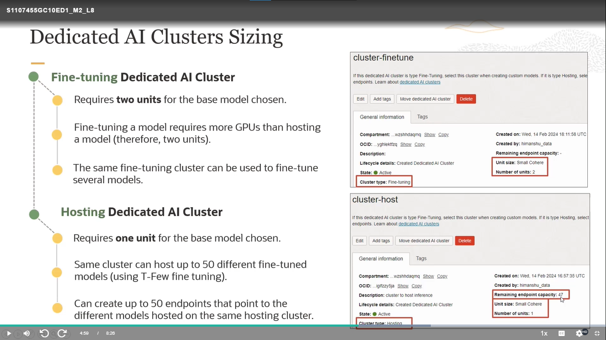
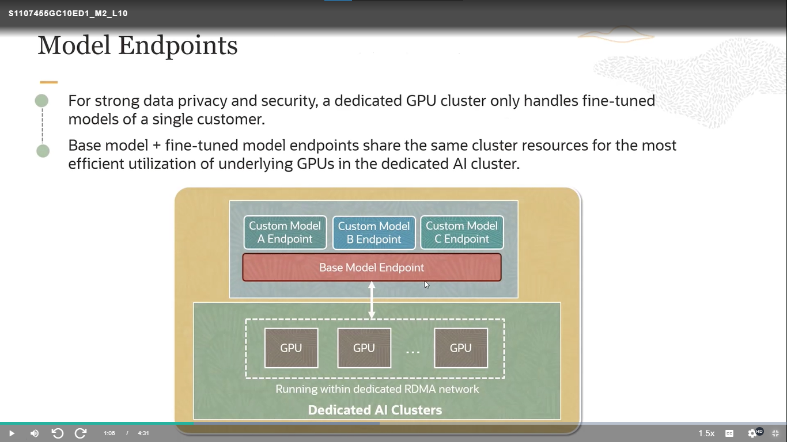

# Generative AI Service

## Introduction to OCI Generative AI Service

### OCI Generative AI Service

- `Fully managed service` that provides a set of customizable Large Language Models (LLMs) available via a single API to build generative Al applications.
- `Choice of Models:` high performing pretrained foundational models from Meta and Cohere.
- `Flexible Fine-tuning:` create custom models by fine-tuning foundational models with your own data set.
- `Dedicated Al Clusters:` GPU based compute resources that host your fine-tuning and inference workloads.

## Generation Models

### Cuadro comparativo de modelos de generación preentrenados en IA Generativa

| Modelo               | Parámetros del modelo | Tamaño de ventana de contexto | Casos de uso                                | Ventajas                                                                             | Desventajas               |
| -------------------- | --------------------- | ----------------------------- | ------------------------------------------- | ------------------------------------------------------------------------------------ | ------------------------- |
| **Command**          | 52B                   | 4096 tokens                   | Generación de texto, chat, resumen de texto | Modelo conversacional de alto rendimiento que sigue instrucciones                    | Modelo grande y costoso   |
| **Command-light**    | 6B                    | 4096 tokens                   | Generación de texto, chat, resumen de texto | Versión más pequeña y rápida de Command                                              | Menos preciso que Command |
| **Ilama-2-70b-chat** | 70B                   | 4096 tokens                   | Chat, generación de texto                   | Modelo de código abierto de alto rendimiento optimizado para casos de uso de diálogo | Modelo grande y costoso   |

**Notas:**

* Los parámetros del modelo se refieren al número de parámetros en el modelo. Un modelo con más parámetros suele ser más preciso, pero también es más grande y costoso de ejecutar.
* El tamaño de la ventana de contexto se refiere al número de tokens que el modelo considera al generar texto. Un modelo con un tamaño de ventana de contexto más grande puede generar texto más coherente, pero también es más lento.
* Los casos de uso se refieren a las tareas para las que el modelo está diseñado. Un modelo puede ser diseñado para una variedad de tareas, como generación de texto, chat o resumen de texto.
* Las ventajas y desventajas de cada modelo se enumeran en la última columna.

## Embedding Models

### Embeddings

- Embeddings are numerical representations of a piece of text converted to number sequences.
- A piece of text could be a word, phrase, sentence, paragraph or one or more paragraphs.
- Embeddings make it easy for computers to understand the relationships between pieces of text.

## Prompt Engineering

## Customize LLMs with your data

## Fine Tuning and Inference in OCI Generative AI

## Dedicated AI Cluster Sizing and Pricing

## Fine-tuning configuration

## OCI Generative AI Security

[Siguiente](./3%20-%20Building.md)