# Building Blocks for an LLM Application

## RAG (Retrieval Augmented Generation)

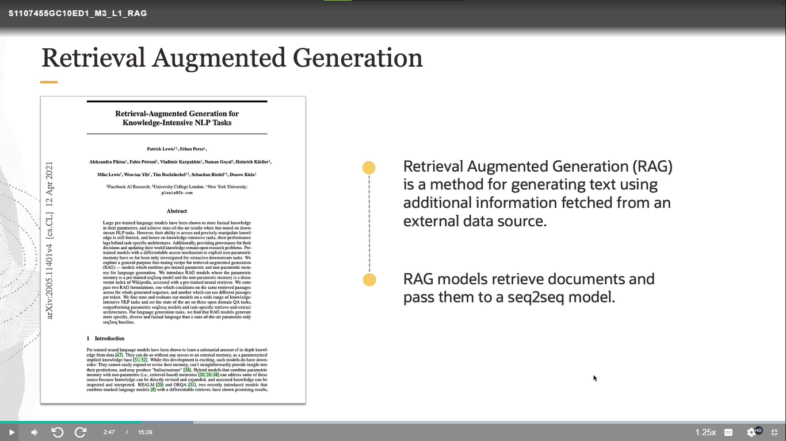
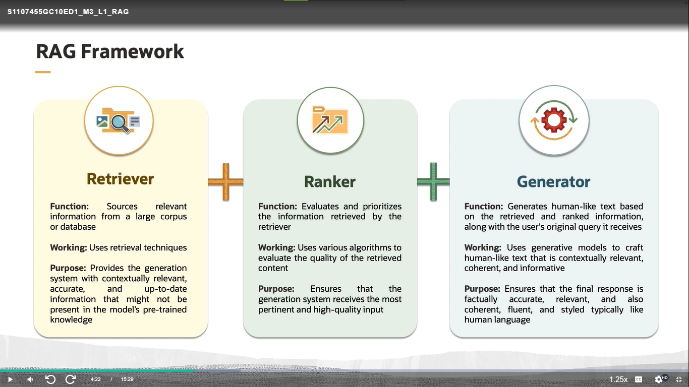
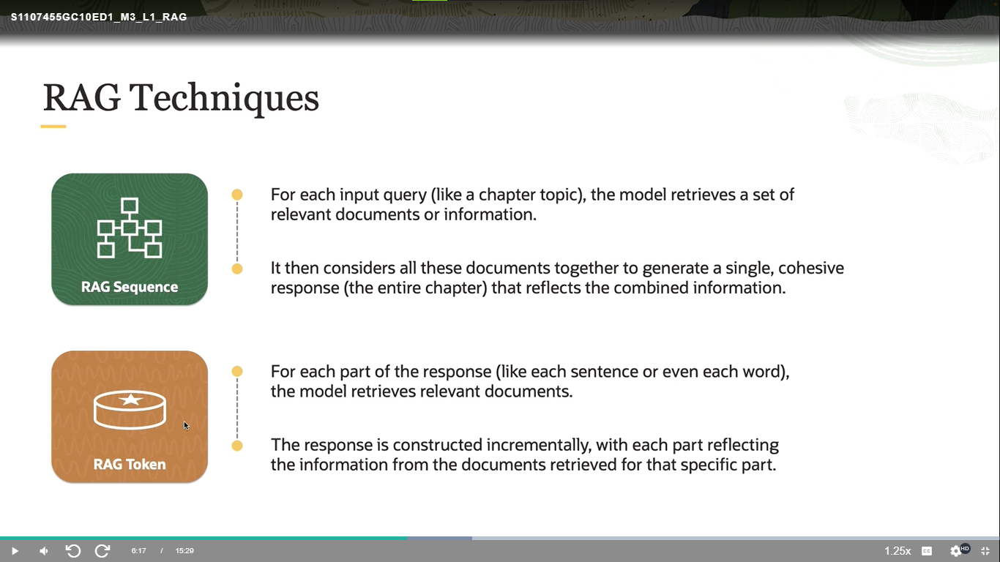
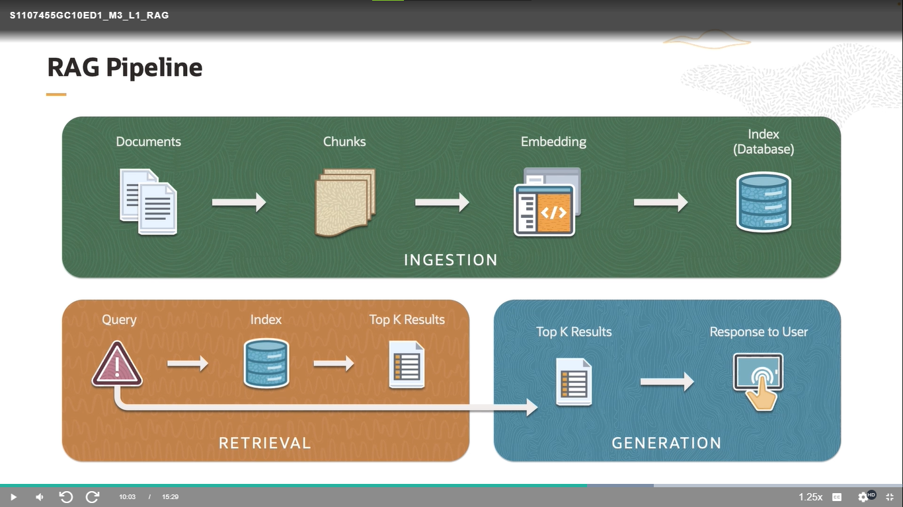
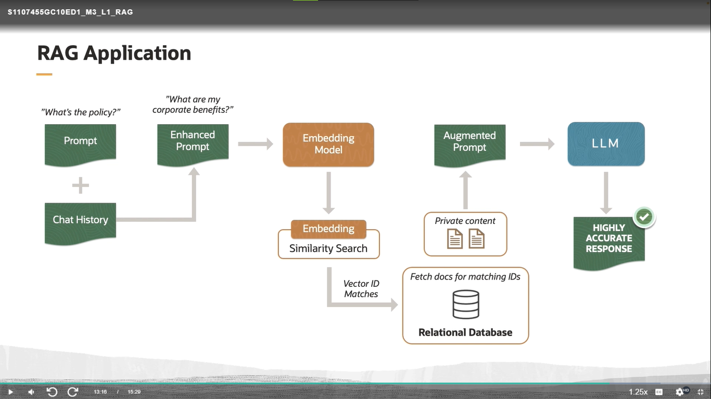
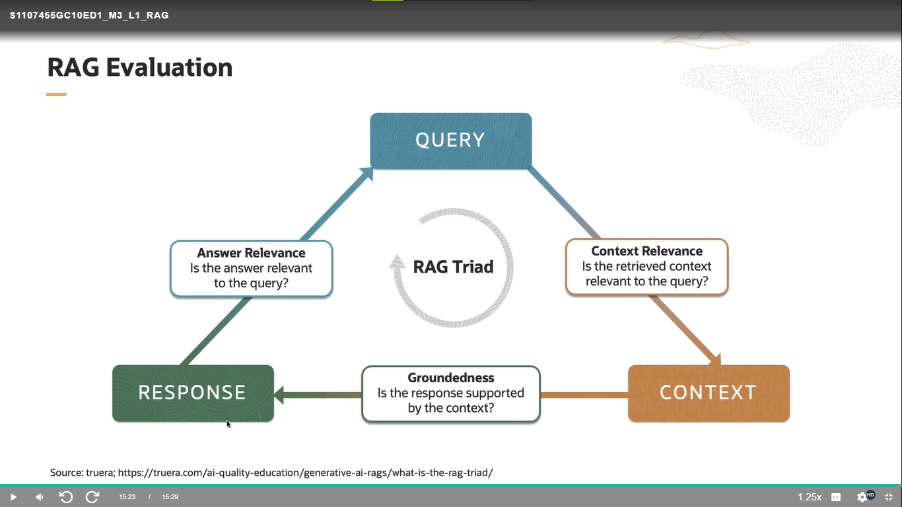

## Resumen:

Retrieval-Augmented Generation (RAG) es una técnica avanzada en el campo del procesamiento del lenguaje natural (NLP) que combina la generación de texto (utilizando modelos generativos como GPT) con la recuperación de información. Este enfoque está diseñado para mejorar la precisión y la relevancia de las respuestas generadas por modelos de lenguaje, especialmente en contextos donde se requiere información específica o actualizada.

## Principios Básicos de RAG

1. **Recuperación de Información**:
   - RAG utiliza un sistema de recuperación de información para buscar documentos relevantes en una base de datos o en una colección de textos antes de generar una respuesta.
   - Este paso asegura que el modelo generativo tenga acceso a información actualizada y precisa que pueda no estar incluida en su entrenamiento original.

2. **Generación de Texto**:
   - Una vez recuperada la información relevante, un modelo generativo (como GPT-3) utiliza esta información para producir una respuesta coherente y contextualizada.
   - La combinación de recuperación y generación permite que las respuestas sean no solo relevantes, sino también detalladas y específicas.

## Aplicaciones de RAG en Oracle OCI

Oracle Cloud Infrastructure (OCI) es una plataforma de servicios de nube que ofrece una variedad de herramientas y capacidades para el desarrollo y despliegue de aplicaciones empresariales. En el contexto de OCI, RAG puede tener múltiples aplicaciones valiosas:

### 1. **Mejora de Servicios de Atención al Cliente**
   - **Chatbots y Asistentes Virtuales**: Los chatbots integrados con RAG pueden proporcionar respuestas más precisas y útiles a las consultas de los clientes, recuperando información específica de bases de datos de conocimiento actualizadas y generando respuestas que son contextualmente relevantes.
   - **Soporte Técnico**: En el soporte técnico, RAG puede ayudar a los agentes a encontrar rápidamente soluciones a problemas complejos al recuperar y generar información de documentación técnica y bases de datos de incidencias previas.

### 2. **Optimización de Procesos Empresariales**
   - **Gestión de Datos**: En la gestión de grandes volúmenes de datos, RAG puede ayudar a los analistas a encontrar rápidamente información relevante y generar reportes detallados y precisos basados en datos recuperados de múltiples fuentes dentro de OCI.
   - **Toma de Decisiones**: Para la toma de decisiones empresariales, RAG puede sintetizar información de diferentes fuentes de datos, proporcionando resúmenes y recomendaciones basadas en información actualizada y relevante.

### 3. **Desarrollo de Aplicaciones**
   - **Desarrollo de Aplicaciones Inteligentes**: Los desarrolladores pueden utilizar RAG para crear aplicaciones que necesiten respuestas basadas en grandes volúmenes de datos, mejorando la capacidad de estas aplicaciones para interactuar con los usuarios de manera inteligente y relevante.
   - **Automatización de Flujos de Trabajo**: RAG puede integrarse en flujos de trabajo automatizados para recuperar y procesar información en tiempo real, mejorando la eficiencia y la eficacia de los procesos empresariales.

## Implementación Técnica de RAG en OCI

Para implementar RAG en Oracle OCI, se pueden seguir varios pasos técnicos:

1. **Configuración de Entornos**:
   - Utilizar servicios como Oracle Autonomous Database para almacenar y gestionar grandes volúmenes de datos.
   - Configurar instancias de cómputo en OCI para alojar modelos de lenguaje generativo y sistemas de recuperación de información.

2. **Integración de APIs**:
   - Utilizar las APIs de OCI para acceder a bases de datos, servicios de almacenamiento y otros recursos necesarios para la recuperación de información.
   - Integrar APIs de modelos generativos como GPT para la generación de texto basada en la información recuperada.

3. **Desarrollo de Modelos**:
   - Entrenar modelos de recuperación de información utilizando técnicas de aprendizaje automático para asegurar que puedan recuperar datos relevantes de manera eficiente.
   - Ajustar modelos generativos para mejorar su capacidad de utilizar información recuperada y generar respuestas coherentes y precisas.

4. **Despliegue y Monitoreo**:
   - Desplegar los modelos en OCI, utilizando servicios como Oracle Functions para la ejecución de funciones serverless que manejan las solicitudes de recuperación y generación.
   - Monitorear el rendimiento del sistema y realizar ajustes necesarios para mejorar la precisión y la relevancia de las respuestas generadas.

## Vector Databases

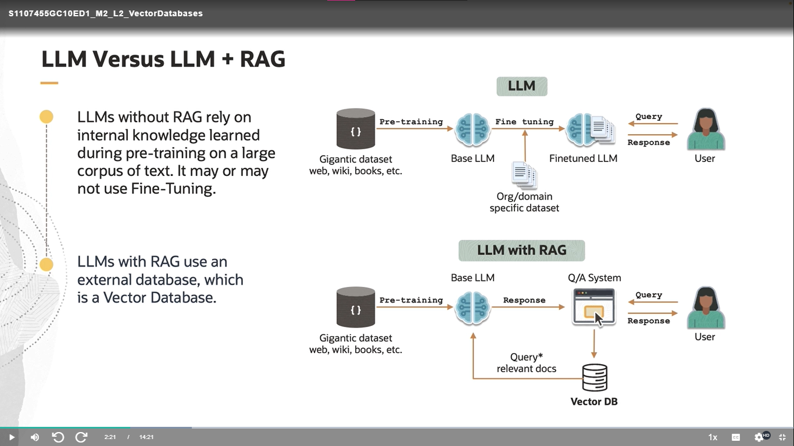
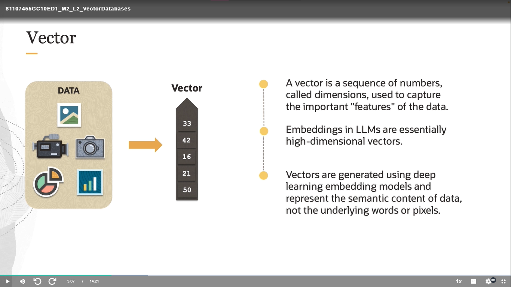
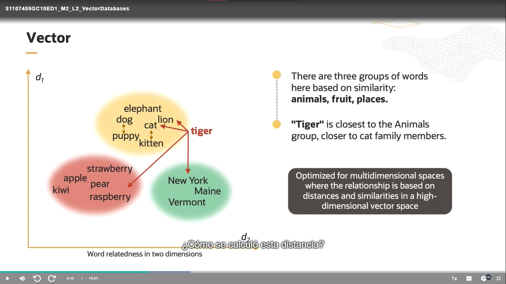
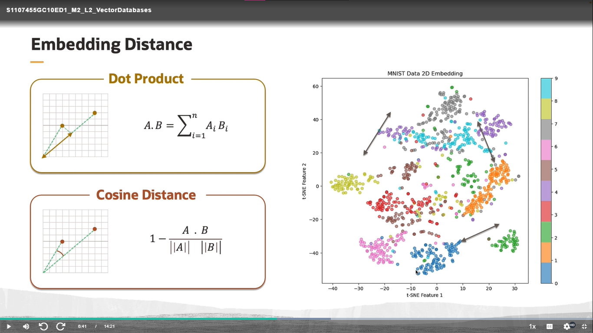
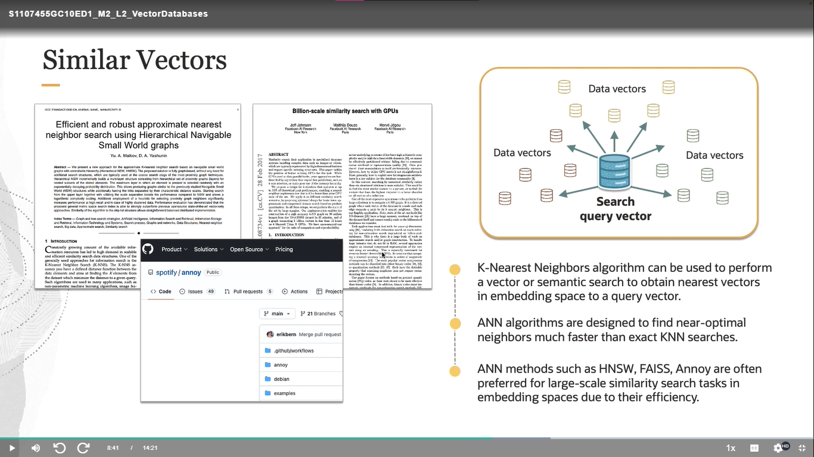
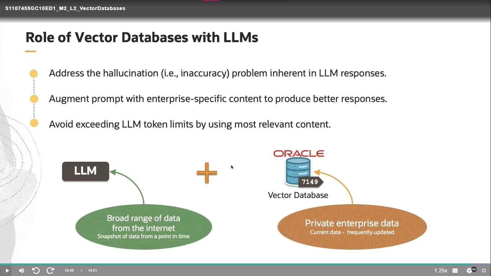

### Role of Vector Databases with LLMs

- Cheaper than fine-tuning LLMs, which can be expensive to update
- Real-time updated knowledge base
- Cache previous LLM prompts/responses to improve performance and reduce costs

## Keyword Search

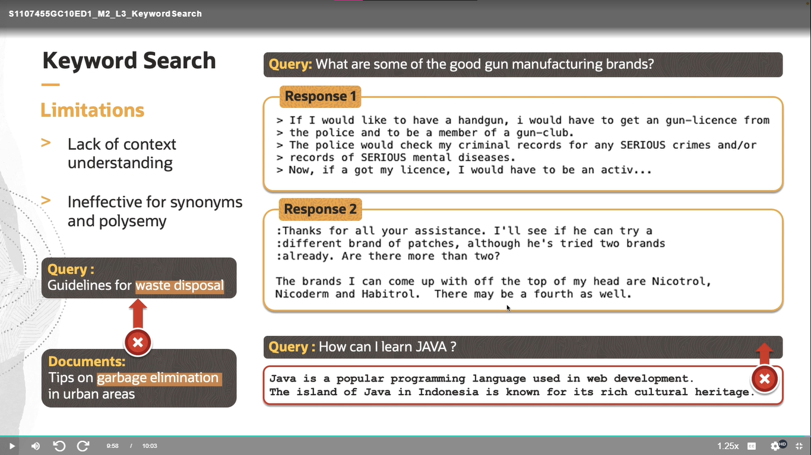

## Semantic Search

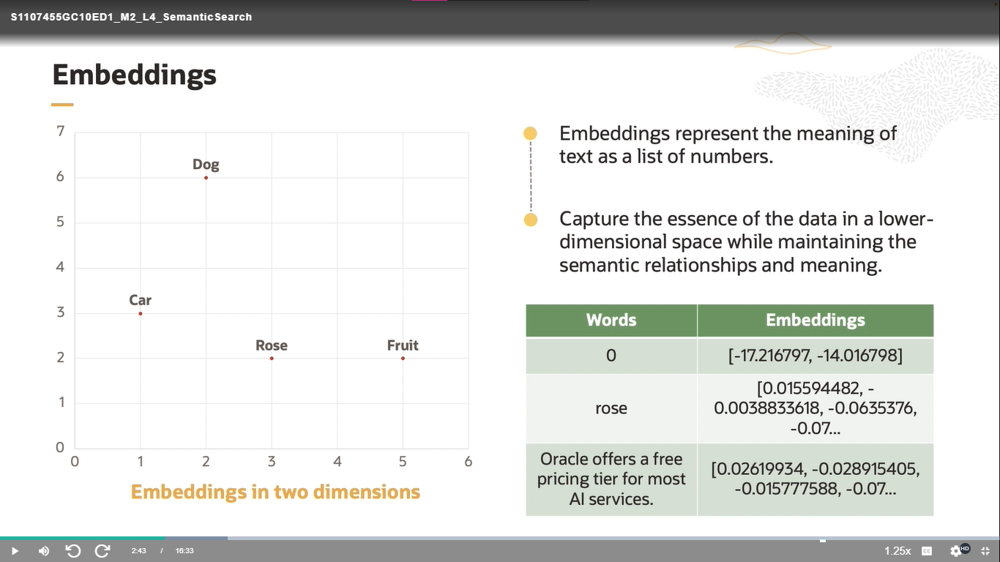
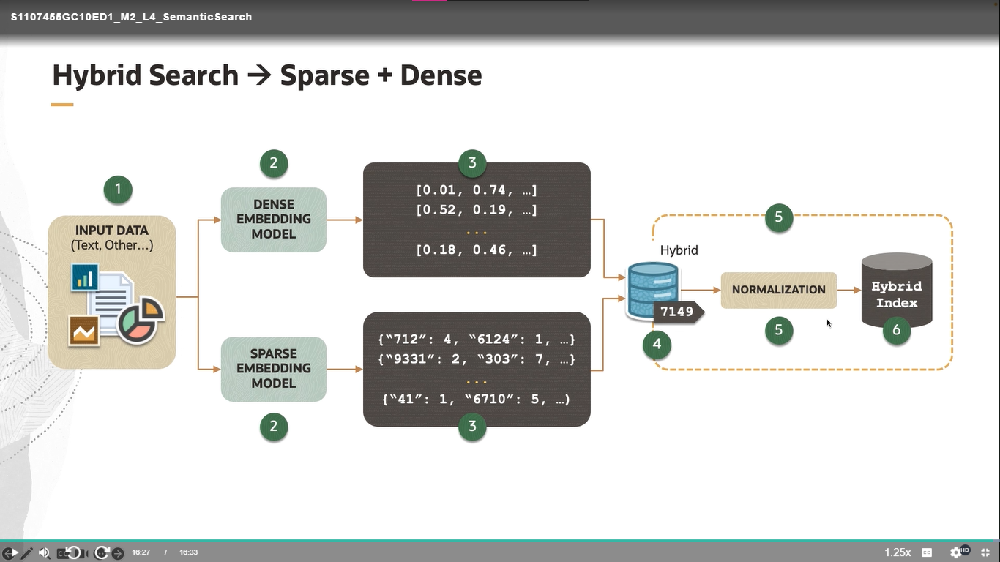

El diagrama ilustra un proceso de búsqueda híbrida que combina modelos de representación esparsa y densa para mejorar la búsqueda semántica. Este proceso es parte de la construcción de aplicaciones basadas en Modelos de Lenguaje Grande (LLM, por sus siglas en inglés) dentro del contexto del curso de inteligencia artificial generativa de Oracle.

### Desglose del Diagrama:

1. **Entrada de Datos (Input Data):**
   - La entrada consiste en datos textuales u otros tipos de datos que serán procesados por los modelos de incrustación.

2. **Modelos de Incrustación:**
   - **Modelo de Incrustación Densa (Dense Embedding Model):** Este modelo convierte los datos de entrada en vectores densos de baja dimensionalidad. Estos vectores capturan relaciones semánticas complejas entre las palabras.
   - **Modelo de Incrustación Esparsa (Sparse Embedding Model):** Este modelo representa los datos de entrada en vectores esparsos de alta dimensionalidad, donde las palabras se codifican en base a su frecuencia y contexto específico.

3. **Vectores de Incrustación:**
   - Los modelos de incrustación generan dos tipos de vectores:
     - **Vectores Densos:** Ejemplificados como [0.01, 0.74, …], [0.52, 0.19, …], etc.
     - **Vectores Esparsos:** Ejemplificados como {"712": 4, "6124": 1, …}, {"9331": 2, "303": 7, …}, etc.

4. **Índice Híbrido (Hybrid Index):**
   - Ambos conjuntos de vectores (densos y esparsos) se almacenan en una base de datos híbrida.

5. **Normalización (Normalization):**
   - Los vectores de incrustación se normalizan para unificar las escalas y mejorar la comparación y búsqueda.

6. **Índice Final (Hybrid Index):**
   - Finalmente, los vectores normalizados se almacenan en un índice híbrido que se utiliza para realizar búsquedas más precisas y eficientes.

