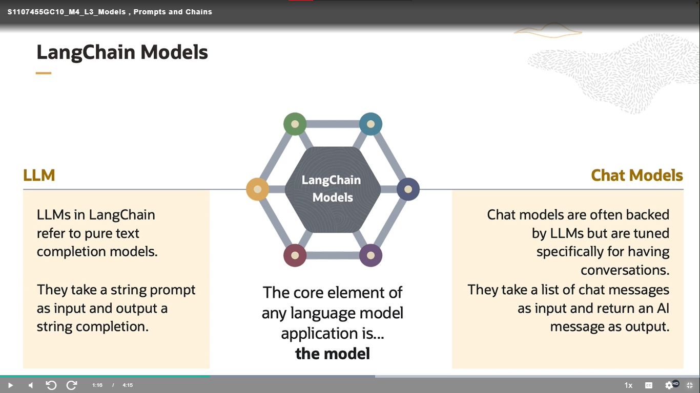
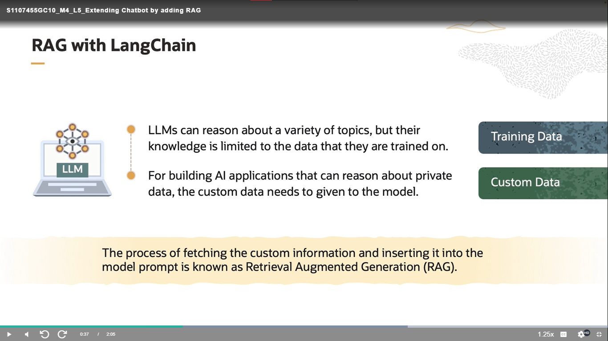

# Build an LLM Application using OCI Generative AI Service

## Q&A Chatbot Architecture and basic components.

## Models , Prompts and Chains

## Extending Chatbot by adding Memory

## Extending Chatbot by adding RAG

## Extending Chatbot by adding  RAG + Memory

## Chatbot Technical Architecture

