# Become An Application Integration Professional (2023)

Oracle Integration Cloud proporciona un entorno completamente gestionado y preconfigurado que le brinda el poder de integrar sus aplicaciones en la nube y en las instalaciones. Los desarrolladores y arquitectos de la nube pueden conectar aplicaciones SaaS y en las instalaciones seis veces más rápido con una experiencia de desarrollo visual, integraciones preconstruidas y mejores prácticas integradas.

Al final de este entrenamiento, estarás preparado para asumir la Certificación Profesional en Integración de Aplicaciones.

Aprenderás a:

- Comprender los componentes, características y capacidades de OIC
- Crear y configurar conexiones (Adaptador, Desencadenador, Invocar)
- Crear integraciones (Orquestaciones impulsadas por aplicaciones y programadas)
- Mapear datos utilizando búsquedas y el Mapeador de datos
- Aprovechar las opciones, características y capacidades de manejo de archivos
- Configurar acciones de orquestación y lógica de manejo de fallas
- Embarcarte en un viaje exitoso para dominar el diseño e implementación de integraciones de OIC.

## [Enlace directo al curso](https://mylearn.oracle.com/ou/learning-path/become-an-application-integration-professional-2023/122249)

## Application Integration on Oracle Cloud

### OIC Architectural Overview - Architectual Overview & Use Cases

#### Oracle Integration Cloud Services

    

**Crear y gestionar integraciones (Integraciones)**

* Crea las conexiones a las aplicaciones con las que deseas compartir datos.
* Luego configura una integración, que utiliza la conexión que creaste y define cómo se comparten los datos entre tus aplicaciones.

**Desarrollar aplicaciones de procesos automatizados (Process Builder)**

* Automatiza tu negocio utilizando aplicaciones de procesos: desarrolla, prueba, publica y activa.
* Repite siempre que se necesiten cambios.

**Desarrollar aplicaciones web y móviles (Visual Builder)**

* Crea y publica rápidamente aplicaciones web y móviles personalizadas
* utilizando una herramienta de desarrollo visual.
* Construye las páginas de tu aplicación utilizando componentes que colocas en un lienzo e integra con otros servicios.
* No se requiere configuración ni codificación.

#### OIC: Process Builder

    

#### Process Builder - Creating Applications

    

#### OIC: Visual Builder

    

#### OIC: Using Features Together

    

#### OIC: Integrations

    

#### SaaS-to-SaaS Integration

    

#### SaaS-to-On-Premises Integration

    

#### OIC Integrations Value Proposition

    

#### OIC Integration Components

    

#### Integration DEvelopment and Management Workflow

    

#### OIC Integration Scenarios

    

### OIC Architectural Overview - Demo: Activating & Testing a Sample Integration (Practice 2-1)

1. Iniciar sesión en OIC
2. Ir a `Integrations`
3. Activar `Hello World`, habilitando el `Tracing` y el `Include Payload`
4. Da click en el boton de `Run` -> `Test`
5. Abrira una ventana de pruebas estilo `Postman`.
6. En los URI Parameters desmarca `flowid` e `email`
7. Solo en `name` escribe algo como `Pedro`
8. Da click en `Test` y observa el JSON resultante
9. Si volvemos a la ventana de `Integrations` y volvemos a dar click en `Run` veremos el `Metadata URL`
10. Abre dicha URL en otra ventana y veremos una serie de datos de la integración, de momento nos interesa el `Endpoint URL`, el cuál puedes usar para probar con otras herramientas como la antes mencionada `Postman` o directamente en el navegador

### Integrations Life Cycle & Packages - Packaging & Versioning Integrations

#### Prebuilt Integrations

    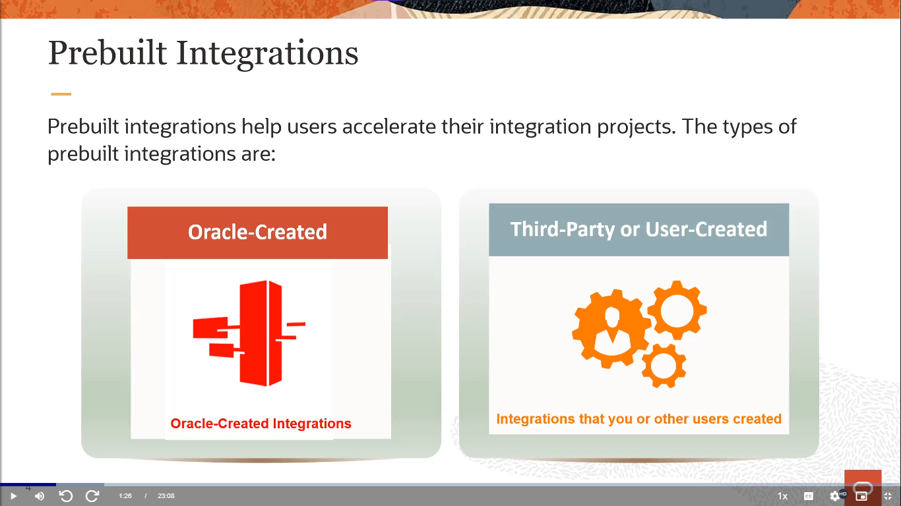

Las integraciones preconstruidas de Oracle Integration Cloud (OIC) son soluciones listas para usar que conectan aplicaciones de Oracle y de terceros. Estas integraciones simplifican el proceso de integración al proporcionar flujos de trabajo, mapeos, adaptadores y activadores preconfigurados. Las integraciones preconstruidas de OIC se pueden implementar rápidamente y personalizar según las necesidades del negocio.

#### Oracle-Created Prebuilt Integrations

    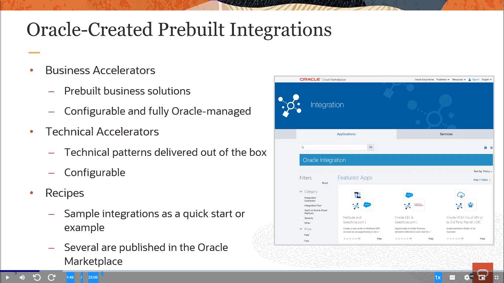

* `Business Accelerators:` Son soluciones empresariales preconstruidas que son configurables y completamente gestionadas por Oracle. Estas aceleradoras de negocio están diseñadas para ayudar a las empresas a implementar rápidamente soluciones de Oracle que se ajusten a sus necesidades específicas.
* `Technical Accelerators:` Entregan patrones técnicos listos para usar que también son configurables. Estos aceleradores técnicos proporcionan una forma eficiente de implementar tecnologías y funcionalidades específicas sin tener que desarrollarlas desde cero.
* `Recipes:` Son integraciones de muestra que sirven como un inicio rápido o ejemplo. Varios de estos “recetas” están publicados en el Oracle Marketplace, proporcionando a los usuarios una forma conveniente de explorar y aprender sobre diferentes integraciones.

#### Business Accelerators

    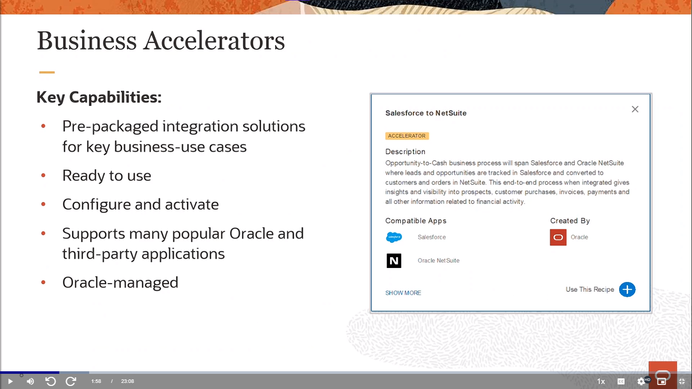

Los Business Accelerators son soluciones preconfiguradas que permiten a las empresas implementar rápidamente procesos de negocio basados en las mejores prácticas de Oracle. Estas soluciones se integran con Oracle Integration Cloud (OIC), una plataforma de integración híbrida que ofrece capacidades clave como la orquestación de servicios, la automatización de procesos, la analítica y la seguridad. Algunas de las ventajas de usar los Business Accelerators con OIC son:

- Reducir el tiempo y el costo de implementación al aprovechar las plantillas y los conectores listos para usar de Oracle.
- Aumentar la agilidad y la innovación al adaptar fácilmente los procesos a las necesidades específicas del negocio.
- Mejorar la eficiencia y la productividad al automatizar tareas repetitivas y optimizar el flujo de trabajo.
- Facilitar la colaboración y la comunicación entre los equipos y los socios al conectar aplicaciones y datos en la nube y en las instalaciones.
- Obtener visibilidad y control sobre el rendimiento y la calidad de los procesos mediante cuadros de mando e informes.

Los Business Accelerators son una forma rápida y sencilla de aprovechar el potencial de Oracle OIC para transformar digitalmente su negocio.

    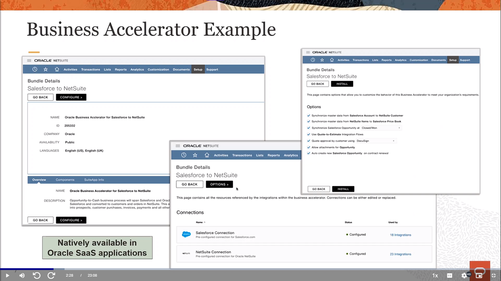

#### Integration Recipes in the Oracle Marketplace

    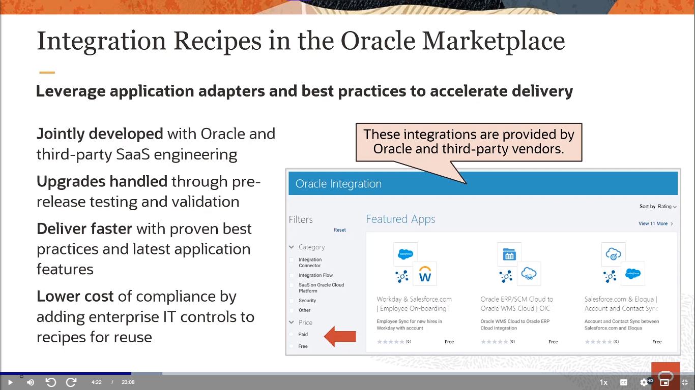

Las recetas de integración en el Oracle Marketplace son una forma rápida y fácil de crear y desplegar integraciones en la nube con Oracle Integration Cloud (OIC). Estas recetas son soluciones predefinidas que se pueden personalizar según las necesidades de cada cliente. Algunas de las ventajas de usar las recetas de integración son:

- Ahorrar tiempo y recursos al aprovechar las mejores prácticas y la experiencia de Oracle y sus socios.
- Acceder a una amplia variedad de recetas que cubren diferentes escenarios de integración, como la sincronización de datos, la automatización de procesos, la orquestación de servicios, etc.
- Facilitar la adopción y el mantenimiento de las integraciones al contar con documentación detallada y soporte técnico.
- Mejorar la seguridad y el rendimiento de las integraciones al utilizar los estándares y las herramientas de Oracle.

Para utilizar las recetas de integración, se debe acceder al Oracle Marketplace desde el portal de OIC y buscar la receta que se desea implementar. Luego, se debe descargar la receta y seguir los pasos para configurarla e instalarla en el entorno de OIC. Finalmente, se puede ejecutar y monitorear la integración desde el panel de control de OIC.

Las recetas de integración en el Oracle Marketplace son una opción conveniente y eficiente para los clientes que quieren aprovechar al máximo las capacidades de OIC y simplificar sus procesos de integración en la nube.

    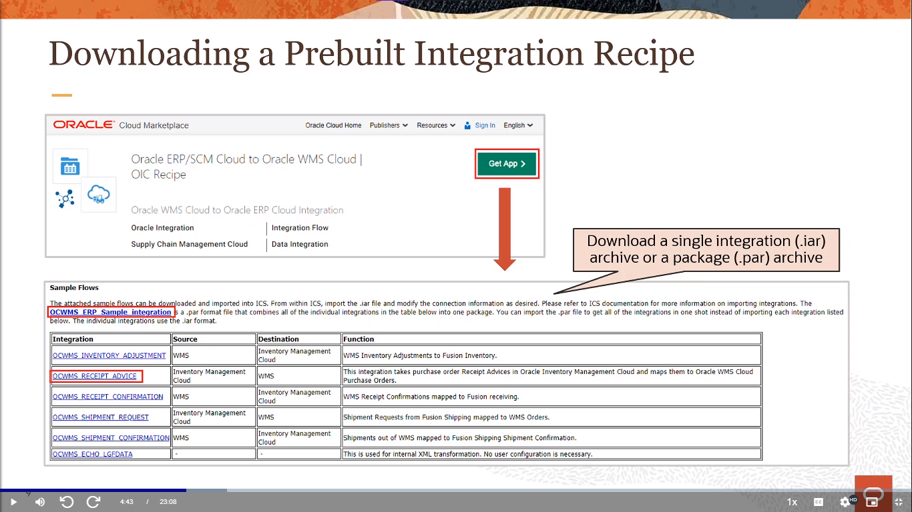

    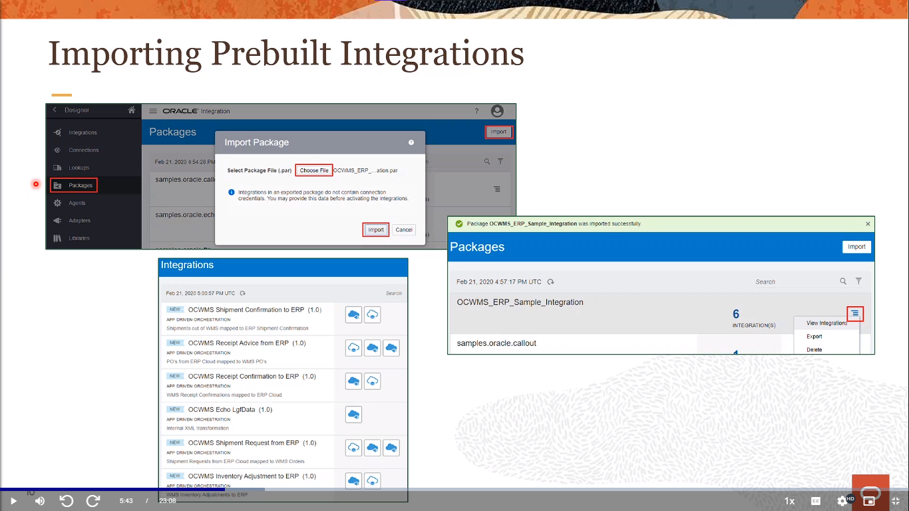

    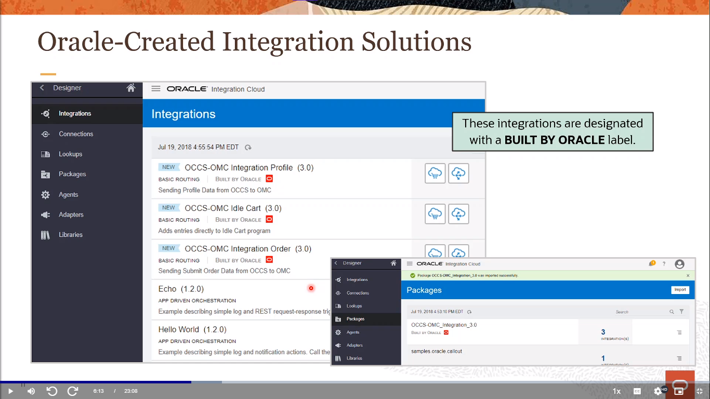

    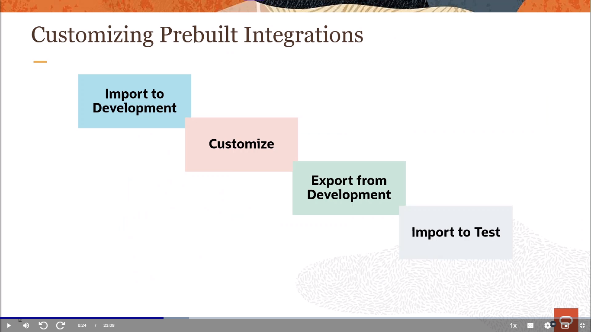

#### OIC Integraion Packages

    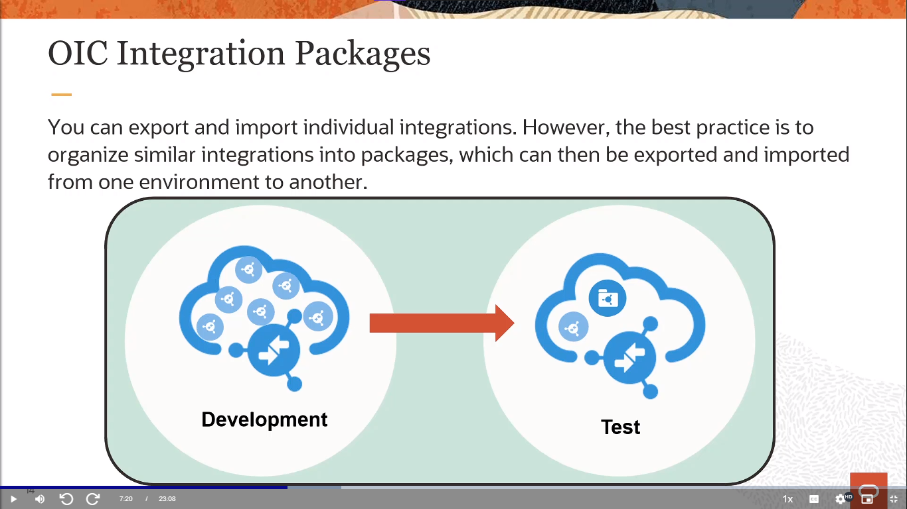

Los paquetes de integración de Oracle OIC son soluciones preconstruidas que facilitan la conexión de aplicaciones en la nube y locales. Estos paquetes se basan en el marco de integración de Oracle, que ofrece una plataforma unificada para diseñar, implementar y gestionar flujos de trabajo, procesos y servicios. Los paquetes de integración de Oracle OIC permiten a los usuarios aprovechar las mejores prácticas y los patrones comunes de integración, reduciendo el tiempo y el costo de desarrollo. Algunos ejemplos de paquetes de integración son:

- `Oracle ERP Cloud to Oracle EPM Cloud:` sincroniza los datos financieros entre las aplicaciones de planificación y gestión empresarial.
- `Oracle HCM Cloud to Oracle ERP Cloud:` transfiere los datos de recursos humanos entre las aplicaciones de gestión del capital humano y financiera.
- `Oracle CX Cloud to Oracle ERP Cloud:` integra los datos de ventas, marketing y servicio al cliente entre las aplicaciones de experiencia del cliente y financiera.

Los paquetes de integración de Oracle OIC se pueden personalizar y ampliar según las necesidades específicas de cada cliente. También se pueden monitorizar y auditar desde una consola centralizada, lo que facilita el mantenimiento y la resolución de problemas. Los paquetes de integración de Oracle OIC son una forma rápida y eficaz de lograr una integración empresarial sin código.

    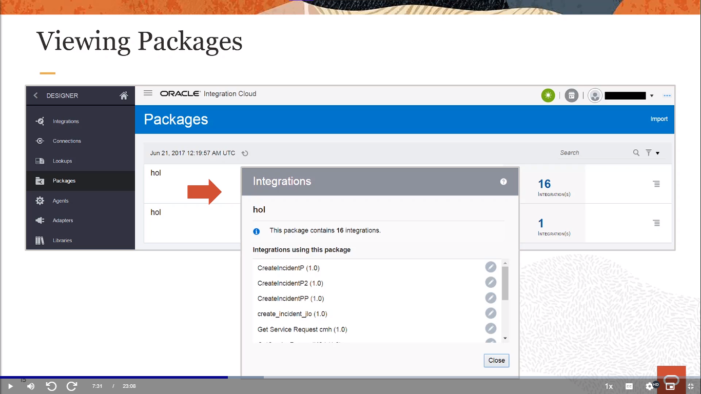

#### Creating Packages

    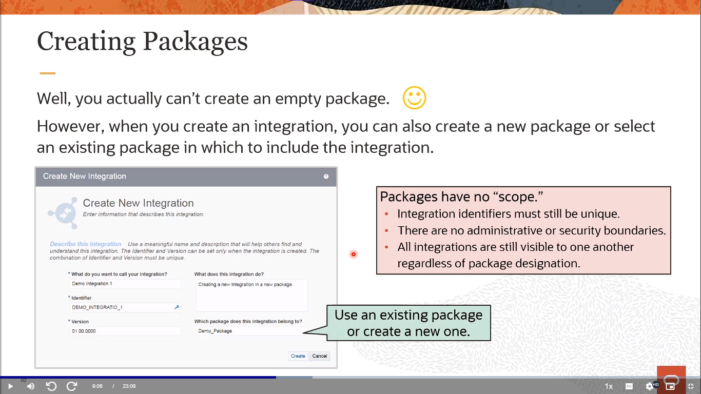

#### Exporting Packages

    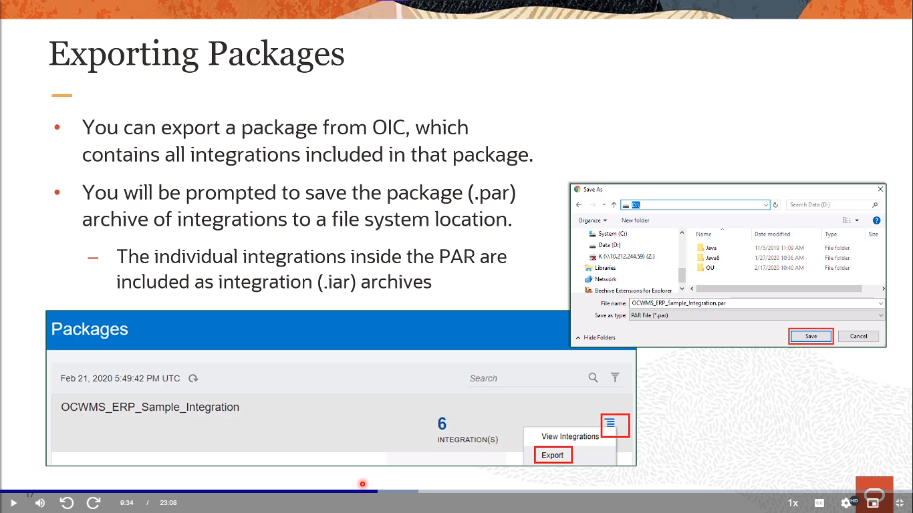

    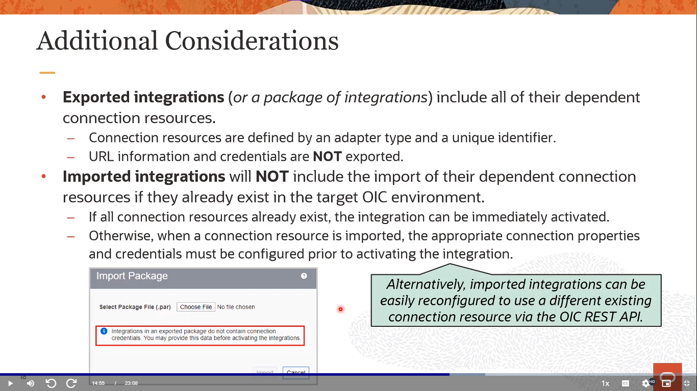

#### Life Cycle Operations for Integrations

    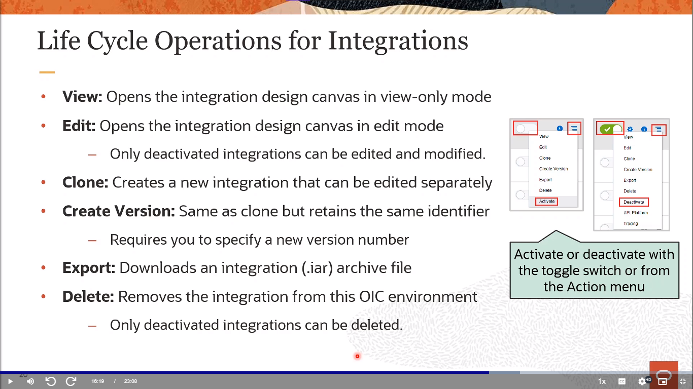

#### Activation Options

    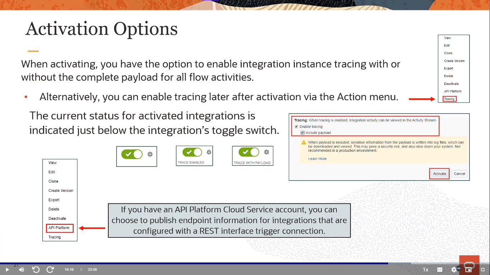

#### Integration VErsioning

    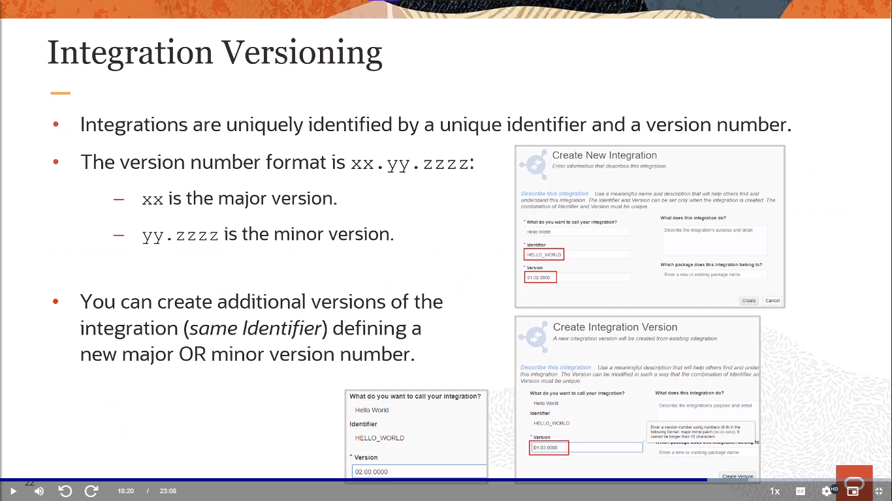

    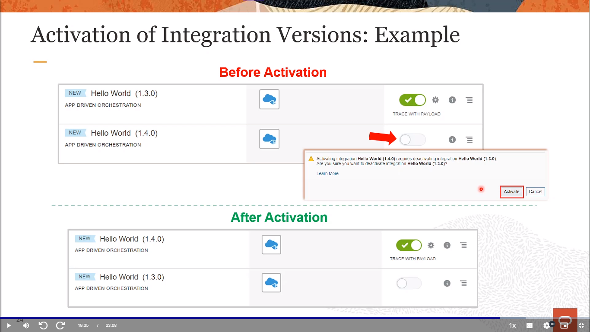

