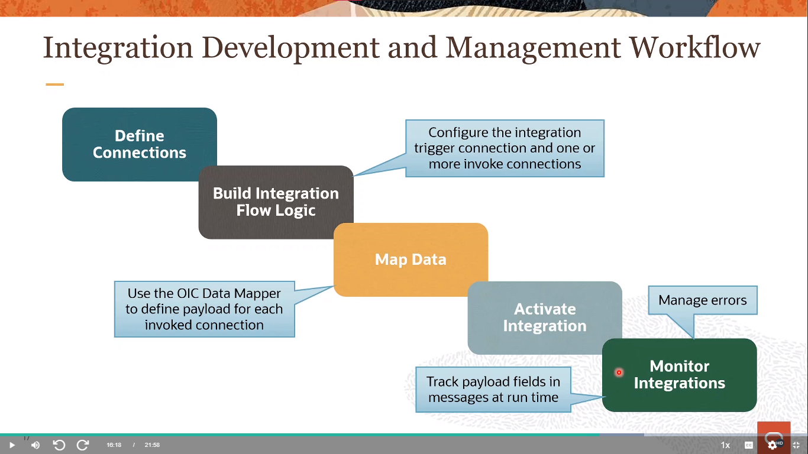

# Become An Application Integration Professional (2023)

Oracle Integration Cloud proporciona un entorno completamente gestionado y preconfigurado que le brinda el poder de integrar sus aplicaciones en la nube y en las instalaciones. Los desarrolladores y arquitectos de la nube pueden conectar aplicaciones SaaS y en las instalaciones seis veces más rápido con una experiencia de desarrollo visual, integraciones preconstruidas y mejores prácticas integradas.

Al final de este entrenamiento, estarás preparado para asumir la Certificación Profesional en Integración de Aplicaciones.

Aprenderás a:

- Comprender los componentes, características y capacidades de OIC
- Crear y configurar conexiones (Adaptador, Desencadenador, Invocar)
- Crear integraciones (Orquestaciones impulsadas por aplicaciones y programadas)
- Mapear datos utilizando búsquedas y el Mapeador de datos
- Aprovechar las opciones, características y capacidades de manejo de archivos
- Configurar acciones de orquestación y lógica de manejo de fallas
- Embarcarte en un viaje exitoso para dominar el diseño e implementación de integraciones de OIC.

## [Enlace directo al curso](https://mylearn.oracle.com/ou/learning-path/become-an-application-integration-professional-2023/122249)

## Application Integration on Oracle Cloud

### OIC Architectural Overview - Architectual Overview & Use Cases

#### Oracle Integration Cloud Services

    

**Crear y gestionar integraciones (Integraciones)**

* Crea las conexiones a las aplicaciones con las que deseas compartir datos.
* Luego configura una integración, que utiliza la conexión que creaste y define cómo se comparten los datos entre tus aplicaciones.

**Desarrollar aplicaciones de procesos automatizados (Process Builder)**

* Automatiza tu negocio utilizando aplicaciones de procesos: desarrolla, prueba, publica y activa.
* Repite siempre que se necesiten cambios.

**Desarrollar aplicaciones web y móviles (Visual Builder)**

* Crea y publica rápidamente aplicaciones web y móviles personalizadas
* utilizando una herramienta de desarrollo visual.
* Construye las páginas de tu aplicación utilizando componentes que colocas en un lienzo e integra con otros servicios.
* No se requiere configuración ni codificación.

#### OIC: Process Builder

    

#### Process Builder - Creating Applications

    

#### OIC: Visual Builder

    

#### OIC: Using Features Together

    

#### OIC: Integrations

    

#### SaaS-to-SaaS Integration

    

#### SaaS-to-On-Premises Integration

    

#### OIC Integrations Value Proposition

    

#### OIC Integration Components

    

#### Integration DEvelopment and Management Workflow

    

#### OIC Integration Scenarios

    

### OIC Architectural Overview - Demo: Activating & Testing a Sample Integration (Practice 2-1)

1. Iniciar sesión en OIC
2. Ir a `Integrations`
3. Activar `Hello World`, habilitando el `Tracing` y el `Include Payload`
4. Da click en el boton de `Run` -> `Test`
5. Abrira una ventana de pruebas estilo `Postman`.
6. En los URI Parameters desmarca `flowid` e `email`
7. Solo en `name` escribe algo como `Pedro`
8. Da click en `Test` y observa el JSON resultante
9. Si volvemos a la ventana de `Integrations` y volvemos a dar click en `Run` veremos el `Metadata URL`
10. Abre dicha URL en otra ventana y veremos una serie de datos de la integración, de momento nos interesa el `Endpoint URL`, el cuál puedes usar para probar con otras herramientas como la antes mencionada `Postman` o directamente en el navegador

### Integrations Life Cycle & Packages - Packaging & Versioning Integrations