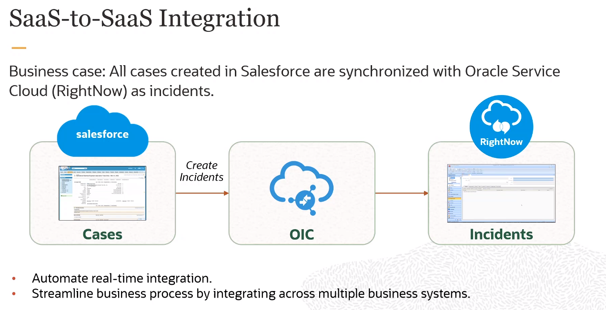

# Become An Application Integration Professional (2023)

Oracle Integration Cloud proporciona un entorno completamente gestionado y preconfigurado que le brinda el poder de integrar sus aplicaciones en la nube y en las instalaciones. Los desarrolladores y arquitectos de la nube pueden conectar aplicaciones SaaS y en las instalaciones seis veces más rápido con una experiencia de desarrollo visual, integraciones preconstruidas y mejores prácticas integradas.

Al final de este entrenamiento, estarás preparado para asumir la Certificación Profesional en Integración de Aplicaciones.

Aprenderás a:

- Comprender los componentes, características y capacidades de OIC
- Crear y configurar conexiones (Adaptador, Desencadenador, Invocar)
- Crear integraciones (Orquestaciones impulsadas por aplicaciones y programadas)
- Mapear datos utilizando búsquedas y el Mapeador de datos
- Aprovechar las opciones, características y capacidades de manejo de archivos
- Configurar acciones de orquestación y lógica de manejo de fallas
- Embarcarte en un viaje exitoso para dominar el diseño e implementación de integraciones de OIC.

## [Enlace directo al curso](https://mylearn.oracle.com/ou/learning-path/become-an-application-integration-professional-2023/122249)

## Application Integration on Oracle Cloud

### OIC Architectural Overview - Architectual Overview & Use Cases

#### Oracle Integration Cloud

    

La innovación es fácil, pero escalarla no lo es. Proteger los datos confidenciales de la empresa y escalar el rendimiento cuando el negocio lo exige requiere una plataforma de nube híbrida e infraestructura de próxima generación.

Oracle Integration se ejecuta en nuestra infraestructura en la nube Gen2 segura y de alto rendimiento e incluye 3 capacidades principales:

- **Integración de aplicaciones:** Conecta todas sus aplicaciones comerciales SaaS y locales de 6 a 10 veces más rápido utilizando adaptadores prediseñados para simplificar la complejidad técnica de lidiar con API de bajo nivel.

    * En otras palabras, OIC elimina la necesidad de que los desarrolladores escriban código complejo para conectar aplicaciones. Los adaptadores preconstruidos actúan como traductores entre diferentes sistemas, lo que permite una integración más rápida y fácil.

- **Automatización de procesos:** Ayuda a los analistas de negocio, TI de aplicaciones y especialistas en integración a colaborar en paralelo utilizando recetas de ejemplo. Las recetas predefinidas combinan adaptadores de aplicaciones de origen y destino con un disparador y un mapa de datos de ejemplo.

    * Piensa en las recetas de automatización de procesos como flujos de trabajo prediseñados. OIC proporciona plantillas para tareas comunes, lo que permite a los usuarios comerciales y técnicos crear automatizaciones sin necesidad de programar desde cero.

- **Visual Builder:** Te ofrece una manera rápida de extender las aplicaciones SaaS y locales con arrastrar y soltar para crear aplicaciones móviles en minutos.

    * Visual Builder es una interfaz gráfica de usuario que permite a los usuarios no técnicos crear extensiones y aplicaciones simples. Al arrastrar y soltar componentes preconstruidos, puedes ampliar la funcionalidad de las aplicaciones existentes sin necesidad de codificación.

#### Oracle Integration Cloud Services

    

**Integraciones: Conectando Aplicaciones**

Utiliza Integraciones para conectar tus aplicaciones en un flujo empresarial continuo. Puedes desarrollar y activar rápidamente integraciones entre tus aplicaciones que se encuentran en la nube y aquellas que aún están en las instalaciones. Identifica las aplicaciones que deseas integrar y configura los detalles de conexión para cada una de ellas. También puedes seleccionar entre nuestros más de 50 adaptadores preconstruidos para conectarte con aplicaciones de Oracle y de terceros, como Oracle Sales Cloud, Oracle RightNow Cloud, Google Calendar, Salesforce y SAP. Utiliza una interfaz visual basada en navegador para crear integraciones y luego mapear los datos entre tus aplicaciones. Los mapeos pueden variar desde asignaciones de datos simples hasta expresiones complejas. Activa tu integración cuando estés listo. Monitorea el tablero de control para verificar el estado y las estadísticas de procesamiento de una integración. El tablero de control también mide y rastrea el rendimiento de tus transacciones al capturar y reportar información clave.

**Constructor de Procesos: Automatización de Procesos Empresariales**

Utiliza el Constructor de Procesos para diseñar, automatizar y gestionar rápidamente procesos empresariales en la nube. Comienzas creando una aplicación de proceso desde cero, utilizando una aplicación de inicio rápido o importando un archivo. Luego, modelas el flujo de tu proceso, incluidas las solicitudes, aprobaciones, caminos de decisión y roles para cada tarea. Dependiendo del proceso empresarial, es posible que necesites crear formularios web, agregar modelos de decisión e interactuar con servicios web para enviar y recibir datos. En cualquier momento mientras diseñas tu aplicación de proceso, puedes reproducir tu proceso paso a paso para probar cada escenario. Cuando estés listo, activa la aplicación de proceso para hacerla disponible y asigna roles para otorgar acceso a los usuarios a tu aplicación.

#### OIC: Process Builder

    

#### Process Builder - Creating Applications

    

#### OIC: Visual Builder

    

Visual Builder proporciona un fácil acceso a datos de cualquier servicio basado en REST y permite la creación de objetos de negocio personalizados y reutilizables para almacenar y gestionar datos. Utilizando las herramientas de desarrollo visual basadas en la nube, puedes crear y probar aplicaciones web receptivas y aplicaciones móviles nativas sin necesidad de instalar ningún software adicional. El diseñador visual te permite diseñar rápidamente páginas en tus aplicaciones arrastrando y soltando componentes de interfaz de usuario, personalizando sus atributos y definiendo su comportamiento.

Aunque Visual Builder proporciona un conjunto rico de diseñadores visuales para mejorar la productividad, los desarrolladores experimentados siempre tienen acceso al código fuente de sus aplicaciones. Los desarrolladores pueden mejorar la funcionalidad de su aplicación utilizando los editores de código para escribir funciones JavaScript personalizadas y editar metadatos de la aplicación. Visual Builder aprovecha el conjunto de herramientas de extensión JavaScript Oracle (Oracle JET) de código abierto para crear interfaces web y móviles atractivas. La arquitectura de componentes compuestos Oracle JET reutilizable (CCA), que se basa en el estándar de Componentes Web, se puede agregar a la aplicación para mejorar aún más la experiencia del usuario.

Los componentes básicos de una aplicación visual son aplicaciones móviles, aplicaciones web, conexiones de servicio, objetos de negocio y procesos.

Los bloques de construcción básicos de una aplicación móvil o web son componentes de interfaz de usuario (UI), variables, cadenas de acciones, flujos de página y navegación de página, y acceso a datos a través de puntos finales REST.

#### OIC: Using Features Together

    

Oracle Integration es una plataforma unificada donde puedes integrar tus aplicaciones, automatizar procesos y crear aplicaciones.

Específicamente, con Oracle Integration, puedes:

- Utilizar integraciones para diseñar, monitorear y gestionar conexiones entre tus aplicaciones.
- Crear aplicaciones de proceso para automatizar y gestionar los flujos de trabajo de tu negocio.
- Construir aplicaciones web y móviles personalizadas.

Los procesos empresariales críticos, como los relacionados con la gestión del capital humano (HCM), la experiencia del cliente (CX) y la planificación de recursos empresariales (ERP), suelen ser lentos e inflexibles. Por ejemplo, un proceso de varios pasos como de Prospecto a Oportunidad a Cotización a Pedido puede involucrar cuatro o más aplicaciones y requerir gestión de excepciones humanas en cada paso del proceso. En este escenario, la falta de integración entre departamentos, así como los retrasos en la resolución de problemas basados en humanos, pueden resultar en pérdida de ingresos, clientes frustrados y altos costos.

Oracle Integration cambia todo eso. Te capacita para:

- Establecer conectividad entre las múltiples aplicaciones que forman parte de todo el ciclo de vida del proceso empresarial.
- Ensamblar tecnologías existentes en nuevos servicios empresariales para alinearse mejor con los cambios de las nuevas demandas empresariales.
- Entregar nuevas innovaciones empresariales más rápido al conectar rápidamente aplicaciones diversas y roles empresariales clave.

#### OIC: Integrations

    

Oracle Integration Cloud (OIC) es una solución completa, segura pero liviana de integración que te permite conectar tus aplicaciones en la nube. Simplifica la conectividad entre tus aplicaciones y conecta tanto tus aplicaciones que residen en la nube como aquellas que aún están en las instalaciones. OIC proporciona conectividad segura de grado empresarial independientemente de las aplicaciones que estés conectando o de dónde residan.

OIC proporciona conectividad nativa a las aplicaciones de Software como Servicio (SaaS) de Oracle, como Oracle Sales Cloud, Oracle RightNow Cloud, y así sucesivamente. Los adaptadores de OIC simplifican la conectividad al manejar las complejidades subyacentes de conectar aplicaciones utilizando las mejores prácticas de la industria. Solo necesitas crear una conexión que proporcione información mínima de conectividad para cada sistema. Las búsquedas de OIC mapean los diferentes códigos o términos utilizados por las aplicaciones que estás integrando para describir elementos similares (como códigos de país o género). Finalmente, el mapeador visual de datos te permite crear rápidamente mapeos directos entre la activación y las estructuras de datos de invocación. Desde el mapeador, también puedes acceder a tablas de búsqueda y usar funciones XPath estándar para mapear datos entre tus aplicaciones.

Una vez que integres tus aplicaciones y actives las integraciones en el entorno de ejecución, el tablero de control muestra información sobre las integraciones en ejecución para que puedas monitorear el estado y las estadísticas de procesamiento de cada integración. El tablero de control mide y rastrea el rendimiento de tus transacciones al capturar y reportar información clave, como el rendimiento, el número de mensajes procesados exitosamente y el número de mensajes que no pudieron procesarse. También puedes gestionar identificadores empresariales que rastrean campos en mensajes y gestionar errores por integraciones, conexiones o instancias específicas de integración.

#### SaaS-to-SaaS Integration

    

#### SaaS-to-On-Premises Integration

    

#### OIC Integrations Value Proposition

    

Las Integraciones de OIC se centran en la simplicidad y el tiempo de comercialización. Está diseñado para SaaS y optimizado para una alta productividad.

Tiempo de comercialización:

- Utiliza un enfoque de configuración en lugar de un enfoque de codificación para reducir el tiempo de integración.
- Proporciona una herramienta de mapeo de datos inteligente, de arrastrar y soltar.
- Incluye una biblioteca de adaptadores e integraciones comúnmente utilizados.

Simplicidad:

- Se aprovisiona automáticamente y se asocia con aplicaciones SaaS; los inquilinos no necesitan (ni obtienen) acceso a máquinas virtuales (VM).
- Está diseñado para ser fácil e intuitivo para todos los usuarios, no solo para los desarrolladores.

Aumenta la agilidad al reducir el tiempo de ciclo de desarrollo de integración con más funcionalidades listas para usar, adaptadores y implementaciones más rápidas.

#### OIC Integration Components

    

#### Integration DEvelopment and Management Workflow

    

#### OIC Integration Scenarios

    

### OIC Architectural Overview - Demo: Activating & Testing a Sample Integration (Practice 2-1)

1. Iniciar sesión en OIC
2. Ir a `Integrations`
3. Activar `Hello World`, habilitando el `Tracing` y el `Include Payload`
4. Da click en el boton de `Run` -> `Test`
5. Abrira una ventana de pruebas estilo `Postman`.
6. En los URI Parameters desmarca `flowid` e `email`
7. Solo en `name` escribe algo como `Pedro`
8. Da click en `Test` y observa el JSON resultante
9. Si volvemos a la ventana de `Integrations` y volvemos a dar click en `Run` veremos el `Metadata URL`
10. Abre dicha URL en otra ventana y veremos una serie de datos de la integración, de momento nos interesa el `Endpoint URL`, el cuál puedes usar para probar con otras herramientas como la antes mencionada `Postman` o directamente en el navegador

### Integrations Life Cycle & Packages - Packaging & Versioning Integrations

#### Prebuilt Integrations

    

Las integraciones preconstruidas de Oracle Integration Cloud (OIC) son soluciones listas para usar que conectan aplicaciones de Oracle y de terceros. Estas integraciones simplifican el proceso de integración al proporcionar flujos de trabajo, mapeos, adaptadores y activadores preconfigurados. Las integraciones preconstruidas de OIC se pueden implementar rápidamente y personalizar según las necesidades del negocio.

#### Oracle-Created Prebuilt Integrations

    

* `Business Accelerators:` Son soluciones empresariales preconstruidas que son configurables y completamente gestionadas por Oracle. Estas aceleradoras de negocio están diseñadas para ayudar a las empresas a implementar rápidamente soluciones de Oracle que se ajusten a sus necesidades específicas.
* `Technical Accelerators:` Entregan patrones técnicos listos para usar que también son configurables. Estos aceleradores técnicos proporcionan una forma eficiente de implementar tecnologías y funcionalidades específicas sin tener que desarrollarlas desde cero.
* `Recipes:` Son integraciones de muestra que sirven como un inicio rápido o ejemplo. Varios de estos “recetas” están publicados en el Oracle Marketplace, proporcionando a los usuarios una forma conveniente de explorar y aprender sobre diferentes integraciones.

#### Business Accelerators

    

Los Business Accelerators son soluciones preconfiguradas que permiten a las empresas implementar rápidamente procesos de negocio basados en las mejores prácticas de Oracle. Estas soluciones se integran con Oracle Integration Cloud (OIC), una plataforma de integración híbrida que ofrece capacidades clave como la orquestación de servicios, la automatización de procesos, la analítica y la seguridad. Algunas de las ventajas de usar los Business Accelerators con OIC son:

- Reducir el tiempo y el costo de implementación al aprovechar las plantillas y los conectores listos para usar de Oracle.
- Aumentar la agilidad y la innovación al adaptar fácilmente los procesos a las necesidades específicas del negocio.
- Mejorar la eficiencia y la productividad al automatizar tareas repetitivas y optimizar el flujo de trabajo.
- Facilitar la colaboración y la comunicación entre los equipos y los socios al conectar aplicaciones y datos en la nube y en las instalaciones.
- Obtener visibilidad y control sobre el rendimiento y la calidad de los procesos mediante cuadros de mando e informes.

Los Business Accelerators son una forma rápida y sencilla de aprovechar el potencial de Oracle OIC para transformar digitalmente su negocio.

    

#### Integration Recipes in the Oracle Marketplace

    

Las recetas de integración en el Oracle Marketplace son una forma rápida y fácil de crear y desplegar integraciones en la nube con Oracle Integration Cloud (OIC). Estas recetas son soluciones predefinidas que se pueden personalizar según las necesidades de cada cliente. Algunas de las ventajas de usar las recetas de integración son:

- Desarrollo conjunto con equipos SaaS: significa que las capacidades más recientes de la aplicación, como el marco de eventos en ERP Cloud, siempre están disponibles para usted tan pronto como hayan sido probadas y validadas por Oracle.

- Mantenimiento de actualizaciones realizado por usted: el ejemplo mostrado para ERP SCM Cloud y WMS Cloud resalta la cantidad de pruebas y validación de API que proporciona Oracle para ahorrarle problemas de actualización

- Entrega en días, no en meses: con objetos de negocio de alto nivel y diseñadores visuales. Lo que tradicionalmente tomaba a los especialistas en TI semanas y meses ahora se puede hacer en días y minutos

Para utilizar las recetas de integración, se debe acceder al Oracle Marketplace desde el portal de OIC y buscar la receta que se desea implementar. Luego, se debe descargar la receta y seguir los pasos para configurarla e instalarla en el entorno de OIC. Finalmente, se puede ejecutar y monitorear la integración desde el panel de control de OIC.

Las recetas de integración en el Oracle Marketplace son una opción conveniente y eficiente para los clientes que quieren aprovechar al máximo las capacidades de OIC y simplificar sus procesos de integración en la nube.

    

    

**Importar una Integración Preconstruida**

Puedes importar integraciones preconstruidas a tu entorno de Oracle Integration. Hay dos tipos de integraciones preconstruidas:

- **Integraciones creadas por el usuario:** Estas son integraciones que tú u otro usuario crearon.

- **Integraciones creadas por Oracle desde el Oracle Marketplace:** Importas integraciones desde el Oracle Marketplace como parte de un paquete. Estas integraciones están designadas con un mensaje BUILT BY ORACLE que se muestra junto al nombre de la integración en la página de Integraciones. No puedes editar estas integraciones, pero puedes ver su contenido, incluyendo mapeos e identificadores empresariales. Debes editar las conexiones en estas integraciones para incluir credenciales de punto final relevantes para tus requisitos comerciales. También puedes clonar estas integraciones, lo que te permite editar la versión clonada de la integración.

    

No puedes editar estas integraciones tal como están, pero puedes ver su contenido, incluidos los mapeos e identificadores empresariales.

DEBES editar las conexiones en estas integraciones para incluir credenciales de punto final que sean relevantes para tus requisitos comerciales.

También puedes clonar estas integraciones, lo que te permitirá editar la versión clonada de la integración.

    

Puedes importar el paquete de integraciones preconstruidas en tu instancia de desarrollo.

Personaliza una o más de las integraciones para que se ajusten a tus necesidades. Puedes proporcionar metadatos, como Nombre y Versión, Versiones Mínimas de Aplicaciones, URL de Instrucciones, y así sucesivamente.

Luego, exporta desde tu entorno de desarrollo e importa en tu entorno de prueba.

#### OIC Integraion Packages

    

Los paquetes de integración de Oracle OIC son soluciones preconstruidas que facilitan la conexión de aplicaciones en la nube y locales. Estos paquetes se basan en el marco de integración de Oracle, que ofrece una plataforma unificada para diseñar, implementar y gestionar flujos de trabajo, procesos y servicios. Los paquetes de integración de Oracle OIC permiten a los usuarios aprovechar las mejores prácticas y los patrones comunes de integración, reduciendo el tiempo y el costo de desarrollo. Algunos ejemplos de paquetes de integración son:

- `Oracle ERP Cloud to Oracle EPM Cloud:` sincroniza los datos financieros entre las aplicaciones de planificación y gestión empresarial.
- `Oracle HCM Cloud to Oracle ERP Cloud:` transfiere los datos de recursos humanos entre las aplicaciones de gestión del capital humano y financiera.
- `Oracle CX Cloud to Oracle ERP Cloud:` integra los datos de ventas, marketing y servicio al cliente entre las aplicaciones de experiencia del cliente y financiera.

Los paquetes de integración de Oracle OIC se pueden personalizar y ampliar según las necesidades específicas de cada cliente. También se pueden monitorizar y auditar desde una consola centralizada, lo que facilita el mantenimiento y la resolución de problemas. Los paquetes de integración de Oracle OIC son una forma rápida y eficaz de lograr una integración empresarial sin código.

    

#### Creating Packages

    

#### Exporting Packages

    

    

#### Life Cycle Operations for Integrations

    

#### Activation Options

    

#### Integration Versioning

    

    

# [Parte 2](./Notas_2.md)