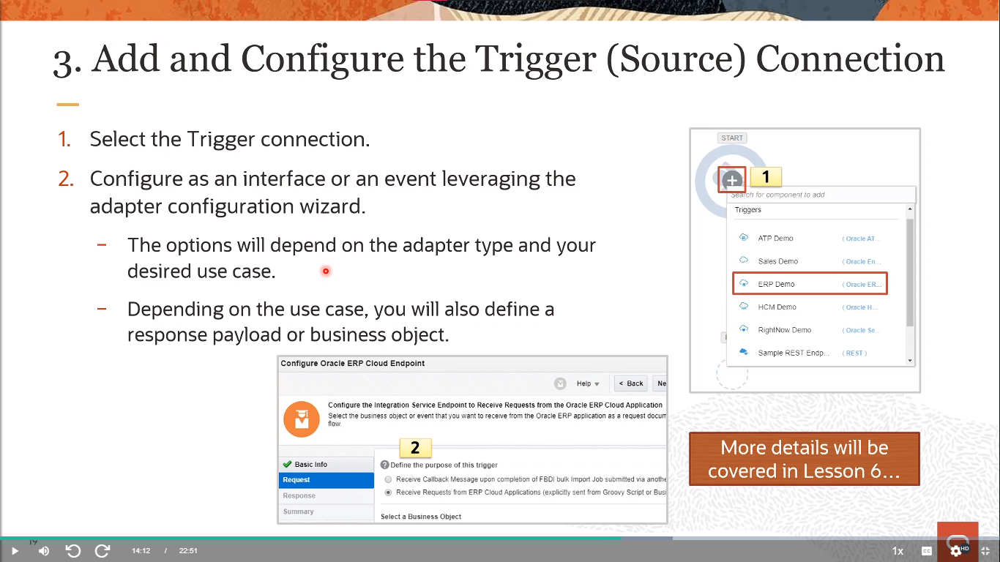

# Become An Application Integration Professional (2023) - Parte 2

## Application Integration on Oracle Cloud

### Fundamentals of Creating Integrations - Integration Design Fundamentals

#### What Is an OIC Integration?

<div align="center">
    
</div>

Las Integraciones son el ingrediente principal de Oracle Integration. Una integración incluye al menos una conexión (para las solicitudes enviadas a Oracle Integration) de `disparador/trigger` (origen) y una conexión (para las solicitudes enviadas desde Oracle Integration al destino) de `invocación/invoke` (destino)  y el `mapeo/mapping` de campos entre esas dos conexiones.

Cuando creas tus integraciones, construyes sobre las conexiones que ya has creado al definir cómo procesar los datos para las conexiones de disparador (origen) e invocación (destino). Esto puede incluir la definición del tipo de operaciones a realizar en los datos, los objetos y campos empresariales contra los cuales realizar esas operaciones, los esquemas requeridos, y así sucesivamente. Para hacer esto más fácil, las tareas de configuración más complejas son manejadas por Oracle Integration.

Una vez que tus conexiones de disparador (origen) e invocación (destino) están configuradas, las acciones de mapeo entre ambas se muestran para que puedas definir cómo se transfiere la información entre las estructuras de datos de disparador (origen) e invocación (destino) tanto para los mensajes de solicitud como para los de respuesta.

#### OIC Integration Styles

<div align="center">
    
</div>

- El Estilo de Integración de `Enrutamiento Básico/Basic Routing` ha sido descontinuado. Oracle recomienda que utilices el Estilo de Orquestación Dirigida por Aplicación, que proporciona más flexibilidad.

- Los patrones de integración de disparar y olvidar son manejados por los Estilos `Publicar en OIC/Publish to OIC` y `Suscribirse a OIC/Subscribe to OIC`. Por lo tanto, existe una dependencia en la que un Publicador debe ser configurado antes de crear el Suscriptor. Sin embargo, puedes tener más de una integración suscrita al mismo Publicador.

- La mayoría de las integraciones utilizarán el Estilo de `Orquestación Dirigida por Aplicación/App Driven Orchestration` ya que permite los cuatro patrones de interacción (interfaz síncrona [solicitud-respuesta], interfaz asíncrona [unidireccional], interfaz asíncrona con devolución de llamada, basado en eventos).

- El Estilo de `Orquestación Programada/Scheduled Orchestation` es útil para casos de uso que necesitan ser activados en un horario recurrente y/o bajo demanda.

- El Estilo de `Transferencia de Archivos/File Transfer` es actualmente **`idéntico`** al Estilo de Orquestación Programada.

#### Integration Style Patterns Described

<div align="center">
    
</div>

| Patrón | Descripción |
| --- | --- |
| Enrutamiento Básico | Este estilo de diseño de lienzo de integración ha sido descontinuado. |
| Publicar en OIC | Crea una integración en la que defines un adaptador de disparador para publicar mensajes a OIC a través de una interfaz o evento asincrónico. Esta integración está desacoplada de todos los suscriptores, ya que todas las integraciones participantes pueden activarse y desactivarse independientemente entre sí. |
| Suscribirse a OIC | Crea una integración en la que te suscribes a una integración publicadora existente. Luego defines un adaptador invocable para procesar mensajes que han sido publicados a OIC por esa integración. |
| Orquestación Impulsada por Aplicaciones | Crea una integración que utiliza capacidades básicas del Administrador de Procesos BPEL. Puedes incluir expresiones Switch y construcciones loop, así como estrategias para el manejo de fallas. Los cuatro patrones de intercambio de mensajes son compatibles. |
| Orquestación Programada | Crea una integración con las mismas opciones de actividad de orquestación que el estilo impulsado por aplicaciones. La diferencia es un horario, o se utiliza una solicitud bajo demanda para activar la integración en lugar del patrón basado en interfaces para el intercambio |
| Transferencia de Archivos | Este estilo es actualmente idéntico al estilo Orquestacion Programada |

#### App Driven Orchestration Style

<div align="center">
    
</div>

Puedes crear integraciones orquestadas basadas en objetos empresariales o eventos. Las integraciones orquestadas pueden ser de tipo síncrono, asíncrono o de disparar y olvidar. Las integraciones orquestadas utilizan las capacidades de Oracle BPEL Process Manager. Oracle BPEL Process Manager te permite definir cómo se ejecuta un proceso empresarial que involucra servicios web. Los mensajes BPEL invocan servicios remotos y orquestan la ejecución del proceso. Al diseñar integraciones, puedes crear múltiples expresiones de enrutamiento.

> [!NOTE]
> Asegúrate de optimizar el diseño de la integración. Si una integración orquestada contiene demasiadas acciones (por ejemplo, hay 25 o más acciones de escritura de etapa), puede producirse un fallo en la activación. Si es necesario, divide una integración con muchas acciones en varias integraciones.

#### Scheduled Orchestration Style

<div align="center">
    
</div>

Puedes programar la ejecución de integraciones. Por ejemplo, puedes crear una `integración orquestada` que se activa mediante un `horario/schedule`. Puedes programar esta ejecución de la integración para copiar archivos en una fecha y hora de tu elección. También puedes definir la frecuencia de la integración. Cuando creas este tipo de integraciones, se muestra un icono de horario junto a la entrada de la integración en la página de Integraciones.

#### Integration Development and Management Workflow

<div align="center">
    
</div>

#### Basic Integration Development Workflow Steps

<div align="center">
    
</div>

#### 1. Basic Integration Development Workflow Steps

<div align="center">
    
</div>

Selecciona un adaptador de la ventana emergente. También puedes buscar el adaptador que deseas utilizar ingresando un nombre parcial o completo en el campo de búsqueda y haciendo clic en Buscar.

<div align="center">
    
</div>

Ingresa la información para describir la conexión.

Ingresa un nombre significativo para ayudar a otros a encontrar tu conexión cuando comiencen a crear sus propias integraciones. El nombre que ingreses se agregará automáticamente en mayúsculas al campo de Identificador. Si utilizas el nombre del identificador, no incluyas un espacio en blanco (por ejemplo, Oportunidad de Venta).

Selecciona el rol (dirección) en el que se puede usar esta conexión (desencadenar, invocar o ambos). Solo se muestran los roles admitidos por este adaptador para la selección. Cuando seleccionas un rol, solo se muestran en la página de Conexiones las propiedades de conexión y las políticas de seguridad apropiadas para ese rol. Si seleccionas un adaptador que admite tanto la invocación como el desencadenamiento, pero seleccionas solo uno de esos roles, y luego intentas arrastrar el adaptador a la sección que no seleccionaste, recibirás un error (por ejemplo, configura un Adaptador de Nube de Oracle Service (RightNow) solo como invocar, pero arrastra el adaptador a la sección de desencadenador).

Ingresa una descripción opcional de la conexión.

Haz clic en Crear. Tu conexión se crea y ahora estás listo para configurar los detalles de la conexión, como el contacto de correo electrónico, las propiedades de la conexión, las políticas de seguridad, las credenciales de inicio de sesión de la conexión y (para ciertas conexiones) el grupo de agentes.

#### 2. Creating Integration

<div align="center">
    
</div>

#### 3. Add and Configure the Trigger (Source) Connection

<div align="center">
    
</div>

#### 4. Add and Configure an Invoke (Target) Connection

<div align="center">
    
</div>

#### 5. & 6. Request and Response Data Mapping

<div align="center">
    
</div>

Una de las tareas clave en cualquier integración es definir cómo se transfiere, o se mapea, los datos entre dos aplicaciones.

En la mayoría de los casos, los mensajes que deseas transferir entre las aplicaciones en una integración tienen estructuras de datos diferentes. Un mapeador visual te permite mapear campos entre aplicaciones arrastrando campos de origen sobre campos de destino. Cuando abres el mapeador para una solicitud o mensaje en una integración, las estructuras de datos se completan automáticamente con la información extraída de las conexiones de origen y destino. Puedes expandir y cargar niveles de estructura de datos a pedido para mostrar niveles adicionales. No hay límite en los niveles de visualización.

Los mapas que creas se llaman mapas de transformación y utilizan el `Lenguaje de Hojas de Estilo Extensible (XSL)` para describir los mapeos de datos, lo que te permite realizar manipulaciones y transformaciones de datos complejas. Se proporciona un conjunto estándar de funciones `XPath` para que definas cómo se modifica los datos al moverse de una aplicación a otra. También se proporciona una función especializada para que hagas referencia a búsquedas directamente desde el mapeador.

El mapeador admite tanto esquemas calificados como no calificados (es decir, esquemas sin elementFormDefault = "qualified"). También se admiten elementos y atributos con y sin prefijos de espacio de nombres.

Se admiten grupos de sustitución en esquemas. Puedes ver todos los elementos sustituibles en un elemento base en el mapeador y seleccionar el que deseas usar.

Los elementos y atributos para los cuales se requiere mapeo se identifican con un asterisco azul (*) a la izquierda de sus nombres. Para mostrar solo los campos requeridos, haz clic en el ícono de `Filtro/Filter`, selecciona `Campos Requeridos/Required Fields` y haz clic en `Aplicar/Apply`.

#### 7. Assigning Business Identifiers

<div align="center">
    
</div>

Los identificadores empresariales te permiten realizar un seguimiento de los campos de carga útil en los mensajes durante el tiempo de ejecución. Puedes especificar hasta tres campos de identificación empresarial para realizar un seguimiento durante el tiempo de diseño. Uno de estos campos debe seleccionarse como el campo de identificación empresarial principal. El identificador empresarial principal te permite realizar un seguimiento de los campos a lo largo de los flujos de integración durante el tiempo de ejecución y siempre está disponible. Durante el tiempo de ejecución, el estado de los identificadores empresariales es visible en la página de Seguimiento y (si han ocurrido errores de integración) en la página de Errores.

Para asignar identificadores empresariales:

Desde el menú, selecciona Seguimiento. Se muestra el cuadro de diálogo Identificadores Empresariales para Seguimiento. La carga útil de origen para la integración seleccionada se muestra en el lado izquierdo. Solo puedes asignar identificadores empresariales a campos de las `cargas útiles/payloads` de origen. No puedes asignar identificadores empresariales a campos de las `cargas útiles/payloads` de destino.

Desde la sección de Origen, arrastra el campo de carga útil que deseas rastrear hasta la sección de Arrastra un campo de desencadenador aquí. Puedes filtrar la visualización de las estructuras de origen haciendo clic en el enlace de Filtro. Esto te permite filtrar si se utilizan o no los campos y el tipo de campo (campos requeridos, campos personalizados o todos los campos).

Selecciona la casilla de verificación si deseas que este sea el identificador empresarial principal. Se requiere al menos un identificador. Si solo agregas uno, se seleccionará automáticamente como la clave principal.

En el campo de Nombre de Seguimiento, opcionalmente ingresa un nombre descriptivo para rastrear durante el tiempo de ejecución (por ejemplo, `Orgld`). El nombre se muestra cuando este campo se utiliza para filtrar mensajes en la página de Seguimiento o (si hay un error de integración) en la página de Errores durante el tiempo de ejecución.

#### 8. Activation Options (Review)

<div align="center">
    
</div>

#### Testing a SOAP Interface Trigger Connection

<div align="center">
    
</div>

<div align="center">
    
</div>

<div align="center">
    
</div>

### Creating OIC Adapter Connections - Defining OIC Adapter Connections

#### Oracle Adapters: Benefits

<div align="center">
    
</div>

**Beneficios de los Adaptadores de OIC**

Mejoran la productividad del desarrollador al permitir una interfaz, impulsada por el usuario, para descubrir metadatos y objetos empresariales de los servicios en la nube. Esto contrasta con la forma en que los desarrolladores trabajaban en el pasado al examinar archivos `WSDL`.

> [!NOTE]
> [Saber más sobre archivos WSDL](./Extras.md/#¿qué-son-los-archivos-wsdl)

Proporcionan beneficios en tiempo de ejecución con la gestión de sesiones y seguridad. La gestión de sesiones es un gran dolor de cabeza para la integración, como el manejo del tiempo de espera de sesión y la abstracción, entre otros. Por lo general, requiere codificación manual. Con los adaptadores, todo está empaquetado, cubierto y transparente para los usuarios finales.

Mejoran el aspecto transformador general de la integración al proporcionar servicios web normalizados. Típicamente, al realizar integraciones, se pasa mucho tiempo mapeando datos desde la fuente al servicio de destino. Los adaptadores te permiten generar servicios web normalizados y amigables para la integración, lo que hace que el mapeo sea mucho más rápido.

#### Oracle Cloud Adapters: Supported Features

<div align="center">
    
</div>

#### Aviable OIC Adapters

<div align="center">
    
</div>

#### OIC Connections Review

<div align="center">
    
</div>

Antes de integrar aplicaciones, debes ser capaz de conectarte a estas aplicaciones. Puede llevar mucho tiempo y esfuerzo crear el código para conectarse a otras aplicaciones. Las conexiones de OIC te permiten conectarte con aplicaciones locales y en la nube para compartir datos. Estas conexiones se basan en adaptadores e incluyen información adicional, como la `URL del WSDL` y `credenciales de seguridad`, según lo requerido por el adaptador para comunicarse con una instancia específica de una aplicación. Creas una conexión para cada instancia de aplicación que participe en las integraciones de OIC.

#### Whats Is a Connection?

<div align="center">
    
</div>

Las conexiones definen información sobre las instancias de cada configuración que estás integrando. OIC incluye un conjunto de adaptadores predefinidos, que son los tipos de aplicaciones en los que puedes basar tus conexiones, como Oracle Engagement Cloud, Oracle ERP Cloud, Oracle Cloud, Oracle Service Cloud (RightNow) y otros.

Una conexión se basa en un adaptador. Por ejemplo, para crear una conexión a una instancia específica de la aplicación Oracle ERP Cloud, debes seleccionar el adaptador Oracle ERP Cloud y luego especificar la URL del host, la política de seguridad y las credenciales de seguridad para conectarte a ella.

#### Creating a Connection

<div align="center">
    
</div>

#### Getting Started (Review)

<div align="center">
    
</div>

#### Providing Basic Connection Information (Review)

<div align="center">
    
</div>

Selecciona un adaptador de la ventana de diálogo. También puedes buscar el tipo de adaptador que deseas utilizar ingresando un nombre parcial o completo en el campo de búsqueda y haciendo clic en Buscar. 

Se mostrará el cuadro de diálogo Crear Nueva Conexión.

Ingresa la información para describir la conexión.

Ingresa un nombre significativo para ayudar a otros a encontrar tu conexión cuando comiencen a crear sus propias integraciones. El nombre que ingreses se agregará automáticamente en mayúsculas al campo de Identificador. Si utilizas el nombre del identificador, no incluyas un espacio en blanco (por ejemplo, Oportunidad de Venta).

Selecciona el rol (dirección) en el que se utilizará esta conexión (`desencadenar/trigger`, `invocar/invoke` o ambos). Solo se muestran los roles admitidos por este adaptador para la selección. Cuando seleccionas un rol, solo se muestran las propiedades de conexión y las políticas de seguridad apropiadas para ese rol en la página de Conexiones. Si seleccionas un adaptador que admite invocación y desencadenamiento, pero seleccionas solo uno de esos roles, y luego intentas arrastrar el adaptador a la sección que no seleccionaste, recibirás un error (por ejemplo, configura un Adaptador de Oracle RightNow Cloud solo como invocar, pero arrastra el adaptador a la sección de desencadenador).

Ingresa una descripción opcional de la conexión.

Haz clic en Crear.

Tu conexión se ha creado y ahora estás listo para configurar los detalles de la conexión, como el contacto de correo electrónico, las propiedades de la conexión, las políticas de seguridad, las credenciales de inicio de sesión de la conexión y (para ciertas conexiones) el grupo de agentes.

#### Defining Connection and Security Properties

<div align="center">
    
</div>

- [Documentacion de adaptadores OIC Gen 3](https://docs.oracle.com/en/cloud/paas/application-integration/find-adapters.html)
- [Documentacion de adaptadores OIC Gen 2](https://docs.oracle.com/en/cloud/paas/integration-cloud/find-adapters.html)

#### 1. Oracle Service Cloud Adapter Connection

<div align="center">
    
</div>

Debes obtener el WSDL estándar de Oracle Service Cloud (RightNow). Solo se admite el WSDL estándar, el WSDL de partner no es compatible.

El WSDL estándar puede incluir soporte tanto para objetos empresariales como para suscripciones a eventos. Esto te permite recibir ya sea un objeto empresarial o una suscripción a eventos como una solicitud desde la aplicación Oracle Service Cloud (RightNow).

Cuando Oracle Integration solicita las credenciales para comunicarse con Oracle Service Cloud (RightNow), utiliza aquellas asociadas con EVENT_NOTIFICATION_MAPI_USERNAME y EVENT_NOTIFICATION_MAPI_PASDW para enviar mensajes a Oracle Service Cloud (RightNow).

Debes cumplir con los siguientes requisitos previos para crear una conexión con el adaptador de Oracle Service Cloud (RightNow):
- Suscribirte a Oracle Service Cloud (RightNow). Esta acción te permite crear una cuenta de usuario de Oracle Service Cloud (RightNow) con los privilegios correctos. Especificas esta cuenta de usuario al crear una conexión de adaptador de Oracle Service Cloud (RightNow) en la página de Conexiones.
- Obtener el WSDL del catálogo de servicios de Oracle Service Cloud (RightNow) necesario. Este WSDL puede incluir soporte tanto para objetos empresariales como para suscripciones a eventos.
- Si creas una integración en la que una conexión de adaptador de Oracle Service Cloud (RightNow) como desencadenador selecciona un objeto empresarial, debes crear un script PHP de manejador de eventos personalizado o utilizar un cliente SOAP para invocar la integración.

#### 2. Oracle Engagement Cloud Adapter Connection

<div align="center">
    
</div>

Debes obtener la URL del host de Fusion Applications para acceder y configurar el adaptador de entrada y salida, ya sea para utilizar objetos de negocio o servicios de negocio, y para acceder y configurar el adaptador de entrada para usar suscripciones a eventos o para acceder y configurar el adaptador de salida para utilizar recursos de la API REST de Oracle Fusion Applications.

El desarrollador que crea una conexión de Oracle Engagement Cloud debe colaborar con el administrador del servicio de Oracle Engagement Cloud para obtener la URL del host específica de la aplicación SaaS. Las instrucciones para derivar la URL, que se realiza manualmente, están disponibles en la documentación en línea del adaptador de OIC.

El administrador del servicio también debe crear una clave CSF para suscribirse a eventos estándar y personalizados en Oracle Engagement Cloud. Esta clave es necesaria para el marco de manejo de eventos cuando invoca la integración. Las credenciales de la integración son gestionadas por la clave CSF. Crea la clave CSF en Oracle SOA Composer.
Para invocar un catálogo de servicios o un catálogo de eventos de Oracle Engagement Cloud desde Oracle Integration, el administrador del servicio debe crear un usuario separado en Oracle Engagement Cloud. Navega a Navegador > Mi equipo > Administrar usuarios.

> [!NOTE]
> [Saber más sobre clave CSF](./Extras.md/#clave-csf-en-oracle-engagement-cloud)

#### 3. Oracle ERP Cloud Adapter Connection

<div align="center">
    
</div>

Debes obtener la URL del host de Fusion Applications para acceder y configurar el adaptador de entrada y salida, ya sea para utilizar objetos de negocio o servicios de negocio, y para acceder y configurar el adaptador de entrada para usar suscripciones a eventos.

El desarrollador que crea una conexión de Oracle ERP Cloud debe colaborar con el administrador del servicio de Oracle ERP Cloud para obtener la URL del host específica de la aplicación SaaS. Las instrucciones para derivar la URL, que se realiza manualmente, están disponibles en la documentación en línea del adaptador de OIC.

Especifica la URL del host necesaria en el diálogo Propiedades de conexión.

El administrador del servicio también debe crear una clave CSF para suscribirse a eventos estándar y personalizados en Oracle ERP Cloud. Esta clave es necesaria para el marco de manejo de eventos cuando invoca la integración. Las credenciales de la integración son gestionadas por la clave CSF. Crea la clave CSF en Oracle SOA Composer.

Si deseas cargar un archivo encriptado en Oracle WebCenter Content (Gestión de contenido universal, UCM), selecciona la casilla de verificación `Clave Pública PGP (PGP) para Carga de UCM (PGP Public Key for UCM Upload)` y luego haz clic en `Cargar/Upload` para cargar la clave pública y encriptar el archivo. La clave pública PGP ya debe estar creada. El algoritmo compatible para la Clave Pública es RSA para encriptación y el tamaño de la clave debe ser de 1024 bits de longitud.

Para invocar un catálogo de servicios o un catálogo de eventos de Oracle ERP Cloud desde Oracle Integration, el administrador del servicio debe crear un usuario separado en Oracle ERP Cloud. Navega a Navegador > Mi equipo > Administrar usuarios.

#### 4. Oracle HCM Cloud Adapter Connection

<div align="center">
    
</div>

Debes obtener la URL del host de Fusion Applications para acceder a objetos de negocio y para acceder a servicios REST de negocio.

El desarrollador que crea una conexión de Oracle HCM Cloud debe colaborar con el administrador del servicio de Oracle HCM Cloud para obtener la URL del host aprovisionada para la aplicación SaaS específica. Las instrucciones para obtener la URL, que se realiza manualmente, están disponibles en la documentación en línea del adaptador de OIC.

En el campo URL del host de HCM, especifica la URL que se utilizará en esta integración.

Si deseas cargar un archivo encriptado en Oracle WebCenter Content (UCM), selecciona la casilla de verificación `Clave Pública PGP para Carga de UCM (PGP Public Key for UCM Upload)` y luego haz clic en `Cargar/Upload` para cargar la clave pública y encriptar el archivo. La clave pública PGP ya debe estar creada. El algoritmo compatible para la clave pública es RSA para encriptación y el tamaño de la clave debe ser de 1024 bits de longitud.

Para invocar un servicio de catálogo de servicios de Oracle HCM Cloud desde Oracle Integration, el administrador del servicio debe crear un usuario separado en Oracle HCM Cloud. Navega a Navegador > Mi equipo > Administrar usuarios.

#### 5. Salesforce Adapter Connection

<div align="center">
    
</div>

Primero debes crear el WSDL empresarial del Adaptador de Salesforce para incluirlo en una integración. Luego, especificas este WSDL al crear una conexión de Adaptador de Salesforce en la página de Conexiones.

Para crear el WSDL empresarial del Adaptador de Salesforce:

Inicia sesión en tu cuenta de Salesforce.com Enterprise, Unlimited o Developer Edition utilizando un nombre de usuario y contraseña válidos. Debes iniciar sesión como administrador o usuario con el permiso `Modificar todos los datos/Modify All Data`. Los inicios de sesión se verifican para asegurarse de que provienen de una dirección IP conocida.

Bajo `Configuración de la aplicación/App Setup`, expande `Desarrollar/Develop` y haz clic en `API` para mostrar la página de descarga del WSDL. Si la organización tiene paquetes administrados instalados en la organización, haz clic en `Generar WSDL empresarial/Generate Enterprise WSDL`. Salesforce te solicitará que selecciones la versión de cada paquete instalado para incluir en el WSDL generado o haz clic derecho en `Generar WSDL empresarial` y guárdalo en un directorio local.

Proporciona un nombre para el archivo WSDL y una ubicación para guardar el archivo en tu sistema de archivos y haz clic en `Guardar/Save`.

### Creating OIC Adapter Connections - Exploring Additional Adapter Connections

#### 6. Oracle ATP/ADW Adapter Connection

<div align="center">
    
</div>

Los adaptadores Oracle Autonomous Transaction Processing y Autonomous Data Warehouse te permiten integrar la base de datos Oracle ATP o ADW con Oracle Integration a través de la conectividad directa. Se utilizan para ejecutar consultas SQL o procedimientos almacenados en la base de datos Oracle.

Debes cumplir con los siguientes requisitos previos para crear una conexión con Oracle Integration:

- Descargar la cartera de credenciales del cliente desde la instancia de Oracle ATP o ADW.
- Asegurarte de que la base de datos de destino sea accesible.
- Asegurarte de tener permisos de escritura en la base de datos.
- Asegurarte de tener los permisos necesarios para ejecutar procedimientos almacenados y declaraciones SQL.
- Conocer el nombre del servicio de la base de datos.
- Conocer el nombre de usuario y la contraseña del servicio de la base de datos para conectarse a la misma.

#### 7. Oracle Siebel Adapter Connection

<div align="center">
    
</div>

Debes cumplir con los siguientes requisitos previos para crear una conexión con el Adaptador de Oracle Siebel:

- Asegurarte de que el servidor Siebel de destino esté funcionando correctamente.
- Conocer la dirección del host y el número de puerto del servidor Siebel.
- Conocer el nombre de usuario y la contraseña para conectarse al servidor Siebel.
- Asegurarte de que el usuario llamado por el Adaptador de Oracle Siebel tenga acceso tanto al Java Data Bean (JDB) como a los roles de invocación de servicio web SOAP.
- Siebel tiene control de acceso tanto en el tiempo de diseño como en el de ejecución, aunque esto puede variar funcionalmente.
En el tiempo de diseño, el Adaptador de Oracle Siebel obtiene un catálogo de servicios web publicados a través de un servicio empresarial nativo llamado Publicador de Servicios Web. El Adaptador de Oracle Siebel realiza esto invocando internamente el Java Data Bean proporcionado por Siebel. Para acceder a este servicio empresarial a través de este Java Data Bean de Siebel, el usuario que configures en tu conexión de Adaptador de Oracle Siebel debe tener acceso a este servicio empresarial de Siebel llamado Publicador de Servicios Web (y específicamente a los métodos `GetWebServiceList` y `RetrieveWebService` dentro de este servicio) para obtener la lista de servicios web publicados. La configuración se describe en la documentación de Siebel.
- Para invocar cualquiera de los servicios web de Siebel en tiempo de ejecución, necesitas acceso a diferentes niveles dependiendo del tipo de usuario (por ejemplo, anónimo o un usuario nombrado). La documentación de Siebel cubre temas sobre roles de acceso para estos servicios web.

#### 8. Oracle E-Business Suite Adapter Connection

<div align="center">
    
</div>

Oracle E-Business Suite Integrated SOA Gateway es un componente esencial para el Adaptador de Oracle E-Business Suite en Oracle Integration. Es el camino para acceder a todos los servicios REST de Oracle E-Business Suite que puedes utilizar en integraciones en Oracle Integration. Asegúrate de configurar Oracle E-Business Suite Integrated SOA Gateway para habilitar la función de servicio REST.

Para acceder a los servicios de Oracle E-Business Suite desde Oracle Integration, los servicios de Oracle E-Business Suite deben ser accesibles de cualquiera de las siguientes maneras:

- Estos servicios están implementados en un entorno configurado en una configuración de DMZ (Zona Desmilitarizada) para que los servicios REST de Oracle E-Business Suite sean accesibles públicamente a través de Internet.
- Si tu Oracle E-Business Suite no está configurado en una configuración de DMZ, estos servicios deben ser accesibles a través del marco de agentes de Oracle Integration. Ten en cuenta que el agente local no debe instalarse en una instancia de Oracle E-Business Suite. En su lugar, debe instalarse en una máquina separada.

Implementa los servicios REST requeridos en Oracle E-Business Suite.

Para utilizar eventos comerciales de Oracle E-Business Suite como un disparador (fuente) en una integración en Oracle Integration, debes implementar la API del Administrador de Eventos como un servicio REST.

Concede los privilegios de usuario necesarios. Para proteger los datos de la aplicación contra el acceso o ejecución no autorizados, debes otorgar al usuario los privilegios de acceso a la interfaz para los servicios REST proporcionados a través de Oracle E-Business Suite Integrated SOA Gateway.

> [!NOTE]
> [Saber más sobre DMZ](./Extras.md/#dmz)

#### FTP Adapter Connection

<div align="center">
    
</div>

El Adaptador FTP permite la integración del Protocolo de Transferencia de Archivos (FTP) y el Protocolo de Transferencia de Archivos Seguro (sFTP) en Oracle Integration. Mediante el Adaptador FTP, Oracle Integration puede recuperar archivos para procesar en Oracle Integration y puede cargar archivos y mensajes desde Oracle Integration a un directorio en un servidor FTP remoto.

Configura la seguridad para tu conexión FTP seleccionando la política de seguridad y estableciendo las credenciales de inicio de sesión. También puedes especificar una clave pública de Pretty Good Privacy (PGP) para la encriptación y una clave privada para la desencriptación. Una conexión FTP solo está permitida para servidores FTP de acceso público.

- `Política de Acceso al Servidor FTP:` Esta política utiliza el nombre de usuario y la contraseña para la autenticación y permite a los usuarios configurar los valores PGP.
- `Autenticación con Clave Pública FTP:` Esta política se conecta al servidor sFTP usando una clave. Esto se utiliza solo para conexiones sFTP. El usuario ingresa un nombre de usuario y carga el archivo de clave privada. Una frase de contraseña para la clave privada es opcional. El usuario también puede configurar los valores PGP en esta conexión.
- `Autenticación Multinivel FTP:` Esta política utiliza múltiples credenciales independientes para iniciar sesión en el servidor. Este proceso crea una capa adicional de defensa contra usuarios no autorizados. Con esta política, proporcionas un nombre de usuario, contraseña de usuario, clave privada y frase de contraseña de la clave privada para conectarte al servidor sFTP. También configuras la primera secuencia de autenticación entre la contraseña y la clave pública.

#### SOAP Adapter Connection (Trigger) & (Invoke)

<div align="center">
    
</div>

Las capacidades del Adaptador SOAP cuando se configura como un `disparador/trigger` son las siguientes:

- Asegura que un payload estructurado (XML) entrante de un cliente no exceda los 10 MB de tamaño.
- Asegura que un payload no estructurado (MTOM) entrante de un cliente no exceda los 512 MB de tamaño.
- Permite configurar únicamente endpoints SOAP basados en el protocolo HTTPS para aceptar solicitudes SOAP entrantes.
- Admite la configuración de los endpoints SOAP entrantes utilizando las siguientes políticas de seguridad: Autenticación Básica HTTP, Autenticación basada en token WS-Username, OAuth 2.0 y Lenguaje de Marcado de Afirmación de Seguridad (SAML).
- Admite el acceso a propiedades de encabezado SOAP/HTTP estándar y personalizadas presentes en la solicitud SOAP entrante y las pone disponibles como parte de un mensaje de Oracle Integration para su procesamiento en acciones posteriores.
- Te permite implementar los siguientes patrones de intercambio de mensajes en el endpoint SOAP entrante: solicitud/respuesta síncrona, solicitud unidireccional y solicitud asíncrona con soporte de devolución de llamada.

En transacciones seguras de servicios web, se puede insertar un Sello de Tiempo (WSU Timestamp) en un Encabezado de Seguridad WS-Security para definir la vigencia del mensaje en el que se coloca. Si se selecciona "Sí", no se requiere enviar ningún sello de tiempo por parte del cliente.

<div align="center">
    
</div>

Las capacidades del Adaptador SOAP cuando se configura como un `invocador/invoke` son las siguientes:

- Permite la invocación de endpoints SOAP externos basados en protocolo HTTP o HTTPS.
- Permite la invocación de endpoints SOAP externos que están sin protección y protegidos usando Autenticación Básica HTTP y autenticación basada en token WS-Username.
- Permite la invocación de endpoints SOAP externos alojados en servidores TLS versión 1.1 y 1.2.
- Admite la invocación de endpoints SOAP externos de dos vías habilitados para SSL.
- Soporta la configuración de propiedades de encabezado SOAP/HTTP estándar y personalizadas disponibles para la solicitud SOAP saliente.
- Admite la invocación de endpoints SOAP externos que implementan los siguientes patrones de intercambio de mensajes: solicitud/respuesta síncrona, solicitud unidireccional y solicitud asíncrona con devolución de llamada (usando WS-Addressing).
- Admite lo siguiente:
    - Envío de contenido binario y no binario como un archivo adjunto MTOM (de hasta 1 GB) como parte de un mensaje de solicitud al invocar APIs SOAP externos.
    - Recepción de contenido binario y no binario como un archivo adjunto MTOM (de hasta 1 GB) como parte de un mensaje de respuesta al invocar APIs SOAP externos.

#### REST Adapter Connection (Trigger) & (Invoke)

<div align="center">
    
</div>

- Soporte para cargar definiciones de esquema XML complejas como un archivo comprimido en formato zip para definir las definiciones de datos para el contenido XML durante la configuración del Adaptador REST.
- Soporte para cargar documentos XML de muestra para definir las definiciones de datos para el contenido XML durante la configuración del Adaptador REST.
- Asegura que las solicitudes de mensajes entrantes (disparador) sin adjuntos no excedan los 10 MB de tamaño. Los mensajes con adjuntos (por ejemplo, multipart/mixed y multipart/form-data) no están sujetos a esta restricción.
- Asegura que los adjuntos JSON entrantes (disparador) no excedan los 1 GB de tamaño.
- Asegura que las solicitudes de carga de mensajes estructurados entrantes (disparador) (cualquier encabezado de tipo de contenido que contenga JSON, XML, HTML, YAML o MML) de un cliente no excedan los 10 MB de tamaño.
- Soporte para encabezados HTTP estándar y personalizados para modelar una integración y exponer propiedades de encabezado HTTP estándar y personalizadas a Oracle Integration para procesamiento posterior.
- Soporte para adjuntos multipartes (tipos de contenido: multipart/mixed y multipart/form-data) en mensajes de solicitud/respuesta al crear una integración para exponer un punto de conexión REST que acepta mensajes de solicitud entrantes con adjuntos multipartes y/o envía respuestas con adjuntos multipartes.
- Las APIs REST expuestas utilizando el Adaptador REST pueden configurarse para ser compatibles con CORS.
- Soporte para exponer un punto de conexión REST que puede aceptar la solicitud y procesarla de forma asíncrona.

<div align="center">
    
</div>

- Soporte para consumir cualquier API REST descrita utilizando documentos Swagger 2.0/RAML y el Catálogo de Metadatos de Oracle. El Adaptador REST puede descubrir y presentar automáticamente los recursos y operaciones disponibles presentes en los documentos para su configuración. La metadata relacionada con los mensajes de solicitud y respuesta específicos de la operación disponibles en el documento se pone automáticamente disponible para el mapeo y otras actividades.
- Soporte para cargar documentos XML de muestra para definir la definición de datos para el contenido XML durante la configuración del Adaptador REST.
- Soporte para acceder y configurar encabezados HTTP estándar y personalizados expuestos por API REST externas.
- Soporte para adjuntos multipartes (tipo de contenido: multipart/mixed y multipart/form-data) en mensajes de solicitud/respuesta en una integración mientras se envía una solicitud a un punto de conexión REST externo que acepta mensajes de solicitud entrantes con adjuntos multipartes y/o envía respuestas con adjuntos multipartes.
- Soporte para consumir API REST externas que no están descritas usando documentos Swagger /RAML. Puede especificar de manera declarativa el método HTTP y el documento JSON de muestra/esquema XML para describir la forma de los mensajes de solicitud y respuesta.
- Soporte para consumir API REST externas que están protegidas utilizando seguridad a nivel de transporte.
- Soporte para invocar API REST ubicadas en el mismo lugar de manera optimizada.

#### Testing the Connection

<div align="center">
    
</div>

Cuando todas las propiedades de configuración estén completas, prueba tu conexión para asegurarte de que esté configurada correctamente. En la esquina superior derecha de la página, haz clic en `Test`.

Si tu conexión de adaptador utiliza un WSDL, se te pedirá que selecciones el tipo de prueba de conexión a realizar:

- `Validar y Probar:` Realiza una validación completa del WSDL, incluido el procesamiento de los esquemas importados y los WSDL. La validación completa puede tardar varios minutos dependiendo del número de esquemas importados y WSDL. No se envían solicitudes a las operaciones expuestas en el WSDL.
- `Probar:` Se conecta a la URL del WSDL y realiza una verificación de sintaxis en el WSDL, no se envían solicitudes a las operaciones expuestas en el WSDL.

Si es exitoso, se mostrará el siguiente mensaje, y el indicador de progreso mostrará un 100%:
La conexión `connection_name` fue probada exitosamente.

Si tu conexión no tuvo éxito, se mostrará un mensaje de error con detalles. Verifica que los detalles de configuración que ingresaste sean correctos.

Cuando hayas terminado, haz clic en `Guardar` y luego en `Cerrar`.

#### Uploading SSL Certificates

<div align="center">
    
</div>

Los certificados se utilizan para validar las conexiones SSL salientes. Si realizas una conexión SSL en la que el certificado raíz no existe en Oracle Integration, se producirá una excepción. En ese caso, debes cargar el certificado adecuado. Un certificado permite que Oracle Integration se conecte con servicios externos. Si el punto final externo requiere un certificado específico, solicita el certificado y luego cárgalo en Oracle Integration.

- `Certificado de Confianza:` Utiliza esta opción para cargar un certificado de confianza, seleccionando el archivo de confianza (por ejemplo, .cer o .crt) para cargarlo.
- `Certificado de Protección de Mensajes:` Utiliza esta opción para cargar un certificado de almacén de claves con soporte de token SAML. Se admiten operaciones de creación, lectura, actualización y eliminación (CRUD) en este tipo de certificado.
- `Certificado de Identidad:` Utiliza esta opción para cargar un certificado para comunicaciones SSL bidireccionales.

### Creating OIC Adapter Connections - Using the On-Premises Connectivity Agent

#### On.Premises Connectivity Agent Framework

<div align="center">
    
</div>

El agente de conectividad local se instala y se ejecuta en un entorno local en la misma red que los sistemas internos como Oracle E-Business Suite, Oracle Siebel, Oracle Database, y otros. Descargas el instalador del agente de conectividad local desde la página de Agentes en OIC hacia tu entorno local para su instalación. Puede haber varios sistemas host, cada uno ejecutando uno o más agentes, en una topología de nube/local. El agente de conectividad local no permite ninguna conexión entrante explícita. Todas las conexiones se establecen desde el entorno local hacia OIC.

#### Agent Runetime Behavior

<div align="center">
    
</div>

Como se puede ver en el diagrama anterior, el Agente de Conectividad actúa como una puerta de enlace desde el entorno local hacia OIC. Toda comunicación es iniciada por el Agente hacia la nube de Integración y no al revés. OIC no inicia ninguna conexión saliente hacia el agente.

El agente envía un latido regular a la instancia del Agente SaaS en OIC para indicar que está activo, lo que se refleja como un estado de salud "verde" del agente en la consola de monitoreo de OIC. Además, el agente consulta continuamente cualquier trabajo de tiempo de diseño y de ejecución que deba procesarse en el entorno local.

El trabajo de tiempo de diseño incluye solicitudes de 'Test Connection', 'Activation' y 'Deactivation'.

El trabajo de tiempo de ejecución comprende el procesamiento de mensajes de invocación que deben enviarse a sistemas locales como bases de datos, sistemas de archivos, E Business Suite, Siebel u otros puntos finales privados de SOAP o REST.

El tiempo de ejecución también incluye mensajes de activación que se originan en el entorno local (para adaptadores configurados en el rol de activador dentro de un flujo de integración).

Para los mensajes de invocación, Integration Cloud espera un máximo de 240 segundos después de haber enviado la solicitud al agente. El agente debe procesar este trabajo, ejecutarlo contra la base de datos y devolver la respuesta dentro de este período de tiempo de espera. Si no se recibe ninguna respuesta o fallo dentro de este tiempo, la instancia del flujo se agota y falla con el siguiente mensaje de error:

```
Invoke UCA outbound service failed with application error, exception:
com.bea.wli.sb.transports.jca JCATransportException: oracle.cloud.cpi.agent. transport.aq.CpiAQException: Message not received
within 240 seconds of wait interval.
```

#### Available Ada ters for On-Premises Use Cases

<div align="center">
    
</div>

**Conexiones de Adaptador que Funcionan con el Agente de Conectividad**

El agente en el entorno local trabaja con las siguientes conexiones de adaptador.

* Adaptadores salientes (invocar/invoke): Los siguientes adaptadores pueden configurarse como conexiones de invocación en una integración para admitir la comunicación con las aplicaciones de los puntos finales: DB2, Archivo, FTP, Microsoft SQL Server, Base de Datos MySQL, Base de Datos Oracle, Oracle E-Business Suite, REST, SAP, Siebel, SOAP.

* Adaptadores entrantes (desencadenar/trigger): Los siguientes adaptadores pueden configurarse como conexiones de desencadenador en una integración: DB2, Archivo, FTP, JMS, Microsoft SQL Server, Base de Datos MySQL, Base de Datos Oracle, Oracle E-Business Suite, SAP, Siebel.

#### Deployment Topology

<div align="center">
    
</div>

Puedes utilizar el agente de conectividad en entornos de alta disponibilidad. Instalas el agente de conectividad dos veces en hosts diferentes. No hay diferencias en la instalación del agente. Especificas el mismo identificador de grupo de agente durante ambas instalaciones.

**Notas Adicionales:**

- No se abren puertos en el sistema local para la comunicación.
- Toda la comunicación está asegurada utilizando SSL.
- El agente de conectividad local se registra en Oracle Integration a través de SSL utilizando las credenciales proporcionadas por Oracle Integration.
- El agente de conectividad local verifica el trabajo realizando solicitudes salientes a través del firewall.
- El agente de conectividad local puede utilizar un proxy para acceder a Internet (el mismo proxy que utilizan otras aplicaciones internas y navegadores). Se proporciona soporte de autenticación para el acceso al proxy saliente.
- Las conexiones del agente de conectividad local se configuran recuperando los detalles de configuración de Oracle Integration.
- El agente de conectividad local procesa solicitudes extrayendo mensajes de Oracle Integration a través de SSL.
- El agente de conectividad local envía respuestas empujando mensajes a Oracle Integration a través de SSL.
- Toda la comunicación es iniciada por el agente de conectividad local.
- No se exponen servicios web SOAP privados.

#### Workflow For Using the Connectivity Agent

<div align="center">
    
</div>

<div align="center">
    
</div>

<div align="center">
    
</div>

Debes crear un grupo de agentes en OIC antes de ejecutar el instalador del agente de conectividad. Cuando instales el agente de conectividad en tu entorno, asociarás el agente de conectividad con el identificador del grupo de agentes. Solo se puede asociar un agente de conectividad con un grupo de agentes. Para una instancia única de OIC, puedes crear hasta cinco grupos de agentes. La creación del grupo de agentes también crea los artefactos necesarios requeridos para el intercambio de mensajes.

Acepta el valor de identificador predeterminado o cámbialo, si es necesario. Inicialmente, el identificador es igual al nombre del grupo de agentes que proporcionaste, pero en mayúsculas. Cuando instales el agente, debes especificar el valor del identificador.

> [!NOTE]
> Después de crear el grupo de agentes, **NO** podrás editar el identificador del grupo de agentes. En su lugar, debes **eliminar** y volver a crear otro grupo de agentes para asociarlo con un identificador de grupo de agentes diferente.

<div align="center">
    
</div>

Antes de instalar el agente de conectividad en el entorno local, asegúrate de cumplir con los siguientes requisitos del sistema:

1. **Java Development Kit (JDK):** El agente está certificado con Oracle JDK versión 8. Puedes compartir la instalación de JDK con otros productos en el mismo host, pero asegúrate de que la instalación de JDK no se modifique para su uso con estos otros productos.

2. **Sistemas operativos certificados:**
   - Oracle Enterprise Linux 6.x
   - Oracle Enterprise Linux 7.2
   - Oracle Enterprise Linux 7.5
   - RedHat Enterprise Linux 6.6
   - RedHat Enterprise Linux 7.2
   - RedHat Enterprise Linux 7.5
   - Suse Linux Enterprise Edition 12 SP2
   - Windows Standard Edition 2016

Asegúrate de cumplir con estos requisitos antes de proceder con la instalación del agente de conectividad en tu entorno.

#### Preparing to Run the Connectivity Agent Installer

<div align="center">
    
</div>

Si necesitas agregar un certificado en el host del agente, utiliza la herramienta `keytool` para importar el certificado en el almacén de claves (`keystore.jks`). Los escenarios bajo los cuales necesitas importar el certificado en el almacén de claves del agente son los siguientes:

1. El agente de conectividad se utiliza con un proxy SSL.
2. El agente de conectividad se utiliza para invocar puntos finales locales seguros (SSL).

Sigue estos pasos para importar el certificado en el almacén de claves del agente:

1. Dirígete al directorio `agenthome/agent/cert/`. (El archivo `keystore.jks` está disponible en este directorio).
2. Por ejemplo, ejecuta el siguiente comando:

```bash
keytool -importcert -keystore keystore.jks -storepass changeit -keypass password
```

Asegúrate de reemplazar `changeit` con la contraseña del almacén de claves y `password` con la contraseña adecuada.

<div align="center">
    
</div>

Modifica InstallerProfile.cfg para incluir la siguiente información:

**Parámetros obligatorios:**

* `oic_URL=https://OIChost:sslport`
* `agent_GROUP_IDENTIFIER=`

**Parámetros del proxy:**

* `proxy_HOST=`
* `proxy_PORT=`
* `proxy_USER=`
* `proxy_PASSWORD=`
* `proxy_NON_PROXY_HOSTS=`

**Detalles:**

* `oic_URL`: URL HTTPS del host de la instancia de OIC. El puerto es 443.
* `agent_GROUP_IDENTIFIER`: Identificador del grupo de agentes de conectividad creado en OIC.
* `proxy_HOST`: Nombre del host del proxy
* `proxy_PORT`: Puerto del proxy
* `proxy_USER`: Nombre de usuario del proxy
* `proxy_PASSWORD`: Contraseña del proxy
* `proxy_NON_PROXY_HOSTS`: Lista de hosts que no se redireccionarán a través del proxy

#### Executing the Connectivity Agent Installer

<div align="center">
    
</div>

**Ejecución del Instalador del Agente de Conectividad como un Proceso en Segundo Plano**

Cuando ejecutas el instalador del agente de conectividad (usando `java -jar connectivityagent.jar`), el proceso está vinculado a la ventana del terminal en la que estás trabajando y finaliza cuando se cierra la ventana. Si deseas ejecutar el proceso en segundo plano, puedes usar una de las siguientes opciones:

Actualiza `InstallerProfile.cfg` con los valores `oic_USER` y `oic_PASSWORD`, y luego utiliza `nohup` para ejecutar el proceso del agente.

O

Si no deseas incluir la contraseña en `Installerprofile.cfg`, sigue estos pasos:

   - Ingresa `java -jar connectivityagent.jar` en el símbolo del sistema.
   - Ingresa el nombre de usuario y la contraseña cuando se te solicite.
   - Presiona Ctrl+Z para suspender el proceso.
   - Ingresa `bg` para ejecutar el proceso en segundo plano.
   - Ingresa `jobs` para obtener el ID del trabajo.
   - Ingresa `disown -a %jobid` para desvincular el proceso del shell propietario.

#### Post-lnstallation: Examining the Files

<div align="center">
    
</div>

# [Parte 3](./Notas_3.md)