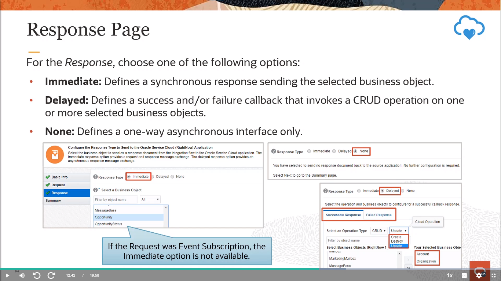
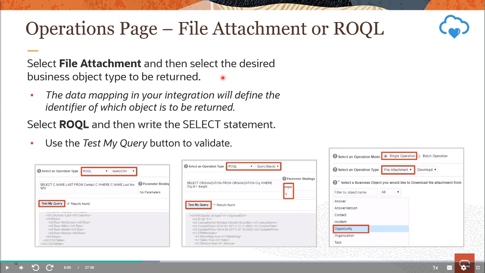

# Become An Application Integration Professional (2023) - Parte 3

## Application Integration on Oracle Cloud

### Configuring Trigger Connections - Configuring Integration Triggers (Concepts & SaaS Adapters)

#### Integration Development (Review)

<div align="center">
    
</div>

#### Message Exchange Patterns

<div align="center">
    
</div>

Las integraciones de OIC acomodan múltiples paradigmas de mensajería y admiten los tipos de comunicación mostrados en la diapositiva.

En una interacción sincrónica, el cliente invoca una Integración de OIC y luego espera una respuesta a la solicitud. Mientras el cliente espera, el canal de comunicación entre las partes queda abierto hasta que se produce la respuesta. Esto puede ser indeseable si se dejan abiertos grandes números de canales durante largos períodos de tiempo. Puede que no sea necesario si el cliente no necesita una respuesta inmediata. En estos casos, una respuesta asincrónica puede ser más apropiada.

En una interacción asincrónica, el cliente invoca la Integración de OIC pero no espera una respuesta antes de continuar. Las operaciones asincrónicas abren un canal de comunicación entre las partes, realizan la solicitud y cierran el canal antes de que se produzca la respuesta. La respuesta puede llegar en un momento posterior a través de una operación de devolución de llamada o puede que no llegue en absoluto para interacciones unidireccionales.

#### Implementing the Message Exchange Pattern

<div align="center">
    
</div>

Cuando diseñas una integración, comienzas con una conexión de adaptador de disparador (fuente) para iniciar la integración. La información requerida para conectarse a la aplicación ya está definida en la conexión. Sin embargo, aún debes especificar cierta información, como el objeto de negocio, la operación u otros elementos para usar en la solicitud y respuesta, y cómo procesar los datos. Esto invoca al Asistente de Configuración de Extremo de Adaptador que te guía a través de la configuración de la conexión del adaptador.

#### Using the Adapter Endpoint Configuration Wizard

<div align="center">
    
</div>

- [documentación gen 2](https://docs.oracle.com/en/cloud/paas/integration-cloud/integrations-user/understand-trigger-and-invoke-connections.html#GUID-B5A3BAB4-3E10-4AF0-989E-52831F1AA1B4)
- [documentación gen 3](https://docs.oracle.com/en/cloud/paas/application-integration/integrations-user/understand-trigger-and-invoke-connections.html#GUID-B5A3BAB4-3E10-4AF0-989E-52831F1AA1B4)

#### Gettin Started — Trigger Connections (Review)

<div align="center">
    
</div>

#### Basic Info Page

<div align="center">
    
</div>

**¿Cómo te gustaría llamar a tu punto de conexión?**

Proporciona un nombre significativo para que otros puedan entender las responsabilidades de esta conexión. Puedes incluir letras del alfabeto inglés, números, guiones bajos y guiones en el nombre. No puedes incluir lo siguiente:

- Espacios en blanco (por ejemplo, Mi Conexión de Entrada)
- Caracteres especiales (por ejemplo, #;83& o righ(t)now4)
- Caracteres multibyte

**¿Qué hace este punto de conexión?**

Proporciona una descripción opcional de las responsabilidades de esta conexión. Por ejemplo: "Esta conexión recibe una solicitud entrante para sincronizar la información de la cuenta con la aplicación en la nube."

#### 1. Oracle Service Cloud (RightNow) Adapter

<div align="center">
    
</div>

Cuando arrastras el Adaptador de Oracle Service Cloud (RightNow) al disparador de una integración, aparece el Asistente de Configuración de Punto de Extremo del Adaptador. Este asistente te guía a través de la configuración de las propiedades del punto de extremo del Adaptador de Oracle Service Cloud (RightNow).

- **Objeto de negocio:** Representa un documento de negocio independiente que puede ser manipulado por la integración. Una integración puede enviar solicitudes para crear un nuevo registro para ese objeto de negocio. También pueden enviar una solicitud para actualizar o eliminar un registro existente para un objeto de negocio. Las integraciones también pueden enviar solicitudes para recuperar información sobre uno o más registros que representan ese objeto de negocio.

- **Suscripción a eventos:** Representa un documento de evento al que te suscribes cuando el Adaptador de Oracle Service Cloud (RightNow) está configurado en la dirección de disparador (fuente). La suscripción a eventos es generada por la aplicación Oracle Service Cloud (RightNow).

<div align="center">
    
</div>

Ingresa los valores de solicitud del disparador del Adaptador de Oracle Service Cloud (RightNow) para tu integración. Los valores que especifiques iniciarán la integración.

Selecciona para recibir un objeto de negocio como solicitud desde la aplicación Oracle Service Cloud (RightNow). Esta opción inicia el proceso de definición para definir y generar un WSDL para la operación SOAP que será invocada por la aplicación Oracle Service Cloud (RightNow).

Selecciona para recibir una suscripción a eventos como solicitud desde la aplicación Oracle Service Cloud (RightNow). Esta selección activa la integración. Las suscripciones a eventos solo son compatibles si la versión de la aplicación Oracle Service Cloud (RightNow) es igual o superior a la versión 15.5 (mayo de 2015). De lo contrario, solo se admiten objetos de negocio.

> [!NOTE] 
> La aplicación Oracle Service Cloud (RightNow) tiene un límite de `20 suscripciones` para cada suscripción de evento disponible. Por ejemplo, puedes construir un máximo de 20 integraciones, todas suscritas al evento de Creación de Cliente, y 20 integraciones suscritas al evento de Destrucción de Contacto. Si creas una 21a integración para la misma suscripción de evento, esto puede provocar errores durante la activación de la integración.

<div align="center">
    
</div>

#### 2. Oracle Engagement Cloud Adapter

<div align="center">
    
</div>

<div align="center">
    
</div>

Selecciona la suscripción a eventos desde la aplicación Oracle Engagement Cloud a la que deseas suscribirte. Este evento se recibe como una solicitud que inicia la integración. Solo se muestran los eventos a los que se puede suscribir.

Cualquier evento de negocio personalizado que hayas creado y publicado en la aplicación Application Composer también está disponible para la selección. Los eventos personalizados se identifican por su descripción.

Ingresa una expresión de filtro de condición de evento. Una expresión de filtro especifica que el contenido (carga útil o encabezados) de un mensaje debe ser analizado antes de que se envíe cualquier suscripción a eventos.

Por ejemplo, puedes aplicar una expresión de filtro que especifique que se envíe una suscripción a eventos solo si el mensaje incluye un ID de cliente. Cuando la lógica de la expresión se cumple, el evento se acepta para la entrega a la integración. Como otro ejemplo, supongamos que tienes la siguiente carga útil de evento y deseas procesar registros donde se proporcione el Nombre del Propietario.

<div align="center">
    
</div>

Selecciona `Retrasado/Delayed` para configurar una respuesta de devolución de llamada exitosa, una respuesta de devolución de llamada fallida, o ambas.

Esto te permite configurar la operación y los objetos de negocio que deseas que la aplicación Oracle Engagement Cloud procese como parte de una respuesta de devolución de llamada exitosa, una respuesta de devolución de llamada fallida, o ambas.

Selecciona el tipo de devolución de llamada para configurar. Después de configurar un tipo de devolución de llamada (por ejemplo, exitosa), puedes configurar el otro tipo (por ejemplo, fallida).

**Respuesta Exitosa:** Selecciona para configurar la operación y los objetos de negocio que deseas que la aplicación Oracle Engagement Cloud procese como parte de una respuesta de devolución de llamada exitosa enviada por la integración.

**Respuesta Fallida:** Selecciona para configurar la operación y los objetos de negocio que deseas que la aplicación Oracle Engagement Cloud procese como parte de una respuesta de devolución de llamada de error enviada por la integración.

Selecciona la operación a realizar en el objeto de negocio.

#### 3. Oracle ERP Cloud Adapter

<div align="center">
    
</div>

<div align="center">
    
</div>

**Página de solicitud: Recibir eventos empresariales generados dentro de ERP Cloud**

Selecciona la suscripción de eventos de la aplicación Oracle ERP Cloud. Este evento se recibe como una solicitud que inicia la integración. Solo se muestran los eventos a los que se puede suscribir.

Cualquier evento empresarial personalizado que hayas creado y publicado en la aplicación Application Composer también está disponible para su selección. Los eventos personalizados se identifican por su descripción.

Ingresa una expresión de filtro de condiciones de evento. Una expresión de filtro especifica que el contenido (carga útil o encabezados) de un mensaje debe ser analizado antes de que se envíe algún evento. Por ejemplo, puedes aplicar una expresión de filtro que especifique que se envíe un evento solo si el mensaje incluye un ID de cliente. Cuando la lógica de la expresión se cumple, se acepta el evento.

**Página de respuesta:**

Selecciona el tipo de respuesta apropiado para tus requisitos empresariales:

`Respuesta retrasada (asincrónica)/Delayed (asynchronous) response:` Se expone un servicio de devolución de llamada (para enrutar la devolución de llamada). Seleccionas `Retrasado/Delayed` como el tipo de respuesta en la página de Respuesta y seleccionas la operación y el objeto de negocio que conforman una respuesta de devolución de llamada exitosa, una respuesta de devolución de llamada fallida, o ambas.

`No se requiere respuesta:` Seleccionas `Ninguna/None` en la página de Respuesta porque no se requiere una respuesta.

<div align="center">
    
</div>

**Recibir Mensaje de Devolución de Llamada al Finalizar el Trabajo de Importación Masiva FBDI enviado a través de otra Integración**

Especifica cuándo descargar los archivos de registro que describen el estado general del trabajo de importación de Oracle ERP Cloud.

`Siempre/Always:` Descargar siempre los registros, independientemente del éxito o fracaso del trabajo de importación.

`En caso de Fracaso/On Failure:` Solo descargar los registros si el trabajo de importación falla.

`En caso de Éxito/On Success:` Solo descargar los registros si el trabajo de importación es exitoso.

`Nunca/Never:` Nunca descargar los registros.

Selecciona el proceso de importación de datos masivos para recibirlo como una solicitud que inicia la integración. También puedes escribir las letras iniciales del nombre para filtrar la visualización de los procesos de importación de datos masivos.

### Configuring Trigger Connections - Configuring Integration Triggers (Technology Adapters)

#### Request and Response Pages: Business Objects

<div align="center">
    
</div>

**Página de Solicitud: Recibir Solicitudes de Aplicaciones de ERP Cloud (enviadas explícitamente desde Script Groovy o Lógica de Negocios)**

Selecciona el objeto de negocio de la aplicación Oracle ERP Cloud para recibirlo como una solicitud que inicia la integración. Se muestra una descripción del objeto de negocio en la parte inferior de la página.

**Página de Respuesta:**

Selecciona el tipo de respuesta apropiado para los requisitos de tu negocio:

- **Respuesta Inmediata (sincrónica):** Se devuelve un objeto de negocio de respuesta de inmediato. Seleccionas Inmediata como el tipo de respuesta en la página de Respuesta y seleccionas el objeto de negocio como parte de la respuesta al cliente.

- **Respuesta Retardada (asincrónica):** Se expone un servicio de devolución de llamada (para enrutamiento de la devolución de llamada). Seleccionas Retardada como el tipo de respuesta en la página de Respuesta y seleccionas la operación y el objeto de negocio que conforman una respuesta de devolución de llamada exitosa, una respuesta de devolución de llamada fallida o ambas.

- **No se requiere respuesta:** Seleccionas Ninguna en la página de Respuesta porque no se requiere una respuesta.

#### 4. (Generic) SOAP Adapter

<div align="center">
    
</div>

**Capacidades del Adaptador SOAP cuando se configura como disparador:**

- Asegura que un payload estructurado (XML) entrante de un cliente no exceda los 10 MB de tamaño.
- Asegura que un payload no estructurado (MTOM) entrante de un cliente no exceda 1 GB de tamaño. Si el tamaño del payload excede 1 GB, se devuelve un mensaje de código de error HTTP al cliente: 413 Solicitud demasiado grande.
- Permite configurar solo puntos finales SOAP basados en el protocolo HTTPS para aceptar solicitudes SOAP entrantes.
- Admite la configuración de los puntos finales SOAP de entrada utilizando las siguientes políticas de seguridad: Autenticación básica de HTTP, autenticación basada en token de WS-Username y compatibilidad con Security Assertion Markup Language (SAML) para acceder a propiedades estándar y personalizadas de encabezado SOAP/HTTP presentes en la solicitud SOAP entrante y hacerlas disponibles como parte de un mensaje de Oracle Autonomous Integration Cloud para cualquier procesamiento en acciones posteriores.
- Permite implementar los siguientes patrones de intercambio de mensajes en el punto final SOAP de entrada: solicitud/respuesta síncrona, solicitud unidireccional y solicitud asincrónica con soporte de devolución de llamada.

<div align="center">
    
</div>

**Página de Operación de Disparador**

Ingrese el tipo de puerto y la operación para el Adaptador SOAP. Si su WSDL incluye solo un servicio, tipo de puerto y operación, estos se seleccionan automáticamente. Si el WSDL incluye varios servicios y tipos de puerto, seleccione los que desee utilizar en su integración. Según los valores seleccionados, otros objetos como el objeto de solicitud, objeto de respuesta y objeto de fallo también pueden mostrarse automáticamente.
Seleccione Sí para desactivar la validación de acción SOAP para las solicitudes entrantes. Esto es útil en entornos en los que su WSDL incluye código personalizado y desea omitir la validación. Cuando se establece en No (el valor predeterminado), Oracle Integration valida la acción SOAP para garantizar que coincida con el WSDL.

**Página de Encabezado**

Ingrese los detalles del encabezado para el Adaptador SOAP. Los encabezados que especifique se aplican al objeto de solicitud y/o respuesta de la operación seleccionada. Los elementos seleccionados se incluyen bajo elementos de envoltura respectivos en el WSDL de integración y se muestran en el mapeador como una solicitud y/o respuesta.

#### 5. (Generic) REST Adapter

<div align="center">
    
</div>

**Capacidades del Adaptador REST al Exponer una Integración como una API REST al Configurar la Conexión como un Disparador**

Soporta la configuración de lo siguiente:

- URI de recursos relativos
- Soporte para los métodos HTTP GET, PUT, POST, DELETE y PATCH
- Parámetros de plantilla y consulta
- Soporte para un payload de solicitud/respuesta
   - Soporte para payloads JSON, XML, binarios (en línea y no estructurados) y codificados en formulario de URL
   - Soporte para matrices JSON homogéneas, incluidas las matrices de nivel superior
   - Soporte para matrices JSON multidimensionales

Las APIs REST expuestas utilizando el Adaptador REST están aseguradas mediante Autenticación Básica, autenticación basada en token OAuth y autenticación basada en JWT. Las APIs REST implementan el protocolo HTTPS, lo que obliga a que todas las solicitudes entrantes tengan seguridad a nivel de transporte. Las APIs REST expuestas utilizando el Adaptador REST están protegidas utilizando Autenticación Básica y autenticación basada en token OAuth.

Impone limitaciones de tamaño para mensajes y adjuntos entrantes.

Soporte para encabezados HTTP estándar y personalizados para modelar una integración y exponer propiedades de encabezado HTTP estándar y personalizadas a Oracle Integration para acciones posteriores.

<div align="center">
    
</div>

Puedes exponer múltiples puntos de entrada a una única integración orquestada que utiliza el Adaptador REST como la conexión de disparador. Cada punto de entrada puede configurarse con una URI de recurso y una acción/verbo HTTP diferentes, según sea necesario. Esta característica elimina la necesidad de crear múltiples integraciones (cada una con una URI de recurso y verbo separados) para realizar diferentes operaciones.

Esta función es útil en los siguientes escenarios:

- Admite múltiples URIs de recurso y acciones/verbos en una integración específica a través del Adaptador REST.
- Admite múltiples patrones de integración (por ejemplo, síncrono y asíncrono). La combinación de un recurso y un verbo se llama operación. Cada operación puede configurarse como un servicio síncrono o unidireccional asíncrono. Los servicios asíncronos aceptan la solicitud y devuelven inmediatamente un estado HTTP 202.

<div align="center">
    
</div>

Especifica la ruta relativa asociada con el recurso. La ruta puede contener parámetros de plantilla especificados entre llaves (por ejemplo, {id-orden}). Un recurso es cualquier fuente de información específica que puede ser abordada. La ruta del recurso sigue una URL fija y prefijada, seguida de la ruta relativa especificada.

Por defecto, la URL tiene el siguiente prefijo de ruta:

```
https://URL-de-instancia/ic/api/integration/v1/flows/rest/NOMBRE_DE_LA_INTEGRACIÓN/VERSIÓN
```

Por ejemplo, si el nombre de la integración es ExposeFlowAsRESTResource, la URL será:

```
https://URL-de-instancia/ic/api/integration/v1/flows/rest/EXPOSEFLOWASRESTRESOURCE
```

Selecciona una sola acción HTTP (método) para que el punto de acceso realice:

- GET: Recupera (lee) información (por ejemplo, realiza consultas). Si seleccionas esta opción, no puedes configurar un cuerpo de solicitud para este punto de acceso.
- PUT: Actualiza información.
- POST: Crea información.
- DELETE: Elimina información. Si seleccionas esta opción, no puedes configurar un cuerpo de solicitud para este punto de acceso.
- PATCH: Actualiza parcialmente recursos existentes (por ejemplo, cuando solo necesitas actualizar un atributo del recurso).

<div align="center">
    
</div>

**Desde la página de Configuración de Recursos:**

- **Agregar y revisar parámetros para este endpoint:** Haz clic para especificar los parámetros de consulta y ver los parámetros de solicitud de plantilla creados como parte de la URI del recurso para este endpoint. Si seleccionas esta opción y haces clic en Siguiente, se mostrará la página de Parámetros de Solicitud.
- **Configurar un carga útil de solicitud para este endpoint:** Haz clic para configurar la carga útil de solicitud para este endpoint, incluida la especificación de la ubicación del esquema y el tipo de carga útil con el que deseas que el endpoint responda. También puedes seleccionar esta opción si deseas incluir un adjunto con la solicitud de entrada. Si seleccionas esta opción y haces clic en Siguiente, se mostrará la página de Solicitud.
- **Seleccionar el tipo de encabezado de solicitud para configurar:**
    - **Estándar:** Selecciona para configurar encabezados HTTP estándar para el mensaje de solicitud.
    - **Personalizado:** Selecciona para configurar encabezados HTTP personalizados para el mensaje de solicitud.
    - **Seleccionar las opciones de procesamiento de adjuntos:** Selecciona el tipo de adjunto multipartes para incluir. Esta opción solo está disponible si seleccionaste la acción POST en la página de Información Básica.
    - **Aceptar adjuntos de la solicitud:** Selecciona para que el punto final REST procese los adjuntos de la solicitud multipartes entrante. Esta selección actualiza la página para mostrar el campo Seleccionar el tipo de carga útil que deseas que el endpoint reciba en la parte inferior de la página.
    - **La solicitud es un formulario HTML:** Selecciona para que el punto final REST acepte para configurar un formulario HTML. Debes seleccionar primero la opción Aceptar adjuntos de la solicitud antes de poder seleccionar esta opción. Esta selección asume que el tipo de medio es multipart/form-data.

<div align="center">
    
</div>

Selecciona las opciones de procesamiento de adjuntos: Selecciona el tipo de adjunto multipartes para incluir.

**Aceptar adjuntos de la respuesta:** Selecciona para recibir la respuesta desde la carga útil. Esta selección actualiza la página para mostrar el campo **Seleccionar el tipo de carga útil con la que deseas que el punto de acceso responda** en la parte inferior de la página.

**La respuesta es un formulario HTML:** Selecciona para que el punto final REST acepte configurar un formulario HTML. Debes seleccionar primero la opción **Aceptar adjuntos de la respuesta** antes de poder seleccionar esta opción. Esta selección asume que el tipo de medio es multipart/form-data.

Selecciona el formato de carga útil de respuesta a utilizar. El cuerpo de carga útil de respuesta debe estar definido por el elemento XSD que define la estructura de esta repesentation.XML Schema

**Muestra JSON:** Selecciona esta opción para usar archivos Swagger y RAML. Se admiten archivos de muestra JSON de hasta 100 KB de tamaño.

No se admiten matrices vacías en archivos de muestra JSON. Es posible que necesites procesar archivos de muestra JSON grandes con caracteres especiales antes de utilizar el Asistente de Configuración de Puntos de Acceso del Adaptador.

**Documento XML de Muestra (Con un Solo Espacio de Nombres o Ninguno):** Selecciona esta opción para usar un documento XML para generar el esquema.

**Documento JSON de Muestra:** Selecciona esta opción para usar un documento JSON para generar el esquema.

**Binario:** Úsalo con cargas útiles que son no estructuradas y en línea, por ejemplo. Preserva el contenido del archivo, pero requiere que el receptor determine el tipo de archivo, por ejemplo, a partir de la extensión del nombre del archivo. El tipo de medio de Internet para una secuencia de bytes arbitraria es application/octet-stream.

<div align="center">
    
</div>

**Página de Operaciones de Disparo del Adaptador REST**

Revise o edite operaciones existentes o agregue una nueva operación. Cada operación representa una rama de acción de selección diferente en una sola integración. El número máximo de operaciones (ramas) que puede crear en una integración es seis. Cada punto de entrada se puede configurar con una URI de recurso y una acción/verbo HTTP diferentes, según sea necesario. Esta función elimina la necesidad de crear múltiples integraciones (cada una con una URI de recurso y un verbo separados) para realizar diferentes operaciones. Puede exponer múltiples puntos de entrada a una sola integración orquestada con una acción de selección que utiliza el Adaptador REST como la conexión de disparo.

#### 6. File Adapter

<div align="center">
    
</div>

**El Adaptador de Archivos proporciona los siguientes beneficios:**

- Transfiere (lectura/escritura) archivos a cualquier servidor accesible públicamente en formato binario o ASCII.
- Admite un patrón de intercambio de mensajes unidireccional síncrono. No hay respuesta del servidor.
- Permite la creación de archivos binarios (opacos) y archivos basados en esquemas como esquemas XML y valores separados por comas (CSV).

> [!NOTE]
> El Adaptador de Archivos admite archivos de Microsoft Excel. Puede enviar el archivo como opaco (sin procesar) o primero guardarlo como un archivo CSV antes de usarlo con Oracle Integration. 
> 
> Admite el procesamiento de archivos de menos de 10 MB de tamaño. Tenga en cuenta que el tamaño de los archivos CSV aumenta al traducirse en un mensaje. Por lo tanto, el tamaño del archivo debe ser inferior a 10 MB para que, después de la traducción, el tamaño del mensaje no supere los 10 MB. 
> 
> Admite la carga de un archivo XSD sin un espacio de nombres objetivo. En estos casos, se agrega un espacio de nombres sustituto al archivo XSD que luego utilizan todos los mensajes: http://xmlns.oracle.com/cloud/adapter/nxsd/surrogate 
> 
> Admite XSD complejos que pueden importar e incluir otros XSD. Los XSD incluidos en el archivo ZIP pueden importar el XSD desde una ubicación HTTP. Todos los archivos XSD deben agregarse a un archivo ZIP y cargarse al configurar el Adaptador de Archivos para operaciones de lectura y escritura en el Asistente de Configuración de Extremos del Adaptador.

<div align="center">
    
</div>

<div align="center">
    
</div>

<div align="center">
    
</div>

### Configuring Invoke Connections - Using the Configuration Wizard (SaaS & DB Adapters)

#### Message Exchange Patterns (Revisited)

<div align="center">
    
</div>

Las integraciones de OIC pueden invocar servicios externos o internos de OIC utilizando cualquiera de los tres patrones básicos de interacción de servicios web.

En una interacción síncrona, la integración de OIC invoca el servicio externo y luego espera una respuesta a la solicitud. Mientras OIC espera, el canal de comunicación entre las partes queda abierto hasta que se recibe la respuesta. Esto puede ser poco deseable si se dejan abiertos un gran número de canales durante largos períodos de tiempo. Puede que no sea necesario si la integración no necesita una respuesta inmediata.

En una interacción asíncrona, la integración de OIC invoca el servicio externo pero no espera una respuesta antes de continuar. Las operaciones asíncronas abren un canal de comunicación entre las partes, realizan la solicitud y cierran el canal antes de que se reciba la respuesta. La respuesta puede llegar en un momento posterior a través de una operación de devolución de llamada o puede que no llegue en absoluto para interacciones unidireccionales.

#### Getting Started—lnvoke Connections (Review)

<div align="center">
    
</div>

#### Basic Info Page (Review)

<div align="center">
    
</div>

**¿Cómo quieres llamar a tu punto de conexión?**

Proporciona un nombre significativo para que otros puedan entender las responsabilidades de esta conexión. Puedes incluir caracteres alfabéticos en inglés, números, guiones bajos y guiones en el nombre. No puedes incluir lo siguiente:

- Espacios en blanco (por ejemplo, Mi Conexión de Entrada)
- Caracteres especiales (por ejemplo, #;83& o ahor(a)ra4)
- Caracteres multibyte

**¿Qué hace este punto de conexión?**

Ingresa una descripción opcional de las responsabilidades de la conexión.

#### 1. Oracle Service Cloud (RightNow)

<div align="center">
    
</div>

<div align="center">
    
</div>

<div align="center">
    
</div>

<div align="center">
    
</div>

#### 2. Oracle Engagement Cloud

<div align="center">
    
</div>

<div align="center">
    
</div>

<div align="center">
    
</div>

<div align="center">
    
</div>

#### 3. Oracle ERP Cloud

<div align="center">
    
</div>

<div align="center">
    
</div>

<div align="center">
    
</div>

<div align="center">
    
</div>

#### 4. Oracle HCM Cloud

<div align="center">
    
</div>

<div align="center">
    
</div>

<div align="center">
    
</div>

<div align="center">
    
</div>

<div align="center">
    
</div>

#### 5. Oracle ATP/ADW Databases

<div align="center">
    
</div>

<div align="center">
    
</div>

<div align="center">
    
</div>

<div align="center">
    
</div>

<div align="center">
    
</div>

<div align="center">
    
</div>

# [Parte 4](./Notas_4.md)