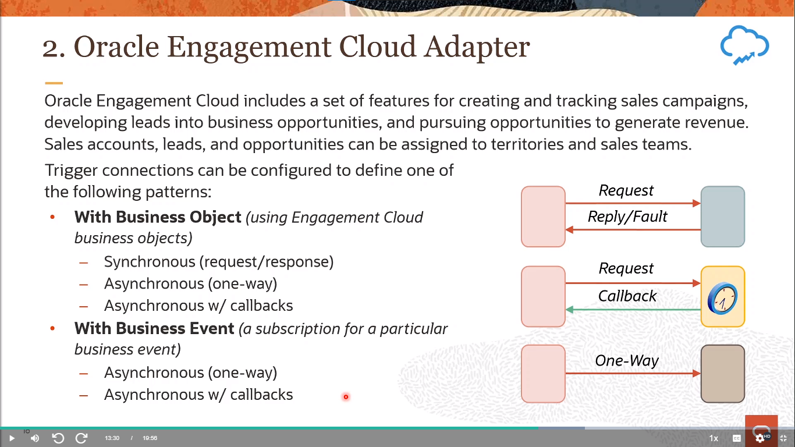

# Become An Application Integration Professional (2023) - Parte 3

## Application Integration on Oracle Cloud

### Configuring Trigger Connections - Configuring Integration Triggers (Concepts & SaaS Adapters)

#### Integration Development (Review)

    

#### Message Exchange Patterns

    

#### Implementing the Message Exchange Pattern

    

#### Using the Adapter Endpoint Configuration Wizard

    

- [documentación gen 2](https://docs.oracle.com/en/cloud/paas/integration-cloud/integrations-user/understand-trigger-and-invoke-connections.html#GUID-B5A3BAB4-3E10-4AF0-989E-52831F1AA1B4)
- [documentación gen 3](https://docs.oracle.com/en/cloud/paas/application-integration/integrations-user/understand-trigger-and-invoke-connections.html#GUID-B5A3BAB4-3E10-4AF0-989E-52831F1AA1B4)

#### Gettin Started — Trigger Connections (Review)

    

#### Basic Info Page

    

#### 1. Oracle Service Cloud (RightNow) Adapter

    

    

    

#### 2. Oracle Engagement Cloud Adapter

    

    

    

#### 3. Oracle ERP Cloud Adapter

    

    

    

### Configuring Trigger Connections - Configuring Integration Triggers (Technology Adapters)

#### Request and Response Pages: Business Objects

    

#### 4. (Generic) SOAP Adapter

    

    

#### 5. (Generic) REST Adapter

    

    

    

    

    

    

#### 6. File Adapter

    

    

    

    

