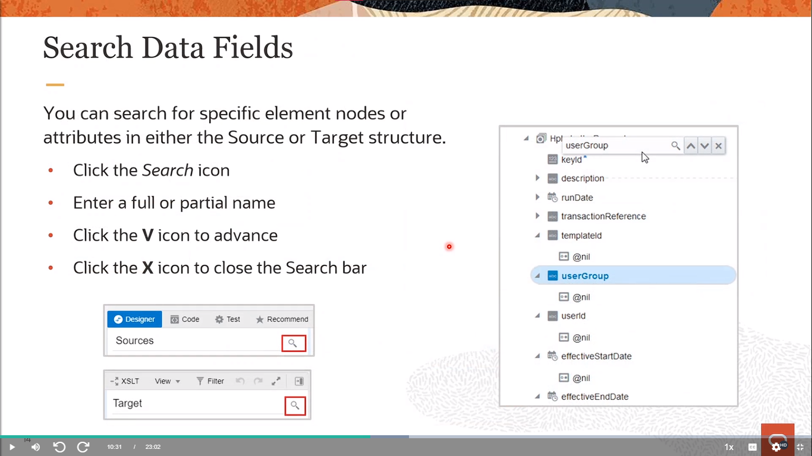

# Become An Application Integration Professional (2023) - Parte 4

## Application Integration on Oracle Cloud

### Configuring Invoke Connections - Using the Configuration Wizard (Technology Adapters)

#### 6. FTP Adapter Connections

<div align="center">
    
</div>

**El Adaptador FTP tiene las siguientes capacidades:**

- Admite la carga de un archivo XSD sin un espacio de nombres objetivo.
- Transfiere (lee y escribe) archivos a cualquier servidor accesible públicamente en formato binario o ASCII.
- Soporte de transmisión para transferir archivos grandes.
- Permite al desarrollador de integración construir un flujo basado en patrones de orquestación para recuperar archivos de servidores FTP y sFTP remotos, así como para cargar los archivos en servidores FTP/sFTP remotos. Oracle Integration proporciona la capacidad para programar la hora y la frecuencia a la que se ejecutarán estos flujos de integración.
- Admite un patrón de intercambio de mensajes de una sola vía sincrónico. No hay respuesta por parte del Adaptador FTP.
- Permite crear un formato de archivo de esquema para los archivos a transferir. El esquema puede ser creado (muestreado) desde un archivo de valores separados por comas (CSV) o desde un archivo de esquema existente. Los delimitadores admitidos en el archivo son espacios simples, comas, puntos y comas o tabulaciones.
- Permite al desarrollador de integración cifrar un archivo que se está cargando en servidores FTP/sFTP remotos utilizando la criptografía de Pretty Good Privacy (PGP).
- Permite al desarrollador de integración descifrar un archivo que se está leyendo o descargando de un servidor FTP/sFTP remoto utilizando la criptografía de Pretty Good Privacy (PGP).

<div align="center">
    
</div>

La operación de descarga de archivos te permite asignar dinámicamente el directorio de descarga. Puedes descargar archivos de hasta 1 GB de tamaño.

Selecciona el modo de transferencia:

- **ASCII:** Transfiere caracteres especiales de control para formatear los datos.
- **Binario:** Transfiere los bytes crudos de los datos del archivo.

Para usar seguridad PGP mientras descargas el archivo, selecciona un modo:

- **Descifrar:** Descifra los datos cifrados. Esto requiere que crees una clave privada y una contraseña de clave privada en la página de Conexiones.
- **Descifrar y Verificar Firma:** Descifra los datos cifrados y valida la firma del remitente. Este modo requiere que crees una clave privada y una contraseña de clave privada para el descifrado en la página de Conexiones. También debes crear una clave pública de firma para la verificación de la firma en la página de Conexiones.
- **Verificar Firma:** Verifica solo la firma presente en los datos. Esto requiere que crees una clave pública de firma en la página de Conexiones.

<div align="center">
    
</div>

<div align="center">
    
</div>

<div align="center">
    
</div>

**Patrón de Nombre de Archivo:** Especifica un patrón de comodines que se utilizará para listar archivos desde el directorio de entrada. Por ejemplo, order*.csv.

**Máximo de Archivos:** El número máximo de nombres de archivos que deben ser listados. El valor máximo es 1000.

> [!NOTE]
> La operación de Listar Archivos devuelve la lista de archivos en un orden ordenado según la última modificación de tiempo. Si seleccionaste 10 como el número máximo de archivos y la última modificación de tiempo del undécimo archivo es la misma que la del décimo archivo, entonces se agrega también el undécimo archivo. Esto continúa hasta que se obtiene un archivo con una marca de tiempo diferente.

Por ejemplo, supongamos que el directorio tiene 15 archivos y seleccionas **10** como el número máximo de archivos. Si el décimo, undécimo, duodécimo y decimotercer archivos tienen el mismo sello de tiempo, entonces la lista de archivos devuelve **13** archivos.

**Edad Mínima:** La edad mínima en segundos para que los archivos sean mostrados. Por ejemplo, si la última vez que un archivo fue modificado es a las 02:28:45 AM y la edad mínima está definida como 80 segundos, el archivo no será listado a las 02:29:00 AM. Será listado después de las 02:30:05 AM.

**Listar Archivos Recursivamente:** Lista archivos dentro de directorios de forma recursiva debajo del directorio de entrada.

<div align="center">
    
</div>

**Patrón de Nombre de Archivo:** El patrón de nombres de archivo para transferir al directorio de salida. Utiliza el patrón dentro de %%. Por ejemplo, Oracle%SEQ%ICS.txt crea archivos en secuencia, como Oracle1ICS.txt, Oracle2ICS.txt, y así sucesivamente. Para obtener una lista de patrones de archivos admitidos, haz clic en el ícono de información.

> [!NOTE]
> El uso de estos patrones puede provocar pérdida de mensajes si los mensajes se escriben en el sistema de archivos al mismo tiempo o si los archivos se escriben en un nodo separado. Para asegurarte de que los archivos no se sobrescriban, utiliza el mapeador para asignar explícitamente los nombres de archivo. Puedes usar funciones XPath para garantizar que los nombres de archivo sean únicos.

**Anexar a Archivo Existente:** Si se selecciona, el contenido del archivo se anexa al contenido del archivo existente y no se sobrescribe.

- Escribir registro por registro utilizando la opción **Anexar a Archivo Existente/Append to Existing File** genera demasiadas llamadas de red y eventualmente ralentiza el proceso. En su lugar, utiliza una Acción de Archivo de Escenario y escribe los registros en un directorio de escenario. Una vez que todos los registros estén escritos, utiliza la opción **Listar Archivo** en la Acción de Archivo de Escenario y la opción **Escribir Archivo** del Adaptador FTP para transferir el archivo a una ubicación FTP. Este enfoque reduce el tiempo de procesamiento y evita demasiadas llamadas al servidor FTP.
- Es posible que estés realizando anexos sucesivos al poner múltiples operaciones de escritura o usar una operación de escritura en un bucle for-each. En este escenario, si el servidor FTP está ejecutándose en múltiples nodos o en un servicio en la nube, debería sincronizar los datos inmediatamente entre todos los nodos. De lo contrario, si la próxima solicitud va a un nodo diferente, habrá inconsistencia en el archivo de salida final. Como alternativa, también puedes colocar una actividad de espera antes o después de cada anexo para dar tiempo a los datos para sincronizarse.

<div align="center">
    
</div>

<div align="center">
    
</div>

<div align="center">
    
</div>

#### 7. SOAP Adapter Connections

<div align="center">
    
</div>

**Capacidades del Adaptador SOAP al configurarse como una invocación:**

- Permite la invocación de un punto final SOAP externo basado en el protocolo HTTPS, lo que encripta las comunicaciones utilizando seguridad en la capa de transporte (TLS).
- Permite la invocación de puntos finales SOAP basados en el protocolo HTTP.
- Permite la invocación de puntos finales SOAP externos que están desprotegidos y protegidos mediante HTTP.
- Autenticación básica y autenticación basada en token WS-Username.
- Permite la invocación de puntos finales SOAP externos alojados en servidores TLS v1.1 y v1.2.
- Admite la invocación de puntos finales SOAP externos habilitados para SSL de dos vías.
- Admite la configuración de propiedades de encabezado SOAP/HTTP estándar y personalizadas disponibles para la solicitud SOAP saliente.
- Admite la invocación de puntos finales SOAP externos que implementan los siguientes patrones de intercambio de mensajes: solicitud/respuesta síncrona, solicitud unidireccional y solicitud asincrónica con soporte de devolución de llamada (usando WS-Addressing).
- Admite el envío y recepción de contenido binario y no binario como un adjunto MTOM (hasta 1 GB) como parte de un mensaje de solicitud o respuesta al invocar API SOAP externos.

<div align="center">
    
</div>

**Página de Encabezado/Header Page**

Ingresa los detalles del encabezado para el Adaptador SOAP. Los encabezados que especifiques se aplicarán al objeto de solicitud y/o respuesta de la operación seleccionada. Los elementos seleccionados se mostrarán en el mapeador como una solicitud y/o respuesta.

#### REST Adapter Connections

<div align="center">
    
</div>

El Adaptador REST trata todos los puntos finales tal como están expuestos. El Adaptador REST no filtra ni cambia ninguna de las API expuestas por la aplicación a la que te estás conectando. Si hay un adaptador nativo para la aplicación a la que te estás conectando, utiliza ese adaptador en su lugar. Si eliges usar el Adaptador REST en lugar del adaptador nativo, se aplican las restricciones de API y las políticas de desaprobación especificadas en la documentación de la aplicación respectiva.

Aplica limitaciones de tamaño para mensajes salientes y archivos adjuntos:

- Asegura que las respuestas que contienen archivos adjuntos para solicitudes REST salientes no superen 1 GB. Estos archivos adjuntos pueden ser multipart/mixed, multipart/form-data, o application/octet-stream. Si el archivo adjunto excede 1 GB, se devuelve un mensaje de error HTTP con el código 413: Solicitud demasiado grande.
- Asegura que los mensajes salientes (invoke) que devuelven un payload no estructurado (multipart-formdata y binary/octed-stream) desde un cliente no excedan 1 GB de tamaño.
- Asegura que los mensajes salientes (invoke) que devuelven payloads de mensaje estructurados (cualquier header de content-type que contenga JSON, XML, HTML, YAML o YML) desde un cliente no excedan 10 MB de tamaño.

<div align="center">
    
</div>

**Parámetros de Configuración**

Configuras los siguientes parámetros utilizando el Asistente de Configuración del Punto Final del Adaptador para exponer y consumir un servicio REST:

- Ruta URI relativa del recurso:
- Método HTTP (acciones) a realizar
- Plantillas y parámetros de consulta
- Estructura del mensaje de solicitud/respuesta

**Soporte de Encabezados Estándar y Personalizados**

El Adaptador REST admite encabezados HTTP de solicitud y respuesta estándar y personalizados. Los encabezados HTTP te permiten utilizar una invocación saliente para especificar propiedades de encabezado. Muchas API REST esperan que se especifiquen ciertas propiedades en los encabezados HTTP (similar a las API SOAP donde puedes especificar propiedades de encabezado como la dirección WS). Utiliza los encabezados HTTP estándar para especificar estas propiedades. También puedes utilizar los encabezados HTTP personalizados para especificar propiedades. Las API REST pueden esperar que la aplicación cliente pase propiedades en los encabezados personalizados, lo que puede influir en el comportamiento de las API. Las propiedades de encabezado HTTP estándar y personalizadas configuradas en el Asistente de Configuración del Punto Final del Adaptador comienzan a aparecer automáticamente en el mapeador. Puedes mapear las propiedades de encabezado en el mapeador.

<div align="center">
    
</div>

Especifica la ruta relativa asociada con el recurso. La ruta puede contener parámetros de plantilla especificados entre llaves (por ejemplo, **{order-id}**). Un recurso es cualquier fuente de información específica que puede ser direccionada. La ruta del recurso sigue una URL fija y prefijada, a la que se le añade la ruta relativa especificada.

<div align="center">
    
</div>

Desde la página de Información Básica:

**Agregar y revisar parámetros para este punto final:** Haz clic para especificar los parámetros de consulta y ver los parámetros de solicitud de plantilla creados como parte de la URI del recurso para este punto final. Si seleccionas esta opción y haces clic en Siguiente, se muestra la página de Parámetros de Solicitud.

**Configurar un payload de solicitud para este punto final:** Haz clic para configurar el payload de solicitud para este punto final, incluyendo la especificación de la ubicación del esquema y el tipo de payload con el que deseas que el punto final responda. También puedes seleccionar esta opción si deseas incluir un archivo adjunto con la solicitud entrante. Si seleccionas esta opción y haces clic en Siguiente, se muestra la página de Solicitud.

Selecciona el tipo de encabezado de solicitud a configurar:

**Estándar:** Selecciona para configurar encabezados HTTP estándar para el mensaje de solicitud.

**Personalizado:** Selecciona para configurar encabezados HTTP personalizados para el mensaje de solicitud.

Selecciona el tipo de adjunto multipart para incluir. Esta opción solo está disponible si seleccionaste la acción POST en la página de Información Básica.

**Enviar archivos adjuntos en la solicitud:** Selecciona para que el punto final REST procese archivos adjuntos desde la solicitud multipart de salida. Esta selección actualiza la página para mostrar el campo **Seleccionar el tipo de payload que deseas que el punto final reciba** en la parte inferior de la página.

**La solicitud es un formulario HTML:** Selecciona para que el punto final REST acepte configurar un formulario HTML. Debes seleccionar primero la opción **Enviar archivos adjuntos en la solicitud/Send attachments in request** antes de poder seleccionar esta opción. Esta selección asume que el tipo de medio es multipart/form-data.

<div align="center">
    
</div>

Para las respuestas de salida (invocación), selecciona el tipo de adjunto multipart a incluir.

**Procesar archivos adjuntos de la respuesta:** Selecciona para que el punto final REST procese archivos adjuntos desde la solicitud multipart de salida. Esta selección actualiza la página para mostrar el campo **Selecciona el tipo de payload con el que deseas que el punto final responda** en la parte inferior de la página.

**La respuesta es un formulario HTML:** Selecciona para que el punto final REST acepte configurar un formulario HTML. Debes seleccionar primero la opción **Procesar archivos adjuntos de la respuesta** antes de poder seleccionar esta opción. Esta selección asume que el tipo de medio es multipart/form-data.

Selecciona el formato del payload de respuesta a utilizar. El cuerpo del payload de respuesta debe estar definido por el elemento XSD que define la estructura de esta representación.

- **Muestra de JSON:** Selecciona esta opción para usar archivos Swagger y RAML. Se admiten archivos de muestra JSON de hasta 100 KB de tamaño. Los arrays vacíos en archivos de muestra JSON no son compatibles. Es posible que necesites procesar archivos JSON de muestra grandes con caracteres especiales antes de usar el Asistente de Configuración de Puntos Finales del Adaptador.
- **Documento XML de muestra (único o sin espacio de nombres):** Selecciona esta opción para usar un documento XML para generar el esquema.
- **Documento JSON de muestra:** Selecciona esta opción para usar un documento JSON para generar el esquema.
- **Binario:** Úsalo con payloads que son no estructurados y en línea, por ejemplo, application/octet-stream. Preserva el contenido del archivo, pero requiere que el receptor determine el tipo de archivo, por ejemplo, a partir de la extensión del nombre del archivo. El tipo de medio de Internet para un flujo de bytes arbitrario es application/octet-stream.

<div align="center">
    
</div>

### Data Mapping - Using the OIC Data Mapper

#### Integration Development (Review)

<div align="center">
    
</div>

#### OIC Data Mapping

<div align="center">
    
</div>

OIC proporciona un mapeador visual que te permite definir el mapeo de datos entre diferentes estructuras de datos de las aplicaciones de origen y destino mediante arrastrar y soltar. Puedes crear mapeos desde asignaciones de datos simples hasta expresiones o cálculos complejos. Se admite la transformación entre XML y XML.

OIC incluso puede hacer recomendaciones de mapeo para automatizar el proceso. También puedes agregar mapeos personalizados a integraciones preconstruidas que importas desde Oracle Marketplace.

#### Supported Features

<div align="center">
    
</div>

#### Launching the OIC Mapper (Review)

<div align="center">
    
</div>

Para crear mapeos en una integración, primero debes acceder al mapeador. En las integraciones de Orquestación, al agregar desencadenadores e invocaciones, se agrega automáticamente un icono de mapeo. También puedes agregar mapeos ad-hoc, como agregar un mapeador a una acción de switch.

Haz clic en un icono de mapeo existente o arrastra un mapeador a tu integración desde el panel de Acciones hasta la ubicación adecuada en tu integración, luego haz clic en el icono de Edición.

Si haces clic en el icono de Vista, ten en cuenta los siguientes detalles:

- No puedes agregar o editar mapeos.
- No puedes validar mapeos.
- No puedes guardar ni borrar la expresión XPath en el Constructor de Expresiones.
- No puedes crear ni eliminar elementos o mapeos en los menús contextuales del objetivo.
- No puedes arrastrar nodos de elementos de origen a nodos de elementos de destino.
- Puedes ver el código XSLT y probar tus mapeos.

#### OIC Data Mapper: Designer View

<div align="center">
    
</div>

Una de las tareas clave en cualquier integración es definir cómo se transfiere o mapea la información entre dos aplicaciones.

En la mayoría de los casos, los mensajes que deseas transferir entre las aplicaciones en una integración tienen estructuras de datos diferentes. Un mapeador visual te permite mapear campos entre aplicaciones arrastrando campos de origen hacia campos de destino. Cuando abres el mapeador para una solicitud o mensaje en una integración, las estructuras de datos se populan automáticamente con la información extraída de las conexiones de origen y destino. Puedes expandir y cargar niveles de estructura de datos a demanda para mostrar niveles adicionales. No hay límite en los niveles de visualización.

#### Schema Support

<div align="center">
    
</div>

Los mapas que creas se llaman mapas de transformación y utilizan el lenguaje de hojas de estilo extensible (XSL) para describir los mapeos de datos, lo que te permite realizar manipulación y transformación de datos complejas. Se proporciona un conjunto estándar de constructos XSLT (por ejemplo, xsl:if, xsl:for-each, entre otros). También se proporciona una función especializada para que puedas hacer referencia a búsquedas directamente desde el mapeador.

El mapeador admite esquemas calificados y no calificados (es decir, esquemas sin elementFormDefault="qualified"). También se admiten elementos y atributos con y sin prefijos de espacio de nombres.

Se admiten grupos de sustitución en los esquemas. Puedes ver todos los elementos sustituibles en un elemento base en el mapeador y seleccionar el que deseas utilizar.

También se admiten tipos de datos extendidos.

Los elementos y atributos para los que se requiere un mapeo se identifican con un asterisco azul (*) a la derecha de sus nombres. Para mostrar solo los campos requeridos, haz clic en el icono de filtro en la barra de herramientas del mapeador, selecciona Campos requeridos y haz clic en Aplicar.

También puedes hacer clic derecho en elementos y atributos y seleccionar Información del nodo para mostrar detalles específicos del esquema como el tipo de datos.

#### Data Structure View Options

<div align="center">
    
</div>

#### Basic Field Mapping: Drag & Drop

<div align="center">
    
</div>

Puedes mapear campos directamente desde la estructura de datos de origen a la estructura de datos de destino en el mapeador. Para mapear campos directamente, haz clic en un nodo de elemento de origen y arrástralo hasta el campo correspondiente en el nodo de elemento de destino. Una línea azul conecta los dos nodos. Se muestra un Constructor de expresiones debajo del mapeador para mostrar la expresión XPath.

#### Basic Field Mapping: Using the Expression Builder

<div align="center">
    
</div>

Una vez que tienes un nodo de elemento de destino, se muestra el **Constructor de expresiones/Expression Builder**. Se muestra un botón de traslado (enlace de traslado) en el lado izquierdo del campo. Los botones de guardar y borrar se muestran en el lado derecho del cuadro de campo. 

Arrastra el nodo de elemento de origen al Constructor de expresiones. También puedes resaltar el nodo de elemento de origen y hacer clic en el enlace de traslado para agregar un valor al Constructor de expresiones. 

Si deseas eliminar el valor, haz clic en el ícono de borrar y luego haz clic en el ícono de guardar para eliminar completamente el mapeo.

#### Using the Set Text Mode

<div align="center">
    
</div>

Cuando no hay ningún mapeo en el Constructor de expresiones, hay un botón de enlace llamado "Modo de texto establecido". Esta opción te permite ingresar texto en un nodo de elemento. Solo puedes tener una expresión XPath o texto en el Constructor de expresiones. No puedes tener ambos tipos.

Resalta un nodo de elemento de destino y haz clic en el botón de enlace "Modo de texto establecido" en el Constructor de expresiones para entrar en el modo de texto establecido.

Ingresa texto en el Constructor de expresiones. Se agrega un ícono de letra **A** al nodo. Cuando colocas el cursor sobre el ícono, se muestra el texto que ingresaste.

Nota: Si arrastras un nodo de origen al Constructor de expresiones mientras estás en el modo de texto establecido, el valor de mapeo se agrega literalmente como texto y no como una expresión XPath.

También puedes ingresar valores literales en el Constructor de expresiones cuando no estás en modo de texto establecido. Ingresa texto en el Constructor de expresiones, lo que crea una expresión de tipo "value-of" en el archivo XSLT en lugar de texto directo.

#### Search Data Fields

<div align="center">
    
</div>

El mapeador muestra la estructura de datos de origen a la izquierda y la estructura de datos de destino a la derecha. Puedes buscar nodos de elementos o atributos específicos en cualquiera de las estructuras de origen o destino.

Para buscar campos de datos:

En la sección Origen o Destino, haz clic en el ícono de búsqueda.

Ingresa el nombre completo o parcial y haz clic en el ícono de búsqueda.

El árbol se expande automáticamente y se desplaza hasta la primera coincidencia. Si ingresaste texto directo (por ejemplo, *country*), se encontrarán nodos de elementos y atributos del mismo nombre. Si buscas por atributo (por ejemplo, *@country*), solo se mostrarán los atributos del mismo nombre.

Haz clic en el ícono **V** para desplazarte hasta la siguiente coincidencia.

Cuando hayas terminado, haz clic en el ícono **X** para cerrar la ventana de búsqueda.

#### Filter the Source or Target Data Structures

<div align="center">
    
</div>

Puedes filtrar la visualización de las estructuras de datos de origen y destino. Esto te permite mostrar solo los detalles en los que estás interesado. Para filtrar las estructuras de datos de origen o destino:

1. Haz clic en el enlace de filtro en la sección Destino de la barra de herramientas de mapeo.
2. Especifica las opciones de filtrado del mapa en función de los siguientes criterios:
   - Ver los nodos de elementos mapeados, los nodos de elementos no mapeados o ambos.
   - Ver todos los tipos de nodos de elementos (nodos de elementos requeridos y nodos de elementos personalizados que creaste en una integración preconstruida de Oracle que se editó en el modo de personalización).
   - Ver las estructuras de datos de origen en la integración (fuente principal y fuentes secundarias).
   - Ver detalles de validación (ver solo errores, solo advertencias o solo mapeos sin problemas).
3. Haz clic en Aplicar.
Según tus selecciones, se muestran íconos en la barra de herramientas del mapeador. Por ejemplo, se muestra el ícono Mapeado para ambas estructuras de datos si seleccionaste mostrar nodos de elementos mapeados en ambas secciones de Fuentes y Destino.
4. Para eliminar el filtrado seleccionado, haz clic en el ícono Mapeado.

#### Using XPath Functions and Operators

<div align="center">
    
</div>

Puedes utilizar una variedad de funciones XPath estándar en tus mapeos de datos para transformar los datos que transfieres entre aplicaciones. El mapeador también admite algunas funciones de extensión XPath de BPEL que puedes incluir en tus mapeos de datos.

Para usar una función XPath:

- Haz clic en el ícono de Alternar Función para abrir el panel de **Componentes/Components**. Puedes encontrar o buscar la función:
   - Para encontrar la función, escribe el nombre completo o parcial de la función en el campo **Buscar/Find** y haz clic en el ícono de **Buscar/Find**.
   - Para buscar la función, expande la carpeta de **Funciones/Functions** y las subcarpetas de categorías para localizar la función.
- Arrastra la función hacia el elemento de destino o dentro del cuadro del Constructor de Expresiones para ese elemento. Si la función tiene un solo parámetro, insertará automáticamente la expresión de mapeo existente en el parámetro. Si la función tiene múltiples parámetros, te pedirá que selecciones qué parámetro insertar en la expresión de mapeo existente.
- Selecciona un parámetro o **Ninguno/None** si deseas eliminar la expresión de mapeo existente y haz clic en **OK**.
- Haz clic en **Guardar** y **Cerrar**.

#### Working With XSLT Statements

<div align="center">
    
</div>

Expande XSLT y luego busca y arrastra la declaración XSLT apropiada sobre el nodo del elemento de destino o utiliza la herramienta de búsqueda para ingresar manualmente y buscar la declaración XSLT.

Ten en cuenta las siguientes convenciones:

- Puedes arrastrar las declaraciones sobre elementos padre o hijo. Observa las siguientes convenciones sobre el arrastre de declaraciones XSLT:
   - Se muestra un ícono verde cuando arrastras la declaración XSLT hacia adelante o hacia atrás del elemento.
   - Si no se muestra un ícono verde, no puedes insertarlo como padre.
   - Arrastra la declaración hasta el final del nombre para insertarla como padre.
   - Arrastra la declaración hasta el principio del nombre para insertarla como hijo.
- Solo puedes arrastrar declaraciones XSLT sobre elementos creados. Si el elemento sobre el cual deseas arrastrar la declaración está en gris (es un nodo fantasma), haz clic derecho sobre el elemento y selecciona Crear Nodo de Destino.

#### Automaticall Create for-each Statements

<div align="center">
    
</div>

Para crear automáticamente declaraciones for-each:

- En la sección de Origen, identifica los elementos de origen y destino repetibles a los cuales mapear. Los elementos repetibles se identifican con el icono de elemento repetible a la izquierda del nombre. Cuando haces clic derecho en estos elementos y seleccionas "Información del Nodo", se muestra "Repetible: verdadero" en los detalles del mensaje sobre el elemento.
- En la sección de Origen, mapea el elemento hijo repetible al elemento hijo de destino repetible. No puedes mapear elementos a elementos no repetibles.

El mapeador crea una declaración for-each para recorrer el elemento de relación de origen y colocar el mapeo en el elemento de organización de destino. Esta declaración no incluye un valor para seleccionar porque los elementos principales típicamente no contienen atributos para mapear.

#### Repeat a Target Element to Map to Different Sources

<div align="center">
    
</div>

Para repetir un elemento de destino y mapearlo a diferentes fuentes:

- En la estructura de datos de destino, haz clic derecho en el nodo del elemento a repetir y selecciona **Repetir Nodo/Repeat Node**. Esta opción solo está disponible en elementos que se pueden repetir. Los elementos que pueden repetirse se identifican con un icono especial con dos barras a la izquierda del nombre. Cuando colocas el cursor sobre estos elementos, se muestra el texto **Repeating: true** en la información del elemento.
  
    El elemento se repite y se muestra debajo del elemento existente. Los elementos que se repiten muestran el recuento (por ejemplo, **1 de 2** para el elemento existente y **2 de 2** para el elemento repetido).
    Puedes repetir un elemento varias veces.

- Expande los elementos existentes y repetidos para ver que los atributos en cada elemento se repiten.
- Arrastra los mapeos de origen apropiados a los destinos repetidos.

> [!NOTE]
> Si creas un elemento repetible en el que no realizas ningún mapeo, haz clic en Cerrar y aplica tus cambios cuando se te solicite, el elemento vacío no se guardará.

#### Accessing the XSL Stylesheet

<div align="center">
    
</div>

#### Testing Your Mappings

<div align="center">
    
</div>

Una vez que hayas completado el diseño de tus mapeos, puedes probarlos ingresando contenido de muestra del mensaje a procesar en el probador de mapeo. Cuando ejecutas la prueba, se genera una salida a partir del contenido de muestra. Nota: Las funciones JavaScript personalizadas no pueden ser probadas.

En el panel de Entrada, puedes ingresar manualmente la **carga útil/payload**, **COPIAR** y pegar la carga útil, o hacer clic en Generar Entradas para generar y probar automáticamente la carga útil. Las cargas útiles para parámetros escalares no se crean.

Si tu mapeo incluye múltiples estructuras de datos fuente, se muestran ambos nombres. Se pueden generar cargas útiles para ambas fuentes.

Los valores aleatorios se generan automáticamente para los elementos de la carga útil. Según el tipo de datos del elemento, se generan los valores correctos (por ejemplo, valores numéricos o de cadena). Puedes editar manualmente los valores generados aleatoriamente, según sea necesario.

Haz clic en Ejecutar para generar resultados en el panel de Destino.

Revisa los resultados en el panel de Destino para asegurarte de que tu carga útil de entrada se procesó correctamente.

Prueba tu mapeo y, según sea necesario, vuelve al mapeador para realizar cambios en el mapeo, como cambiar las declaraciones XSLT o funciones utilizadas.

Para limpiar los paneles de Entrada y Destino, haz clic en Borrar.

Cuando la prueba esté completa, haz clic en Diseñador para volver al mapeador.

#### Data Mapping Recommendations

<div align="center">
    
</div>

El mapeador incluye un motor de recomendaciones para crear mapeos. Esto elimina la necesidad de analizar y realizar cada mapeo individual de origen a destino. Los resultados del motor de recomendaciones son particularmente útiles cuando tienes una nueva integración en la que aún no se ha creado el mapeo. También puedes usar el motor de recomendaciones con mapeos previamente creados.

#### Enabling the Oracle Recommendations Engine

<div align="center">
    
</div>

Para desactivar o volver a activar el motor de recomendaciones, sigue estos pasos:

1. En el panel de navegación izquierdo, haz clic en Inicio > Configuración > Recomendaciones.
2. Desmarca la casilla Contribuir a los mapeos de integración a Oracle Recommends y luego haz clic en Guardar en la esquina superior derecha.
3. Para volver a activar, marca la casilla Contribuir a los mapeos de integración a Oracle Recommends y luego haz clic en Guardar en la esquina superior derecha.

#### Launching the Mapper Recommendations

<div align="center">
    
</div>

Para utilizar las recomendaciones de mapeo del motor de recomendaciones, sigue estos pasos:

1. Ve a la página de Integraciones y encuentra la integración en la que deseas utilizar las recomendaciones de mapeo del motor de recomendaciones.
2. Abre el mapeador.
3. Haz clic en **Recomendar/Recommend** en la esquina superior izquierda. La página muestra los nodos de elementos de origen y destino recomendados.
4. Haz clic en **Fortaleza/Strength**. Elige mostrar recomendaciones de mapeo de fuerza Alta, Media o Baja.
5. Si deseas ver todas las recomendaciones, haz clic en **Seleccionar todo**.
6. Para anular la selección de un mapeo, haz clic en la marca de verificación o haz clic en la línea de mapeo y luego en Seleccionar.
7. Realiza una de las siguientes opciones:
   - Haz clic en **Diseñador** para salir de la página de Recomendaciones y volver al mapeador.
   - Haz clic en **Aplicar recomendaciones** para aplicar los mapeos seleccionados. Las recomendaciones que seleccionaste se muestran en el mapeador. Haz clic en Validar para guardar los cambios.
   - Haz clic en Cerrar y selecciona Aplicar para guardar el mapeo y salir de la página.

#### Displaying By Strength

<div align="center">
    
</div>

#### Selecting and Accepting Recommendations

<div align="center">
    
</div>

#### Complete the Data Mapping

<div align="center">
    
</div>

### Data Mapping - Configuring Transformations & Lookups

#### Creating Transformations Outside of OIC

<div align="center">
    
</div>

Puede haber escenarios en los que necesites realizar una tarea avanzada de XSLT (crear variables, usar plantillas, etc.) que no puedas realizar en el mapeador de OIC. Para estos casos, puedes exportar la integración, importarla en Oracle JDeveloper, realizar estas tareas avanzadas en el archivo de mapeo en el Editor de Mapas XSLT en Oracle JDeveloper, y luego guardar y volver a importar el archivo de mapeo en OIC. El archivo de mapeo debe ser de un Proyecto de Servicio de Oracle en Oracle JDeveloper.

Por ejemplo, aunque es posible, toma casi 15 clics (asumiendo que lo hagas en el orden correcto) para agregar una condición if similar a:

```bash
<xsl:if test="string-length ($returnCode) > 0" > <tns:Keyword> <xsl:value-of select="$returnCode"/> </tns:Keyword> </xsl:if>
```

#### Preparing for XSL Export

<div align="center">
    
</div>

#### Exporting the XSL File

<div align="center">
    
</div>

#### Setting Up JDEveloper to Edit the XSL File

<div align="center">
    
</div>

Crear una aplicación de Oracle Service Bus con un proyecto en Oracle JDeveloper.
- En el navegador de la aplicación, haz clic derecho en el proyecto de Oracle Service Bus y selecciona Importar. Se mostrará el cuadro de diálogo Importar.
- Selecciona Recursos de Service Bus y haz clic en Aceptar. Se mostrará el asistente de Importar Recursos de Service Bus.
- Selecciona Recursos Comprimidos/Archivados y haz clic en Siguiente.
- Haz clic en el icono Examinar origen ZIP a la derecha del campo Origen ZIP. Se mostrará el cuadro de diálogo Seleccionar archivo ZIP.
- Desde el menú Tipo de archivo, selecciona Archivo de Archivo de Integración Cloud (*.iar).
- Busca y selecciona el archivo de archivo IAR de Oracle Integration Cloud Service que exportaste previamente.
- Selecciona la carpeta **recursos/resources** en la que importar el archivo de archivo. Ten en cuenta que por defecto se selecciona todo el árbol de **Recursos/Resource**, incluyendo todo lo que está por encima del nodo de jerarquía que deseas seleccionar. Asegúrate de deseleccionar las partes por encima del nodo relevante de la jerarquía y luego haz clic en **Finalizar**.

Los recursos se importan al proyecto de Oracle Service Bus. Ahora puedes abrir el archivo de mapeo para editarlo con el Editor de Mapa XSLT en Oracle JDeveloper.

#### Using the XSLT Editor

<div align="center">
    
</div>

El Editor de Mapas XSLT te permite editar hojas de estilo XSLT utilizando un editor gráfico. También proporciona la característica de editar directamente el origen XSLT. Puedes alternar entre el editor gráfico y la Vista de origen usando las pestañas en la parte inferior del editor. Haz clic en **Diseño/Design** para editar usando el editor gráfico. Haz clic en **Fuente/Source** para editar usando el editor de origen.

Puedes moverte hacia adelante y hacia atrás entre las pestañas de Fuente y Diseño. Cualquier cambio realizado bajo una pestaña se refleja en la otra pestaña. Una pestaña de **Historial/History** también está disponible para permitirte ver el historial de revisiones y revertir a cualquier punto en el historial de edición.

El Editor de Mapas XSLT admite completamente XSLT 1.0 y XPath 1.0. Si deseas usar XSLT 2.0, puedes cambiar la versión de XSLT en la vista de origen.

El Editor de Mapas XSLT proporciona las siguientes vistas de edición bajo la vista de diseño:

- Vista de Mapa
- Vista de XSLT

Puedes alternar entre las dos vistas usando los botones en la esquina superior derecha del editor XSLT. Haz clic en **Mapa** para usar la vista de Mapa tradicional del editor XSLT. Haz clic en **XSLT** para usar la Vista de XSLT para mapas XSLT más complejos.

Información adicional sobre la creación de transformaciones con el Editor de Mapas XSLT está disponible en la documentación en línea de Fusion Middleware: [enlace](https://docs.oracle.com/middleware/1221/soasuite/develop/GUID-83DAC40D-A3FE-4530-8832-9C51FA63DE9D.htm#SOASE188)

#### Import the Edited XSL File into OIC

<div align="center">
    
</div>

Puedes importar un archivo de mapa XSL que fue exportado previamente desde la misma integración. Esta acción sobrescribe el archivo de mapeo existente. Una vez importado, el archivo de mapa no puede ser editado. Por ejemplo, puedes exportar el mapa desde una integración específica, editar el archivo XSL según los requisitos del usuario, guardarlo y luego importarlo de nuevo en la misma integración. No puedes importar un archivo de mapa XSL en una integración orquestada que fue exportada desde una integración diferente en Oracle Integration o desde una aplicación en Oracle JDeveloper.

Haz clic en **Examinar/Browse** para seleccionar el archivo de mapa (.xsl). Ten en cuenta que aunque exportaste toda la integración, no importas toda la integración de vuelta a OIC. Solo importas el archivo de mapa de la integración exportada de vuelta a OIC. Haz clic en **Importar**.

Consideraciones importantes:

Aunque es sencillo editar una transformación fuera del mapeador gráfico de OIC, hay razones por las que podrías optar por NO hacerlo. Una vez que un mapeo está bloqueado, OIC impone algunas restricciones:

- El mapeo ya no puede ser visto ni editado desde OIC. Esto dificulta un poco la depuración cuando surgen problemas.
- No es fácil agregar fuentes adicionales. Es más fácil crear una nueva acción de mapeo que incluya las fuentes requeridas y luego copiar la transformación desde la fuente del documento de mapeo original. Además, a menos que las fuentes se mapearan en el mismo orden, los prefijos de espacio de nombres pueden haber cambiado.
- La exportación/importación tiende a causar problemas en el formato XML, lo que dificulta un poco la localización de cambios.

#### Using Custom JavaScript Functions

<div align="center">
    
</div>

#### Adding JavaScript Libraries

<div align="center">
    
</div>

#### Using Custom XPath Functions in the OIC Mapper

<div align="center">
    
</div>

#### Executing Orchestation JavaScript Functions

<div align="center">
    
</div>

En el lado derecho del lienzo, haz clic en **Acciones** para expandir la paleta.

Arrastra el ícono de **JavaScript** hasta el signo **Plus/+** donde deseas agregar una función.

Ingresa un nombre y una descripción opcional para la acción de JavaScript cuando se te solicite y luego haz clic en **Aceptar**.

Puedes utilizar el menú para mostrar información sobre el JavaScript o para eliminar el JavaScript y volver a la paleta de **Acciones**.

Haz clic en el botón **+Function**.

Aparece el pop-up Seleccionar una Función.

Haz clic en una función y luego haz clic en el botón **Seleccionar** en la fila de la función.

Se muestra la página de configuración. Muestra los detalles de la función seleccionada, incluidos los parámetros de entrada y salida.

Haz clic en el ícono de lápiz en la columna **Valor** para usar el Constructor de Expresiones y configurar los parámetros de entrada.

Haz clic en **Validar** en la barra de título para validar los parámetros.

Haz clic en Cerrar en la barra de título para cerrar la página.

#### The Challenge

<div align="center">
    
</div>

Diferentes aplicaciones almacenan los mismos datos utilizando identificadores diferentes. Mapear datos entre estas aplicaciones puede ser un verdadero desafío. Necesitas mapear el mensaje recibido desde la fuente a una forma que el servicio web de destino comprenda. Por ejemplo, necesitas hacer coincidir IDs entre tres aplicaciones diferentes, pero una aplicación llama al campo simplemente ID, la segunda aplicación lo llama **OrganizationID**, y la tercera lo llama **OrgID**.

#### OIC Lookups

<div align="center">
    
</div>

Un **lookup** asocia valores utilizados por una aplicación para un campo con los valores utilizados por otras aplicaciones para el mismo campo. Esto proporciona la capacidad de mapear valores entre vocabularios o sistemas. Por ejemplo, puedes mapear códigos de país, códigos de ciudad, códigos de moneda, y así sucesivamente.

#### Getting Started

<div align="center">
    
</div>

**Crear un Lookup**

Crea un lookup para mapear valores entre aplicaciones.

En el panel de navegación, haz clic en **Integraciones** y luego en **Lookups**.

Haz clic en Crear. Se muestra el cuadro de diálogo Crear Nuevo Lookup.

Ingresa un nombre y una descripción opcional para el lookup.

Haz clic en **Crear**.

Se muestra la página de Lookup.

#### Creating Lookups

<div align="center">
    
</div>

Agregar adaptadores o nombres de dominio a un lookup para mapear valores entre conexiones.

Haz clic en **Nombre del Dominio 1**. Se muestra un menú con opciones. Selecciona el tipo que deseas crear:

**Seleccionar Adaptador:** Esta selección invoca el diálogo Seleccionar Adaptador para elegir el adaptador a utilizar. Puedes cambiar tu selección:

- Si deseas cambiar tu selección de adaptador, haz clic en el tipo de adaptador seleccionado y luego elige **Seleccionar un Adaptador Diferente/Select Different Adapter**.
- Si deseas cambiar de un adaptador a un nombre de dominio, haz clic en el tipo de adaptador seleccionado y elige **Reemplazar con Nombre de Dominio/Replace with Domain Name**.

**Ingresar Nombre de Dominio:** Esta selección invoca un diálogo para ingresar el nombre de dominio a utilizar. Hay un límite de 50 caracteres. Puedes cambiar tu selección:

- Si deseas cambiar de un nombre de dominio a un adaptador, haz clic en el nombre de dominio y luego elige **Reemplazar con Adaptador/Replace with Adapter**.
- Si deseas cambiar el nombre de dominio, haz clic en el nombre y luego elige **Editar Nombre de Dominio/Edit Domain Name**.

Si deseas agregar otra columna, haz clic en **+**. Repite para agregar más adaptadores y nombres de dominio al lookup. Haz clic en Guardar cuando hayas terminado.

#### Editing Lookups

<div align="center">
    
</div>

Después de crear un lookup, puedes clonarlo para crear rápidamente un nuevo lookup y exportarlo a un archivo CSV para usarlo en otros entornos de OIC. Esto demuestra la facilidad con la que puedes crear y usar lookups para compartir información entre aplicaciones.

Los lookups no se implementan como parte de la activación de la integración. Por lo tanto, los cambios que realices en los lookups ya utilizados en integraciones activas generalmente se aplican de inmediato. No es necesario volver a activar las integraciones que utilizan un lookup cambiado para que el nuevo valor del lookup surta efecto.

Puede haber instancias en las que las actualizaciones en el entorno de ejecución sean lentas porque no ocurren en tiempo real y pueden producirse encolamientos durante la ejecución. Para esos casos, las actualizaciones pueden tardar un par de minutos en surtir efecto.

Una vez que creas un lookup, puedes exportar ese lookup para usarlo en otros entornos de Oracle Integration. Puedes exportar un lookup tanto desde el Diseñador de Lookups como desde la lista de Lookups.

**Para exportar un lookup:**

- En el panel de navegación, haz clic en **Integraciones/Integrations** y luego en **Lookups**.
- Selecciona el menú **Acciones/Actions** a la derecha en la fila del lookup y luego selecciona **Exportar a CSV/Export to CSV**.
- En el diálogo que aparece, selecciona **Guardar archivo** y luego haz clic en Aceptar.
- Guarda el archivo en la ubicación que desees.
- El archivo se guarda como un archivo CSV con el mismo nombre que el lookup.

#### Referincing Lookups in the OIC Dta Mapper

<div align="center">
    
</div>

El asistente Build Lookup Function para crear los valores de parámetros de la función lookupValue es accesible desde el Constructor de Expresiones en Oracle Integration.

Para acceder al asistente Build Lookup Function:

- Expande **Componentes de Mapeo**.
- Expande **Funciones** > **Integration Cloud**.
- Expande la función lookupValue para ver los parámetros disponibles para definir en el asistente Build Lookup Function y el Constructor de Expresiones.
- dvmLocation
- srcColumn
- srcValue
- targetColumn
- defaultValue
- Arrastra la función lookupValue al campo **Nueva Condición**.

<div align="center">
    
</div>

# [Parte 5](./Notas_5.md)