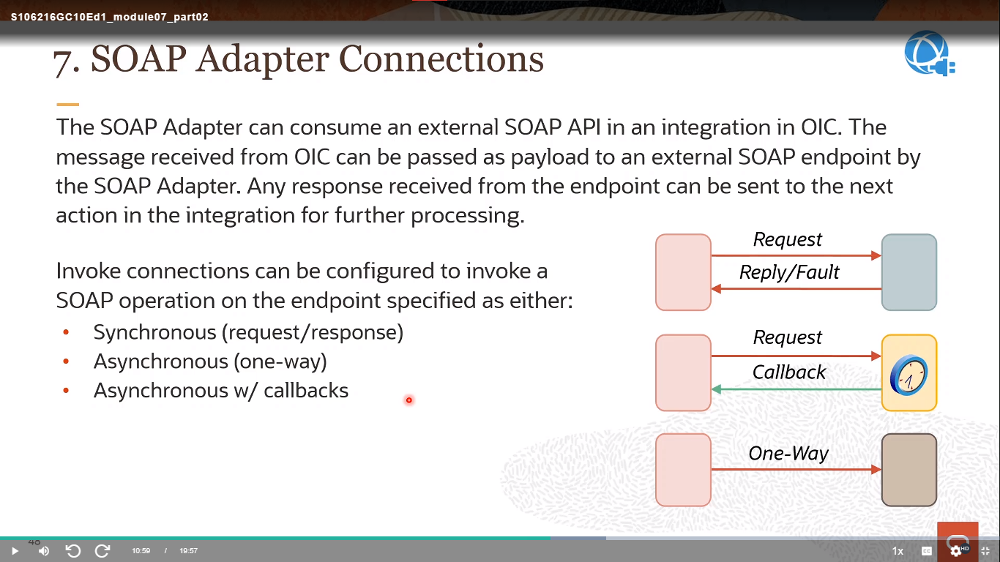

# Become An Application Integration Professional (2023) - Parte 4

## Application Integration on Oracle Cloud

### Configuring Invoke Connections - Using the Configuration Wizard (Technology Adapters)

    

    

    

    

    

    

    

    

    

#### 7. SOAP Adapter Connections

    

    

#### REST Adapter Connections

    

    

    

    

    

    

### Data Mapping - Using the OIC Data Mapper

#### Integration Development (Review)

    

#### OIC Data Mapping

    

#### Supported Features

    

#### Launching the OIC Mapper (Review)

    

#### OIC Data Mapper: Designer View

    

#### Schema Support

    

#### Data Structure View Options

    

#### Basic Field Mapping: Drag & Drop

    

#### Basic Field Mapping: Using the Expression Builder

    

#### Using the Set Text Mode

    

#### Search Data Fields

    

#### Filter the Source or Target Data Structures

    

#### Using XPath Functions and Operators

    

#### Working With XSLT Statements

    

#### Automaticall Create for-each Statements

    

#### Repeat a Target Element to Map to Different Sources

    

#### Accessing the XSL Stylesheet

    

#### Testing Your Mappings

    

#### Data Mapping Recommendations

    

#### Enabling the Oracle Recommendations Engine

    

#### Launching the Mapper Recommendations

    

#### Displaying By Strength

    

#### Selecting and Accepting Recommendations

    

#### Complete the Data Mapping

    

### Data Mapping - Configuring Transformations & Lookups

#### Creating Transformations Outside of OIC

    

#### Preparing for XSL Export

    

#### Exporting the XSL File

    

#### Setting Up JDEveloper to Edit the XSL File

    

#### Using the XSLT Editor

    

#### Import the Edited XSL File into OIC

    

#### Using Custom JavaScript Functions

    

#### Adding JavaScript Libraries

    

#### Using Custom XPath Functions in the OIC Mapper

    

#### Executing Orchestation JavaScript Functions

    

#### The Challenge

    

#### OIC Lookups

    

#### Getting Started

    

#### Creating Lookups

    

#### Editing Lookups

    

#### Referincing Lookups in the OIC Dta Mapper

    

    

# [Parte 5](./Notas_5.md)