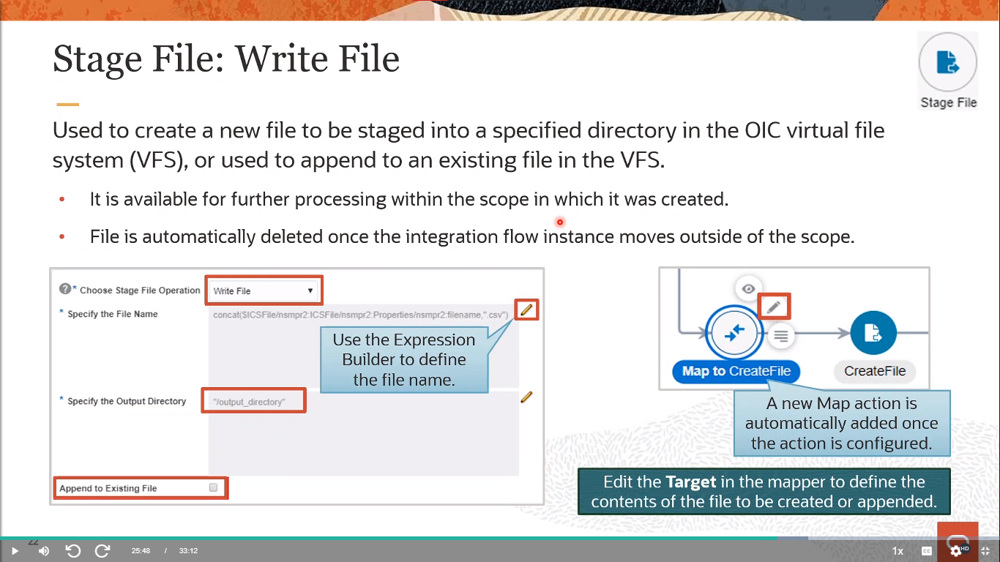

# Become An Application Integration Professional (2023) - Parte 5

## Application Integration on Oracle Cloud

### Orchestration Integration Actions - Using Orchestration Actions (Part 1)

#### Orchestation Styles (Review)

    

**Orquestación impulsada por la aplicación**

Crea una integración que utilice un evento o un objeto de negocio para activar la integración. Por ejemplo, puedes crear una integración con un Adaptador de Oracle RightNow como disparador y un Adaptador de Oracle Engagement Cloud como invocación. El Adaptador de Oracle RightNow se suscribe a un evento de la aplicación Oracle RightNow para activar la integración. Las integraciones de orquestación incluyen características como las siguientes:

- Actividades de Switch para crear múltiples expresiones de enrutamiento
- Actividades For-each para recorrer elementos repetidos
- Actividades de Asignación para asignar valores a variables escalares
- Mapeos ad-hoc en las ramas de switch

Las actividades de devolución de llamada (para finalizar un proceso y responder al remitente) y las actividades finales (para finalizar un proceso sin responder al remitente) están incluidas en integraciones asíncronas.

**Orquestación Programada**

Crea una integración que utilice una programación para activar la integración en lugar de un adaptador. Por ejemplo, agregas un adaptador de invocación inicial para leer un archivo de activación y un segundo adaptador FTP para descargar el archivo para su posterior procesamiento. Después de diseñar esta integración, programas cuándo ejecutarla.

#### Editing View Options

    

Se proporcionan varios íconos en la esquina superior izquierda para trabajar con la integración.

- **Vista de Canvas:** Muestra la Vista predeterminada del lienzo de integración.
- **Vista Pseudo/Pseudo View:** Muestra la integración de forma vertical con nodos secundarios indentados. Detalles sobre cada nodo en la integración se muestran a la derecha. Puedes editar la integración haciendo clic en el signo más **(+)** para invocar un menú en línea para agregar invocaciones y acciones. Cuando seleccionas **Vista Pseudo**, las opciones para **Vista de Diseño/Layout View** desaparecen.

#### Pseudo View

    

#### Repositioning Invoke and Actions Nodes

    

**Reposicionamiento de Nodos Dentro de una Integración**

Puedes reposicionar nodos de invocación y la mayoría de las acciones dentro de una integración. Por ejemplo, puedes mover una notificación de una parte de una integración a una rama de una acción de switch.

1. Encuentra el nodo que deseas reposicionar.
2. Haz clic en **Reposicionar** sobre el lienzo de integración para entrar en el modo de reposicionamiento.
3. Arrastra el nodo hacia la ubicación del **signo más** donde deseas colocarlo.
4. Después de completar el reposicionamiento, haz clic en **Reposicionar** para volver al modo de diseño de integración regular.

> [!NOTE]
> Actualmente, solo se pueden reposicionar los ámbitos colapsados. Otras acciones contenedoras como acciones mientras, acciones de switch, acciones for-each, etc., no pueden ser reposicionadas.

#### Using Outbound Invokes (Review)

    

Si la conexión del adaptador que deseas utilizar no existe, haz clic en el signo más (+) para crear una nueva conexión. Se mostrará el cuadro de diálogo Crear Conexión - Seleccionar Adaptador para seleccionar la conexión. Después de configurar y probar la conexión del adaptador, y el mensaje indica que está completo al 100%, guarda y cierra la página. La nueva conexión del adaptador se mostrará en el panel. También se mostrará un ícono de **Editar** a la derecha del nombre de la conexión para realizar actualizaciones. Si editas la conexión de modo que ya no esté completa al 100%, guarda y cierra la página de Conexiones. Se mostrará un mensaje en el banner indicando que no está completa al 100% y no puede mostrarse en el panel. Para que la conexión vuelva a mostrarse en el panel, debes regresar a la página de Conexiones y configurar la conexión para que esté completa al 100%.

Haz clic en el tipo de adaptador para mostrar el tipo específico y el número de adaptadores configurados. Se admiten disparadores síncronos, asíncronos y de "fire-and-forget" (sin respuesta).

Arrastra el adaptador configurado a la sección grande de signo más dentro del círculo en el lienzo de integración. Esto invoca al Asistente de Configuración de Punto de Extremo del Adaptador.

Completa las páginas del asistente para configurar el adaptador seleccionado.

> [!NOTE]
> No puedes eliminar una conexión de disparador en una integración. (La opción de eliminar no está disponible).

#### Actions Menu

    

#### Data Section

    

#### Assign Action

    

**Asignar Valores a Variables Escalares en una Acción de Asignación**

Puedes asignar valores a variables escalares en integraciones orquestadas utilizando el Constructor de Expresiones.

- Las variables creadas dentro de una acción de ámbito o una acción de bucle (por ejemplo, un for-each o un while) no son accesibles directamente fuera de la acción de ámbito/bucle. Para acceder a las variables (locales) fuera de una acción de ámbito/bucle, crea una variable global utilizando una acción de asignación encima de la acción de ámbito/bucle. Asigna la variable local a esta variable global y luego úsala fuera de la acción de ámbito/bucle.
- No se pueden asignar valores a otros tipos de variables, como tipos complejos.

> [!NOTE]
> Después de navegar lejos de la página de Asignación (por ejemplo, ir al Constructor de Expresiones o cerrar la página de Asignación), ya no puedes cambiar el nombre de la variable de asignación.

    

#### EDI Translate Action

    

**Traducir un Documento EDI con la Acción de Traducción de EDI**

Puedes traducir un mensaje hacia o desde el formato de **`Intercambio Electrónico de Datos/Electronic Data Interchange (EDI)`** en una integración orquestada con la acción de traducción de EDI. Esta acción invoca el Asistente de Acción de Traducción de EDI para guiarte a través de la configuración con el estándar de documento EDI X12. La acción de traducción de EDI traduce un documento EDI entrante en un mensaje XML de Oracle Integration y traduce un mensaje XML saliente de Oracle Integration en un documento EDI X12.

B2B para Oracle Integration admite el protocolo comercial EDI X12 para el intercambio de documentos comerciales entre Oracle Integration y un socio comercial. Se proporcionan las versiones EDI X12 de 4010 a 8010, que incluyen todos los tipos de documentos dentro de cada versión, con B2B para Oracle Integration.

#### Map Action

    

**Definir Mapeos Ad Hoc**

A medida que agregas switches y sus conexiones de invocación asociadas a las ramas del switch, puedes agregar mapeadores ad hoc según sea necesario. También puedes eliminar los mapeadores que se crearon automáticamente cuando agregaste tu primer disparador a la integración, si no son necesarios.

#### Stage File Action

    

**Procesar Archivos en Integraciones con la Acción de Archivo en Etapa**

Puedes utilizar la acción de archivo en etapa para procesar archivos o referencias de archivos en integraciones de orquestación. Puede procesar cada archivo descargado por el Adaptador FTP u Otros archivos temporales que se crean durante el flujo de integración.

La acción de archivo en etapa:

- Puede leer (y eliminar cualquier _remolque/trailer_), escribir, comprimir, descomprimir y listar archivos en una ubicación en etapa conocida por Oracle Integration.
- También puede leer (y eliminar cualquier remolque) y descomprimir archivos referenciados en una ubicación en etapa.
- Es similar en funcionalidad a los adaptadores. Sin embargo, a diferencia de los adaptadores, no necesitas crear una conexión para utilizar la acción de archivo en etapa. No tiene propiedades de credenciales ni políticas de seguridad.
- También difiere del Adaptador de Archivo y del Adaptador FTP en que proporciona la capacidad de definir un formato de archivo para operaciones de lectura y escritura. Para que la acción de archivo en etapa procese o actúe sobre archivos y adjuntos, deben estar disponibles en Oracle Integration.

Puedes hacer que los archivos estén disponibles en Oracle Integration ya sea utilizando la operación de descarga en el Adaptador FTP o consumiendo las API SOAP/REST que devuelven adjuntos multiparte o MTOM. Los flujos de Oracle Integration expuestos como puntos finales REST utilizando el Adaptador REST y exponiendo una interfaz para aceptar adjuntos multiparte también almacenan automáticamente archivos en etapa en Oracle Integration cuando las solicitudes se envían al punto final.

    

**Configurar Referencia de Archivo:**

- **Sí:** Selecciona para procesar una operación aguas arriba que proporciona una referencia de archivo. Después de seleccionarlo, especificas la referencia de archivo.
- **No:** Selecciona para procesar un nombre de archivo.

**Especificar la Referencia de Archivo** (aparece si seleccionas **Sí** para **Configurar Referencia de Archivo**):

- Haz clic en el ícono del **Constructor de Expresiones** para especificar una referencia de archivo.

**Especificar el Nombre de Archivo** (aparece si seleccionas **No** para **Configurar Referencia de Archivo**):

- Haz clic en el ícono del **Constructor de Expresiones/Expression Builder** para construir una expresión que especifique el nombre del archivo (por ejemplo, /nssrcmpr:schedule/nssrcmpr:startTime).

    **`NOTA:`** El tamaño del archivo debe ser menor de 10 MB. Para archivos mayores de 10 MB, utiliza la operación **Leer Archivo en Segmentos**.

**Especificar el Directorio desde el que leer:**

- Haz clic en el ícono del **Constructor de Expresiones** para construir una expresión que especifique el directorio desde el que leer archivos.

**Eliminar Remolque:**

- Selecciona para no eliminar el remolque, eliminar la última fila o eliminar las últimas n filas.

    

La opción **Leer Archivo en Segmentos** crea una acción de archivo en etapa que incluye una parte de ámbito. Esto te permite arrastrar acciones dentro del ámbito (como acciones for-each, acciones de archivo en etapa adicionales y otras) para escenarios más complejos.

**Tamaño del Segmento:** La fragmentación de archivos permite procesar archivos grandes, un fragmento lógico a la vez. Un fragmento lógico (segmento) se extrae de un archivo enorme, lo que permite que el archivo se mantenga dentro de las restricciones de memoria.

**Notas**

- Este campo no se muestra cuando agregas una nueva acción de archivo en etapa a una integración. El tamaño del segmento se establece en 200 registros de manera predeterminada y no se puede cambiar.
- Este campo solo se muestra en acciones de archivo en etapa existentes en las que se especifica un tamaño de segmento distinto a 200 registros. Para estos escenarios, puedes especificar un valor entre 10 y 200 registros.

Cuando el diseño esté completo, la acción de archivo en etapa se mostrará en el lienzo de integración y se creará una parte de ámbito. Puedes arrastrar acciones adicionales dentro de la parte de ámbito de la acción de archivo en etapa para realizar tareas.

- Por ejemplo, puedes agregar una acción for-each a la acción de archivo en etapa para procesar los fragmentos segmentados de archivos grandes un registro a la vez.
- También puedes agregar acciones de archivo en etapa secundarias para realizar un procesamiento adicional en cada uno de los fragmentos. Sin embargo, no puedes configurar una fragmentación adicional en la acción de archivo en etapa secundaria.

    

**Creación de Archivos Locales**

Ten en cuenta los siguientes detalles sobre el comportamiento de archivos locales:

- Las carpetas locales de Oracle Integration solo pueden crearse utilizando una operación de escritura de archivos en etapa desde dentro de la integración.
- Dentro del ámbito de la integración, el archivo está disponible para su procesamiento adicional.
- El uso de operaciones de archivos en etapa como lectura, escritura y otras te permite leer el contenido en el ámbito en el que el archivo está disponible.
- El archivo no es visible fuera del ámbito en el que fue creado.
- Puedes usar variables relacionadas con la escritura de archivos en etapa en operaciones de mapeo para apuntar a este archivo virtual.
- Una vez que la integración sale del ámbito de visibilidad del archivo, el archivo local se elimina.

**Para configurar la operación de Escritura de Archivo:**

- **Especificar el Nombre del Archivo:** Haz clic en el ícono del **Constructor de Expresiones** para construir una expresión que especifique el nombre del archivo.
- **Especificar el Directorio de Salida:** Haz clic en el ícono del **Constructor de Expresiones** para construir una expresión que especifique el directorio de salida.
- **Anexar a un Archivo Existente:** Opcionalmente, selecciona para añadir registros al archivo existente.

#### File Schema Options

    

#### Configure the Format Definition (Review)

    

#### Stage File: List Files

    

**Especificar el Directorio para Listar Archivos:** Haz clic en el ícono del **Constructor de Expresiones/Expression Builder** para construir una expresión que especifique el directorio desde el cual listar archivos.

**Especificar el Patrón de Archivo a Utilizar:** Especifica el patrón del nombre del archivo para transferir al directorio de salida. Haz clic en el ícono **?** para ver la lista de patrones admitidos.

**Listar Archivos de Forma Recursiva:** Selecciona esto para listar los archivos de forma recursiva.

    

**`Descomprimir Archivo/Unzip File`**

**Configurar Referencia de Archivo:**

- **Sí:** Selecciónalo para procesar una operación aguas arriba que proporcione una referencia de archivo ZIP. Una vez seleccionado, especificas la referencia de archivo y el directorio en el que descomprimir el archivo.

**Especificar la Referencia de Archivo:** Haz clic en el ícono del **Constructor de Expresiones** para especificar una referencia de archivo ZIP.

**Especificar el Nombre del Archivo ZIP** (aparece si seleccionas **No** para **Configurar Referencia de Archivo**): Haz clic en el ícono del **Constructor de Expresiones** para construir una expresión que especifique el nombre del archivo ZIP a leer.

**Especificar el Directorio del Archivo ZIP:** Haz clic en el ícono del **Constructor de Expresiones** para construir una expresión que especifique el directorio en el que descomprimir el archivo.

**Especificar el Directorio para Descomprimir:** Haz clic en el ícono del **Constructor de Expresiones** para construir una expresión que especifique el directorio en el que descomprimir archivos.

**`Comprimir Archivos/Zip File`**

**Especificar el Nombre del Archivo:** Haz clic en el ícono del **Constructor de Expresiones** para construir una expresión que especifique el nombre del archivo.

**Especificar el Directorio a Comprimir:** Haz clic en el ícono del **Constructor de Expresiones** para construir una expresión que especifique el directorio que se va a comprimir.

**Especificar el Directorio de Salida:** Haz clic en el ícono del **Constructor de Expresiones** para construir una expresión que especifique el directorio de salida en el que se va a escribir un archivo ZIP.

    

### Orchestration Integration Actions - Using Orchestration Actions (Part 2)

#### Call Section

    

#### Invoking JavaScript Functions (Review)

    

En el lado derecho del lienzo, haz clic en **Acciones** para expandir la paleta.

Arrastra el ícono de **JavaScript** hasta el signo **Plus/+** donde deseas agregar una función.

Ingresa un nombre y una descripción opcional para la acción de JavaScript cuando se te solicite y luego haz clic en **Aceptar**.

Puedes utilizar el menú para mostrar información sobre el JavaScript o para eliminar el JavaScript y volver a la paleta de **Acciones**.

Haz clic en el botón **+Function**.

Aparece el pop-up Seleccionar una Función.

Haz clic en una función y luego haz clic en el botón **Seleccionar** en la fila de la función.

Se muestra la página de configuración. Muestra los detalles de la función seleccionada, incluidos los parámetros de entrada y salida.

Haz clic en el ícono de lápiz en la columna **Valor** para usar el Constructor de Expresiones y configurar los parámetros de entrada.

Haz clic en **Validar** en la barra de título para validar los parámetros.

Haz clic en Cerrar en la barra de título para cerrar la página.

#### Invoking Local Integrations

    

#### Local Integration Selection Wizard

    

#### Invoking a Local OIC Process

    

Puedes invocar un proceso desde una integración orquestada. Cuando arrastras la acción de Proceso dentro de una integración, se invoca el Asistente de Selección de Proceso y te solicita que selecciones un espacio de trabajo de aplicación y un proceso para ser invocado.

- Expande Proceso de Negocio. Se muestran cualquier proceso basado en mensajes activo para su selección.
- Arrastra el proceso hasta el signo más (+) en la integración. Se muestra el Asistente de Selección de Proceso.
- En la página de Información Básica, ingresa un nombre y una descripción opcional, y luego haz clic en Siguiente.
- En la página Seleccionar Proceso:
    - En la lista de Aplicaciones, selecciona el espacio de trabajo de la aplicación. Se muestran los espacios de trabajo de aplicación disponibles para la instancia del proceso.
    - En el campo de Proceso, selecciona el nombre del proceso. El proceso ya debe estar activado y debe ser un proceso basado en mensajes para ser visible para la selección.
    - Si tu proceso tiene múltiples operaciones, selecciona una operación de la lista de Operaciones. Los procesos típicamente tienen solo una operación que se selecciona de forma predeterminada.

Haz clic en Siguiente.

- En la página de Resumen, confirma tus selecciones y haz clic en Listo. Se muestra un nodo de proceso con un mapa para proporcionar las entradas para invocar el proceso. El mapa puede contener uno o más esquemas y uno o más tipos complejos o primitivos dependiendo de la interfaz definida para el proceso.

#### Collection Section

    

#### For-Each Loop

    

**Iterando sobre Elementos Repetitivos con una Acción For-Each**

La acción for-each te permite iterar sobre un elemento repetitivo y ejecutar una o más acciones dentro del ámbito de la acción for-each. El número de iteraciones del bucle se basa en un elemento repetitivo seleccionado por el usuario. Por ejemplo, puedes tener una integración en la que has descargado varios archivos y deseas iterar sobre la salida de los archivos. La acción for-each te permite realizar esta tarea.

Expande el árbol de Origen para seleccionar un elemento.

Arrastra un elemento repetitivo al campo **Elemento Repetitivo**. Este es el elemento sobre el cual iterar.
**Ten en cuenta las siguientes restricciones:** El elemento seleccionado debe ser identificable como repetitivo mediante el icono de dos barras a la izquierda del nombre del elemento.

- Ningún padre del elemento seleccionado debe ser repetitivo.
- El tipo de datos del elemento seleccionado debe ser escalar.
- Se pueden seleccionar elementos repetitivos globales y no globales.

Si tienes un elemento repetitivo dentro de otro elemento repetitivo (es decir, una lista dentro de otra lista), primero debes crear una acción for-each y hacer un bucle sobre la lista principal. Esto te brinda acceso a la lista secundaria durante cada iteración. Luego puedes crear una segunda acción for-each dentro del ámbito de la primera acción for-each y hacer un bucle sobre la lista secundaria.

#### While Loop

    

**Iterando Sobre Acciones o Conexiones Invoke Mientras se Cumple una Condición con una Acción While**

La acción while te permite hacer un bucle sobre acciones o conexiones invoke mientras se cumpla una condición específica. Defines la condición para el bucle while en el Constructor de Expresiones. La acción while está disponible tanto en orquestaciones programadas como no programadas.

**Conflicto al Usar Variables de Tipo de Datos String y Aplicar Expresiones de Comparador Matemático**

Todas las variables creadas en Oracle Integration actualmente son solo de tipo de datos string. Usar estas variables directamente y aplicar expresiones de comparador matemático da como resultado un comportamiento inusual. Por ejemplo, en una acción de asignación, se crean dos variables, `var1` y `var2`, con valores de `1` y `10`, respectivamente. En una acción while, si luego estableces la condición como `$var1 > $var2`, el bucle termina después de dos iteraciones. El uso correcto es establecer la condición envolviendo las variables con la función XPath de número: `number($var1) < number($var2).` Este bucle itera 10 veces antes de terminar.

#### Switch Branches

    

Para definir las ramas de un switch:

1. En el lado derecho del lienzo, haz clic en **Acciones** para expandir el panel.
2. Arrastra el ícono de **Switch** al lienzo de integración. Mientras lo haces, se mostrarán grandes secciones con un signo + dentro de círculos que indican dónde puedes soltar la actividad de switch. Para este ejemplo, la actividad de switch se añade inmediatamente después de la conexión del disparador.
Nota: Se admiten switches anidados.

Se crean automáticamente dos ramas:

- Rama **Undefined** (primera): Debes definir una expresión de enrutamiento para esta rama.
- Rama **Otherwise** (segunda): Esta rama se toma si la expresión de enrutamiento para la rama inicial no se resuelve como verdadera.
    
    **Nota:** Para agregar más ramas, haz clic en el signo de interrogación en la actividad de switch para invocar un menú.

3. Haz clic en el ícono de la rama **Undefined**. Selecciona el ícono de Editar del menú que se muestra. Esto invoca el Constructor de Expresiones.

Define una expresión de enrutamiento y luego haz clic en Cerrar. Se admiten funciones de la versión 2.0 de XPath. También se admiten funciones de codificación y decodificación en base 64 que procesan datos de forma confidencial entre capas y funciones que devuelven resultados booleanos. No se admiten funciones que devuelven valores no booleanos.

Ahora puedes definir diferentes flujos de datos para ambas ramas definidas y de lo contrario en la actividad de switch.

#### General Section

    

Puedes registrar mensajes en el flujo de actividad y en los registros de diagnóstico agregando la acción de registro en cualquier punto de la integración. Creas un mensaje de registro en la acción de registro que puede ser un mensaje estático o un mensaje en el Constructor de Expresiones.

Puedes agregar notas de marcador similar a notas adhesivas a una integración. Por ejemplo, si aún no has definido una conexión de invocación y deseas agregar una nota de marcador en la integración que indique que planeas definir la conexión de invocación más tarde. Otro desarrollador de integraciones lee esa nota y puede agregar la conexión de invocación, o la nota te recuerda agregar la conexión de invocación en otro momento cuando vuelvas a trabajar en la integración.

La acción de nota es una característica de diseño que no afecta al tiempo de ejecución. Los cambios en las acciones ascendentes o descendentes en tu integración no afectan a la acción de nota.

Puedes enviar un correo electrónico de notificación a los usuarios relevantes en puntos específicos de la ejecución de una integración. Puedes configurar los campos para, desde y asunto de un correo electrónico. También puedes crear el cuerpo del correo electrónico utilizando parámetros definidos en el Constructor de Expresiones.

La acción de espera te permite retrasar la ejecución de una integración durante un período de tiempo específico. Utiliza esta acción en integraciones orquestadas programadas y asíncronas. Un uso típico para esta acción es invocar una operación específica en un momento determinado. Las acciones de espera están disponibles solo en integraciones asíncronas y de envío y olvido.

#### Logger Action

    

**Registrando mensajes con una Acción de Registro**

Para crear una acción de registro:

- Ingresa un nombre y una descripción opcional, luego haz clic en **Aceptar/OK**. Se mostrará la página del Registro.
- Selecciona si deseas registrar siempre este mensaje o solo cuando esté habilitado el rastreo. Puedes habilitar el rastreo al activar una integración.
- Especifica un mensaje estático o poblado por variables para ser mostrado en la secuencia de actividades y registros de diagnóstico. Haz clic en el ícono del **Constructor de Expresiones** para crear un mensaje que incluya variables.

#### Note Action

    

**Agregando Notas de Marcador de Posición con una Acción de Nota**

Para añadir una acción de nota:

- Ingresa un nombre y una descripción de la acción, luego haz clic en Aceptar. La acción se añadirá a la integración.
- Haz clic en el icono de **Edición** para agregar tus notas. Puedes agregar hasta 256 caracteres.
- Ingresa tus notas, luego haz clic en Aceptar.

Coloca tu cursor sobre el icono para mostrar el texto de la nota.

#### Notification Action

    

**Enviar Correos Electrónicos de Notificación Durante Etapas de la Integración con una Acción de Notificación**

Puedes enviar un correo electrónico de notificación a usuarios relevantes en puntos específicos durante la ejecución de una integración. Puedes configurar los campos para, de, y asunto de un correo electrónico. Puedes crear la parte del cuerpo de un correo electrónico utilizando parámetros definidos en el Constructor de Expresiones. También puedes agregar adjuntos al correo electrónico si tu integración los incluye. El límite total de tamaño en un correo electrónico de notificación es de 2 MB. Tanto el cuerpo del correo electrónico como el adjunto se consideran al calcular el tamaño total.

Para los campos **De, Para**, y **Asunto**, haz clic en los íconos del **Constructor de Expresiones** para construir las expresiones a utilizar. También puedes ingresar manualmente texto sin formato en el campo **Asunto**. Puedes proporcionar una dirección de correo electrónico en el campo De que esté aprobada como el remitente para alertas de fallos del servicio, informes de estado del sistema y informes de errores de integración. Configura la dirección de correo electrónico aprobada para usar en el campo **De** en la página de Notificaciones que es accesible desde **Configuración** > **Notificaciones**.

En el campo **Cuerpo**, ingresa un mensaje utilizando texto sin formato, formato HTML simple que crees en una herramienta de edición HTML separada y pegues en este campo, o parámetros que crees en la tabla inmediatamente debajo de este campo. Después de crear parámetros, ingrésalos dentro de { } corchetes.

Para agregar un nombre y valor de parámetro, haz clic en el ícono de Plus en la sección de **Parámetros**.

- Ingresa un nombre y descripción de parámetro.
- Haz clic en los íconos del Constructor de Expresiones para definir los valores del parámetro (para este ejemplo, se crea el nombre).

En la sección de **Adjuntos**, haz clic en el ícono de Plus para abrir una página y seleccionar un archivo adjunto. Selecciona los archivos adjuntos para añadir. Puedes editar o eliminar adjuntos una vez añadidos.

#### Wait Action

    

**Retrasar la Ejecución de la Integración Durante un Período de Tiempo Especificado con una Acción de Espera**

La acción de espera te permite retrasar la ejecución de una integración durante un período de tiempo especificado. Utiliza esta acción en integraciones orquestadas programadas y asíncronas. Un uso típico para esta acción es invocar una operación específica en un momento determinado, o dentro de una estructura de bucle para retrasar el procesamiento dentro de cada iteración del bucle. Las acciones de espera solo están disponibles en integraciones asíncronas y de "fire-and-forget".

**Creación de una Acción de Espera**

En el lado derecho del lienzo, haz clic en **Acciones** para expandir la paleta.

Arrastra el icono de **Espera** hasta el signo de más donde deseas retrasar la ejecución de la integración.

Ingresa los siguientes detalles cuando se te solicite, luego haz clic en **Aceptar**:

- Nombre de la acción.
- Descripción opcional de la acción.
- Número de horas, minutos y segundos para esperar antes de ejecutar la integración. Ingresa valores enteros positivos entre 0 y 59. Los tres campos no pueden ser cero. El tiempo total de espera no puede exceder las seis horas.

Si deseas editar o eliminar la acción, haz clic en ella y selecciona una opción del menú que se muestra.

#### End Section

    

#### Return Action

    

#### Callback Action

    

#### Stop Action

    

#### Actions Menu (Review)

    

# [Parte 6](./Notas_6.md)