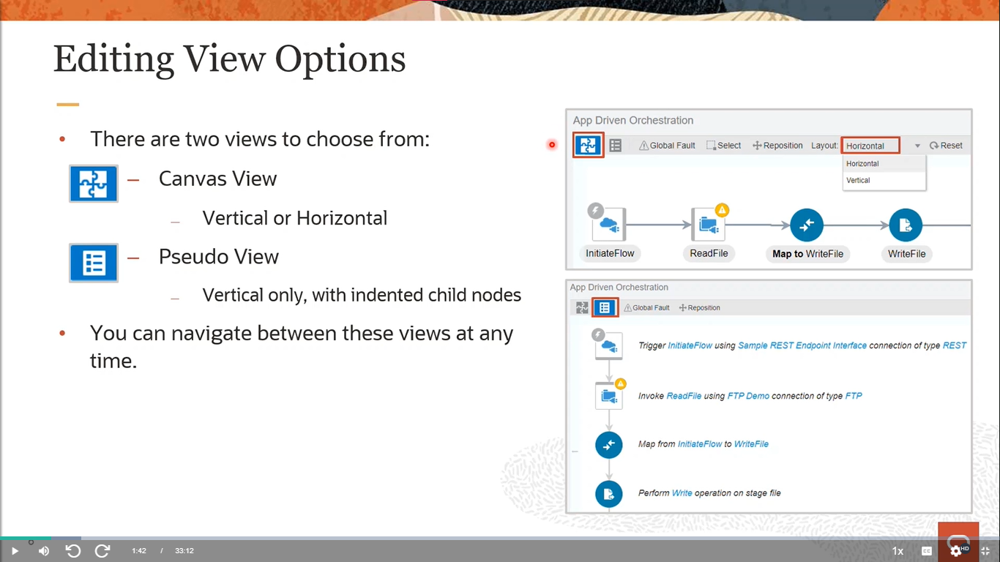
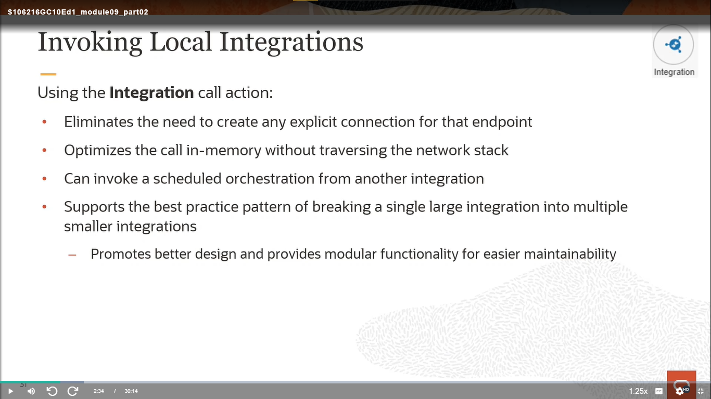
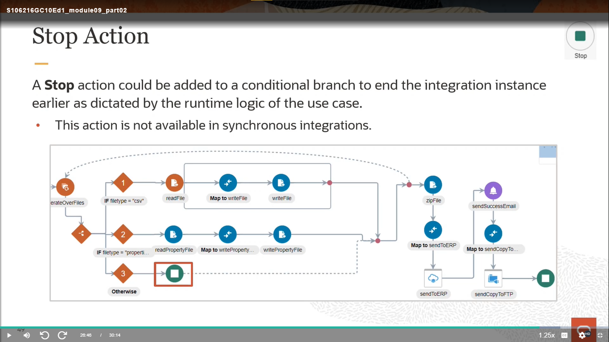

# Become An Application Integration Professional (2023) - Parte 5

## Application Integration on Oracle Cloud

### Orchestration Integration Actions - Using Orchestration Actions (Part 1)

#### Orchestation Styles (Review)

    

#### Editing View Options

    

#### Pseudo View

    

#### Repositioning Invoke and Actions Nodes

    

#### Using Outbound Invokes (Review)

    

#### Actions Menu

    

#### Data Section

    

#### Assign Action

    

    

#### EDI Translate Action

    

#### Map Action

    

#### Stage File Action

    

    

    

    

#### File Schema Options

    

#### Configure the Format Definition (Review)

    

#### Stage File: List Files

    

    

    

### Orchestration Integration Actions - Using Orchestration Actions (Part 2)

#### Call Section

    

#### Invoking JavaScript Functions (Review)

    

#### Invoking Local Integrations

    

#### Local Integration Selection Wizard

    

#### Invoking a Local OIC Process

    

#### Collection Section

    

#### For-Each Loop

    

#### While Loop

    

#### Switch Branches

    

#### General Section

    

#### Logger Action

    

#### Note Action

    

#### Notification Action

    

#### Wait Action

    

#### End Section

    

#### Return Action

    

#### Callback Action

    

#### Stop Action

    

#### Actions Menu (Review)

    

# [Parte 6](./Notas_6.md)