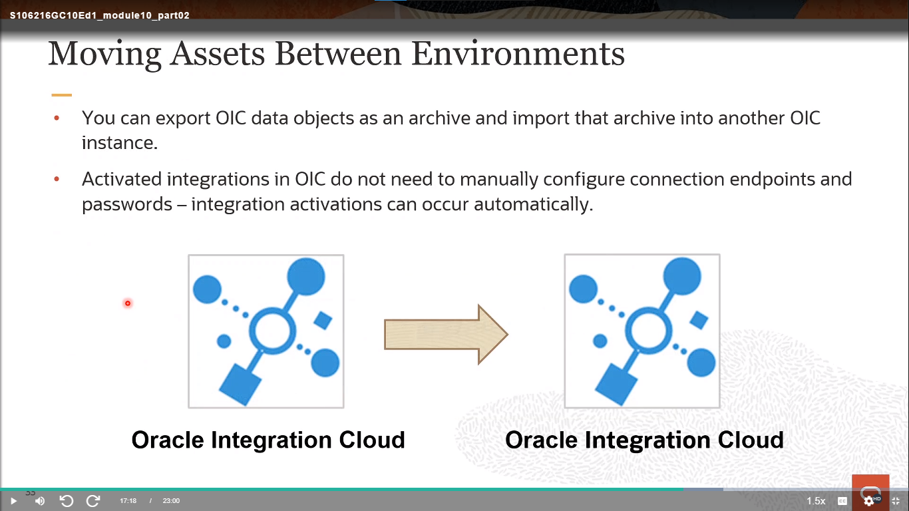

# Become An Application Integration Professional (2023) - Parte 6

## Application Integration on Oracle Cloud

### Additional OIC Capabilities - Creating Scheduled Integrations and Monitoring Instances & Messages

#### Scheduled Integrations

<div align="center">
    
</div>

**Crear Integraciones Programadas**

Puedes programar la ejecución de integraciones. Por ejemplo, puedes crear una integración orquestada que sea activada por una programación, y luego podrías usar un adaptador FTP invocado para leer un archivo. Puedes programar la ejecución de esta integración para copiar archivos en una fecha y hora de tu elección. También puedes definir la frecuencia de la integración. Cuando creas este tipo de integración, se muestra un icono de programación junto a la entrada de la integración en la página de Integraciones.

#### Scheduled Orchestration Design Canvas

<div align="center">
    
</div>

#### Creating a Schedule

<div align="center">
    
</div>

Si deseas primero crear una programación para una integración que activarás más tarde:

- Selecciona **Agregar Programación** del menú desplegable en la parte derecha.

En el campo **Nombre de la Programación**, acepta el nombre predeterminado o haz clic en el ícono de **Editar** para ingresar un nuevo nombre. Cuando hayas terminado, ingresa una descripción opcional y haz clic en la **marca de verificación verde**. Esta acción no guarda los cambios.

> [!NOTE]
> Supongamos que creas una programación y generas varias ejecuciones de integración, luego desactivas y eliminas la integración. Si luego creas y activas una nueva integración con el mismo nombre que la integración eliminada, y vas a la página de Seguimiento de Ejecuciones, se muestran las ejecuciones pasadas de la integración eliminada. Esto es intencional.

#### Defining a Basic Schedule

<div align="center">
    
</div>

Si deseas programar ejecuciones básicas de integración, haz clic en **Básico**. Para este tipo, hay un límite mínimo de frecuencia de diez minutos. Si intentas definir una frecuencia de programación de menos de diez minutos, se produce un error de validación.

En la sección **Frecuencia**, haz clic en el ícono para mostrar una lista desplegable para seleccionar la frecuencia con la que se ejecutará la integración. Mientras defines una frecuencia, puedes especificar valores adicionales haciendo clic en el ícono a la derecha de la sección **Frecuencia**. Haz clic en el ícono de la **marca de verificación verde** para cada tipo de frecuencia que especifiques. El campo Zona horaria muestra el valor que seleccionaste en la página de Preferencias.

En la sección "Esta programación es efectiva", haz clic en el enlace a la derecha de Desde. Se muestra un menú para definir la fecha de inicio de la programación.

En la sección **Hasta**, haz clic en el enlace a la derecha. Se muestra un menú para definir la fecha de vencimiento.

Si deseas que la ejecución de la programación nunca expire, selecciona **Nunca (repetir indefinidamente)**.

Si deseas que la ejecución de la integración tenga una fecha de vencimiento fija:

- Selecciona **Elegir fecha de vencimiento**.
- Haz clic en el ícono del **Calendario** para seleccionar el mes, año y día, así como la hora, minuto y segundo en los que finalizará la ejecución de la integración.
- Haz clic en **Aceptar**.

Haz clic en Guardar. Si tienes éxito, se mostrará un mensaje en la esquina superior izquierda.

#### Defining an Advanced Schedule

<div align="center">
    
</div>

Si deseas programar ejecuciones de integración con una expresión iCal, haz clic en **Avanzado**.

Ingresa una expresión iCal y haz clic en **Validar Expresión**. Por ejemplo, la siguiente expresión indica que esta integración se ejecuta cada mes en los días 1, 10 y 15 del mes a las 5:15 a.m., 10:15 a.m., 3:15 p.m. y 8:15 p.m.:

`PREQ=MONTHLY ; BYMONTHDAY=1, 10 , 15; BYHOUR=5, 10, 15, 20; BYMINUTE-15;`

También puedes definir múltiples frecuencias de programación. La siguiente programación se ejecuta todos los días entre las 5:30 p.m. y las 7:30 p.m., y durante estas horas se ejecuta cada 10 minutos. Esta configuración requiere tres programaciones separadas por el signo `&`:

```
PREQ=DAILY ; BYHOUR=17 ; BYMINUTE=30,40,50 ; BYSECOND=0;
& FREQ=DAILY ; BYHOUR=18 ; BYMINUTE=0,10,20,30,40,50 ; BYSECOND=0;
& FREQ=DAILY ; BYHOUR=19; BYMINUTE=0,10,20,30 ; BYSECOND=0;
```

Si la validación es exitosa, se mostrará el siguiente mensaje en la parte superior: `La expresión iCal es válida`.

Nota: Existe una limitación de un minuto en cuánta frecuencia puedes ejecutar integraciones programadas con una expresión iCal. No se admite nada por debajo de este límite.

#### Initiating an Integration Run Schedule

<div align="center">
    
</div>

Si ya has activado la integración, selecciona una opción para ejecutarla. Para una ejecución ad hoc, selecciona **Enviar Ahora/Submit Now** del menú.

Para iniciar la programación, selecciona **Iniciar Programación** en la página **Programación y Futuras Ejecuciones/Schedule and Future Runs** para activar la programación de la integración. Haz clic en Iniciar cuando se te indique. De lo contrario, haz clic en Cancelar.

> [!NOTE]
> Si colocas un archivo en un directorio de entrada y ejecutas una integración por primera vez, el archivo se copia en el directorio de salida. Si luego ejecutas la integración por segunda vez, el mismo archivo no se copia nuevamente en el directorio de salida, incluso si eliminaste el archivo del directorio de salida antes de volver a ejecutar la integración. Esto es intencional. Las segundas ejecuciones de integración no copian el mismo archivo. Sin embargo, si se coloca un archivo nuevo en la carpeta de entrada o si el archivo copiado previamente se actualiza con una versión más reciente en el directorio de entrada, ambos se copian en el directorio de salida.

Si creas una nueva programación para repetir cada minuto y lanzas el calendario para especificar una hora de inicio, muestra la hora actual (por ejemplo, 12:41:16). Si actualizas la hora de inicio a varios minutos más tarde (por ejemplo, 12:43:55), guardas y comienzas la ejecución programada de la integración, entonces la integración comienza a ejecutarse a las 12:43:16 en lugar de a las 12:43:55. El programador no tiene en cuenta los segundos ingresados y ejecuta la programación cada minuto.

#### Managing Integration Schedules

<div align="center">
    
</div>

**Iniciar y Pausar una Programación de Integración**

Después de definir una programación, debes activarla. También puedes pausar (desactivar) una programación, según sea necesario.

Haz clic en Iniciar cuando se te solicite para iniciar la programación. El siguiente mensaje se muestra en la parte superior de la página: La programación está ahora activa. Se muestran detalles sobre la programación, incluida la frecuencia y cualquier fecha de vencimiento. El botón de Iniciar Programación se cambia a Detener Programación.

Si deseas pausar la ejecución de la programación, haz clic en **Pausar Programación** en la parte derecha.

**Ver Futuras Ejecuciones**

Puedes ver el estado de las futuras ejecuciones programadas de la integración. Selecciona **Programación** en el menú de la derecha. Se mostrará la página de Programación y Futuras Ejecuciones. Haz clic en el menú para ver las tareas que puedes realizar.

Se muestran detalles sobre las futuras ejecuciones. Puedes filtrar para mostrar todas las ejecuciones, solo las ejecuciones programadas automáticamente o solo las ejecuciones enviadas manualmente. La página solo muestra las ejecuciones enviadas manualmente que tienen un estado de bloqueado, espera, listo, pausado o cancelando. También se muestra la zona horaria en la que se creó la programación.

#### Monitoring Integration Runs

<div align="center">
    
</div>

#### Resubmitting Failed Runs

<div align="center">
    
</div>

#### Initiating Runs Using the Integration's REST API

<div align="center">
    
</div>

Puedes crear ejecuciones ad hoc en integraciones programadas desde la API REST. Esto es útil cuando deseas probar la integración o crear una aplicación cliente que inicie una ejecución basada en casos de uso dinámicos.

Para crear ejecuciones ad hoc de integraciones, en el panel de navegación, haz clic en **Integraciones**.

- Encuentra la integración en la que está definida una programación (indicada por el ícono de calendario).
- Haz clic en el ícono de **Detalles de la Integración** en la parte derecha.
- Copia la URL desde **Enlace para Enviar Ahora/Submit Now Link** en una herramienta para probar APIs REST (por ejemplo, SOAP UI, pero puedes utilizar cualquier herramienta de invocación REST o script). También puedes utilizar comandos CURL desde una ventana de terminal para invocar las APIs REST.
- Invoca la ejecución de la integración.

#### Using Schedule Parameters

<div align="center">
    
</div>

**Crear Parámetros en Integraciones Programadas**

Puedes crear y actualizar parámetros programados de tipo escalar en integraciones programadas que determinan cómo agrupar y leer datos recibidos desde una ubicación de origen. Luego, utilizas estos valores de parámetro aguas abajo en la integración. Creas y asignas valores a estos parámetros en la página de Parámetros de Programación que está disponible en integraciones orquestadas programadas. También puedes asignar valores a estos parámetros en acciones de asignación. Se admiten hasta cinco parámetros en la página de Parámetros de Programación.

También puedes crear y asignar parámetros programados como identificadores comerciales que te permiten realizar un seguimiento de campos en mensajes durante el tiempo de ejecución.

Los parámetros programados están disponibles en todas las ejecuciones programadas de una integración y pueden facilitar el procesamiento de datos de una ejecución a la siguiente. Por ejemplo, al realizar procesamiento por lotes, un parámetro programado puede hacer un seguimiento de la posición actual de los datos por lotes entre ejecuciones. Este valor está disponible en todas las ejecuciones programadas y no puede superar los 256 caracteres.

#### Overriding Schedule Parameters

<div align="center">
    
</div>

**Anular los Valores de los Parámetros de Programación**

Puedes anular los valores de los parámetros de programación establecidos en el diseño al enviar una solicitud de programación ad hoc o al iniciar una programación en una integración activada. Esta función te permite proporcionar valores de parámetros al invocar una integración sin desactivarla.

Para anular los valores de los parámetros de programación, puedes acceder al cuadro de diálogo para anular los valores de los parámetros de dos maneras. Si la integración programada ha definido parámetros, se muestra el cuadro de diálogo Configurar Parámetros de Programación. De lo contrario, no se muestra el cuadro de diálogo y se inicia la integración programada.

#### Business Identifiers (Review)

<div align="center">
    
</div>

**Asignación de Identificadores Comerciales**

Desde el menú, selecciona **Seguimiento**. Se muestra el cuadro de diálogo Identificadores Comerciales para Seguimiento. El payload fuente para la integración seleccionada se muestra en el lado izquierdo. Solo puedes asignar identificadores comerciales a campos de payloads fuente. No puedes asignar identificadores comerciales a campos de payloads objetivo.

Desde la sección **Fuente**, arrastra el campo del payload que deseas seguir hasta la sección **Arrastra un campo de desencadenador aquí**. Puedes filtrar la visualización de las estructuras fuente haciendo clic en el enlace **Filtrar**. Esto te permite filtrar según si los campos se usan o no y según el tipo de campo (campos requeridos, campos personalizados o todos los campos).

Selecciona la casilla de verificación si deseas hacer de este el identificador comercial principal. Se requiere al menos un identificador. Si agregas solo uno, automáticamente se selecciona como la clave principal.

En el campo Nombre de Seguimiento, opcionalmente ingresa un nombre descriptivo para seguir durante el tiempo de ejecución (por ejemplo, OrgID). El nombre se muestra cuando este campo se utiliza para filtrar mensajes en la página de Seguimiento o (si hay un error de integración) en la página de Errores durante el tiempo de ejecución.

En el campo **Texto de Ayuda**, opcionalmente, ingresa instrucciones para permitir que los usuarios sepan qué ingresar en este campo durante el tiempo de ejecución (por ejemplo, ingresa un número de organización válido). Estas instrucciones se muestran dentro del campo vacío cuando se utiliza en la página de Seguimiento de tiempo de ejecución para filtrar mensajes.

#### Filtering and Tracking Business Identifiers

<div align="center">
    
</div>

**Seguimiento de Identificadores Comerciales en Integraciones Durante el Tiempo de Ejecución**

Puedes hacer un seguimiento de los campos en los mensajes en los que has definido identificadores comerciales en la página de Seguimiento durante el tiempo de ejecución. Se encuentran disponibles campos adicionales para el seguimiento en la página de Seguimiento si has definido identificadores comerciales adicionales durante el diseño.

Para hacer un seguimiento de identificadores comerciales en integraciones durante el tiempo de ejecución:

1. En el panel de navegación, haz clic en **Integraciones**, y luego haz clic en la flecha izquierda (`<`) junto a **Diseñador**.
2. Haz clic en **Monitoreo**, y luego haz clic en **Seguimiento**.
3. Desde la lista desplegable, selecciona el período de tiempo durante el cual buscar identificadores comerciales en los mensajes. Se muestran resultados para cualquier integración en la que se haya establecido un identificador comercial principal, incluido el identificador comercial y su valor, el identificador de instancia de la integración y el estado de la integración (por ejemplo, completada, fallida o abortada). Puedes mostrar el nombre y el valor de las variables de seguimiento.

#### Viewing the Integration Instance

<div align="center">
    
</div>

#### Viewing Instance Details

<div align="center">
    
</div>

### Additional OIC Capabilities - Managing Errors and Leveraging the OIC REST API

#### Monitoring and Managing Errors

<div align="center">
    
</div>

Puedes gestionar los errores producidos por la integración en la que ocurrieron. Las tareas de gestión consisten en ver el recuento total de errores para una integración durante un período de tiempo específico, descartar (eliminar) todos los errores para una integración y ver detalles más específicos del mensaje de error haciendo clic en el nombre de la integración o en el recuento total de errores.

Puedes descartar errores basados en la integración en la que ocurrieron. Un mensaje de error descartado se elimina de la página de Errores por Integración y se puede ver en estado de descarte en la página de Seguimiento. No puedes realizar ninguna operación adicional en un mensaje descartado, incluida la recuperación. Después de un cierto período de tiempo, el mensaje de error se elimina permanentemente del servidor.

#### Viewing Errors

<div align="center">
    
</div>

#### Discarding Errors

<div align="center">
    
</div>

Puedes descartar errores basados en la integración en la que ocurrieron. Un mensaje de error descartado se elimina de la página de Errores y se puede ver en estado de descarte en la página de Seguimiento. No puedes realizar ninguna operación adicional en un mensaje descartado, incluida la recuperación. Después de un cierto período de tiempo, el mensaje de error se elimina permanentemente del servidor.

#### Resubmitting Failed Instances

<div align="center">
    
</div>

Puedes volver a enviar manualmente mensajes fallidos. Volver a enviar un mensaje fallido inicia la integración desde el principio.

Todas las instancias con fallas en flujos asíncronos en Oracle Autonomous Integration Cloud son recuperables y pueden volver a enviarse. Los flujos síncronos no pueden volver a enviarse. Puedes volver a enviar errores de las siguientes maneras:

- Volver a enviar mensajes fallidos de forma individual
- Volver a enviar mensajes fallidos de forma masiva

Las instancias de error que se vuelven a enviar y se resuelven correctamente se eliminan de la lista de errores. Si una instancia se vuelve a enviar y está en progreso, se muestra un estado de "En Progreso" en la lista. Durante este estado, no se permiten envíos adicionales de esta instancia de error.

#### Automated Bulk Recovery

<div align="center">
    
</div>

REST API para recuperar instancias de integración con errores:

**GET**

**`/ic/api/integration/vl/monitoring/errors`**

Recupera información sobre todas las instancias de integración que tienen un estado de "Fallido" en la última hora, ordenadas por el tiempo de última actualización de la instancia de integración.

REST API para volver a enviar instancias de integración con errores:

**POST**

**`/ic/api/integration/vl/monitoring/errors/resubmit`**

Los detalles para este enfoque se proporcionan en este artículo del blog por Viswanatha Basavalingappa: [enlace](https://blogs.oracle.com/integration/post/bulk-recovery-of-fault-instances)

#### Setting Logging Levels

<div align="center">
    
</div>

Puedes establecer niveles de registro y descargar registros de diagnóstico en Oracle Integration. También puedes obtener el nombre del POD afectado a partir de los registros de diagnóstico.

**Notas**

- Cambiar los niveles de registro desde sus valores predeterminados puede llenar el espacio en disco y degradar el rendimiento del sistema. Asegúrate de restablecer el nivel del registrador al nivel predeterminado cuando hayas completado la solución de problemas.
- Cuando utilizas la función de búsqueda, solo se muestran los primeros diez resultados, incluso si hay más.

Para establecer niveles de registro:

1. En el panel de navegación, haz clic en **Integraciones** y luego haz clic en la flecha izquierda (`<`) junto a **Diseñador/Designer**.
2. Haz clic en **Configuración/Settings** y luego en **Niveles de Registro/Logging Levels**.
3. Se muestran los registradores disponibles para configuración. Si el nivel del registrador se hereda de un registrador padre, se muestra esa información.
4. Cambia el nivel del registrador de cualquier registrador.
5. Para volver al ajuste anterior antes de hacer clic en Guardar, haz clic en Revertir.
6. Haz clic en Guardar.

#### Accessing Logs

<div align="center">
    
</div>

> [!NOTE]
> También puedes acceder directamente a los registros de diagnóstico desde la página de Integraciones si la activación de tu integración falla. Haz clic en el enlace **Descargar registros de diagnóstico** en la parte superior de la página.

#### Downloaded Contents

<div align="center">
    
</div>

Ten en cuenta que el nombre del archivo ZIP descargado incluye el nombre del dominio del servidor WebLogic (el mismo que el nombre de tu POD) antepuesto al principio. Para este ejemplo, el nombre del POD, domain_ics_expanded, se antepone al principio: domain_ics_expanded-diagnostic-logs-number.zip. Esto te permite saber desde qué POD se está descargando el archivo.

También puedes obtener el nombre del POD desde el archivo `AdminServer-diagnostic.log` que está incluido en el archivo ZIP.

Descomprime el archivo y, dentro de la estructura de directorios expandida, abre `AdminServer-diagnostic.log`.

Si el nivel del registrador está configurado en NOTIFICATION, este archivo también incluye el nombre del dominio del servidor WebLogic (el nombre del POD), que se escribe en el archivo cada 30 minutos (para este ejemplo, el nombre del dominio es "domain_ics_expanded"). `[2016-11-09T12:00:00.413-08:00] [AdminServer] [NOTIFICATION] [ICS-10071] [oracie.ics] [tid:[ACTIVE].ExecuteThread: '5' for queue: 'weblogic.kernel.Default (self-tuning)'] [userld: <anonymous>] [ecid: fixa8364-21dc-4c08-8843-a57b23b9bde2-000051f5,O] [APP: icswebapp]` **El nombre del dominio de WebLogic es "domain_ics_expanded"**.

Un archivo `environment.txt` es parte del archivo ZIP descargado. Contiene detalles sobre Oracle Integration, incluyendo la versión, el modo y el nombre del POD.

#### REST API for Oracle Integration

<div align="center">
    
</div>

Utiliza la API REST de Oracle Integration para automatizar procesos comerciales, integrar aplicaciones y publicar eventos comerciales en bruto en un servidor de Integration Insight. Estas API REST se aplican a todas tus instancias de Oracle Integration. No importa qué edición estés utilizando, qué características tengas o quién gestione tu entorno en la nube. Encontrarás todos los recursos que necesitas en esta API REST para Oracle Integration.

#### Example Use Cases

<div align="center">
    
</div>

**Ejemplo: Activar o desactivar una integración.**

**Activar:** Una vez que creas una integración y tiene el estado CONFIGURADA, puedes activar la integración en el entorno de ejecución.

Ten en cuenta que el número de versión es importante al activar integraciones:

- Si la integración XYZ/01.00.00 está activada y activas XYZ/01.00.0001, XYZ/01.00.00 se desactivará automáticamente antes de que se active XYZ/01.00.0001. Tendrás solo una integración activada en este caso (XZY/01.00.0001). La desactivación automática se comporta de la misma manera que la desactivación manual.

- Si la integración XYZ/01.00.00 está actualmente activada y activas XYZ/02.00.00, tendrás dos integraciones activadas.

**Desactivar:** Puedes desactivar una integración para detener el procesamiento de nuevos mensajes. Si hay solicitudes pendientes sin procesar, se perderán después de la desactivación.

#### Moving Assets Between Environments

<div align="center">
    
</div>

#### Migration Overview

<div align="center">
    
</div>

1. Crea un depósito de almacenamiento de objetos en el entorno subyacente de Oracle Cloud Infrastructure.
2. Utilizando la URL de almacenamiento y las credenciales de almacenamiento, invoca la API REST de exportación dentro del entorno de OIC fuente. Esto copiará los datos en el servicio de almacenamiento.
3. Invoca una API REST para proporcionar el estado de la operación de exportación si es necesario.
4. La información sobre qué objetos se han exportado o cualquier error o advertencia que se haya generado como parte de la migración se puede recuperar de un informe de migración.
5. Realiza la operación de importación en el entorno de destino de OIC pasando la URL de almacenamiento y las credenciales de almacenamiento, así como el nombre del archivo.
6. Invoca una API REST para proporcionar el estado de la operación de importación si es necesario.
7. La información sobre qué objetos se han importado o cualquier error o advertencia que se haya generado como parte de la migración se puede recuperar del informe de migración.

# [Parte 7](./Notas_7.md)