# Become An Application Integration Professional (2023) - Parte 7

## Application Integration on Oracle Cloud

### File Handling Concepts and Options

#### Integration Style Options

    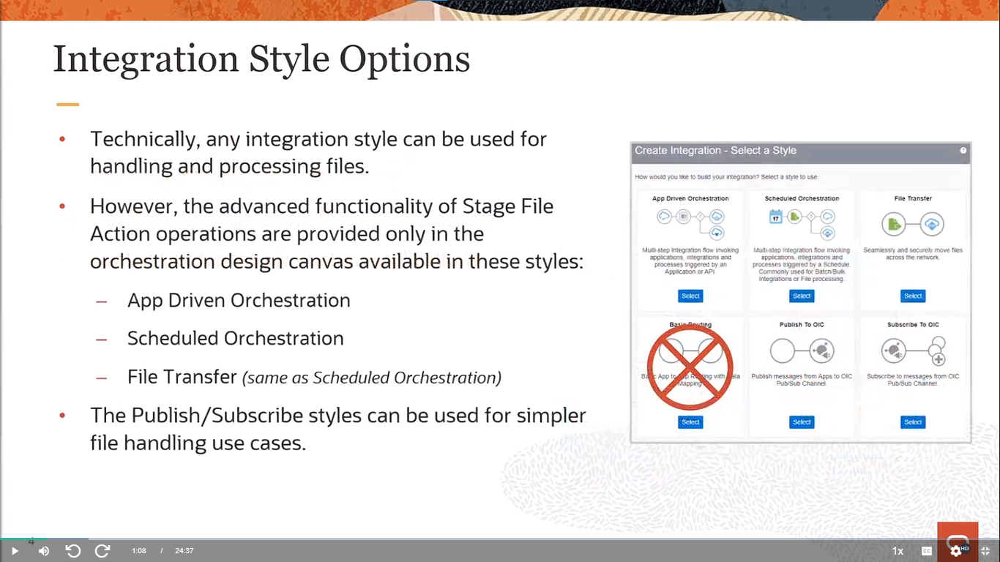

#### OIC Toolls and Options for File Handling

    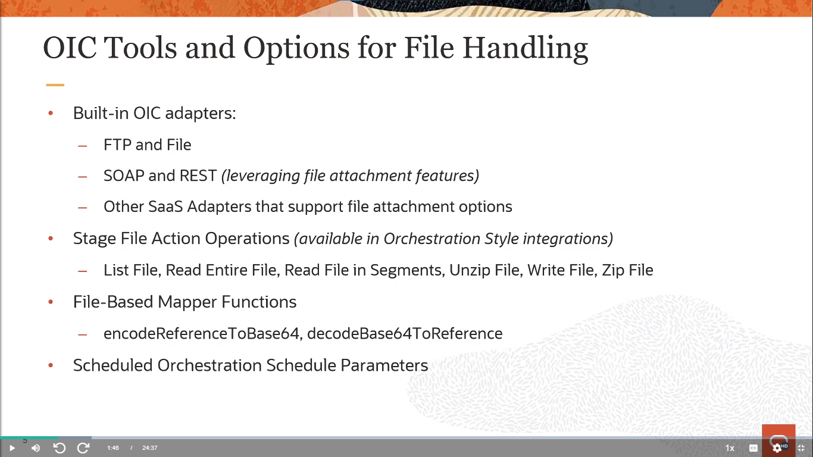

#### File Adapter Options Summary

    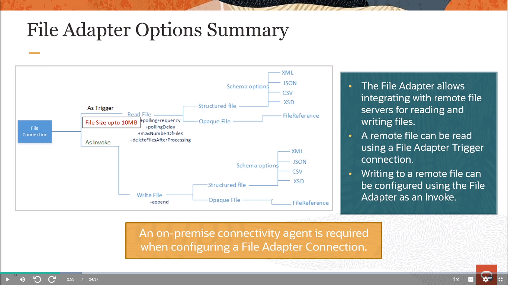

#### FTO Adapter Options Summary

    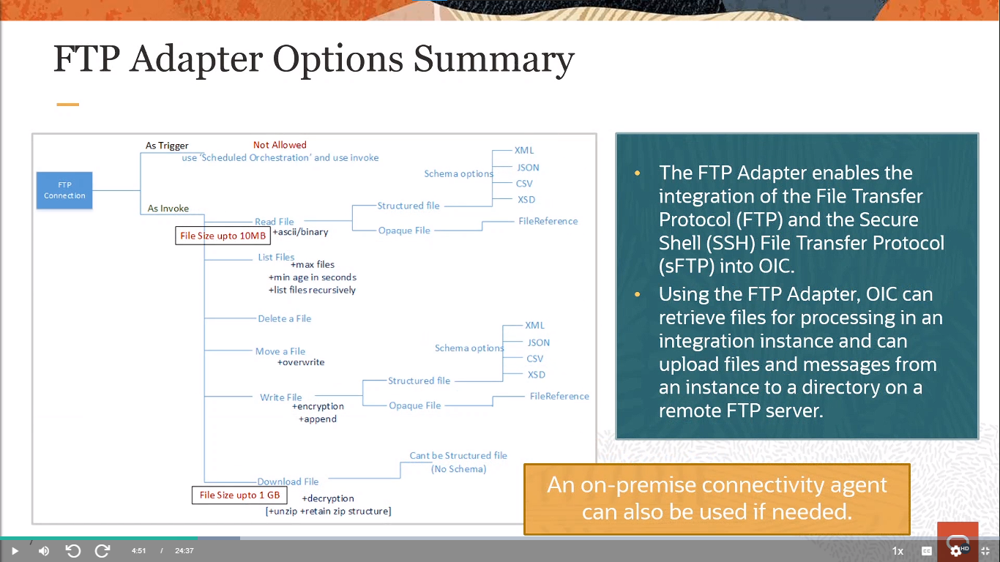

#### Differences Between File and FTP Adapters

    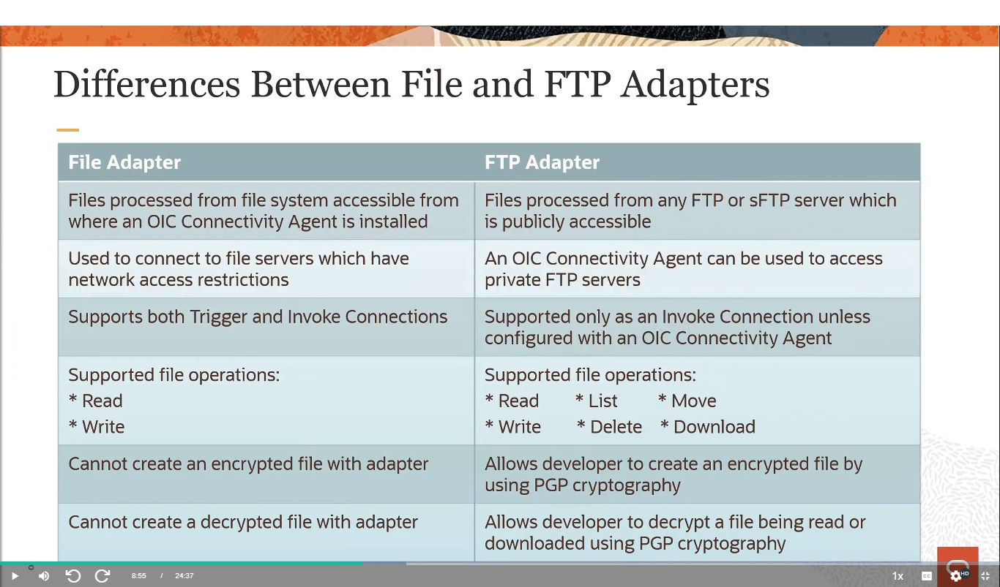

#### SOAP and REST Adapter Options

    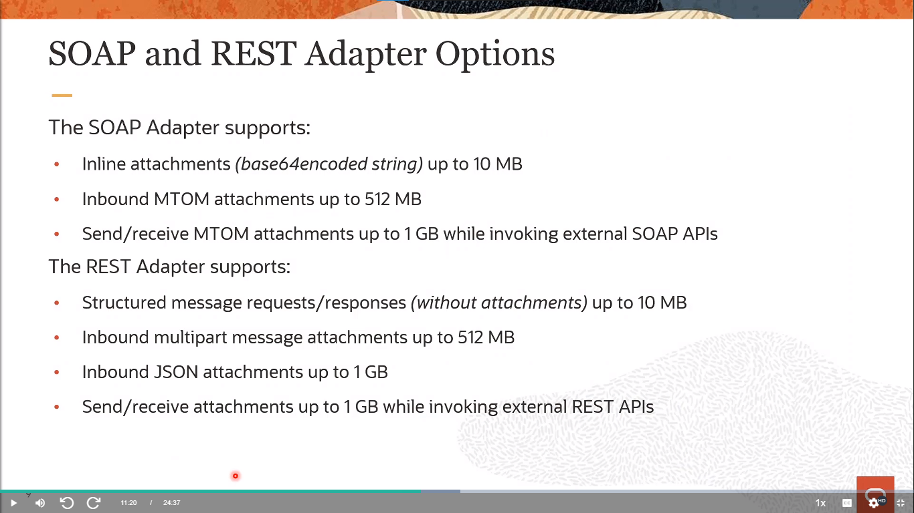

#### Stage File Action Operations Summary

    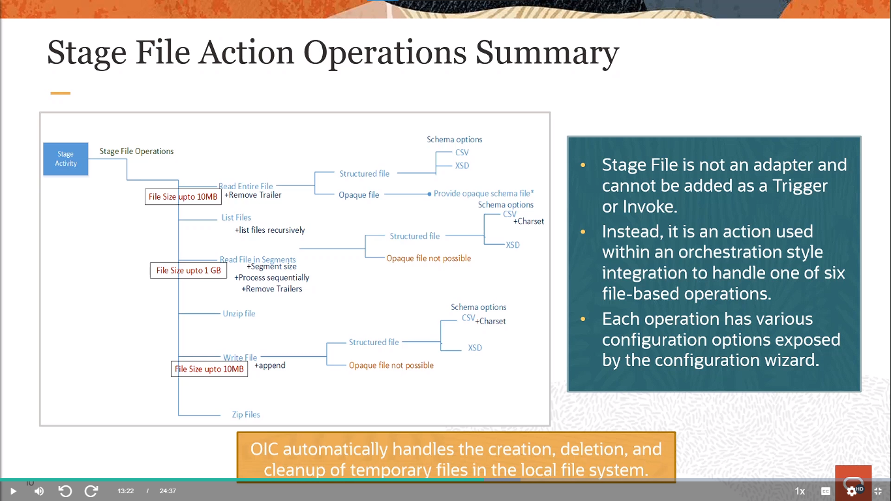

#### Stage File Action

    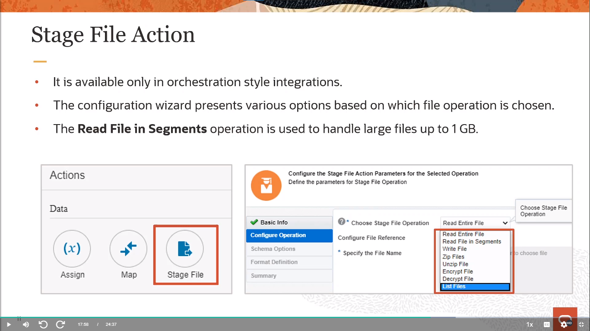

#### Fil-Based Mapper Functions

    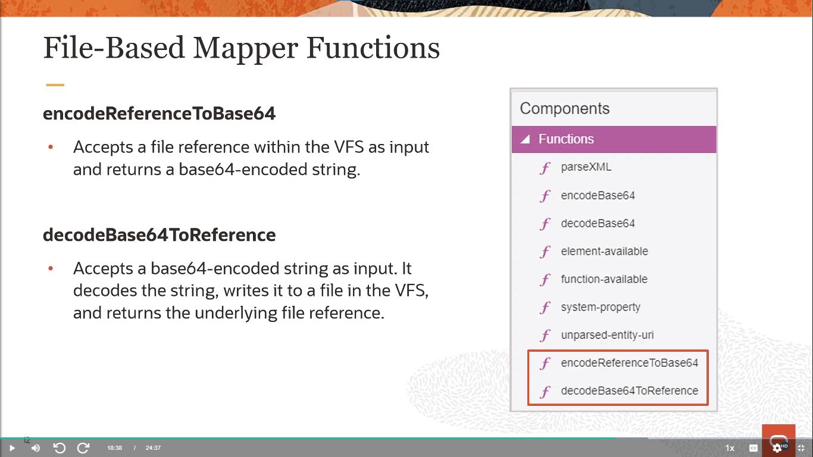

#### Scheduled Orchestration Parameters

    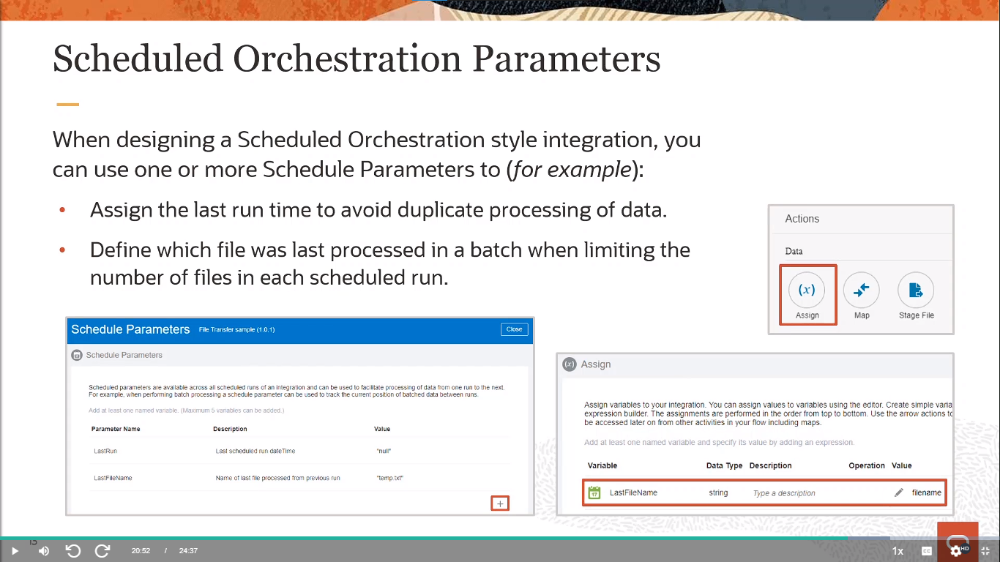

#### File Sizes Support Summary

    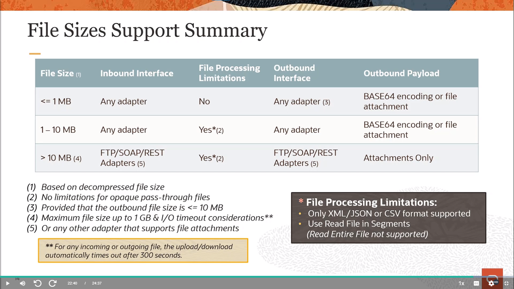

