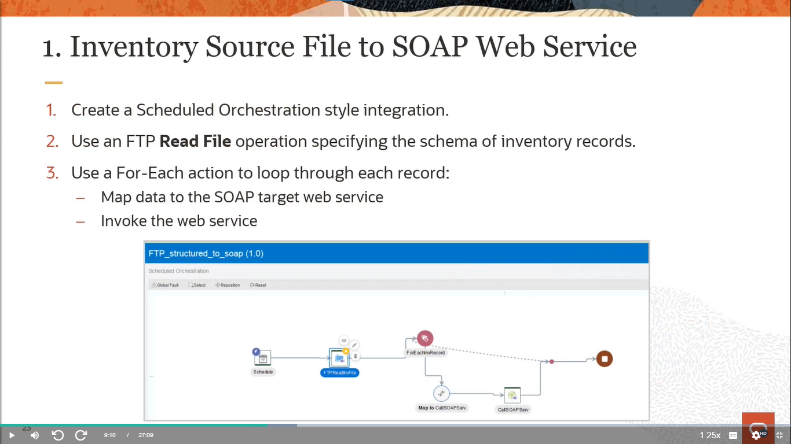

# Become An Application Integration Professional (2023) - Parte 7

## Application Integration on Oracle Cloud

### File Handling Concepts and Options - Leveraging Options for Handling Files

#### Integration Style Options

    

#### OIC Toolls and Options for File Handling

    

#### File Adapter Options Summary

    

#### FTO Adapter Options Summary

    

#### Differences Between File and FTP Adapters

    

#### SOAP and REST Adapter Options

    

#### Stage File Action Operations Summary

    

#### Stage File Action

    

#### Fil-Based Mapper Functions

    

#### Scheduled Orchestration Parameters

    

#### File Sizes Support Summary

    

### File Handling Concepts and Options - Reviewing Example Solutions for Files

#### How to Read a Structured File?

    

#### How to Process Large Files? (up to 1 GB)

    

#### How to Decrypt and Encrypt Files?

    

#### How to Read/Write Native File Formats?

    

#### Using the Native Format Builder Wizard

    

#### Inventory Source File to SOAP Web Service

    

#### PDF File to SOAP Service as MTOM Attachment

    

#### HDL File to Oracle HCM as Inline Attachment

    

#### Images From Zip File Uploaded to a REST Service

    

#### Read Large File & Process All Records to ERP

    

#### Aggregate Records Into Local File & Transfer to FTP

    

#### OIC Design/Modeling Considerations for Fusion Apps

    

#### Inbound FTP <= 1 MB / Outbound <= 10 MB

    

#### Inbound FTP <= 10 MB / Outbound <= 10 MB

    

#### Inbound FTP > 10 MB / Outbound > 10 MB

    

#### Inbound REST <= 10 MB / Outbound <= 10 MB

    

#### Inbound REST > 10 MB / Outbound <= 10 MB

    

#### Response file > 10 MB / Outbound > 10 MB

    

# [Parte 8](./Notas_8.md)