# Become An Application Integration Professional (2023) - Parte 8

## Application Integration on Oracle Cloud

### Orchestration Scopes and Fault Handling - Understanding Scope Containers & Using Fault Handlers

#### Scope Containers

    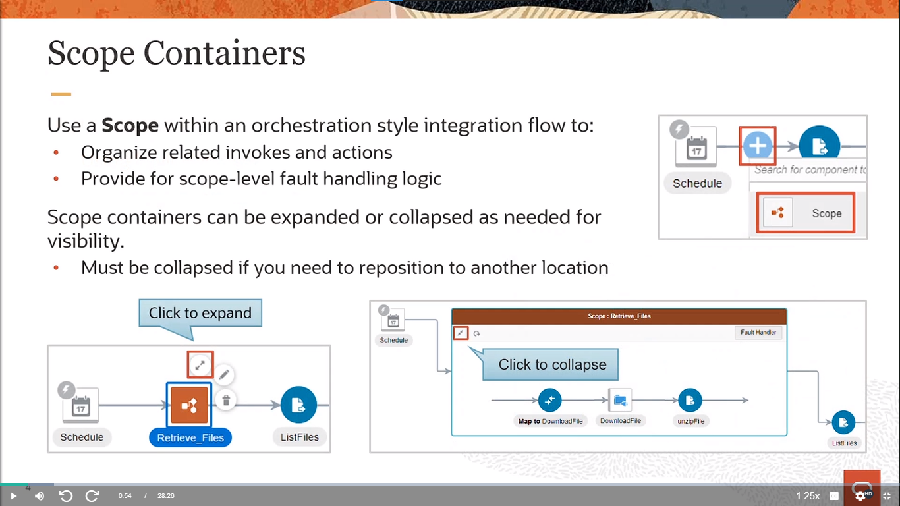

**Administra un Grupo de Acciones y Manejadores de Fallos con una Acción de Ámbito**

Puedes administrar un grupo de acciones con una acción de ámbito. La acción de ámbito es esencialmente una colección de acciones secundarias e invocaciones que pueden tener sus propios manejadores de fallos. La acción de ámbito proporciona el contexto de comportamiento para los elementos secundarios. Los elementos definidos en el ámbito principal tienen visibilidad local dentro de este ámbito. Todo lo que puedes hacer en una integración, como diseñar invocaciones, mapeos y acciones, se puede hacer en una acción de ámbito.

#### Nested Scopes

    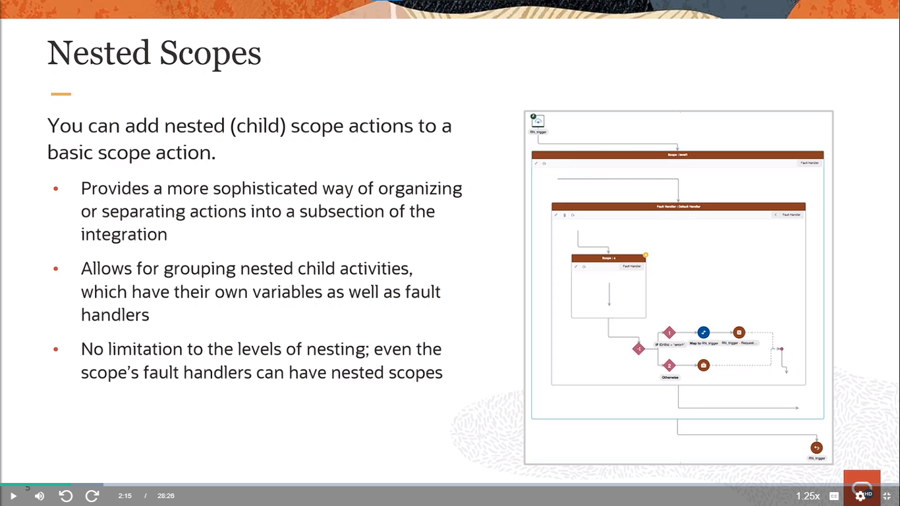

**Agregar Ámbitos Anidados a una Acción de Ámbito**

Puedes agregar acciones de ámbito anidadas (hijas) a una acción de ámbito básica. Esto proporciona una manera más sofisticada de organizar o separar acciones en una subsección de la integración. Un ámbito anidado proporciona las siguientes capacidades:

- Se comporta de la misma manera que un ámbito básico. Proporciona su propio contenedor de acciones secundarias y manejadores de fallos.
- No hay limitación en los niveles de anidamiento. Incluso los manejadores de fallos de un ámbito pueden tener ámbitos anidados.

Para configurar:

1. Arrastra un ámbito dentro de un ámbito existente.
2. Agrega acciones y manejadores de fallos al ámbito anidado, según sea necesario.

#### Scope Context Considerations

    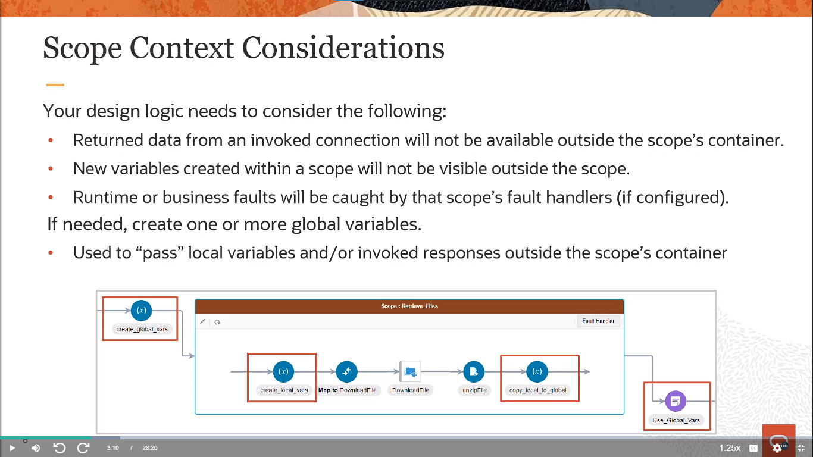

#### Faults In Integration Flows

    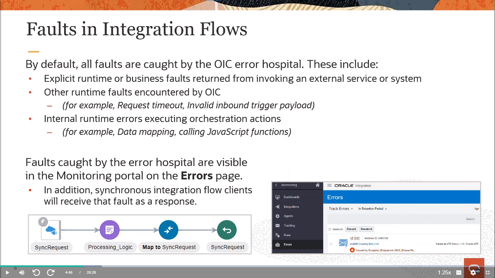

#### Designing Beyond the "Happy Path"

    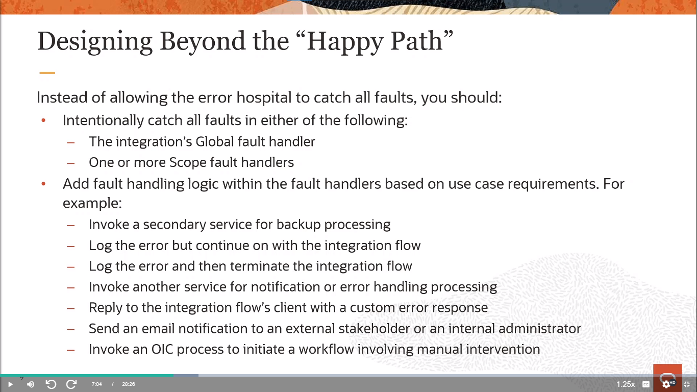

#### Global Fault Handler

    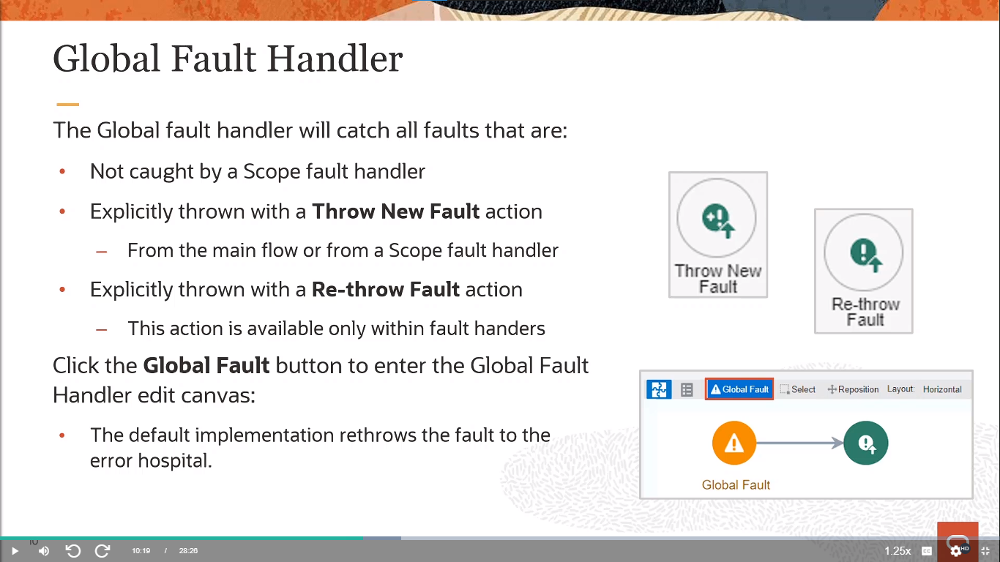

**Agregar Manejo Global de Fallos a Integraciones Orquestadas**

Puedes agregar manejo global de fallos a integraciones orquestadas. Esta funcionalidad te permite dirigir los fallos comerciales de vuelta al llamante o aplicar lógica comercial antes de enviar los fallos al marco de manejo de errores. Puedes agregar manejo de fallos a cualquier tipo de integración (por ejemplo, asíncrona, síncrona o `programada de enviar y olvidar/scheduled fire-and-forget ` [sin respuesta esperada]).

El desencadenante inicial en tu integración está automáticamente conectado a una acción inicial de **Hospital de Errores/Error Hospital** que no puede ser eliminada. Sin embargo, puedes agregar y eliminar otras acciones de **Hospital de Errores**. La acción de **Hospital de Errores** no responde de vuelta al desencadenante. En cambio, los detalles recopilados por la acción de **Hospital de Errores** se envían al marco de manejo de errores.

#### Fault Handling Logic

    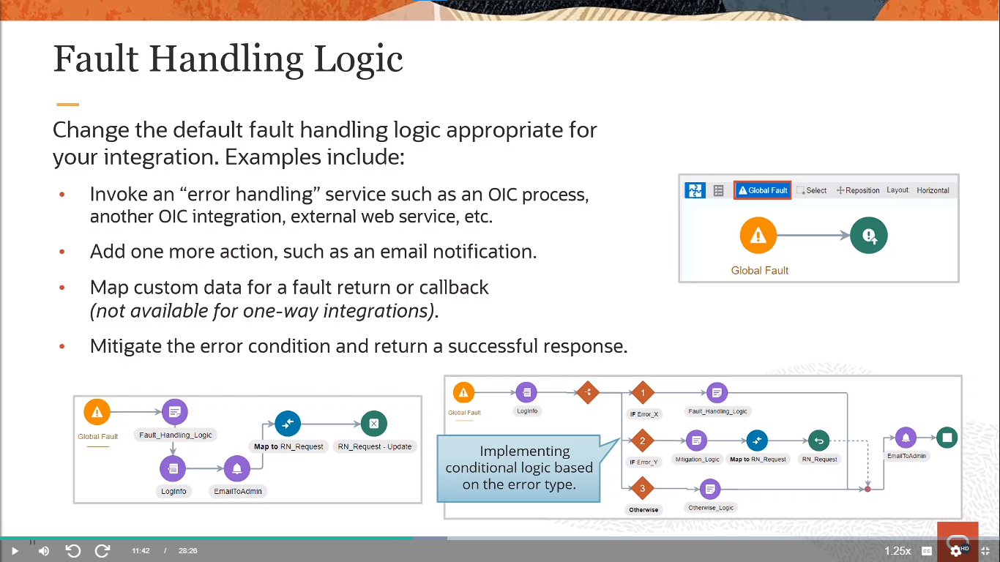

Además de los manejadores de fallos a nivel de ámbito, existe un **manejador de fallos global/Global fault handler** disponible a nivel general del flujo de integración, que actúa como un bloque de captura principal. Cualquier error no manejado en los ámbitos internos o errores encontrados en bloques no relacionados con ámbitos se elevan hasta este manejador de fallos global.

#### Defining How to End the Integration Flow

    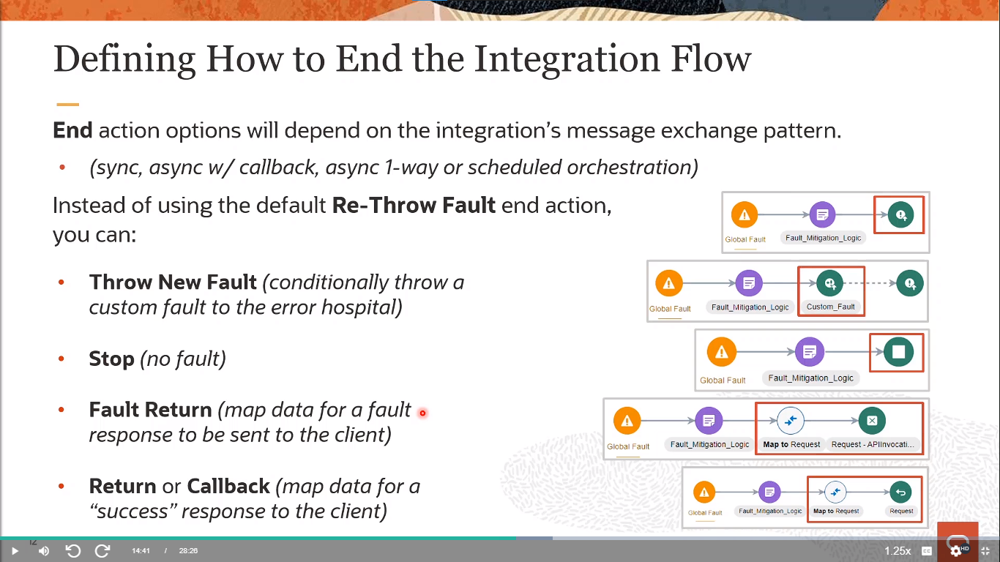

**Captura Fallos con una Acción de Re-lanzamiento de Fallos**

Puedes enviar mensajes fallidos al hospital de errores para un análisis adicional con una acción de re-lanzamiento de fallos. Si la integración contiene un fallo global definido, el error capturado por la acción de re-lanzamiento de fallos se envía a través del manejador de fallos global y luego opcionalmente al hospital de errores para análisis. Si no se define ningún fallo global, el fallo se envía directamente al hospital de errores para análisis. La acción de re-lanzamiento de fallos opera como un bloque de captura general y se procesa si se lanza un fallo por una acción de invocación en el ámbito. Sin embargo, la acción de re-lanzamiento de fallos no tiene un nombre específico para capturarla.

#### Scope Fault Handlers

    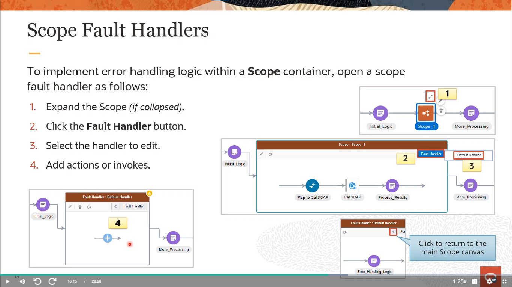

#### Additional Fault Handlers

    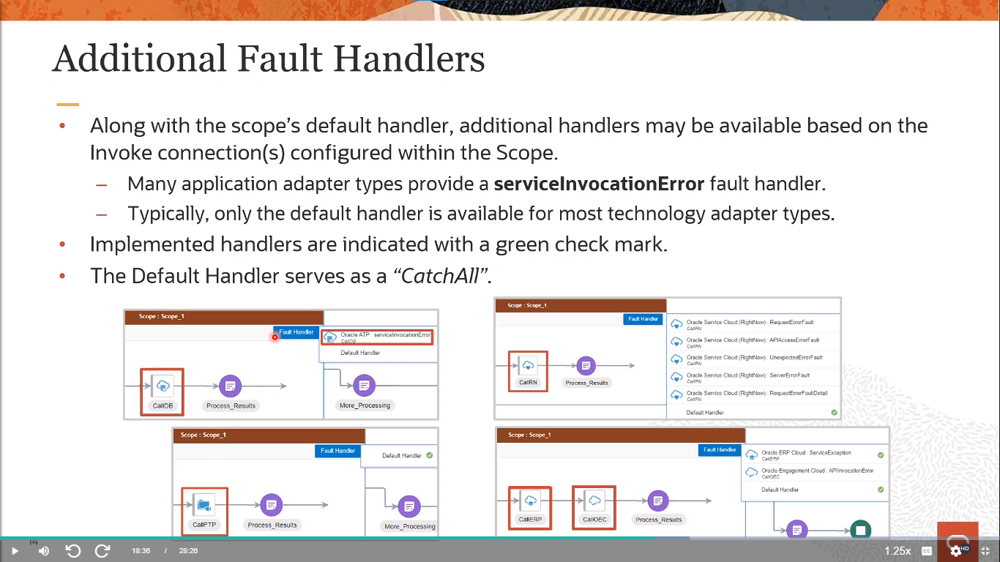

**Manejadores de Fallos dentro de una Acción de Ámbito**

Cuando agregas invocaciones a un ámbito, los fallos nombrados asociados con las invocaciones se agregan para ser seleccionados en la sección de **Manejador de Fallos/Fault Handler** del ámbito. Estos son fallos que la aplicación invocada podría devolver. La unicidad de los fallos nombrados está definida por el nombre cualificado (qname) del fallo. Si hay múltiples invocaciones que definen el fallo qname, el fallo (en tiempo de ejecución) puede responder a cualquier invocación. Las diversas invocaciones no pueden diferenciarse si sus qnames no son únicos. En estos casos, es mejor separar las invocaciones en contenedores de ámbito diferentes.

> [!NOTE]
> Los ámbitos pueden tener manejadores de fallos en los cuales se pueden capturar y volver a lanzar fallos específicos. Sin embargo, en el caso de las invocaciones basadas en agentes de conectividad, los manejadores de fallos nombrados no se ejecutan. Todo el manejo de fallos debe hacerse en el manejador de fallos predeterminado.

#### Catching Faults

    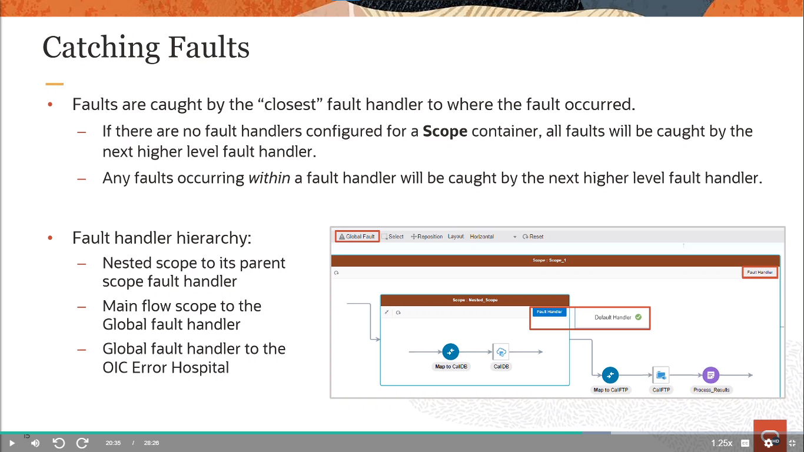

#### Fault Mitigation

    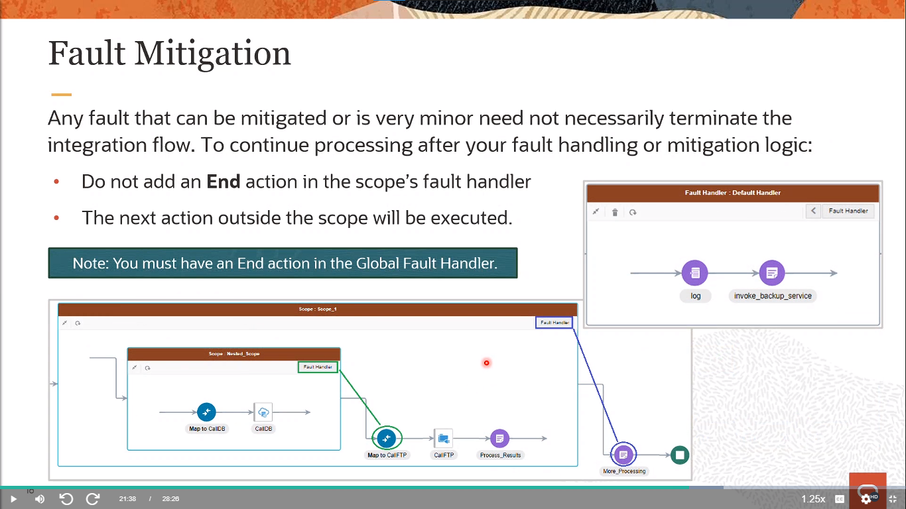

#### Adding Scopes Inside of Fault Handlers

    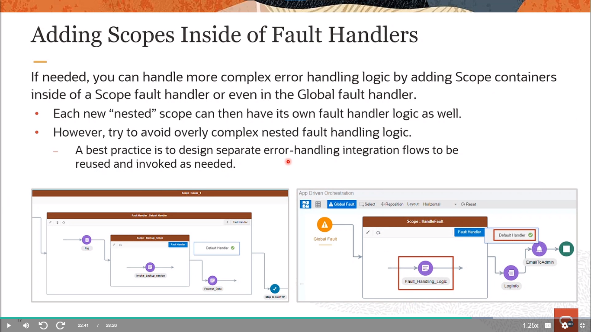

#### Accessing Fault Information

    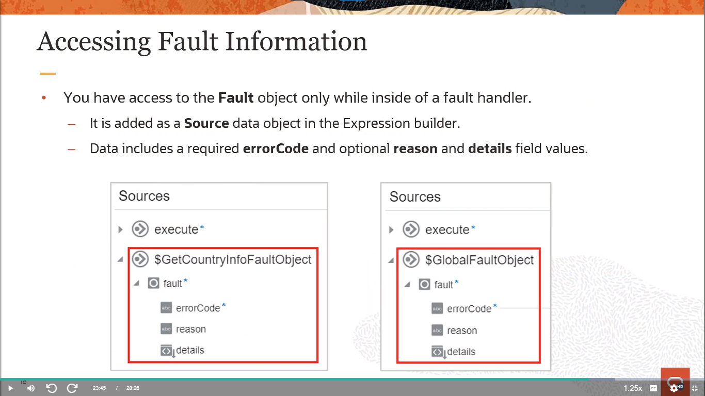

#### Leveraging the Throw New Fault Action

    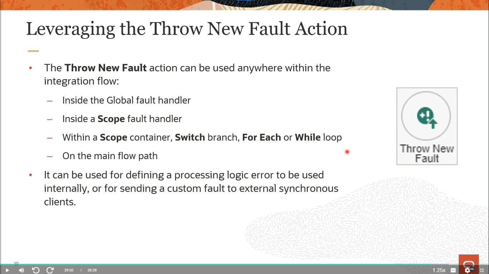

Puedes crear y lanzar tus propios fallos en una integración con una acción de **throw new fault**. Durante la configuración de esta acción, defines la condición bajo la cual lanzar el fallo y el punto en la integración en el que lanzarlo. Puedes agregar esta acción al final de un bloque (por ejemplo, una acción **for-each**, una acción **switch**, etc.). Nada puede estar después de esta acción en el bloque a menos que se configure una condición de salto (skip condition).

1. En el lado derecho del lienzo, haz clic en **Acciones** para expandir la paleta o coloca tu cursor en el lugar adecuado en la integración y haz clic en el signo más (**+**) para invocar el menú en línea.
2. Arrastra el icono de **Throw New Fault** dentro de la integración o selecciónalo del menú en línea. Se mostrará el cuadro de diálogo Crear Acción.
3. Ingresa un nombre y descripción para la acción, luego haz clic en Aceptar. Se mostrará la página Throw New Fault.
4. Define la acción:
   - **Código:** Haz clic en el icono de Editar para crear una expresión en el Constructor de Expresiones. Este campo es obligatorio.
   - **Razón:** Haz clic en el icono de Editar para definir una razón para el error en el Constructor de Expresiones.
   - **Detalles:** Haz clic en el icono de Editar para definir detalles adicionales del error en el Constructor de Expresiones.
   - **Condición de Salto:** Define una condición para evitar que el fallo sea lanzado en la versión de Condición de Salto del Constructor de Expresiones.

#### Configuring the Throw New Fault Action

    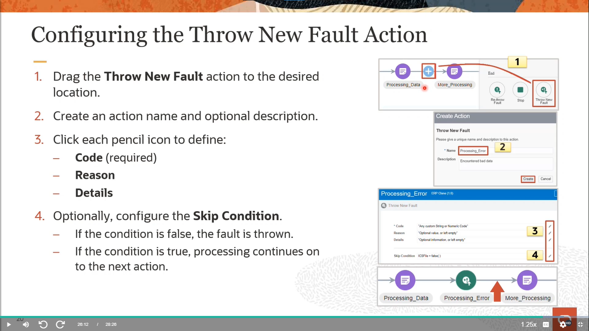

#### Skip Condition Considerations

    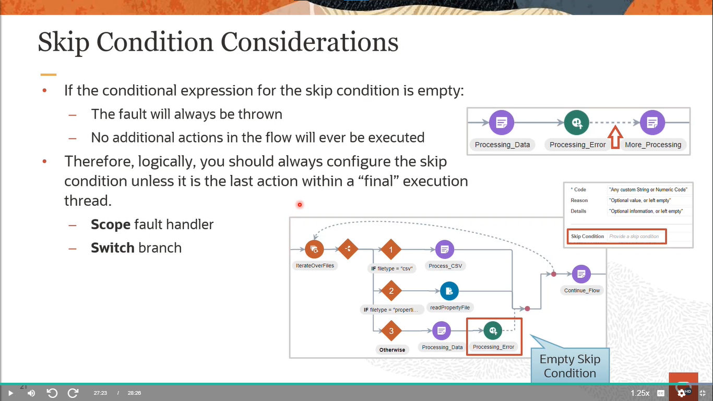

### Orchestration Scopes and Fault Handling - Managing Failed Instances

#### Resubmitting Failed Instances

    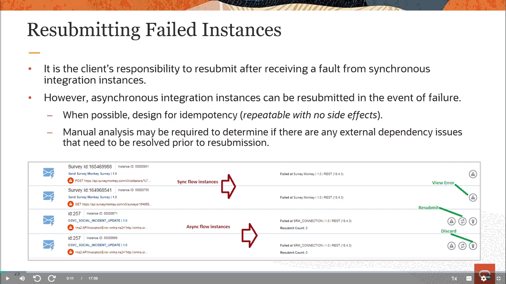

Las instancias de flujo asíncrono pueden ser reenviadas en caso de fallo. Tales instancias con fallos están disponibles para ser reenviadas durante el período de retención en OIC. Pueden ser seleccionadas desde la página de errores de la consola de monitoreo de OIC (o también desde otras vistas). Estas instancias pueden ser descartadas o reenviadas.

Una instancia de flujo puede ser seleccionada y reenviada desde esta vista de monitoreo. Ten en cuenta que cuando una instancia es reenviada, comenzará la ejecución desde el principio del flujo. Se debe tener cuidado al diseñar flujos asíncronos para asegurar que las actividades en el flujo sean repetibles sin efectos secundarios (idempotentes).

Por ejemplo, si hay una necesidad de una actividad de inserción en la base de datos dentro del flujo, asegúrate de que no se creen registros duplicados en la base de datos. Una forma de lograr esto es envolviendo la actividad de inserción en la base de datos dentro de un ámbito, y permitir que un manejador de errores a nivel de ámbito maneje con gracia el error de "Violación de Restricción Única de la Base de Datos".

También puedes realizar reenvíos en masa. Usando la consola de monitoreo, puedes buscar instancias de flujo con errores por tiempo, duración, tipo de error, nombre de integración y otros criterios. La consola de monitoreo de OIC permite seleccionar todas esas instancias de flujo y reenviarlas en masa.

#### Extended Error Handling

    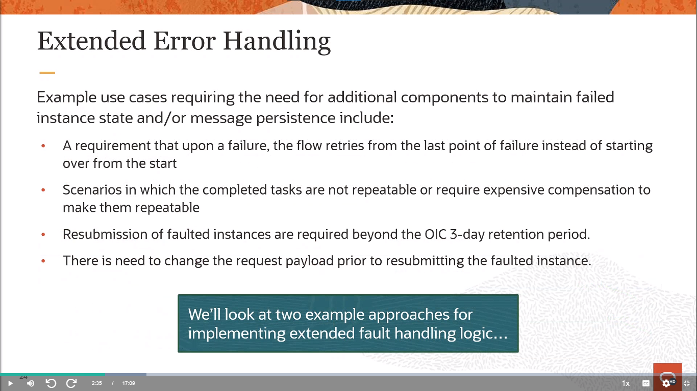

En la mayoría de los casos de uso, es posible modelar los flujos de integración como una serie de pasos repetibles de manera segura. Tales flujos pueden aprovechar al máximo las características integradas de manejo de errores y monitoreo que hemos visto hasta ahora.

Sin embargo, puede haber algunos casos de uso donde haya necesidad de un manejo de errores personalizado, que requiera componentes adicionales para mantener el estado de la instancia y persistir los mensajes. Ejemplos de casos de uso son los siguientes:

- El caso de uso requiere que en el reenvío, el flujo vuelva a intentarlo desde el último punto de fallo.
- Las tareas completadas no son repetibles o requieren compensaciones costosas para hacerlas repetibles.
- Se requieren las instancias con fallos más allá del período de retención de OIC para reenviarlas.
- Hay necesidad de cambiar los payloads al reenviar la instancia con fallos.

Información adicional está disponible en Oracle A-Team Chronicles:

- [error-handling](https://www.ateam-oracle.com/post/error-handling-guide-oracle-integration-cloud)
- [advanced-error-handlig](https://www.ateam-oracle.com/post/advanced-error-handling-and-scheduling-best-practices-oracle-integration-cloud)

#### Parking Lot Pattern

    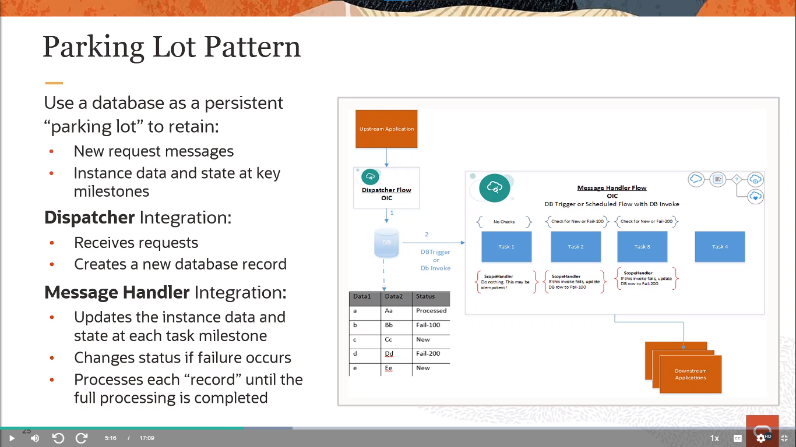

Esta solución utiliza el popular patrón de "Parking Lot" como base para implementar el manejo de errores y habilitar reenvíos desde el punto de falla. Este diseño extendido de manejo de errores implica el uso de una tabla de base de datos para el seguimiento del estado y el almacenamiento de metadatos relacionados con el payload que se procesa. En su forma más simple, puede implementarse utilizando una tabla de estacionamiento o tabla de etapas en una base de datos, y dos flujos de integración, como se muestra en el gráfico en la diapositiva.

> [!NOTE]
> El gráfico representa una base de datos de forma genérica. Podría estar respaldado por diferentes implementaciones de bases de datos según el caso de uso. Si los puntos finales de la integración son principalmente locales, entonces la base de datos podría ser una base de datos local. Si son principalmente en la nube, se podría usar Oracle ATP o Oracle DBCS. La elección depende de la arquitectura y el caso de uso específico.

La integración del Despachador es responsable de recibir mensajes para ser procesados desde sistemas fuente aguas arriba y persistirlos en una tabla de Estadios DBaaS como nuevos registros. La tabla de Estadios está diseñada para contener los mensajes de entrada y cualquier metadato adicional con respecto al estado de procesamiento de la instancia.

Un integrador de Manejador de Mensajes consulta periódicamente la tabla de estadios y recupera mensajes de entrada no procesados. Cualquier error durante varias etapas de procesamiento se 'captura' a nivel de ámbito. Los manejadores de errores y el estadio de hito se actualizan en la tabla de estadios. Las siguientes consultas del flujo del manejador de mensajes recuperarán estos registros semiprocesados y los procesarán según los marcadores de hito apropiados.

#### File-based Integrations

    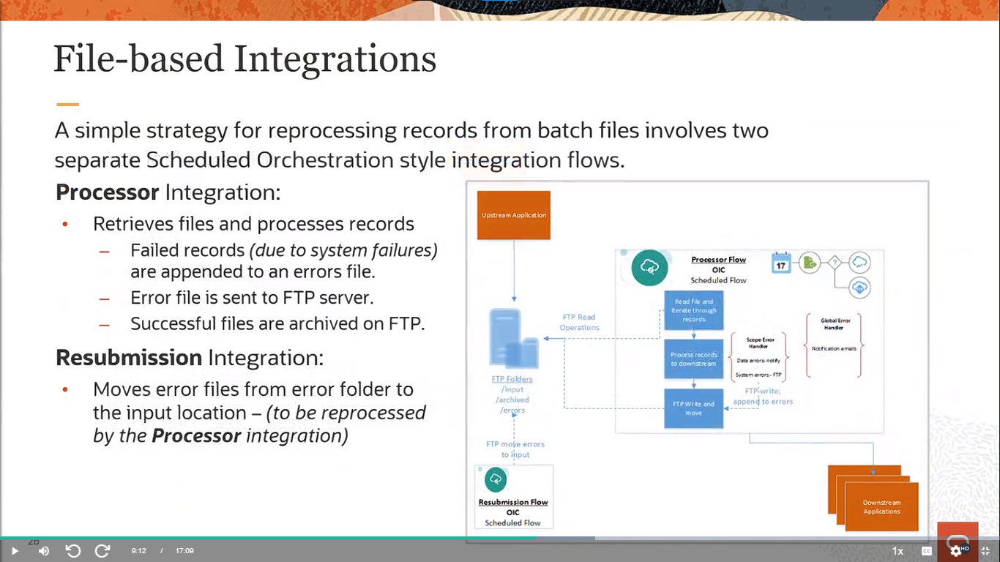

Las interfaces de datos masivos que utilizan archivos a menudo emplean un servidor FTP para el almacenamiento de archivos. Este patrón implementará un manejo de errores simple aprovechando el servidor FTP y permitirá el reprocesamiento de instancias fallidas mediante el uso de múltiples carpetas FTP y operaciones de movimiento entre carpetas utilizando el adaptador FTP.

1. Se utiliza un servidor FTP para recibir archivos de entrada que contienen múltiples registros que serán procesados aguas abajo.
2. Una integración programada recupera los archivos y procesa los registros iterando a través de ellos. Cualquier registro fallido se añade a un archivo de errores en una ubicación separada en el servidor FTP.
3. Después de leer todos los registros del archivo de entrada, este se mueve a un archivo de archivo en el servidor FTP.
4. Un segundo flujo de orquestación programado de reenvío puede simplemente mover los archivos desde la carpeta de errores a la ubicación de entrada para ser reprocesados por el flujo de orquestación principal.

#### Fault Handling Best Practices

    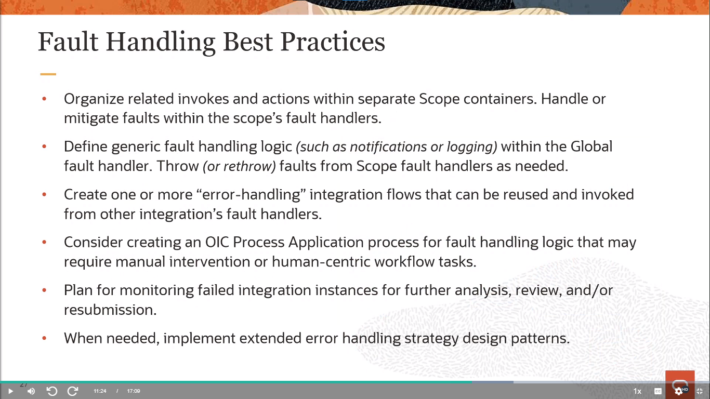

### Orchestration Scopes and Fault Handling - OIC Integration Best Practices

#### OIC Integration Antipatterns

    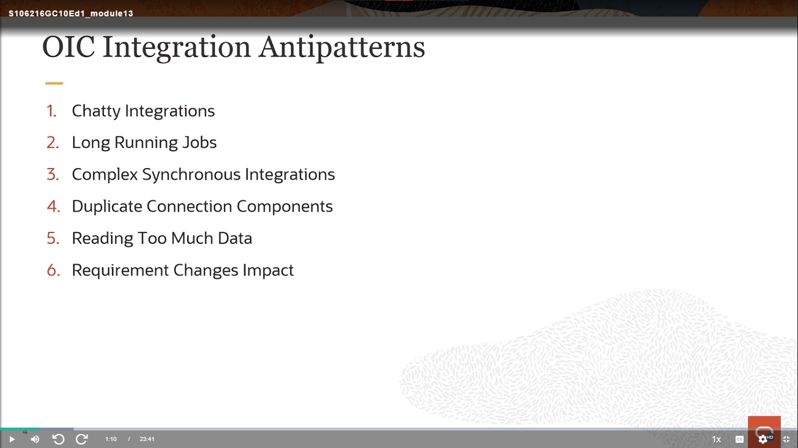

#### Chatty Integrations

    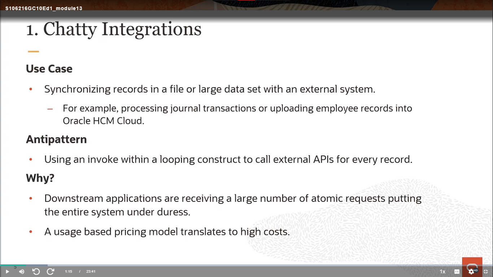

    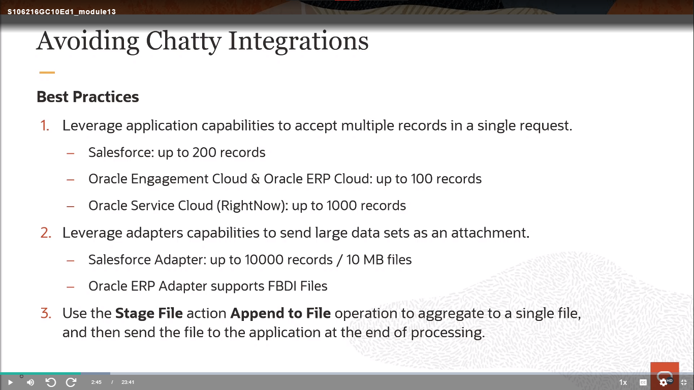

#### Long Running Jobs

    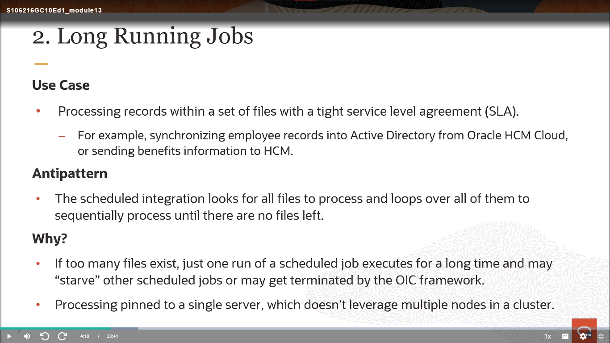

    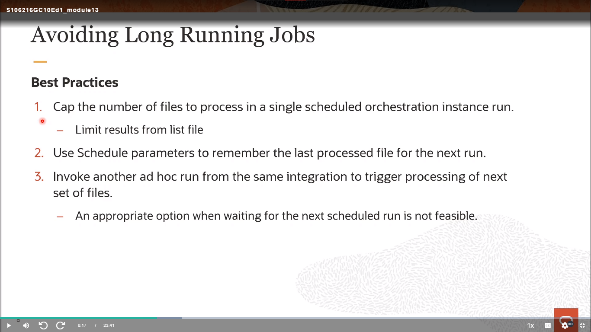

#### Complex Synchronous Integrations

    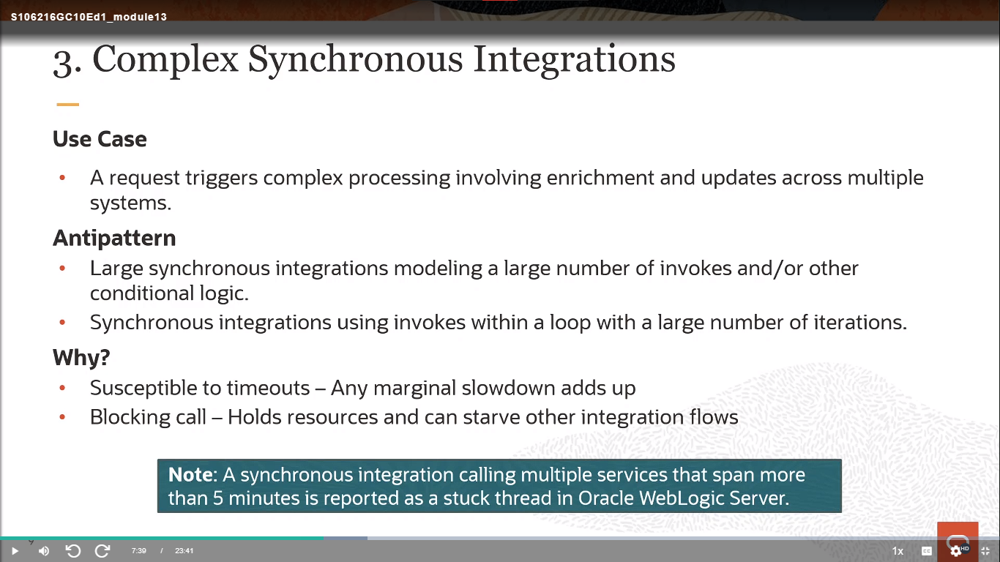

    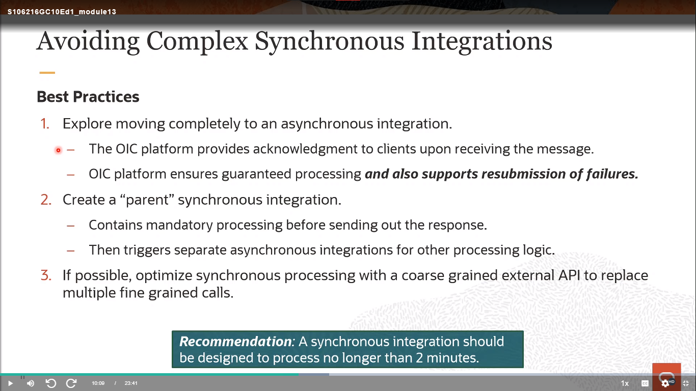

Ten en cuenta las siguientes mejores prácticas al diseñar una integración síncrona que llama a cualquier servicio de solicitud-respuesta asíncrona:

- Llamar a servicios asíncronos de tipo enviar y olvidar (one-way) es aceptable.
- Actualmente, OIC no permite modelar un servicio de solicitud-respuesta asíncrona. Sin embargo, todos los patrones de orquestación programada internamente utilizan una solicitud-respuesta asíncrona. Por lo tanto, una integración síncrona que utiliza una orquestación programada es un anti-patrón.

Una integración síncrona que llama a múltiples servicios que abarcan más de 5 minutos se reporta como un hilo bloqueado en Oracle WebLogic Server.

Puede haber escenarios en los que las invocaciones síncronas desde OIC (incluyendo llamadas a otras integraciones) sean llamadas bloqueantes y deben completarse dentro de 300 segundos. Debido a que la llamada puede involucrar uno o más proxies, cada uno de los proxies puede tener un tiempo de espera similar. Por ejemplo, el proxy predeterminado en Oracle Public Cloud tiene un valor de tiempo de espera de 120 segundos. Si la llamada es a un servicio localizado detrás de un firewall, el proxy configurado también puede tener su propio valor de tiempo de espera. En caso de que se definan tiempos de espera en múltiples capas, la invocación del servicio falla en el primer tiempo de espera.

Ten en cuenta la siguiente mejor práctica al diseñar integraciones de larga duración o que consumen mucho tiempo. No expongas integraciones de larga duración o que consumen mucho tiempo como flujos síncronos. Esta acción puede provocar que las aplicaciones cliente (incluidas otras integraciones) agoten el tiempo de espera. Las integraciones síncronas también tienen un tiempo de espera en el lado del servidor. En su lugar, modela cualquier integración síncrona que tome más de dos minutos como un flujo asíncrono.

#### Duplicate Connection Components

    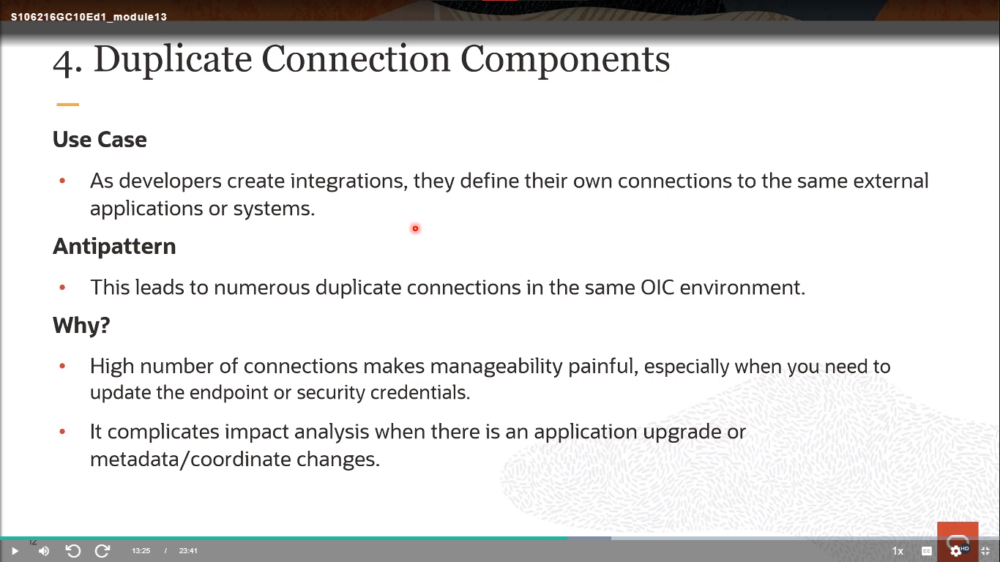

    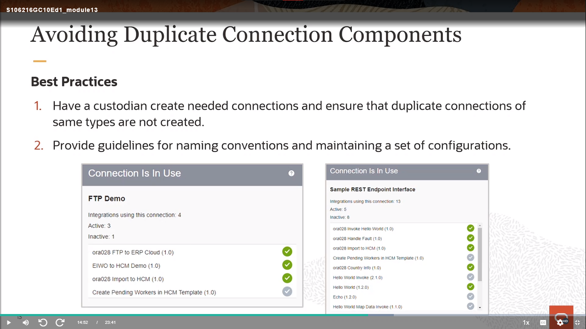

#### Reading Too Much Data

    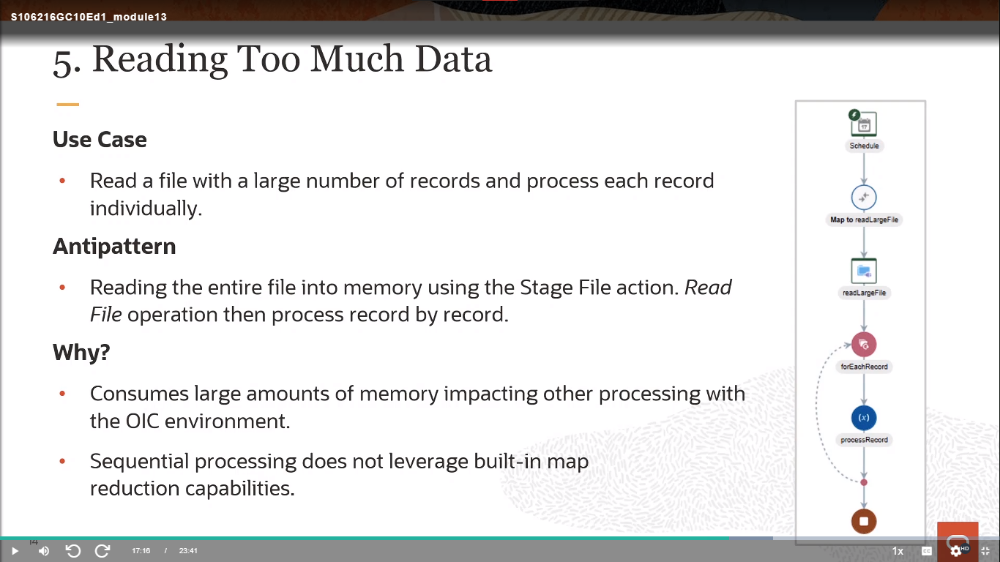

    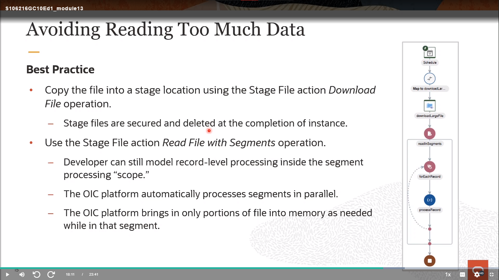

#### Requirement Changes Impact

    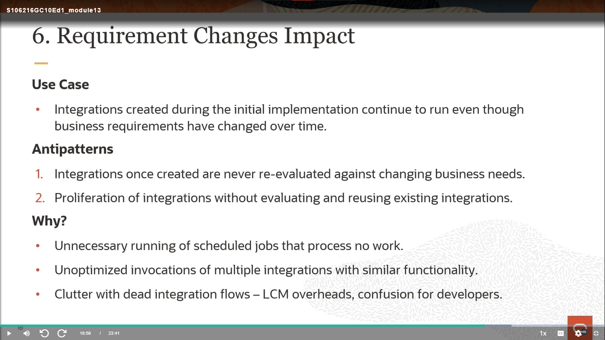

    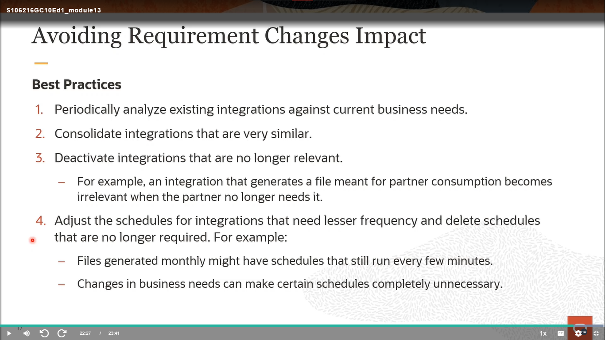

# [Parte 9](./Notas_9.md)