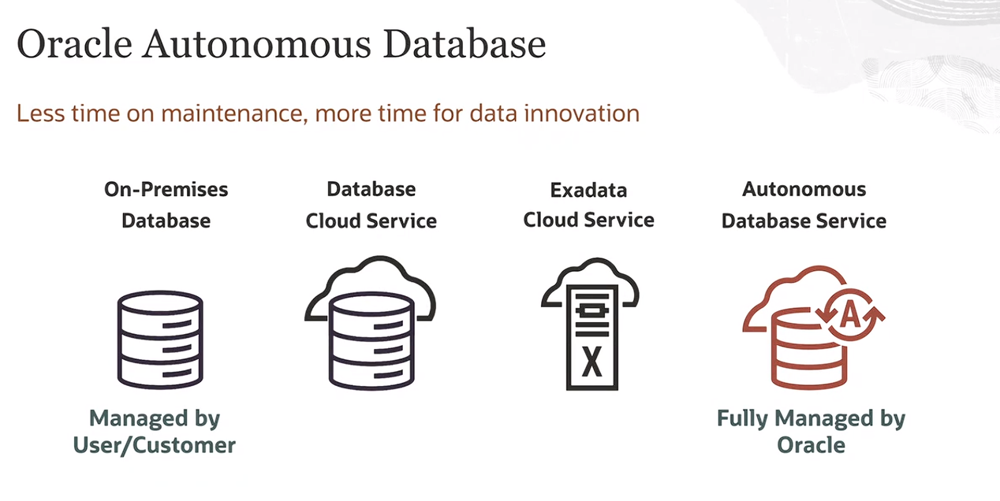
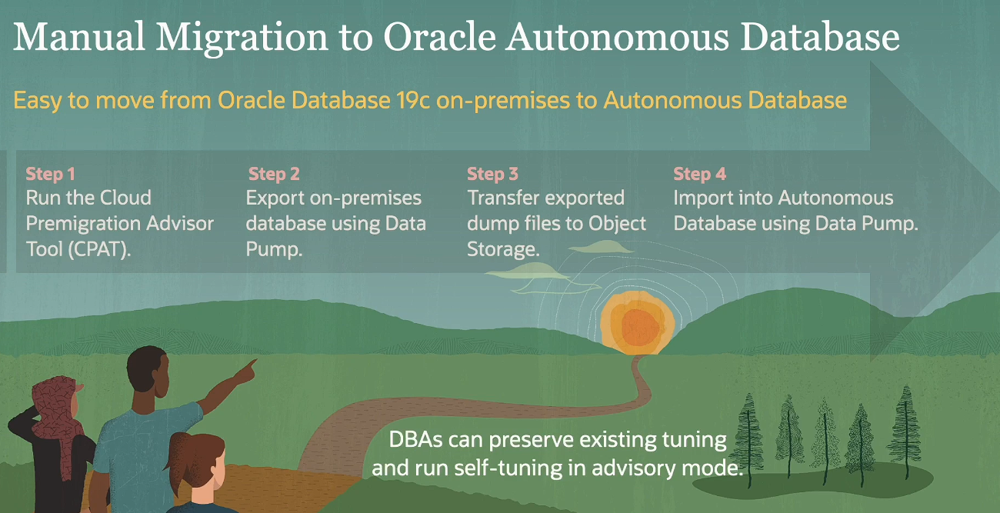
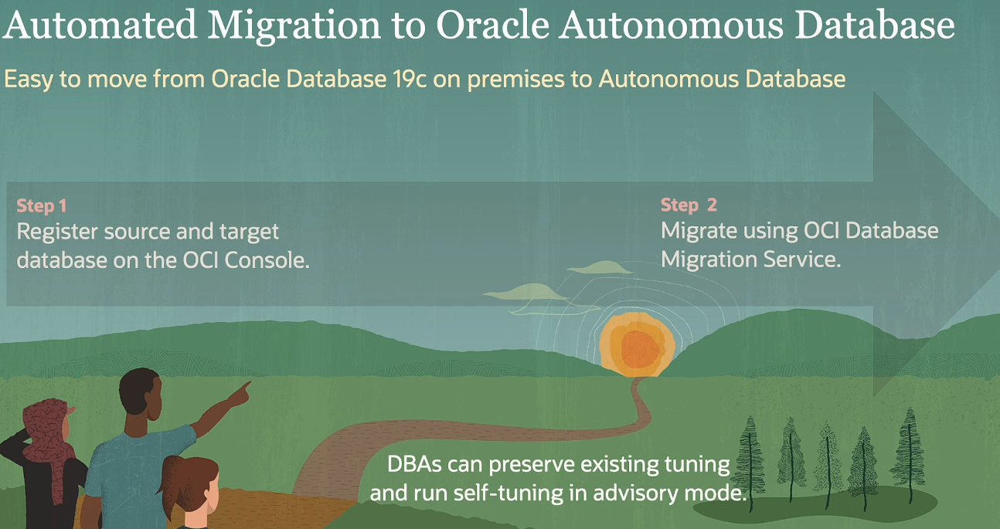
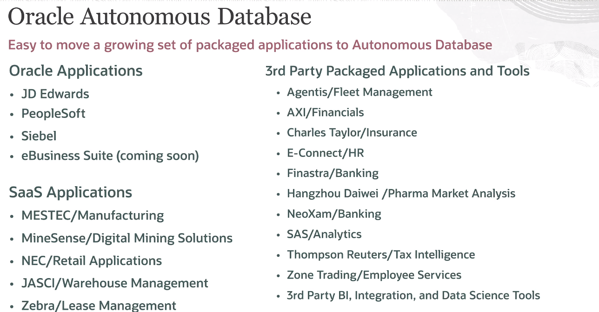
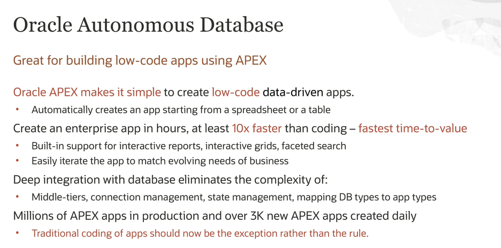
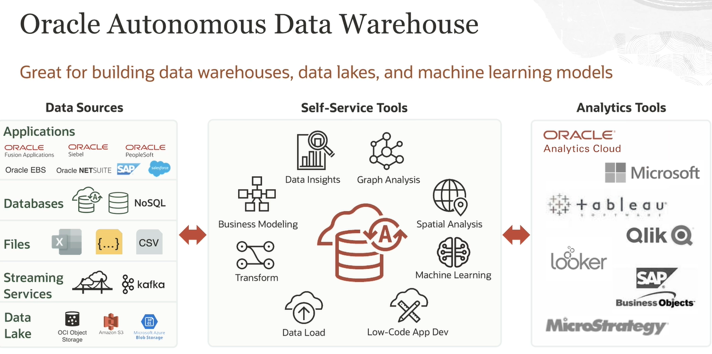
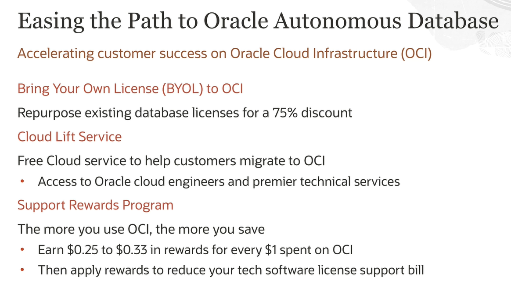

# Oracle Database Offerings

    

La imagen proporciona una comparación de los diferentes tipos de servicios de bases de datos ofrecidos por Oracle:

- **Base de Datos Local (On-Premises Database)**: Este es el tipo más tradicional de base de datos, que se gestiona localmente por el usuario o cliente. Requiere un nivel significativo de mantenimiento y gestión.

- **Servicio de Base de Datos en la Nube (Database Cloud Service) y Servicio de Nube Exadata (Exadata Cloud Service)**: Estos son servicios en la nube que aún requieren cierta medida de gestión por parte del usuario o cliente. Sin embargo, ofrecen la flexibilidad y escalabilidad asociadas con las soluciones en la nube.

- **Servicio de Base de Datos Autónoma (Autonomous Database Service)**: Este servicio es completamente gestionado por Oracle, liberando a los usuarios o clientes del mantenimiento rutinario. Esto permite a los usuarios enfocarse más en la innovación y el uso estratégico de los datos.

Oracle ofrece una gama de servicios de bases de datos, desde soluciones locales hasta bases de datos autónomas completamente gestionadas. Cada servicio tiene sus propias ventajas y puede ser adecuado para diferentes necesidades y contextos. El "Oracle Autonomous Database" se destaca por reducir el tiempo dedicado al mantenimiento y aumentar el tiempo disponible para la innovación en datos. Esto puede ser especialmente beneficioso para las organizaciones que buscan maximizar el valor de sus datos sin la carga del mantenimiento de la base de datos.

---

    

La imagen describe los pasos para la migración manual a Oracle Autonomous Database:

1. **Ejecutar la herramienta Cloud Premigration Advisor (CPAT)**: Esta es la primera etapa del proceso de migración.
2. **Exportar la base de datos local usando Data Pump**: En este paso, se exporta la base de datos existente utilizando la herramienta Data Pump.
3. **Transferir los archivos de volcado exportados al almacenamiento de objetos**: Los archivos de volcado exportados se transfieren al almacenamiento de objetos en este paso.
4. **Importar a la base de datos autónoma usando Data Pump**: Finalmente, los datos se importan a la base de datos autónoma utilizando la herramienta Data Pump.

Además, hay una nota que dice que los administradores de bases de datos pueden preservar la sintonización existente y ejecutar la auto-sintonización en modo de asesoramiento. Esto sugiere que la migración no interfiere con las configuraciones de rendimiento existentes.

---

    

Esta imagen contiene información sobre la "Migración automatizada a Oracle Autónoma Database":

- Es fácil pasar de **Oracle Database 19c local** a **Base de datos autónoma**.
- El proceso de migración implica dos pasos:
   - **Paso 1**: Registre la base de datos de origen y de destino en la Consola OCI.
   - **Paso 2**: Migrar utilizando el Servicio de migración de bases de datos OCI.
- Una nota en la parte inferior indica que los DBA pueden conservar el ajuste existente y ejecutar el autoajuste en modo de asesoramiento.

---

    

---

    

La imagen proporciona información sobre el uso de la base de datos autónoma de Oracle para construir aplicaciones de bajo código con APEX:

- **Oracle APEX**: Es una plataforma que simplifica la creación de aplicaciones de bajo código basadas en datos. Puede crear automáticamente una aplicación a partir de una hoja de cálculo o una tabla.

- **Eficiencia**: Se afirma que las aplicaciones empresariales se pueden crear en horas, lo que es al menos 10 veces más rápido que los métodos de codificación tradicionales.

- **Integración profunda con bases de datos**: Esta característica elimina la complejidad de los niveles intermedios, la gestión de conexiones, la gestión de estados y la asignación de tipos de base de datos a tipos de aplicación.

- **Millones de aplicaciones APEX en producción**: Se crean más de 3000 nuevas aplicaciones APEX todos los días. Sugiere que la codificación tradicional de aplicaciones debería ser ahora la excepción en lugar de la regla.

---

    

---

    

La imagen proporcionada contiene información sobre la base de datos autónoma de Oracle y los servicios relacionados:

- **Accelerating customer success on Oracle Cloud Infrastructure (OCI)**: Sección que habla sobre cómo acelerar el éxito del cliente en OCI.
- **Bring Your Own License (BYOL) to OCI**: Ofrece la opción de reutilizar las licencias de base de datos existentes para obtener un descuento del 75%.
- **Cloud Lift Service**: Un servicio gratuito para ayudar a los clientes a migrar a OCI, incluyendo acceso a ingenieros de la nube de Oracle y servicios técnicos de primer nivel.
- **Support Rewards Program**: Cuanto más se usa OCI, más se ahorra. Ofrece de $0.25 a $0.33 en recompensas por cada $1 gastado en OCI que se puede aplicar para reducir las facturas de soporte de licencias de software técnico.

---