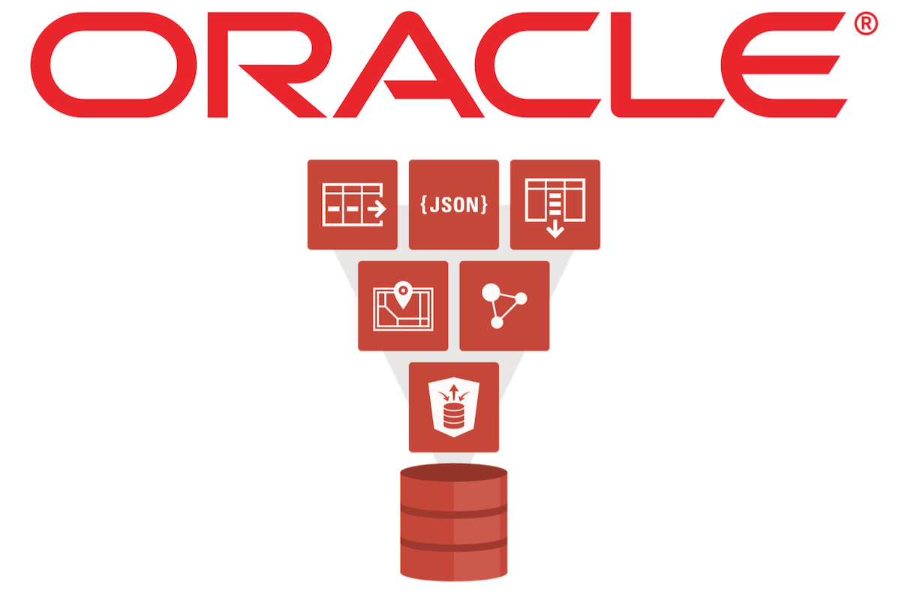

# Aprendiendo Oracle OIC y Oracle DataBase

    

# Nota importante

    

Oracle OIC es un servicio de paga dentro de la nube de Oracle, cuando creamos una cuenta nueva tenemos acceso a casi todas sus funcionalidades y herramientas por `un año`, pero en el caso de `OIC` este tiempo es considerablemente menor, solo se nos ofrecen **_`30 días de prueba`_**. Así que recomiendo que si se quieren hacer pruebas y practicar con la herramienta se debe tomar muy en cuenta esta restricción.

Por lo mismo muchas partes prácticas seran tomadas directamente de videos de youtube que ejemplifiquen/complementen el tema visto.

# Índice

## Oracle OIC: Gen 2

### 1. <a href="./OIC_GEN_2/1_Introduccion.md">Introducción</a>

### 2. <a href="./OIC_GEN_2/2_Componentes.md">Componentes en OIC</a>

- <a href="./OIC_GEN_2/2_Componentes.md/#adaptadores-en-oic">Adaptadores</a>
- <a href="./OIC_GEN_2/2_Componentes.md/#agentes-en-oic">Agentes</a>
- <a href="./OIC_GEN_2/2_Componentes.md/#conexiones-en-oic">Conexiones</a>
- <a href="./OIC_GEN_2/2_Componentes.md/#lookups-en-oic">Lookups</a>
- <a href="./OIC_GEN_2/2_Componentes.md/#bibliotecas-paquetes-y-javascript-en-oic">Bibliotecas y Paquetes</a>
- <a href="./OIC_GEN_2/2_Componentes.md/#integraciones-en-oracle-integration-cloud-oic">Integraciones</a>

### 3. <a href="./OIC_GEN_2/3_Patrones_Int.md">Patrones de Integración en OIC</a>

- <a href="./OIC_GEN_2/3_Patrones_Int.md/#orquestación-impulsada-por-aplicaciones">Orquestación Impulsada por Aplicaciones</a>
- <a href="./OIC_GEN_2/3_Patrones_Int.md/#orquestación-programada">Orquestación Programada</a>
- <a href="./OIC_GEN_2/3_Patrones_Int.md/#transferencia-de-archivos">Transferencia de Archivos</a>
- <a href="./OIC_GEN_2/3_Patrones_Int.md/#enrutamiento-básico">Enrutamiento Básico</a>
- <a href="./OIC_GEN_2/3_Patrones_Int.md/#publicar-en-oracle-integration-cloud">Publicar en Oracle Integration Cloud</a>
- <a href="./OIC_GEN_2/3_Patrones_Int.md/#suscribirse-a-oracle-integration-cloud">Suscribirse a Oracle Integration Cloud</a>
- <a href="./OIC_GEN_2/3_Patrones_Int.md/#demo-creación-de-una-integración">Demo 📺: creación de una integración</a>

### 4. <a href="./OIC_GEN_2/4_Ejemplos_Practicos.md">Ejemplos Practicos</a>

1. [¿Cómo ejecutar la integración? Integración de programación y basada en aplicaciones](./OIC_GEN_2/4_Ejemplos_Practicos.md/#¿cómo-ejecutar-la-integración-integración-de-programación-y-basada-en-aplicaciones)
2. [¿Cómo crear una conexión en OIC? ¿Cuándo utilizar el Agente en Conexión?](./OIC_GEN_2/4_Ejemplos_Practicos.md/#¿cómo-crear-una-conexión-en-oic-¿cuándo-utilizar-el-agente-en-conexión)
3. [Adaptador, paquete, bibliotecas, agente y lookup en OIC](./OIC_GEN_2/4_Ejemplos_Practicos.md/#adaptador-paquete-bibliotecas-agente-y-lookup-en-oic)
4. [Descripción general de la página de integración de Oracle | Elementos de la integración de Oracle | ¿Cómo manejar la excepción?](./OIC_GEN_2/4_Ejemplos_Practicos.md/#descripción-general-de-la-página-de-integración-de-oracle--elementos-de-la-integración-de-oracle--¿cómo-manejar-la-excepción)
5. [Cree su primera integración de orquestación programada en OIC | Crear integración en OIC](./OIC_GEN_2/4_Ejemplos_Practicos.md/#cree-su-primera-integración-de-orquestación-programada-en-oic--crear-integración-en-oic)
6. [Cree su primera integración de orquestación basada en aplicaciones | Crear integración en OIC](./OIC_GEN_2/4_Ejemplos_Practicos.md/#cree-su-primera-integración-de-orquestación-basada-en-aplicaciones--crear-integración-en-oic)
7. [Crear integración con parámetro | Cómo crear una integración impulsada por aplicaciones con parámetros](./OIC_GEN_2/4_Ejemplos_Practicos.md/#crear-integración-con-parámetro--cómo-crear-una-integración-impulsada-por-aplicaciones-con-parámetros)
8. [Crear integración con request payload | Cómo crear una integración impulsada por aplicaciones con solicitud](./OIC_GEN_2/4_Ejemplos_Practicos.md/#crear-integración-con-request-payload--cómo-crear-una-integración-impulsada-por-aplicaciones-con-solicitud)
9. [Crear integración en oic para obtener solicitud y devolver la respuesta | Solicitud y Respuesta en OIC](./OIC_GEN_2/4_Ejemplos_Practicos.md/#crear-integración-en-oic-para-obtener-solicitud-y-devolver-la-respuesta--solicitud-y-respuesta-en-oic)
10. [Cree una integración para obtener dos números como solicitud y devolver la suma de ambos num en respuesta](./OIC_GEN_2/4_Ejemplos_Practicos.md/#cree-una-integración-para-obtener-dos-números-como-solicitud-y-devolver-la-suma-de-ambos-num-en-respuesta)
11. [Assing en Oracle Integration: cómo crear una variable en oic | Crear variable local en oic](./OIC_GEN_2/4_Ejemplos_Practicos.md/#assing-en-oracle-integration-cómo-crear-una-variable-en-oic--crear-variable-local-en-oic)
12. [Data Stitch en Oracle Integration: cómo crear una variable global en oic | Variable global en oic](./OIC_GEN_2/4_Ejemplos_Practicos.md/#data-stitch-en-oracle-integration-cómo-crear-una-variable-global-en-oic--variable-global-en-oic)
13. [Switch en OIC | Crear integración para comprobar que no es positivo o negativo | if else](./OIC_GEN_2/4_Ejemplos_Practicos.md/#switch-en-oic--crear-integración-para-comprobar-que-no-es-positivo-o-negativo--if-else)
14. [Crear integración de calculadora usando Switch en la integración de Oracle | Implementar if else en oic](./OIC_GEN_2/4_Ejemplos_Practicos.md/#crear-integración-de-calculadora-usando-switch-en-la-integración-de-oracle--implementar-if-else-en-oic)
15. [Scope: Manejo de excepciones en la integración de Oracle | Cómo manejar la excepción](./OIC_GEN_2/4_Ejemplos_Practicos.md/#scope-manejo-de-excepciones-en-la-integración-de-oracle--cómo-manejar-la-excepción)
16. [Global Fault Handler: manejo de excepciones en la integración de Oracle | Cómo manejar la excepción en oic](./OIC_GEN_2/4_Ejemplos_Practicos.md/#global-fault-handler-manejo-de-excepciones-en-la-integración-de-oracle--cómo-manejar-la-excepción-en-oic)
17. [While Loop: declaración de bucle en Oracle Integration | Cómo usar el bucle while en oic](./OIC_GEN_2/4_Ejemplos_Practicos.md/#while-loop-declaración-de-bucle-en-oracle-integration--cómo-usar-el-bucle-while-en-oic)
18. [For Each Loop: declaración de bucle en Oracle Integration | Cómo usar para cada bucle en oic](./OIC_GEN_2/4_Ejemplos_Practicos.md/#for-each-loop-declaración-de-bucle-en-oracle-integration--cómo-usar-para-cada-bucle-en-oic)
19. [Cómo importar y exportar una integración | Cómo realizar una copia de seguridad de la integración | Migración de integración](./OIC_GEN_2/4_Ejemplos_Practicos.md/#cómo-importar-y-exportar-una-integración--cómo-realizar-una-copia-de-seguridad-de-la-integración--migración-de-integración)

### <a href="./OIC_GEN_2/0_Definiciones.md">Glosario de Componentes</a>

---

## Oracle OIC: Gen 3

---

## Oracle University - OIC

### [Become An Application Integration Professional (2023) - Parte 1](./ORACLE_UNI_NOTES/OIC/Notas_1.md)

- #### OIC Architectural Overview - Architectual Overview & Use Cases
- #### Integrations Life Cycle & Packages - Packaging & Versioning Integrations

### [Become An Application Integration Professional (2023) - Parte 2](./ORACLE_UNI_NOTES/OIC/Notas_2.md)

- #### Fundamentals of Creating Integrations - Integration Design Fundamentals
- #### Creating OIC Adapter Connections - Defining OIC Adapter Connections
- #### Creating OIC Adapter Connections - Exploring Additional Adapter Connections
- #### Creating OIC Adapter Connections - Using the On-Premises Connectivity Agent

### [Become An Application Integration Professional (2023) - Parte 3](./ORACLE_UNI_NOTES/OIC/Notas_3.md)

- #### Configuring Trigger Connections - Configuring Integration Triggers (Concepts & SaaS Adapters)
- #### Configuring Trigger Connections - Configuring Integration Triggers (Technology Adapters)
- #### Configuring Invoke Connections - Using the Configuration Wizard (SaaS & DB Adapters)

### [Become An Application Integration Professional (2023) - Parte 4](./ORACLE_UNI_NOTES/OIC/Notas_4.md)

- #### Configuring Invoke Connections - Using the Configuration Wizard (Technology Adapters)
- #### Data Mapping - Using the OIC Data Mapper
- #### Data Mapping - Configuring Transformations & Lookups

### [Become An Application Integration Professional (2023) - Parte 5](./ORACLE_UNI_NOTES/OIC/Notas_5.md)

- #### Orchestration Integration Actions - Using Orchestration Actions (Part 1)
- #### Orchestration Integration Actions - Using Orchestration Actions (Part 2)

### [Become An Application Integration Professional (2023) - Parte 6](./ORACLE_UNI_NOTES/OIC/Notas_6.md)

- #### Additional OIC Capabilities - Creating Scheduled Integrations and Monitoring Instances & Messages
- #### Additional OIC Capabilities - Managing Errors and Leveraging the OIC REST API

### [Become An Application Integration Professional (2023) - Parte 7](./ORACLE_UNI_NOTES/OIC/Notas_7.md)

- #### File Handling Concepts and Options - Leveraging Options for Handling Files
- #### File Handling Concepts and Options - Reviewing Example Solutions for Files

### [Become An Application Integration Professional (2023) - Parte 8](./ORACLE_UNI_NOTES/OIC/Notas_8.md)

- #### Orchestration Scopes and Fault Handling - Understanding Scope Containers & Using Fault Handlers
- #### Orchestration Scopes and Fault Handling - Managing Failed Instances
- #### Orchestration Scopes and Fault Handling - OIC Integration Best Practices

### [Become An Application Integration Professional (2023) - Parte 9](./ORACLE_UNI_NOTES/OIC/Notas_9.md)

### [Preguntas de práctica para certificación](./ORACLE_UNI_NOTES/OIC/Preguntas.md)

---

## SQL