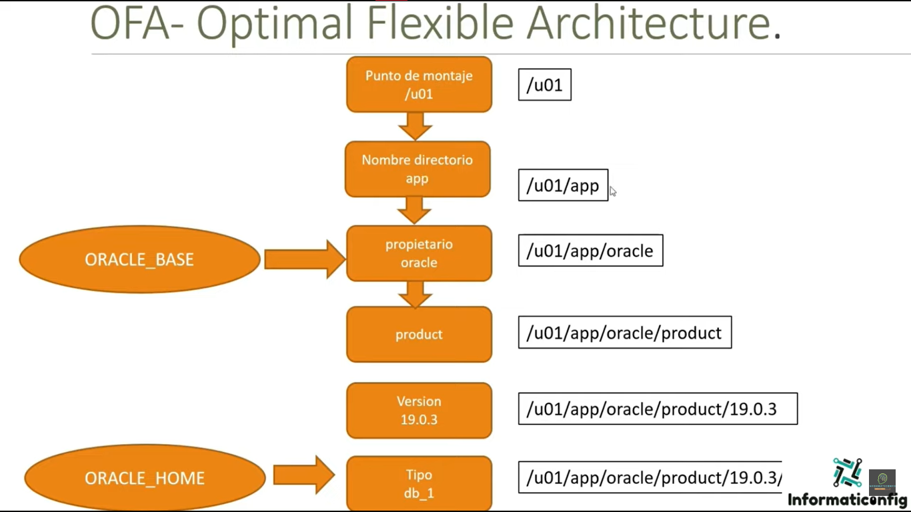
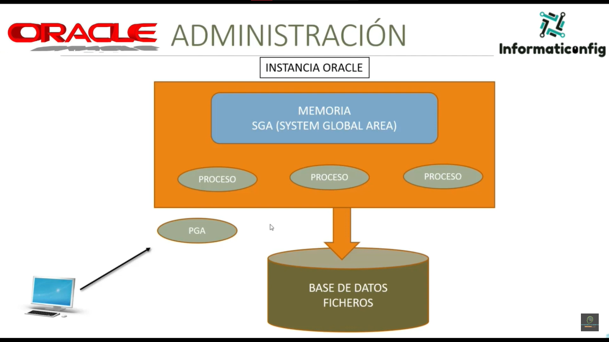
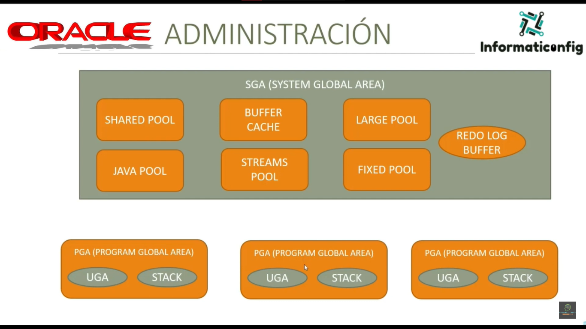

# Detalle de la información de las tablas sobre Grupos y Usuarios de Oracle:

**Tabla de Grupos de Oracle:**

Esta tabla describe los grupos predefinidos en Oracle y sus respectivas funciones:

| Grupo | Descripción |
|---|---|
| **oinstall** | Grupo de instalación de Oracle. Este grupo tiene permisos para instalar y configurar software de Oracle. |
| **dba** | Grupo de administradores de base de datos (OSDBA). Los usuarios de este grupo tienen privilegios completos de administración (SYSDBA) sobre las bases de datos Oracle. |
| **oper** | Grupo de operadores de base de datos (OSOPER). Los usuarios de este grupo tienen privilegios limitados de administración (SYSOPER) sobre las bases de datos Oracle, como iniciar y detener instancias de base de datos. |
| **backupdba** | Grupo de administradores de backups (OSBACKUPDBA). Los usuarios de este grupo tienen permisos para realizar operaciones de backup y recuperación de bases de datos Oracle. |
| **dgdba** | Grupo de administradores de Oracle Data Guard (OSDGDBA). Los usuarios de este grupo tienen permisos para administrar y configurar Oracle Data Guard, una solución de alta disponibilidad para bases de datos Oracle. |
| **mkdba** | Grupo de administradores de claves de encriptación (OSKMDBA). Los usuarios de este grupo tienen permisos para administrar las claves de encriptación utilizadas por Oracle. |

**Importancia de los Grupos de Oracle:**

* **Administración de permisos:** Los grupos permiten asignar permisos de manera granular a los usuarios, lo que facilita la administración del acceso a recursos de Oracle.
* **Seguridad:** Los grupos ayudan a proteger las bases de datos Oracle al limitar el acceso a usuarios que solo requieren permisos específicos.
* **Eficiencia:** El uso de grupos permite agrupar usuarios con necesidades similares, simplificando la administración de permisos y tareas.

**Tabla de Usuarios de Oracle:**

Esta tabla muestra el usuario predefinido más común en Oracle y su función:

| Usuario | Descripción |
|---|---|
| **oracle** | Usuario propietario de Oracle. Este usuario es el propietario de los archivos y procesos de Oracle. |

**Importancia del Usuario Oracle:**

* **Propietario de Oracle:** El usuario `oracle` es esencial para el correcto funcionamiento de Oracle, ya que es el propietario de los archivos y procesos necesarios para su operación.
* **Seguridad:** El usuario `oracle` tiene privilegios elevados, por lo que es crucial proteger su contraseña y evitar su uso indebido.

# OFA (Optimal Flexible Architecture)

OFA (Optimal Flexible Architecture) es un conjunto de prácticas recomendadas para organizar los archivos de la base de datos Oracle en el sistema de archivos. El objetivo principal de OFA es optimizar el rendimiento, la administración y la seguridad de la base de datos Oracle mediante una estructura de archivos bien definida y estandarizada.

Aquí hay algunos aspectos clave de OFA en el contexto de Oracle y su base de datos:

1. **Estructura de directorios estándar**: OFA recomienda una estructura de directorios estándar para organizar los archivos relacionados con la base de datos. Esto incluye directorios para los archivos de datos, archivos de control, archivos de redo logs, archivos de archivos temporales, archivos de backups y archivos de logs de auditoría, entre otros.

2. **Distribución de archivos de datos**: OFA sugiere separar los archivos de datos, los archivos de redo logs y los archivos de control en diferentes discos físicos o conjuntos de discos para mejorar el rendimiento. Esto puede ayudar a distribuir la carga de E/S (entrada/salida) y minimizar los cuellos de botella.

3. **Nomenclatura de archivos**: OFA establece convenciones de nomenclatura para los archivos de la base de datos Oracle. Por ejemplo, los archivos de datos pueden seguir un patrón de nomenclatura que incluya el nombre de la instancia de la base de datos, el tipo de archivo y un número de secuencia.

4. **Ubicación de archivos de logs y backups**: OFA sugiere almacenar los archivos de redo logs y los archivos de backups en ubicaciones separadas y seguras para garantizar la disponibilidad y la integridad de los datos en caso de fallo del sistema.

5. **Adaptabilidad a diferentes plataformas**: Una característica importante de OFA es su capacidad para adaptarse a diferentes plataformas y sistemas operativos. Esto permite a los administradores de bases de datos seguir las mismas prácticas recomendadas independientemente del entorno en el que se esté ejecutando la base de datos Oracle.

# Arquitectura Básica

**Componentes principales**

Los componentes principales de la arquitectura de Oracle 19c son los siguientes:

* **Cliente:** El cliente es una aplicación que se conecta a la base de datos para acceder a los datos. Puede ser una aplicación local, como una aplicación de escritorio, o una aplicación remota, como una aplicación web.
* **Servidor:** El servidor es el equipo que ejecuta el software de Oracle Database. El servidor es responsable de almacenar, administrar y recuperar los datos de la base de datos.
* **Instancia:** Una instancia de Oracle Database es una copia en ejecución del software de Oracle Database. Una instancia puede alojar una o más bases de datos.
* **Memoria:** La memoria es un recurso utilizado por el servidor para almacenar datos y código. Oracle Database utiliza dos tipos de memoria:

    * **SGA (System Global Area):** El SGA es una memoria compartida que se utiliza para almacenar datos y código que son utilizados por todos los procesos de la instancia.
    * **PGA (Program Global Area):** El PGA es una memoria privada que se utiliza para almacenar datos y código que son utilizados por un proceso individual.

* **Proceso:** Un proceso es una instancia en ejecución de un programa. Oracle Database utiliza varios procesos para realizar diferentes tareas, como administrar la memoria, recuperar datos y ejecutar consultas.
* **Base de datos:** La base de datos es una colección de datos relacionados que se almacenan en un sistema informático. Una base de datos Oracle está organizada en tablas, índices y otros objetos.
* **Ficheros:** Los ficheros son unidades de almacenamiento que se utilizan para almacenar los datos de la base de datos. Los ficheros de datos almacenan los datos de las tablas, mientras que los ficheros de redo contienen información sobre las transacciones que se han realizado en la base de datos.

**Interacciones entre componentes**

Los componentes de la arquitectura de Oracle 19c interactúan entre sí de la siguiente manera:

* El cliente se conecta al servidor y envía una solicitud a la base de datos.
* El servidor recibe la solicitud y la procesa.
* El servidor accede a los datos de la base de datos y los devuelve al cliente.

El servidor utiliza la memoria para almacenar los datos y el código que necesita para procesar las solicitudes. El servidor también utiliza procesos para realizar las diferentes tareas necesarias para procesar las solicitudes.

## Arquitectura STANDALONE

En el contexto de Oracle, una arquitectura STANDALONE se refiere a una configuración en la que una instancia de base de datos Oracle se ejecuta en un único servidor sin ninguna forma de replicación o agrupación de servidores. Aquí hay un desglose detallado de la arquitectura STANDALONE en Oracle:

1. **Instancia de base de datos única**: En una arquitectura STANDALONE, hay una sola instancia de base de datos Oracle que se ejecuta en un servidor físico o virtual. Esta instancia de base de datos incluye todos los componentes esenciales de una base de datos Oracle, como el proceso de fondo (background process), la memoria compartida (shared memory), el proceso de servidor (server process) y los archivos de datos.

2. **Proceso de fondo y servidor**: La instancia de base de datos STANDALONE ejecuta varios procesos de fondo que realizan tareas de administración y mantenimiento de la base de datos, como la gestión de la memoria compartida, la escritura de redo logs y la gestión de bloqueos. También incluye procesos de servidor que manejan las solicitudes de los clientes y ejecutan las consultas SQL en nombre de los usuarios.

3. **Memoria compartida (SGA)**: En una arquitectura STANDALONE, la memoria compartida (System Global Area - SGA) se asigna exclusivamente a la instancia de base de datos única. La SGA incluye componentes como el buffer cache, el shared pool y el redo log buffer, que son esenciales para el funcionamiento de la base de datos Oracle.

4. **Archivos de datos y redo logs**: Todos los archivos de datos, archivos de control y archivos de redo logs asociados con la instancia de base de datos STANDALONE se almacenan localmente en el servidor en el que se ejecuta la instancia. Estos archivos son accesibles solo para la instancia de base de datos específica y no se comparten con otras instancias.

5. **Clientes y aplicaciones**: Los clientes y las aplicaciones se conectan directamente a la instancia de base de datos STANDALONE a través del protocolo de comunicación de Oracle, como Oracle Net. Los clientes pueden ser aplicaciones de servidor, como aplicaciones web o aplicaciones empresariales, o herramientas de administración de bases de datos, como SQL*Plus o SQL Developer.

6. **Administración y mantenimiento**: En una arquitectura STANDALONE, todas las tareas de administración y mantenimiento, como la copia de seguridad y recuperación, la monitorización del rendimiento y la aplicación de parches, se realizan en el mismo servidor donde se ejecuta la instancia de base de datos. Esto simplifica la administración en comparación con entornos distribuidos o en clúster.

## RAC Real Application Cluster

La arquitectura RAC (Real Application Clusters) de Oracle es una solución de alta disponibilidad y escalabilidad que permite ejecutar múltiples instancias de base de datos Oracle en un clúster de servidores interconectados. Aquí está todo lo que necesitas saber sobre la arquitectura RAC:

1. **Cluster de base de datos**: En una arquitectura RAC, múltiples servidores (nodos) están interconectados a través de una red de alta velocidad y comparten una única base de datos Oracle. Cada nodo en el clúster ejecuta su propia instancia de base de datos Oracle, lo que permite una distribución de carga y una alta disponibilidad.

2. **Gestión compartida de recursos**: Los nodos en un clúster RAC comparten recursos críticos, como los archivos de datos, archivos de control y archivos de redo logs, a través de un almacenamiento compartido, como un sistema de archivos distribuido o un almacenamiento compartido en red (NAS o SAN). Esto garantiza que todos los nodos del clúster tengan acceso a los mismos datos y puedan mantener la coherencia de la base de datos.

3. **Cache Fusion**: Cache Fusion es una tecnología fundamental en RAC que permite compartir datos en memoria entre las instancias de base de datos en el clúster sin necesidad de escribir los datos en disco. Cuando una instancia de base de datos necesita acceder a datos que residen en la memoria de otra instancia, puede recuperarlos directamente a través de la red de interconexión de alta velocidad del clúster.

4. **Alta disponibilidad**: La arquitectura RAC proporciona alta disponibilidad al eliminar los puntos únicos de fallo. Si un nodo en el clúster falla, las instancias de base de datos en los nodos restantes continúan ejecutándose y atendiendo las solicitudes de los clientes. Además, las cargas de trabajo se pueden distribuir dinámicamente entre los nodos restantes para mantener el rendimiento.

5. **Escalabilidad horizontal**: RAC permite escalar horizontalmente agregando nodos adicionales al clúster. Esto proporciona una mayor capacidad de procesamiento y almacenamiento a medida que crecen las necesidades de la aplicación sin interrumpir el servicio.

6. **Administración avanzada**: La administración de un clúster RAC implica tareas adicionales en comparación con una base de datos standalone, como la configuración y monitorización del entorno de red, la gestión de recursos compartidos y la implementación de políticas de balanceo de carga.

# Memoria

Las principales áreas de memoria de Oracle Database son las siguientes:

* **SGA (System Global Area):** El SGA es una memoria compartida que se utiliza para almacenar datos y código que son utilizados por todos los procesos de la instancia. El SGA se divide en las siguientes subáreas:

    * **Buffer Cache:** La Buffer Cache almacena los bloques de datos que se han leído del disco. Esto permite que Oracle Database acceda a los datos más rápido, ya que no tiene que leerlos del disco cada vez.
    * **Shared Pool:** El Shared Pool almacena los objetos SQL compilados, los cursores y otros datos que son utilizados por múltiples procesos. Esto permite que Oracle Database ejecute las consultas más rápido, ya que no tiene que compilarlas cada vez.
    * **Redo Log Buffer:** El Redo Log Buffer almacena las entradas del registro de rehacer. El registro de rehacer se utiliza para recuperar la base de datos en caso de fallo.
    * **Java Pool:** El Java Pool almacena el código Java que se utiliza por las aplicaciones Java.
    * **Streams Pool:** El Streams Pool almacena los datos que se utilizan por las características de Oracle Streams.
    * **Fixed Pool:** El Fixed Pool almacena los datos que se utilizan por las características de diagnóstico y administración.

* **PGA (Program Global Area):** El PGA es una memoria privada que se utiliza para almacenar datos y código que son utilizados por un proceso individual. El PGA se divide en las siguientes subáreas:

    * **Private SQL Area:** El Private SQL Area almacena los datos que se utilizan por una consulta individual.
    * **Work Area:** El Work Area se utiliza para almacenar los datos de trabajo que se utilizan por una consulta individual.
    * **Call Stack:** El Call Stack almacena la pila de llamadas para un proceso individual.

* **UGA (User Global Area):** El UGA es una memoria privada que se utiliza para almacenar datos y código que son utilizados por un usuario individual. El UGA se utiliza para almacenar datos de sesión, como el nombre de usuario y la contraseña.

**Uso de la memoria**

Oracle Database utiliza la memoria de la siguiente manera:

* **Almacenamiento de datos:** Oracle Database almacena los datos de la base de datos en la Buffer Cache. Cuando un proceso necesita acceder a los datos, primero comprueba si los datos están en la Buffer Cache. Si los datos no están en la Buffer Cache, Oracle Database los lee del disco y los almacena en la Buffer Cache.
* **Ejecución de consultas:** Oracle Database almacena los objetos SQL compilados, los cursores y otros datos en el Shared Pool. Cuando un proceso necesita ejecutar una consulta, primero comprueba si la consulta está compilada y en el Shared Pool. Si la consulta no está compilada, Oracle Database la compila y la almacena en el Shared Pool.
* **Recuperación de fallos:** Oracle Database almacena las entradas del registro de rehacer en el Redo Log Buffer. En caso de fallo, Oracle Database utiliza el registro de rehacer para recuperar la base de datos a su estado anterior al fallo.
* **Ejecución de aplicaciones Java:** Oracle Database almacena el código Java que se utiliza por las aplicaciones Java en el Java Pool. Cuando una aplicación Java necesita ejecutarse, Oracle Database carga el código Java del Java Pool.
* **Comunicación entre procesos:** Oracle Database utiliza el Streams Pool para almacenar los datos que se utilizan por las características de Oracle Streams. Las características de Oracle Streams se utilizan para replicar datos entre bases de datos.
* **Diagnóstico y administración:** Oracle Database utiliza el Fixed Pool para almacenar los datos que se utilizan por las características de diagnóstico y administración. Las características de diagnóstico y administración se utilizan para supervisar el rendimiento de la base de datos y resolver problemas.

## Shared Pool

La Shared Pool (memoria compartida) es una de las áreas de memoria fundamentales en la arquitectura de Oracle Database. Aquí tienes una explicación detallada sobre la Shared Pool:

1. **Definición**: La Shared Pool es una parte de la memoria global del sistema (SGA - System Global Area) de Oracle Database. Esta área de memoria se comparte entre todas las conexiones de usuario y las instancias de base de datos en un entorno Oracle.

2. **Propósito**: La función principal de la Shared Pool es almacenar y gestionar el SQL y los objetos de datos compartidos entre las conexiones de usuario. Esto incluye principalmente las sentencias SQL, los planos de ejecución (execution plans), los objetos de programa (procedures, functions, packages), los objetos de datos (table definitions, synonyms) y otros recursos compartidos.

3. **Caché de SQL**: Uno de los usos más importantes de la Shared Pool es como caché de SQL. Cuando un usuario ejecuta una sentencia SQL por primera vez, Oracle compila y optimiza esa sentencia y almacena el resultado en la Shared Pool. Si otra conexión de usuario intenta ejecutar la misma sentencia posteriormente, Oracle puede reutilizar el plan de ejecución previamente compilado, lo que puede mejorar significativamente el rendimiento.

4. **Caché de objetos de programa y datos**: Además de las sentencias SQL, la Shared Pool también almacena los objetos de programa y datos compartidos entre las conexiones de usuario. Esto incluye procedimientos almacenados, funciones, paquetes, definiciones de tablas y otros objetos de esquema que pueden ser compartidos y reutilizados por múltiples sesiones de usuario.

5. **Uso eficiente de memoria**: La Shared Pool se gestiona de manera dinámica por Oracle Database para garantizar un uso eficiente de la memoria. Oracle puede ajustar automáticamente el tamaño de la Shared Pool según la demanda de la aplicación y las configuraciones de memoria del sistema.

6. **Parámetros de configuración**: Para optimizar el rendimiento y la utilización de la memoria, Oracle Database proporciona varios parámetros de configuración relacionados con la Shared Pool, como SHARED_POOL_SIZE para especificar el tamaño inicial de la Shared Pool, y SHARED_POOL_RESERVED_SIZE para reservar una parte de la Shared Pool para objetos específicos.

7. **Monitorización y diagnóstico**: Los DBAs pueden monitorear el uso de la Shared Pool mediante vistas dinámicas como `V$SGASTAT` y `V$SQL`. Estas vistas proporcionan información sobre el tamaño actual de la Shared Pool, el número de objetos almacenados y otras métricas importantes para el diagnóstico y la optimización del rendimiento.

## Database Buffer Cache

El Database Buffer Cache (caché de búfer de base de datos) es otra área importante de la memoria global del sistema (SGA) en Oracle Database. A continuación, te proporciono una descripción detallada sobre el Database Buffer Cache:

1. **Definición**: El Database Buffer Cache es una parte de la memoria global del sistema (SGA) de Oracle Database que almacena bloques de datos que han sido leídos recientemente desde los archivos de datos en el disco. Estos bloques de datos se mantienen en memoria para mejorar el rendimiento al evitar lecturas repetidas desde el disco.

2. **Propósito**: El propósito principal del Database Buffer Cache es reducir la necesidad de realizar operaciones de E/S (entrada/salida) costosas al acceder a datos almacenados en el disco. Al mantener una copia en memoria de los bloques de datos que se acceden con frecuencia, Oracle puede satisfacer las solicitudes de lectura de manera más rápida y eficiente.

3. **Caché de bloques de datos**: Cuando se lee un bloque de datos desde el disco, Oracle lo coloca en el Database Buffer Cache. Si otra parte del sistema necesita acceder a los mismos datos nuevamente, Oracle primero verifica si el bloque de datos está presente en el caché. Si lo está, se puede leer directamente desde la memoria en lugar de realizar una nueva lectura desde el disco.

4. **Algoritmos de reemplazo**: El Database Buffer Cache utiliza algoritmos de reemplazo para gestionar la memoria y mantener los bloques de datos más relevantes y utilizados recientemente en caché. Los algoritmos de reemplazo determinan qué bloques de datos deben ser eliminados del caché cuando se necesita espacio para almacenar nuevos bloques de datos.

5. **Tamaño y configuración**: El tamaño del Database Buffer Cache se puede configurar mediante el parámetro DB_CACHE_SIZE en el archivo de parámetros de inicialización de Oracle (init.ora o spfile). Este parámetro especifica la cantidad de memoria que se asignará al caché de búfer de la base de datos. Un tamaño adecuado del caché de búfer es fundamental para optimizar el rendimiento de la base de datos.

6. **Monitorización y diagnóstico**: Los administradores de bases de datos pueden monitorear el uso y el rendimiento del Database Buffer Cache utilizando diversas vistas dinámicas, como `V$DB_CACHE_ADVICE` y `V$BUFFER_POOL_STATISTICS`. Estas vistas proporcionan información detallada sobre el tamaño del caché, la eficacia de la memoria y otras métricas relacionadas con el rendimiento.

7. **Beneficios**: Al mantener los bloques de datos en memoria, el Database Buffer Cache ayuda a reducir el tiempo de respuesta de las consultas y las operaciones de lectura, lo que mejora significativamente el rendimiento general de la base de datos al reducir la carga en el subsistema de E/S (entrada/salida) del sistema de almacenamiento.

## PGA (Program Global Area)

La PGA (Program Global Area) es una parte crítica de la arquitectura de memoria en Oracle Database, pero es importante tener en cuenta que la PGA no es una parte de la SGA (System Global Area), como la Shared Pool y el Database Buffer Cache. Aquí tienes una explicación detallada sobre la PGA:

1. **Definición**: La PGA es una memoria privada dedicada a cada conexión de usuario o sesión de servidor en Oracle Database. A diferencia de la Shared Pool y el Database Buffer Cache, que son compartidos entre todas las sesiones de usuario, la PGA es exclusiva para cada sesión de usuario activa.

2. **Propósito**: La PGA se utiliza para almacenar datos y estructuras de control específicas de cada sesión de usuario, como las áreas de trabajo para la ejecución de consultas, las variables de sesión, los resultados de las operaciones de clasificación y agrupación, y las áreas para la manipulación de datos temporales.

3. **Áreas de la PGA**: La PGA consta de varias áreas, incluyendo el SQL Work Area (área de trabajo SQL), el Private SQL Area (área SQL privada), el Sorting Area (área de clasificación), el Cursor State (estado del cursor) y el Session Memory (memoria de sesión), entre otros.

4. **SQL Work Area**: El SQL Work Area es una parte significativa de la PGA y se utiliza para ejecutar operaciones SQL, como clasificaciones, agrupaciones y joins. Dependiendo del tamaño y la complejidad de las consultas, el SQL Work Area puede usar la memoria disponible en la PGA o la SGA.

5. **Private SQL Area**: Cada sesión de usuario tiene su propio Private SQL Area en la PGA, que se utiliza para almacenar información específica de la consulta, como las sentencias SQL en ejecución, los cursores abiertos y los resultados parciales de la ejecución de la consulta.

6. **Gestión de la PGA**: A diferencia de la SGA, cuyo tamaño se configura globalmente para toda la base de datos, la PGA se gestiona dinámicamente por cada sesión de usuario. Oracle Database asigna y libera automáticamente la memoria de la PGA según las necesidades de cada sesión y los recursos disponibles en el sistema.

7. **Monitorización y diagnóstico**: Los administradores de bases de datos pueden monitorear el uso y el rendimiento de la PGA utilizando vistas dinámicas, como `V$PGA_TARGET_ADVICE` y `V$PROCESS_MEMORY`, que proporcionan información sobre la asignación y el consumo de memoria de la PGA por parte de cada sesión de usuario.

# Procesos